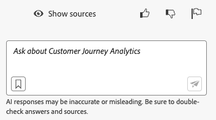

# Adobe Customer Journey Analytics 的 AI 助手

AI 助手是一种对话体验，可以让从业者快速完成工作任务。无论工作任务是要理解概念、解决问题还是搜索信息。AI 助手还允许非专家执行专家任务并提高整体工作质量。

Customer Journey Analytics 中的 AI 助手进行了关于 Adobe Experience League 文档的培训。被问到问题时，AI 助手会给出有用的回答，有助于快速学习。

作为新手用户，您可以使用 AI 助手学习 Customer Journey Analytics 概念，开始了解您不熟悉的产品和功能。作为经验丰富的用户，您可以使用 AI 助手来呈现更高级的用例或者各种技巧。

有关概念问题的一些示例包括：

* 批量摄取和流式摄取两者有什么区别？
* Customer Journey Analytics 最适合用于什么？
* 如何设置数据视图？

超出 Customer Journey Analytics 范围的问题无法回答，例如有关 Adobe Target 和 Adobe Creative Cloud Suite 等其他 Adobe 产品的问题。

Customer Journey Analytics 的 AI 助手适用于所有产品层。

## 产品知识 {#knowledge}

| 产品知识 | 示例 |
| --- | --- |
| 有针对性的学习 | <ul><li>Adobe Analytics 和 Customer Journey Analytics 两者有什么区别？</li><li>如何构建计算量度？</li></ul> |
| 打开发现 | <ul><li>如何导出 Workspace 项目？</li><li>如何找到重复的 Workspace 组件？</li></ul> |
| 故障排除 | <ul><li>数据进入 CJA 需要多长时间？</li><li>在一个 Customer Journey Analytics 连接中可以有多少个派生字段？</li></ul> |

## 数据分析

Data Insights 代理可从 Customer Journey Analytics 中的 AI 助手访问，它是一个生成式 AI 对话代理，可以快速有效地回答有关您数据的问题。它使用来自数据视图的组件和您的实际数据在 Analysis Workspace 中构建相关的可视化图表。

有关在 AI 助手中使用 Data Insights 代理的更多信息，请参阅 [使用 Data Insights 代理可视化数据](/help/data-analysis-ai.md)。

## 功能访问权限

通过以下参数可控制对 AI 助手功能的访问：

* **解决方案访问**：Customer Journey Analytics 中提供 AI 助手，但 Adobe Analytics 中不提供该功能。Adobe Experience Platform、Adobe Journey Optimizer、Adobe Real-Time CDP 和其他 Experience Platform 应用程序中也提供该功能。

* **合同访问**：如果您无法使用 AI 助手，请联系您所在组织的管理员或 Adobe 客户代表。在您的组织可以使用 AI 助手之前，您必须先同意与生成式 AI 相关的特定法律条款。

* **权限**：在 [!UICONTROL Adobe 管理控制台]中，[!UICONTROL 报告工具] **[!UICONTROL AI 助手：产品知识]**&#x200B;权限决定了对该工具的访问权限。[产品配置文件管理员](https://helpx.adobe.com/cn/enterprise/using/manage-product-profiles.html)需要在 [!UICONTROL Admin Console] 中执行以下步骤：
   1. 导航至 **[!UICONTROL Admin Console]** > **[!UICONTROL 产品和服务]** > **[!UICONTROL Customer Journey Analytics]** > **[!UICONTROL 产品配置文件]**。
   1. 选择您想要为其提供[!UICONTROL AI 助手：产品知识]访问权限的产品配置文件的标题。
   1. 在具体的产品配置文件中，选择&#x200B;**[!UICONTROL 权限]**。
   1. 选择来编辑&#x200B;**[!UICONTROL 报告工具]**。
   1. 选择 ，将 **AI 助手：产品知识**&#x200B;添加到&#x200B;**[!UICONTROL 包含的权限项]**。

      。

   1. 选择&#x200B;**[!UICONTROL 保存]**&#x200B;来保存权限。

请参阅 [访问权限控制](/help/technotes/access-control.md#access-control)，以了解更多信息。

## 在 Customer Journey Analytics UI 中访问 AI 助手

1. 要启动 AI 助手，请从 Customer Journey Analytics UI 中任意页面的顶部标题中选择 AI 助手图标。

   

   首次使用 AI 助手时会出现一个免责声明，其中包含使用该助手的条款和条件。

1. 在提供的问题框中，以自然语言方式向 AI 助手询问具体的问题。

   

1. （可选）如要显示来源，请点击&#x200B;**[!UICONTROL 显示来源]**，这样就会显示回答所依据的文档来源。

1. （可选）您还可以对任何给出的回答是否有用投票表示赞同或反对。

1. （可选）您可以将给出的回答标记为不恰当或内容有害。
