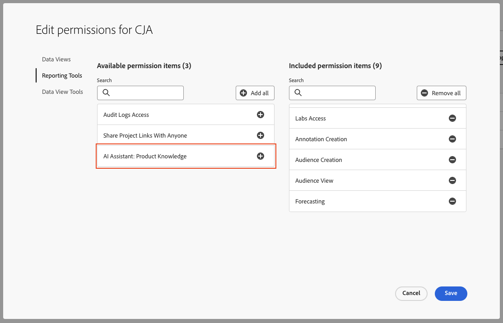

# Adobe Customer Journey Analytics的人工智能助手

>[!NOTE]
>
>用于Customer Journey Analytics的AI助手当前为测试版。 该功能及其文档可能会发生更改。

AI助手是一种对话体验，允许从业人员快速执行任务，无论其理解概念、排除问题还是搜索信息。 它还使非专家能够执行专家任务，并提高整体工作质量。

对Customer Journey AnalyticsAI助手进行Adobe Experience League文档培训。 当被问到问题时，AI Assistant会给出一个有助于快速学习的有用答案。

作为新手，您可以使用AI Assistant学习Customer Journey Analytics概念，并熟悉不熟悉的产品和功能。 作为经验丰富的用户，您可以使用AI Assistant提供更高级的用例或提示和技巧。

概念问题的一些示例包括：

* 批量摄取与流式摄取之间有何区别？
* Customer Journey Analytics的最佳用途是什么？
* 如何设置数据视图？

Customer Journey Analytics范围之外的问题，例如有关Adobe Target和Adobe Creative Cloud Suite等其他Adobe产品的问题，则无法回答。

用于Customer Journey Analytics的AI助手可用于所有产品层。

## 产品知识 {#knowledge}

产品知识检索模型是基于Customer Journey Analytics进行训练的。 其他功能（如数据分析）将在以后推出。

| 产品知识 | 示例 |
| --- | --- |
| 点式学习 | <ul><li>Adobe Analytics与Customer Journey Analytics之间有何区别？</li><li>如何构建计算量度？</li></ul> |
| 打开发现 | <ul><li>如何导出工作区项目？</li><li>如何查找重复的工作区组件？</li></ul> |
| 故障排除 | <ul><li>数据进入CJA需要多长时间？</li><li>Customer Journey Analytics连接中可以包含多少个派生字段？</li></ul> |

## 功能访问

在第一个版本中，对AI Assistant功能的访问受以下参数控制：

* **解决方案访问**： AI助手在Customer Journey Analytics中可用，但在Adobe Analytics中不可用。 Adobe Experience Platform、Adobe Journey Optimizer、Adobe Real-Time CDP及其他Experience Platform应用程序中也提供了此功能。

* **合同访问**：如果您无法使用AI助手，请联系贵组织的管理员或Adobe客户代表。 贵公司必须同意某些与GenAI相关的法律条款，贵组织才能使用AI Assistant。

* **权限**：在 [!UICONTROL Adobe Admin Console]， [!UICONTROL 报告工具] “AI助手：产品知识”权限确定对此工具的访问权限。
A [产品配置文件管理员](https://helpx.adobe.com/enterprise/using/manage-product-profiles.html) 需要在Admin Console中执行以下步骤：
   1. 导航到 [!UICONTROL Admin Console] > [!UICONTROL 产品和服务] > [!UICONTROL Customer Journey Analytics] > [!UICONTROL 产品配置文件] > [!UICONTROL 权限] > [!UICONTROL 编辑报告工具].
   1. 添加“AI助手：产品知识”。
      

## 在Customer Journey AnalyticsUI中访问AI助手

1. 要启动AI助手，请从Customer Journey AnalyticsUI中任何页面的顶部标题中选择AI助手图标。

   

   在首次使用AI助手时，将显示免责声明，其中包含使用该助手的一些条款和条件。

1. 在提供的框中，询问AI助手的特定自然语言问题。

   

1. （可选）要显示源，请单击 **[!UICONTROL 显示源]**，并显示通知答案的一个或多个文档源。

1. （可选）您还可以对任何给定答案的效用提供大拇指支持或大拇指反对的投票。
