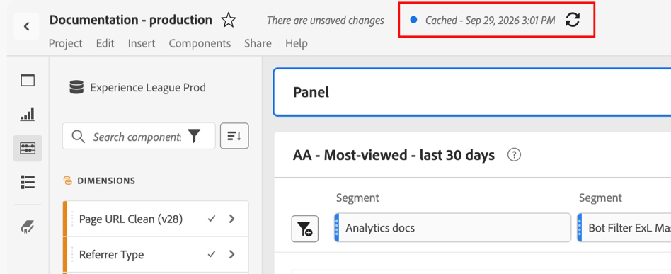

# 在Workspace项目中使用缓存的结果

>[!CONTEXTUALHELP]
>id="project_cached_results"
>title="使用缓存的结果加快加载速度"
>abstract="启用后，结果会在用户首次打开项目或按计划交付项目后12小时内即时加载。 在此期间，任何打开项目的人都会看到相同的结果，即使数据继续在后台流动。 要加载最新结果，请刷新各个面板或整个项目。"

您可以将Analysis Workspace项目配置为在12小时的窗口内显示缓存的结果，从而允许初次加载项目后打开项目的任何人都能立即加载结果。

项目最初可以由打开项目的用户加载，也可以由计划项目交付加载。

>[!NOTE]
>
>仅缓存查询结果。 基础事件数据继续像往常一样流入Customer Journey Analytics。
>
>若要在缓存的结果过期之前查看最新数据，您可以[手动刷新结果](#manually-refresh-results-on-cached-projects)。

## 了解项目中的缓存结果

### 在缓存结果时

首次运行项目时，Analysis Workspace会像往常一样运行查询，并在12小时的窗口内缓存结果。 当有人打开项目或项目为计划交付运行时，会发生这种情况。 例如，如果某个项目计划在上午6:00交付，则结果将缓存到下午6:00。 在上午6:00到下午6:00之间打开项目的每个人都会看到结果立即加载，包括第一个打开项目的人。

12小时后，缓存的结果过期。 项目的下一个查询，无论用户是打开它还是计划的交付运行，都会以正常速度加载并启动新的12小时窗口。

### 缓存了哪些结果

Analysis Workspace会缓存运行的每个查询，而不是项目的每个可能版本。

当有人在项目中更改查询时（例如通过从面板下拉菜单中选择项目或应用区段），Analysis Workspace会运行新查询。 新查询首次以正常速度加载。 之后，结果也会被缓存，因此运行相同查询的人会立即看到结果。

缓存新查询不会覆盖或失效已缓存的结果。 原始项目视图会随人员运行的其他变体一起缓存。

>[!BEGINSHADEBOX]

**示例方案**

假设全球营销活动效果项目包括不同区域的区段，并计划于上午6:00交付：

| 时间 | 操作 | 加载速度 |
| --- | --- | --- |
| 上午 6:00 | 计划的项目交付 | 正常（缓存结果以供将来使用） |
| 上午7:06 | 用户A打开项目 | 即时 |
| 上午7:06 | 用户A应用美洲区段 | 正常（缓存结果以供将来使用） |
| 上午8:01 | 用户B打开项目 | 即时 |
| 上午8:01 | 用户B应用美洲区段 | 即时 |
| 上午8:01 | 用户B应用欧洲、中东和非洲区段 | 正常（缓存结果以供将来使用） |

>[!ENDSHADEBOX]

### 查看缓存结果的用户

默认情况下，缓存的结果会向符合以下条件的所有人显示：

* 具有项目的访问权限

* 有权访问项目中使用的数据视图

* 在之前缓存的项目中使用相同的查询参数（例如，他们查看的项目使用与之前缓存的项目相同的区段或面板下拉选择）

查看缓存的结果时，您可以通过[手动刷新结果](#manually-refresh-results-on-cached-projects)查看最新数据。

## 为项目启用缓存的结果

任何能够更新项目设置的人都可以启用缓存的结果。 这包括项目所有者和具有项目的&#x200B;**[!UICONTROL 编辑原始]**&#x200B;角色的任何人。 有关项目角色的详细信息，请参阅[共享特定项目角色](/help/analysis-workspace/curate-share/share-projects.md#share-a-specific-project-role)。

在您希望启用缓存结果以便进行近乎即时加载的Workspace项目中：

1. 转到&#x200B;**[!UICONTROL 项目]** > **[!UICONTROL 项目信息和设置]**。
1. 选择&#x200B;**[!UICONTROL 使用缓存结果以加快加载]**。
1. 选择&#x200B;**[!UICONTROL 保存]**。

## 在项目中显示缓存的结果时查看

当显示缓存的结果时，项目顶部会显示一个时间戳。 时间戳指定是缓存所有结果，还是只缓存部分结果：

* **[!UICONTROL 显示来自] [_日期和时间_]**&#x200B;的结果：项目中的所有面板都显示来自所显示日期和时间的缓存结果。
* **[!UICONTROL 显示从] [_日期和时间开始的一些结果_]**：某些面板显示从显示的日期和时间开始缓存的结果，而其他面板则刷新得更近。

缓存的项目上的

面板还会显示一个时间戳，显示何时缓存结果：

* **[!UICONTROL 显示来自] [_日期和时间_]**&#x200B;的结果：面板显示来自所显示日期和时间的缓存结果。

  >[!NOTE]
  >
  >此选项在发行的Alpha阶段不可用。

## 手动刷新缓存项目的结果

您可以在12小时的窗口内随时手动刷新项目的结果以查看最新数据。 当您刷新整个项目时，会开始一个新的12小时窗口，在该窗口打开项目的每个人都会看到刷新后的结果。

在要查看最新数据的Workspace项目中，您可以刷新整个项目或单个面板的结果。

### 刷新整个项目的结果

要为所有面板加载最新结果并启动新的12小时窗口，请执行以下操作：

1. 选择项目顶部项目时间戳旁边的&#x200B;**[!UICONTROL 刷新]** 图标。

### 刷新单个面板的结果

>[!NOTE]
>
>此选项在发行的Alpha阶段不可用。

要仅加载单个面板的最新结果，请执行以下操作：

1. 选择位于项目顶部面板时间戳旁边的&#x200B;**[!UICONTROL 刷新]** 图标。

