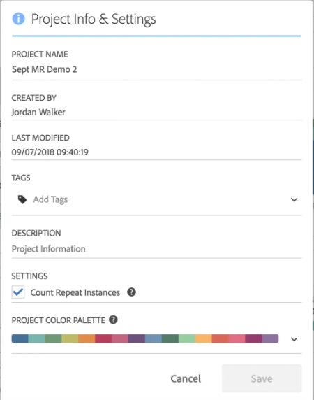

# 可视化图表调色板

可更改在工作区中使用的可视化效果调色板，其中可选择不同的调色板或指定您自己的与贵公司品牌配色相配的调色板。此功能影响工作区中的大部分可视化效果，但它&#x200B;**不**&#x200B;影响摘要变化、自由格式表中的条件格式和地图可视化效果。

>[!NOTE]
>
>Internet Explorer 11 未启用调色板支持。

请牢记：

* 有 5 种预设调色板可供选择。默认调色板和下面的调色板已经过优化以获得合适对比度，并且对于色盲用户来说，二者都更易于使用。
* 位于前两个调色板下方的第 3 个到第 5 个调色板已针对色彩协调进行了优化。

## 更改调色板：

1. 导航至&#x200B;**[!UICONTROL 工作区]** > **[!UICONTROL 项目]** > **[!UICONTROL 项目信息和设置]**。
1. 从&#x200B;**[!UICONTROL 项目调色板]**&#x200B;下拉列表中，您可以从 5 种预设配色方案中选取一种配色方案。

   

1. 要指定自己的调色板，请选择预设选项下方的&#x200B;**[!UICONTROL 自定义调色板]**。
1. 为要使用的颜色指定最多 16 个以逗号分隔的十六进制值（例如，#00a4e4）。例如，如果您只想使用 4 个值，那么将在包含更多颜色的可视化图表中重复使用这些颜色。
