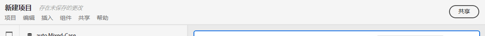
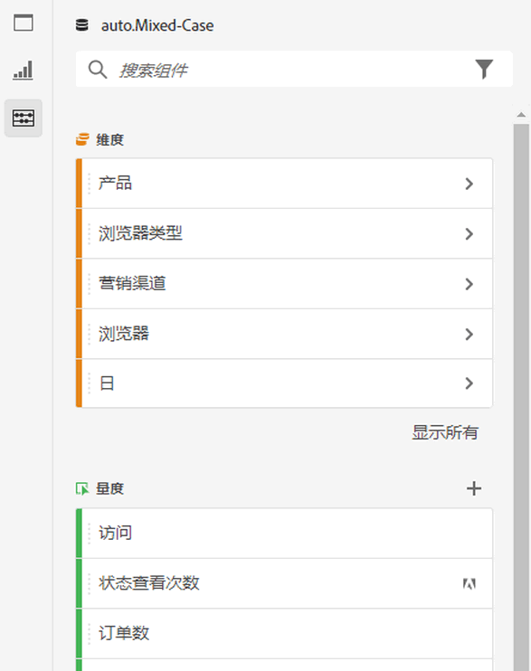
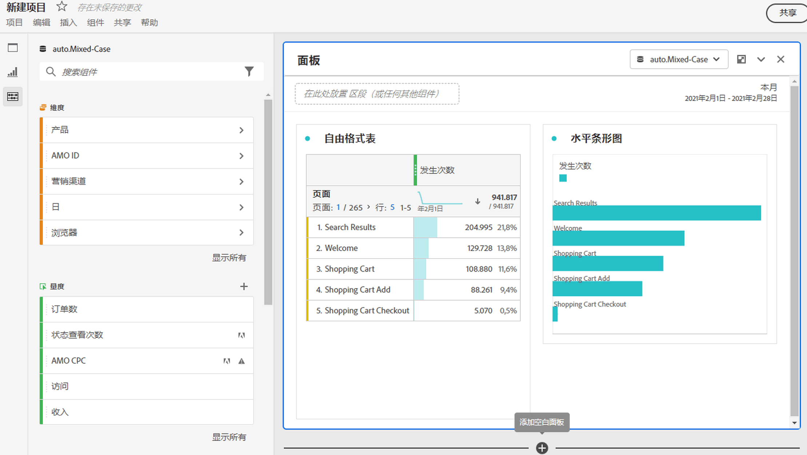
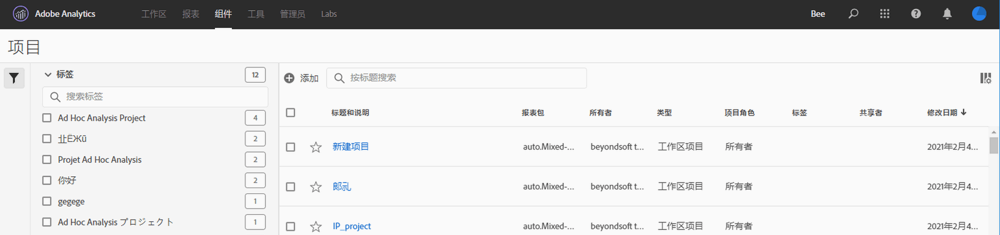

# 项目概述

通过Workspace项目，可组合面板、可视化图表和组件以得出您的分析结果，并与您组织中的任何人共享。 在开始您的第一个项目之前，请了解如何访问、导航和管理您的项目。

要访问Customer Journey Analytics中的项目，请选择&#x200B;**[!UICONTROL Workspace]**。  **[!UICONTROL 项目]**&#x200B;管理器列出了您拥有的所有项目或与您共享的项目。 具有项目列表的项目管理器也是Customer Journey Analytics的默认登录页面，除非您已在首选项中进行其他配置。

## 标题区域

在标题区域中，➊您可以创建项目、创建文件夹、编辑首选项以及显示或隐藏带有其他图块的面板。

* 要显示或隐藏允许您在&#x200B;**[!UICONTROL 项目]**&#x200B;和&#x200B;**[!UICONTROL 学习]**&#x200B;之间选择的左侧面板，请选择。
* 标题显示项目，可以选择添加项目以及选定文件夹的路径。 例如[!UICONTROL 项目] > **[!UICONTROL 公司文件夹]**。 您可以选择单个子文件夹部件直接转到特定文件夹。
* 要显示[**[!UICONTROL 空白项目]**](create-projects.md)、[**[!UICONTROL 空白移动记分卡]**](/help/mobile-app/create-scorecard.md)、[**[!UICONTROL 引导式分析]**](/help/guided-analysis/overview.md)、**[!UICONTROL 打开文档]**&#x200B;和&#x200B;**[!UICONTROL 打开发行说明]**，请选择 **[!UICONTROL 显示更多]**。 若要隐藏带有图块的区域，请选择 **[!UICONTROL 显示更少]**。
* 根据您选择显示的内容，使用[显示选择器](#show-selector)，您可以编辑首选项并对&#x200B;**[!UICONTROL 项目]**&#x200B;中显示的当前文件夹执行操作：

  | 操作 | 描述 |
  |---|---|
  | **[!UICONTROL 创建项目]** | 选择以[创建新项目](create-projects.md)。 |
  | **[!UICONTROL 创建文件夹]** | 选择以[创建新文件夹](workspace-folders/create-folders.md)。 |
  |  **[!UICONTROL 编辑首选项]** | [编辑您所有项目的首选项](/help/analysis-workspace/user-preferences.md)。 当痕迹导航导致空间有限时，此操作将成为子菜单的一部分。 |
  | **[!UICONTROL 添加项目]** | 选择以[将项目](workspace-folders/add-projects.md)添加到当前文件夹。 当痕迹导航导致空间有限时，此操作将成为子菜单的一部分。 |
  | **[!UICONTROL 重命名文件夹]** | [重命名](workspace-folders/manage-folders.md#rename-folders)当前文件夹。 |
  | **[!UICONTROL 移动文件夹]** | [移动](workspace-folders/manage-folders.md#move-folders)当前文件夹。 |
  | **[!UICONTROL 删除文件夹]** | [删除](workspace-folders/manage-folders.md#delete-folders)当前文件夹。 |

## 项目列表

项目列表➋会显示您拥有并与您共享的所有项目。 该列表具有以下列：

| 栏目 | 描述 |
| --- | --- | 
|  | 选择一个或多个项目后，“项目”界面的底部会显示一个蓝色操作栏。 有关详细信息，请参阅[操作](#actions)。 |
|  | 选择支持或取消支持项目。 |
| **[!UICONTROL 标题和描述]** | 要编辑项目，请选择标题链接，这会打开[Workspace项目](/help/analysis-workspace/home.md)。 与您共享的项目以表示。 选择以显示包含项目更多详细信息的弹出菜单。 选择以打开包含操作的上下文菜单。 有关详细信息，请参阅[操作](#actions)。 |
| **[!UICONTROL 类型]** | Workspace项目、文件夹或[移动记分卡](https://experienceleague.adobe.com/en/docs/analytics/analyze/mobapp/home)。 |
| **[!UICONTROL 标记]** | 应用于项目的标记。 |
| 已计划 | 项目是否计划通过电子邮件发送给收件人。 选项为 **[!UICONTROL 开启]**&#x200B;或 **[!UICONTROL 关闭]**。 查看[将项目数据发送给其他人](/help/analysis-workspace/export/t-schedule-report.md)。 |
| **[!UICONTROL 共享链接（任何人）]** | 项目是否与任何人共享，即使与无权访问Analysis Workspace的人共享。 选项为 **[!UICONTROL 活动]**&#x200B;或 **[!UICONTROL 非活动]**。 有关详细信息，请参阅[共享项目](/help/analysis-workspace/curate-share/share-projects.md)中的[与任何人共享项目（无需登录）](/help/analysis-workspace/curate-share/share-projects.md#share-a-project-with-anyone-no-login-required)。 |
| **[!UICONTROL 项目角色]** | 您在项目中的角色。 选项有：“编辑”、“复制”、“查看”。 有关详细信息，请参阅[项目角色](/help/analysis-workspace/curate-share/curate.md)。 |
| **[!UICONTROL 数据视图]** | 与项目关联的数据视图。 |
| **[!UICONTROL 所有者]** | 创建此项目的人员（您或与您共享此项目的人员）。 |
| **[!UICONTROL 共享对象]** | 与项目共享的用户。 |
| **[!UICONTROL 上次修改时间]** | 项目上次修改的日期和时间。 |
| **[!UICONTROL 上次打开时间]** | 上次打开项目的日期和时间。 |
| **[!UICONTROL 项目 ID]** | 项目的ID。 |
| **** | 项目中任何面板或可视化图表的最长日期范围。 |
| **[!UICONTROL 查询次数]** | 项目中包含的查询总数。 |
| **[!UICONTROL 位置]** | 项目所在的文件夹。 |

将鼠标悬停在任意列标题上以显示，然后从上下文菜单中选择：

* **[!UICONTROL 升序排序]**
* **[!UICONTROL 降序排序]**
* **[!UICONTROL 调整列]**&#x200B;的大小。 此时会显示一条蓝线，帮助您调整列大小。

### 操作

您可以使用上下文菜单或蓝色操作栏对一个或多个项目执行操作。

| 操作 | 描述 |
|---|---|
| 已选择 **[!UICONTROL *x *]** | 取消选择选定的项目和文件夹，并删除蓝色操作栏。 |
|  **[!UICONTROL 删除]** | 删除一个或多个项目或文件夹。 系统会提示您进行确认。 |
|  **[!UICONTROL 共享]** | 共享项目。 有关详细信息，请参阅[共享项目](/help/analysis-workspace/curate-share/share-projects.md)。 |
| 重命名 | 重命名项目。 打开&#x200B;**[!UICONTROL 重命名： *项目名称对话框&#x200B;*]**。 输入新名称，然后选择**[!UICONTROL 保存&#x200B;]**。 |
|  **[!UICONTROL 副本]** | 复制一个或多个项目。 项目的名称和后缀`(Copy)`相同。 |
|  **[!UICONTROL Pin]**&#x200B;或&#x200B;**[!UICONTROL 取消固定]** | 固定或取消固定一个或多个项目或文件夹。 固定项目和文件夹显示在列表顶部，并忽略您指定的排序顺序。 |
| **[!UICONTROL 向上移动]** | 在项目列表中向上移动固定项目或文件夹。 |
| **[!UICONTROL 向下移动]** | 在项目列表中向下移动固定项目或文件夹。 |
|  **[!UICONTROL 标签]** | 标记一个或多个项目或文件夹。 显示&#x200B;**[!UICONTROL 标记组件]**&#x200B;对话框以选择一个或多个标记。 选择&#x200B;**[!UICONTROL 保存]**&#x200B;以保存所选项目或文件夹的标记。 |
|  **[!UICONTROL 批准]**&#x200B;或&#x200B;**[!UICONTROL 取消批准]** | 批准或取消批准项目。 只有管理员可以批准项目。 |
|  **[!UICONTROL 导出CSV]** | 将所选项目导出到名为`Project List.csv`的CSV文件。 |
|  **[!UICONTROL 添加项目]** | 将一个或多个项目添加到选定文件夹。 在&#x200B;**[!UICONTROL 添加项目]**&#x200B;中，您可以选择一个或多个项目。 选择&#x200B;**[!UICONTROL 添加]**&#x200B;以将这些项目添加到该文件夹。 有关详细信息，请参阅[将项目添加到文件夹](workspace-folders/add-projects.md#from-inside-a-folder)。 |
|  **[!UICONTROL 移动到]** | 将一个或多个选定项目移至文件夹。 在&#x200B;**[!UICONTROL 选择文件夹]**&#x200B;中，选择要将选定项目移动到的文件夹，然后选择&#x200B;**[!UICONTROL 移动]**。 有关详细信息，请参阅[将项目添加到文件夹](workspace-folders/add-projects.md#from-the-project-list)。 |

## 显示选择器

您可以使用&#x200B;**[!UICONTROL Show]**&#x200B;选择器切换“项目”界面的➌外观。 **[!UICONTROL 显示]**&#x200B;选择器定义[标题区域](#title-area)中可用的选项以及[项目列表](#project-list)中显示的列。

* 要更改[标题区域](#title-area)的可用选项，请选择&#x200B;**[!UICONTROL 显示]** **[!UICONTROL 所有项目]**&#x200B;或&#x200B;**[!UICONTROL 显示]** **[!UICONTROL 文件夹和项目]**。

* 要定义为[项目列表](#project-list)显示的列，请选择，然后从&#x200B;**[!UICONTROL 自定义表]**&#x200B;对话框中选择或取消选择列。 选择&#x200B;**[!UICONTROL 应用]**&#x200B;以应用自定义。 有关列的更多详细信息，请参阅[项目列表](#project-list)。

## 过滤器面板

您可以使用筛选器面板筛选[项目列表](#project-list)中的项目和文件夹➍。 若要显示或隐藏筛选器面板，请使用。

过滤器面板由以下部分组成。

### 标记

| 标记 | 描述 |
|---|---|
| {width="300"} | **[!UICONTROL 标记]**&#x200B;部分允许您根据标记进行筛选。 <ul><li>您使用 *搜索标记*&#x200B;来搜索要用于过滤的标记。</li><li>您可以选择多个标记。 可用的标记取决于在过滤器面板的其他部分中所做的选择。</li><li>这些数字表示：<ul><li>**2︎⃣**：由当前筛选器生成的项目可用的标记数。</li><li>⃣7︎：与特定标记关联的项目数。</li></ul></li></ul> |

### 数据视图

| 数据视图 | 描述 |
|---|---|
| {width="300"} | **[!UICONTROL 数据视图]**&#x200B;部分允许您筛选数据视图。 <ul><li>您使用 *搜索数据视图*&#x200B;来搜索要用于筛选的数据视图。</li><li>您可以选择多个数据视图。 可用的数据视图取决于在筛选器面板的其他部分中所做的选择。</li><li>这些数字表示：<ul><li>**3︎⃣**：从当前筛选器生成的项目可用的数据视图数。</li><li>⃣4︎：与特定数据视图关联的项目数。</li></ul></li></ul> |

### 所有者

| 所有者 | 描述 |
|---|---|
| {width="300"} | 通过&#x200B;**[!UICONTROL 所有者]**&#x200B;部分，可筛选所有者。 <ul><li>您使用 *搜索所有者*&#x200B;来搜索要用于筛选的所有者。</li><li>您可以选择多个所有者。 可用的所有者取决于在筛选器面板的其他部分中所做的选择。</li><li>这些数字表示：<ul><li>**3︎⃣**：从当前筛选器生成的项目可用的所有者数。</li><li>⃣4︎：与特定所有者关联的项目数。</li></ul></li></ul> |

### 类型

| 类型 | 描述 |
|---|---|
| {width="300"} | **[!UICONTROL 类型]**&#x200B;部分允许您筛选项目或文件夹的类型。<ul><li>您可以选择以下一个或多个选项：<ul><li> **[!UICONTROL 文件夹]**</li><li>**[!UICONTROL Workspace 项目]**</li><li>**[!UICONTROL 移动记分卡]**</li></ul> <li>您可以选择多个其他过滤器。 可用的其他筛选器取决于在筛选器面板的其他部分中所做的选择。</li><li>这些数字表示：<ul><li>**5︎⃣**：由当前筛选器生成的项目可用的其他筛选器数。</li><li>⃣4︎：与特定其他过滤器关联的项目数。</li></ul></li></ul> |

### 其他筛选器

| 其他筛选器 | 描述 |
|---|---|
| {width="300"} | 通过&#x200B;**[!UICONTROL 其他筛选器]**&#x200B;部分，可筛选其他预定义筛选器。<ul><li>您可以选择以下一个或多个选项：<ul><li> **[!UICONTROL 显示所有]**</li><li>**[!UICONTROL 与我共享]**</li><li>**[!UICONTROL 我的]**</li><li>**[!UICONTROL 已批准]**</li><li>**[!UICONTROL 收藏夹]**</li></ul> 具体选择内容取决于您的角色和权限。</li><li>您可以选择多个其他过滤器。 可用的其他筛选器取决于在筛选器面板的其他部分中所做的选择。</li><li>这些数字表示：<ul><li>**5︎⃣**：由当前筛选器生成的项目可用的其他筛选器数。</li><li>⃣4︎：与特定其他过滤器关联的项目数。</li></ul></li></ul> |

## 搜索

您可以使用“搜索”区域➎通过字段搜索项目和文件夹。 开始键入，然后[项目列表](#project-list)将自动筛选您的搜索输入。

搜索区域还会显示从“筛选器”面板应用的筛选器。

* 要删除筛选器，请在筛选器中选择。
* 要删除所有筛选器，请选择全部清除。

如果空间有限，无法显示单个筛选器，您会看到&#x200B;**[!UICONTROL 按&#x200B;*x*筛选器进行筛选]**。

* 要删除过滤器，请执行以下操作：

   1. 使用&#x200B;**[!UICONTROL *x *筛选器]**打开上下文菜单，其中列出筛选器的类型和各个筛选器。
   1. 使用删除筛选器。

<!--

The Projects page contains the following information: 

>[!NOTE]
>
>Some columns are not displayed by default. To customize the columns you see, click the **Customize table** icon .

|  Element  | Description  |
|---|---|
| [Edit preferences](/help/analysis-workspace/user-preferences.md) | Manage settings for Analysis Workspace and its related components for all new projects or panels that you create.  |
| [Create folder](/help/analysis-workspace/build-workspace-project/workspace-folders/create-folders.md)  | Add a new folder or subfolder to the list of projects and folders. |
| [Create project](/help/analysis-workspace/build-workspace-project/create-projects.md)  | Start a new project from scratch.  |
|  Show more  |Reveals options for creating a blank project or mobile scorecard, [viewing training tutorials](https://experienceleague.adobe.com/docs/analytics-learn/tutorials/analysis-workspace/analysis-workspace-basics/analysis-workspace-introduction.html), or [viewing release notes](/help/release-notes/latest.md).  |
| Show Folders & Projects| Choose whether to show the folder structure of projects. For more information, see [About Folders in Analytics](/help/analysis-workspace/build-workspace-project/workspace-folders/about-folders.md). |
|  Customize table (icon)  | Allows you to customize the information that shows for each project on the Projects page.  |
|  Name  | Name of the Workspace project.  |
| Type | Indicates whether this is a Workspace Project, a folder, or a [Mobile Scorecard](https://experienceleague.adobe.com/docs/analytics/analyze/mobapp/home.html). |
|  Tags  |Tags that were applied to the project.  |
| Scheduled | Indicates whether projects are scheduled to be emailed to recipients on a schedule. See [Send project data to others](/help/analysis-workspace/export/t-schedule-report.md). |
| Shared link (anyone) | Projects can be shared with anyone--even with people who don't have access to Analysis Workspace. This column shows whether projects have been shared in this way. See [Share a project with anyone (no login required)](/help/analysis-workspace/curate-share/share-projects.md#share-public-link) in [Share projects](/help/analysis-workspace/curate-share/share-projects.md) for more information. |
| Data view | The data view that the project is associated with. |
| [Project Role](https://experienceleague.adobe.com/docs/analytics/analyze/analysis-workspace/curate-share/share-projects.html) | Indicates your role for the project - owners, edit, duplicate, view. |
|  Owner  | The person who created this project (either you or someone who shared the project with you.)  |
|  Shared with  | Users that the project has been shared with.  |
|  Last Modified  | Date and time when the project was last modified.  |
|  Last Opened  | Date and time when the project was last opened.  |
|  Project ID  | The ID of the project.  |
|  Longest Date Range  | The longest date range of the project.  |
|  Number of Queries  | The total number of queries contained in the project.  |
|  Location  | The folder where the project resides.  |

## Menu bar {#menu-bar}

Within a project, the menu provides options for managing your project, adding components, finding help, and more. Each menu option can also be accessed by keyboard [shortcuts](/help/analysis-workspace/build-workspace-project/fa-shortcut-keys.md).

|  Menu item  | Description  |
|---|---|
|  Project  | Includes common actions for project management, including New, Open, Save, and Save As. You can also refresh the entire project to retrieve the most recent data and definitions by clicking Refresh Project. [Download project data](/help/analysis-workspace/export/download-send.md) options enable you to export data from Workspace. **Project Info & Settings** (see below) offers many options for managing your project.  |
|  Edit  | Undo or redo your last action. Clear All will reset your project to a blank starting point. |
|  Insert  | Insert new panels or visualizations from this menu. You can also insert new panels and visualizations from the left panel.  |
|  [Components](/help/components/overview.md)  | Create new filters, calculated metric, date range, or alert components from your project. You can also create new components from the left panel. If your component definitions have recently changed, Refresh Components will retrieve the latest definitions. |
|  [Share](/help/analysis-workspace/curate-share/send-schedule-files.md)  | Curate, share and schedule PDF/CSV projects to recipients in your organization.  |
|  Help  | Access help documentation, videos, and the Analytics [Experience League community](https://experienceleaguecommunities.adobe.com/t5/adobe-analytics/ct-p/adobe-analytics-community). Manage the visibility of Workspace tips as well as the [debugger](https://experienceleague.adobe.com/en/docs/analytics-learn/tutorials/apis/using-analysis-workspace-to-build-api-2-requests). Find details about Workspace and factors that impact project [performance](/help/technotes/optimizing-performance.md).  |
|  Share button or Owner  | If you are in an Own or Edit for the project, the Share button in the top-right gives you one-click access to manage your project recipients. If you are in a Duplicate or View role for the project, you will see the project owner's name. |

### Project Info & Settings {#info-settings}

**[!UICONTROL Workspace]** > **[!UICONTROL Project]** > **[!UICONTROL Project info & settings]** provides project-level information on the currently active project.

Settings include:

|  Setting  | Description  |
|---|---|
|  Project Name  | The name given to the project. You can double-click the name to edit it.  |
|  Created By  | Project owner name  |
|  Last Modified  | Date of last modification to the project.  |
|  Tags  |Lists any tags applied to a project for easier categorization.  |
|  Description  | A description is useful for clarifying the purpose of a project. You can double-click the description to edit it.  |
|  Count repeat instances in project  | Specifies whether repeat instances are counted in reports. Note: this setting does not apply to Flow or Fallout visualizations.  |
|  [Project color palette](/help/analysis-workspace/build-workspace-project/color-palettes.md)  | You can change the categorical color palette used in Workspace, by choosing from out-of-the-box palettes that have been optimized for color blindness, or by specifying your custom palette. This feature affects many things in Workspace, including most visualizations.  |
| [View Density](/help/analysis-workspace/build-workspace-project/view-density.md) | Lets you see more data on the screen by reducing the vertical padding of the left panel, freeform tables and cohort tables. |

## Left panel

Within a project, various icons are available in the left panel, and each represents important parts of a project:

* [Panels](/help/analysis-workspace/c-panels/panels.md) 

* [Visualizations](/help/analysis-workspace/visualizations/freeform-analysis-visualizations.md)

* [Components](/help/components/overview.md)

* [Data dictionary](/help/components/data-dictionary/data-dictionary-overview.md)

* [Table of contents](/help/analysis-workspace/build-workspace-project/project-table-of-contents.md) 

Components (Dimensions, Metrics, Filters, Date Ranges) in the left panel relate to the active panel data view. The active panel is identified by the blue border that surrounds it, and the active data view is listed at the top of the component panel.

## Project canvas {#canvas}

The project canvas is where you bring together panels, tables, visualizations, and components to build your analysis. A project can contain many panels, and each panel can contain many tables and visualizations.

Panels are helpful when you want to organize your projects according to time periods, data views, or analysis use case. The active panel will have a blue border around it, and determines what components are available in the left panel.

Depending on the starting point you chose for your projects, you will either have a [freeform table](/help/analysis-workspace/visualizations/freeform-table/freeform-table.md) or a [blank panel](/help/analysis-workspace/c-panels/blank-panel.md) in the canvas to begin with. The quickest way to start analyzing is to select one or many components and simply drag & drop them into the project canvas. A table of data will automatically be rendered for you. [Learn more](/help/analysis-workspace/visualizations/freeform-table/freeform-table.md) about the different options for building a table, or leverage our [training tutorial](/help/analysis-workspace/home.md) for more guidance on building your first project.

## Project Manager {#manager}

Analysis Workspace projects can be managed under **Analytics > Components >  Projects**. The Project Manager shows the projects that a specific user created. You can transfer project ownership to a new user under Admin > Analytics Users & Assets > Transfer Assets.

In Projects Manager, you can add, tag, share, duplicate/copy, and more. Search for a project in the search bar or by using the filter options in the left panel. You can filter by tag, owners, project type and more.

The following are common actions in the Projects manager, and can be taken on one or many projects at once:

|  Action  | Description  |
|---|---|
|  Add  | Create a new project from scratch.  |
|  Tag or Approve  | Choose "Tag" or "Approve" to organize your projects and make them easier to search for.  |
|  [Share](/help/analysis-workspace/curate-share/share-projects.md)  | Make a project available to other Analysis Workspace users in your organization.  |
|  Delete  | Delete your project.  |
|  Rename  | Edit the name of your project.  |
|  Copy  | Create a duplicate copy of your project. This creates a new project and project ID. Any shares or schedules tied to the original project will not be copied. |
|  Export to CSV  | Download your project as a CSV file, which includes plain-text data.  |

-->

