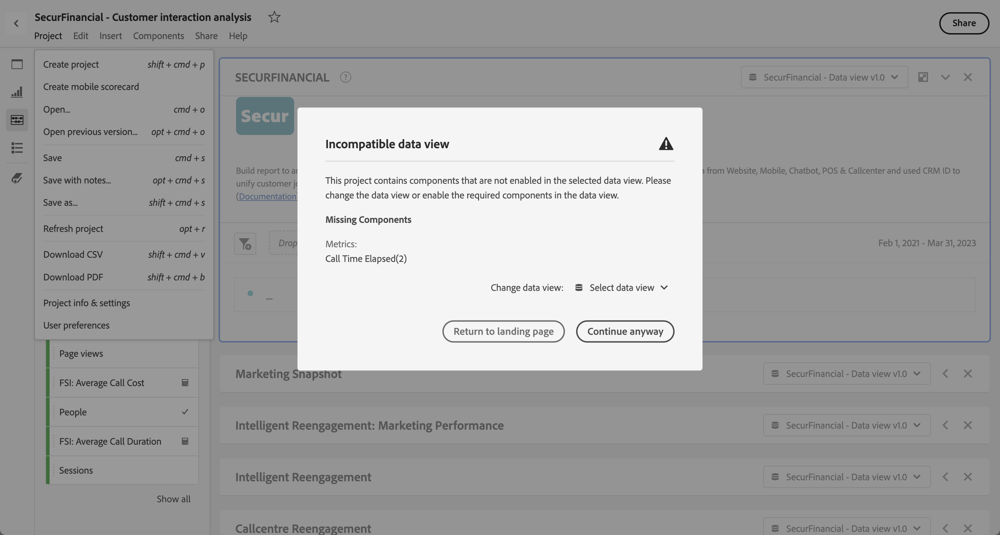

# 打开项目

您可以直接从[项目](/help/analysis-workspace/build-workspace-project/freeform-overview.md)页面打开一个项目。在列表中查找您的项目。使用[搜索](/help/analysis-workspace/build-workspace-project/freeform-overview.md#search)或[区段面板](/help/analysis-workspace/build-workspace-project/freeform-overview.md#segment-panel)来缩小列表范围。

* 选择项目的名称，以在 Analysis Workspace 中打开该项目。

您还可以在处理另一个项目时打开一个项目。

* 从&#x200B;**[!UICONTROL 项目]**&#x200B;菜单中选择&#x200B;**[!UICONTROL 打开]**。您会看到一个类似于[项目](/help/analysis-workspace/build-workspace-project/freeform-overview.md)页面的对话框。使用[搜索](/help/analysis-workspace/build-workspace-project/freeform-overview.md#search)或[区段面板](/help/analysis-workspace/build-workspace-project/freeform-overview.md#segment-panel)来缩小列表范围。
* 选择项目的名称，以在 Analysis Workspace 中打开该项目。

如果您找不到该项目并想要开启一个新项目，请选择&#x200B;**[!UICONTROL 新建]**。

## 打开以前的版本

要打开以前保存的项目版本，请执行以下操作：

1. 从&#x200B;**[!UICONTROL 项目]**&#x200B;菜单中选择&#x200B;**[!UICONTROL 打开先前版本]**。

   

1. 在&#x200B;**[!UICONTROL 先前保存的版本]**&#x200B;对话框中查看可用的先前版本列表。您可以在&#x200B;**[!UICONTROL 所有版本]**&#x200B;和&#x200B;**[!UICONTROL 仅带注释的版本]**&#x200B;之间切换。

   对于每个版本，该列表会显示时间戳、编辑器和已保存的注释。

1. 选择以前的版本，并单击&#x200B;**[!UICONTROL 加载]**。
然后，以前的版本会加载并出现一条通知。在单击&#x200B;**[!UICONTROL 保存]**&#x200B;之前，以前的版本不会成为项目的当前保存版本。如果离开已加载的版本，当您再次想要打开以前的版本时，您会看到最后保存的版本。

## 不兼容的数据视图

当您打开一个项目时，您可能会看到&#x200B;**[!UICONTROL 不兼容的数据视图]**&#x200B;警告对话框。该对话框解释了项目中某些组件在项目中的某个面板的选定数据视图中未启用。

要解决此警告，您可以：

* **[!UICONTROL 更改数据视图]**。从&#x200B;**[!UICONTROL 更改数据视图：]**中选择相应的数据视图。如果选定的数据视图有效，则您的项目会在 Analysis Workspace 中打开。
* **[!UICONTROL 返回登陆页面]**。您选择的项目尚未打开，并且您可以选择其他项目。
* **[!UICONTROL 仍要继续]**。您的项目将在 Analysis Workspace 中打开，但部分可视化内容会显示错误，且不兼容的数据视图会在数据视图名称前显示警告。
