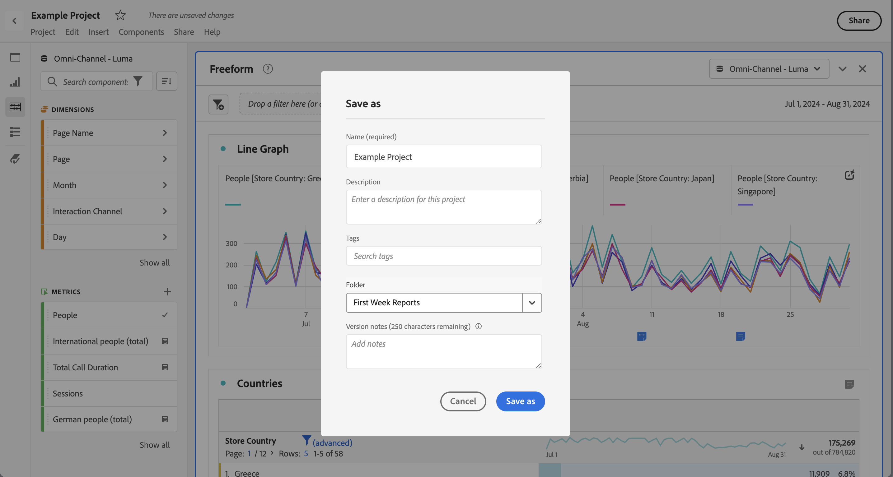
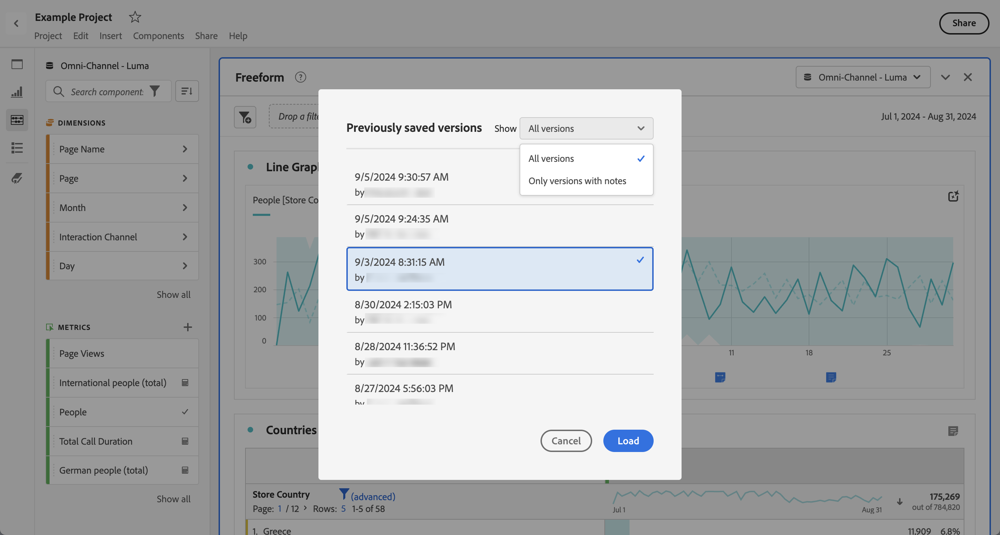

# 保存项目 {#save-projects}

<!-- markdownlint-disable MD034 -->

>[!CONTEXTUALHELP]
>id="cja_workspace_project_addnotes"
>title="添加注释"
>abstract="添加有关正在保存的项目版本的注释。 这些笔记将与版本一起存储，并可通过&#x200B;**[!UICONTROL 项目]** > **[!UICONTROL 打开以前的版本]**&#x200B;菜单访问。"

<!-- markdownlint-enable MD034 -->

Analysis Workspace中的项目每2分钟自动保存一次。 您也可以自行保存项目，将项目另存为重复项目或保存具有版本注释的项目。

## 保存

若要在Analysis Workspace中打开项目的情况下手动保存项目，请选择&#x200B;**[!UICONTROL 项目]**，然后从以下选项中进行选择：

* **[!UICONTROL 保存]**

  将更改保存到项目。如果项目已共享，项目的收件人也会看到所做的更改。

  首次保存项目时，将显示&#x200B;**[!UICONTROL 保存]**&#x200B;对话框。

  

   1. 指定以下内容：

      * **[!UICONTROL 名称]**（必需）。 项目的名称。
      * **[!UICONTROL 描述]**。 项目的描述。
      * **[!UICONTROL 标记]**。 在&#x200B;[!UICONTROL *搜索标记*]&#x200B;字段中搜索标记或使用&#x200B;**[!UICONTROL ENTER]**&#x200B;添加新标记。
      * **[!UICONTROL 文件夹]**。 从&#x200B;[!UICONTROL *选择文件夹*]&#x200B;下拉菜单中选择文件夹。 如果不指定文件夹，则项目将保存在从中创建新项目的当前文件夹中。
      * **[!UICONTROL 版本说明]**。 在&#x200B;*添加注释*&#x200B;文本区域中添加版本注释。

   1. 选择&#x200B;**[!UICONTROL 保存]**&#x200B;以保存您的项目。

  保存您的项目实际上会保存一个项目版本，该版本会存储90天。

  如果保存已共享的项目，则&#x200B;**[!UICONTROL 保存对共享项目的更改]**&#x200B;警告对话框会提示您进行确认。

  

   * 选择&#x200B;**[!UICONTROL 保存]**&#x200B;以保存项目。
   * 选择&#x200B;**[!UICONTROL 另存为]**&#x200B;以使用新名称将该项目另存为重复项目。

* **[!UICONTROL 保存并添加注释]**

  

  在保存项目时，添加有关项目中进行了哪些更改的注释。 在保存版本注释对话框中：

   1. 在&#x200B;**[!UICONTROL 添加注释]**&#x200B;文本区域中输入&#x200B;**[!UICONTROL 版本注释]**。
   1. 选择&#x200B;**[!UICONTROL 保存]**。

  注释与项目版本一起存储，并且在[打开项目的先前版本](open-projects.md#open-previous-version)时可用。 与注释一起保存的版本会自动存储一年。

* **[!UICONTROL 另存为]**

  

  使用新名称创建项目副本。 此时将显示“另存为”对话框。

   1. 指定以下内容：

      * **[!UICONTROL 名称]**（必需）。 项目的名称。
      * **[!UICONTROL 描述]**。 项目的描述。
      * **[!UICONTROL 标记]**。 在&#x200B;[!UICONTROL *搜索标记*]&#x200B;字段中搜索标记或使用&#x200B;**[!UICONTROL ENTER]**&#x200B;添加新标记。
      * **[!UICONTROL 文件夹]**。 从&#x200B;[!UICONTROL *选择文件夹*]&#x200B;下拉菜单中选择文件夹。 如果不指定文件夹，则项目将保存在从中创建新项目的当前文件夹中。
      * **[!UICONTROL 版本说明]**。 在&#x200B;*添加注释*&#x200B;文本区域中添加版本注释。

   1. 选择&#x200B;**[!UICONTROL 保存]**&#x200B;以保存您的项目。

  您可以将项目保存到其他文件夹。 原始项目不受影响。

<!-- Cannot find this option in CJA 
| **[!UICONTROL Save as template]** | Save your project as a [custom template](https://experienceleague.adobe.com/docs/analytics/analyze/analysis-workspace/build-workspace-project/starter-projects.html) that becomes available to your organization under **[!UICONTROL Project > New]** | 
-->

## 自动保存

>[!IMPORTANT]
>
>即使自动保存了新项目，您也必须在&#x200B;**前**&#x200B;次手动保存每个新项目。
>

Analysis Workspace 中的所有项目每 2 分钟自动保存到本地计算机。此自动保存包括尚未手动保存的新创建项目。

### 新项目

在切换到另一个项目、关闭浏览器选项卡等时，Analysis Workspace 会提示您手动保存新项目。

如果由于任何原因，您在手动保存新创建的项目之前意外失去了对它的访问权限，则项目的恢复版本将保存在Analysis Workspace登录页上的名为&#x200B;**[!UICONTROL 已恢复项目（过去7天）]**&#x200B;的文件夹中。 恢复恢复的项目并手动将其保存到所需位置。

要恢复已恢复的项目：

1. 转到Analysis Workspace登录页上的&#x200B;**[!UICONTROL 恢复的项目（过去7天）]**&#x200B;文件夹。

<!-- 
     
  -->

1. 打开您的项目并将其保存到所需位置。

### 现有项目

如果由于任何原因而离开项目时更改尚未自动保存，Analysis Workspace会提示您保存更改或提供警告消息。

一些常见的情况是：

#### 打开另一个项目

如果在处理包含尚未自动保存的更改的项目时打开另一个项目，Analysis Workspace会提示您保存当前项目。

可以使用以下选项：

* **[!UICONTROL 保存]**：将项目的最新自动保存本地副本替换为最新更改。
* **[!UICONTROL 放弃更改]**：放弃您的最新更改。 项目将保留最近自动保存的本地副本。
* **[!UICONTROL 取消]**：取消操作以打开另一个项目并保持现有项目处于打开状态。

<!--  -->

#### 离开或关闭选项卡

如果您在查看包含尚未自动保存的更改的项目时离开页面或关闭浏览器选项卡，则浏览器会警告您未保存的更改将丢失。 您可以选择离开或取消。 浏览器如何警告您取决于您使用的浏览器。

### 浏览器崩溃或会话超时

如果浏览器崩溃或会话超时，则下次访问Analysis Workspace时，系统会提示您恢复对项目所做的任何尚未自动保存的更改。

* 选择&#x200B;**[!UICONTROL 是]**&#x200B;将从最近自动保存的副本中恢复项目。

* 选择&#x200B;**[!UICONTROL 否]**&#x200B;将删除自动保存的副本并打开项目的最后一个用户保存的版本。

<!---->

对于从未保存的&#x200B;**新**&#x200B;项目，未保存的更改将无法恢复。

<!-- Shouldn't this belong to another page?  Moved it to a new open projects page

## Open previously saved version

To open a previously saved version of a project:

1. Select **[!UICONTROL Open previous version]** from the **[!UICONTROL Project]** menu.

   

1. Review the list of previous versions available. You can switch between **[!UICONTROL All versions]** and **[!UICONTROL Only versions with notes]**.

   For each version, the list shows a timestamp
   [!UICONTROL Timestamp] and [!UICONTROL Editor] are shown, in addition to [!UICONTROL Notes] if they were added when the [!UICONTROL Editor] saved. Versions without notes are stored for 90 days; versions with notes are stored for 1 year.
1. Select a previous version and click **[!UICONTROL Load]**.
   The previous version then loads with a notification. The previous version does not become the current saved version of your project until you click **[!UICONTROL Save]**. If you navigate away from the loaded version, when you return, you will see the last saved version of the project.

-->
