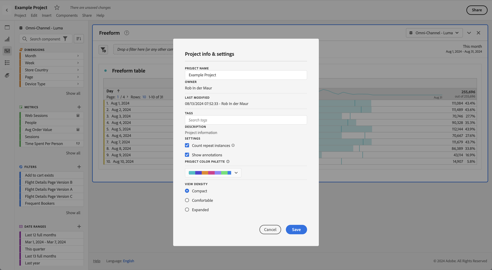
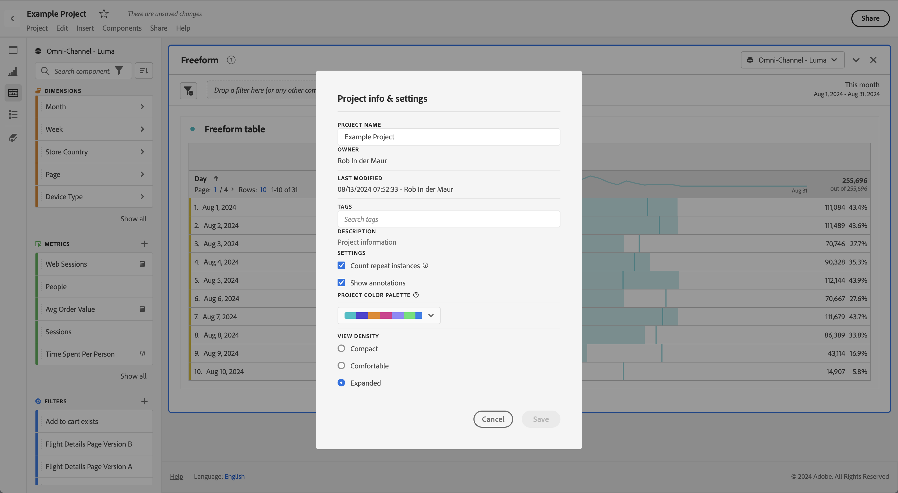

# 视图密度

通过调整视图密度，您可以减小左侧面板、自由格式表和同类群组表的垂直边距，从而在屏幕上查看更多数据。 可用的三个选项为：

>[!BEGINTABS]

>[!TAB 紧凑]

这是最浓缩的视图版本。

>[!TAB 舒适]

这是您在工作区中最常用的视图。

>[!TAB 扩展]

这是最扩展视图的版本。

>[!ENDTABS]

要设置视图密度，请执行以下操作：

1. 在工作区中，导航至&#x200B;**[!UICONTROL 项目]** > **[!UICONTROL 项目信息和设置]**。

1. 选择一个&#x200B;**[!UICONTROL 视图密度]**&#x200B;选项，然后选择&#x200B;**[!UICONTROL 保存]**。
