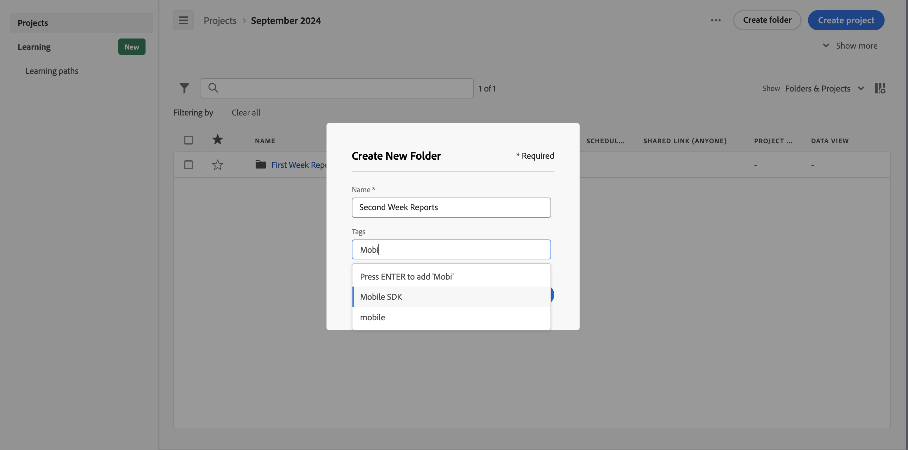

# 创建文件夹

可将新文件夹或子文件夹添加到 Workspace 登陆页上的项目和文件夹列表。

## 创建新文件夹

要创建新文件夹，请执行以下操作

1. 确保您已选择[显示文件夹和项目](/help/analysis-workspace/build-workspace-project/freeform-overview.md#show-selector)。

1. 确保[标题区](/help/analysis-workspace/build-workspace-project/freeform-overview.md#title-area)和[项目列表](/help/analysis-workspace/build-workspace-project/freeform-overview.md#project-list)显示要创建新文件夹的文件夹。

1. 单击&#x200B;**创建文件夹**。

1. 在&#x200B;**[!UICONTROL 创建新文件夹]**&#x200B;对话框中，输入新文件夹的名称。 例如：`Second Week Reports`。

1. 从&#x200B;**[!UICONTROL 标记]**&#x200B;下拉菜单中选择标记或输入新标记。

   

1. 单击&#x200B;**创建**。
新文件夹将会添加到当前文件夹。
