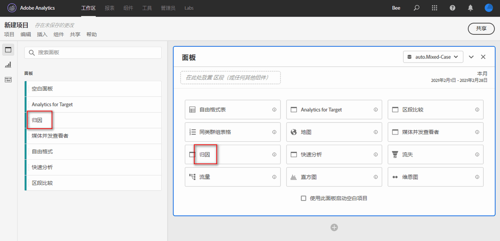
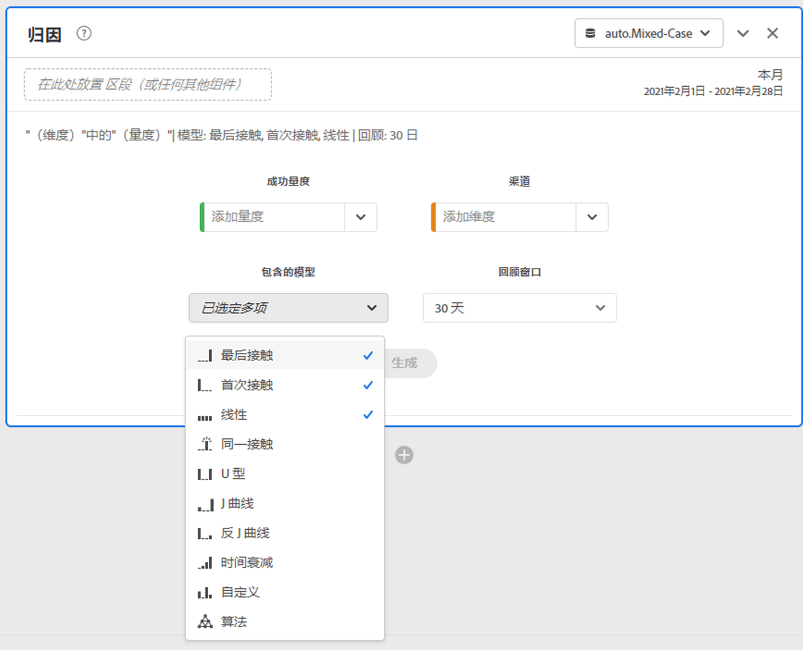
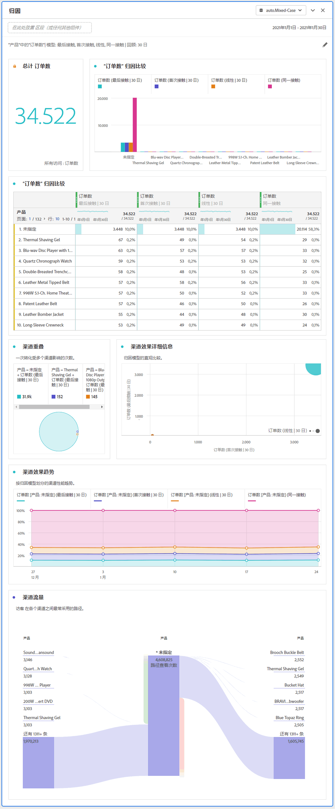

# 归因面板

[!UICONTROL 归因]面板是一种简单的方式，用于构建分析来比较各种归因模型。此功能为您提供专用工作区来使用和比较归因模型。

Customer Journey Analytics 通过让您能够执行以下操作来增强归因：

* 定义付费媒体之外的归因：可将任何维度、量度、渠道或事件应用于模型（例如内部搜索），而不仅仅是营销活动。
* 使用无限制的归因模型比较：动态比较任意所需数量的模型。
* 避免实施更改：使用报告时间处理和上下文感知会话，可在运行时构建并应用客户历程上下文。
* 构建与您的归因方案最匹配的会话。
* 按过滤器划分归因：轻松对所有重要过滤器中的营销渠道效果进行比较（例如新客户与老客户、产品 X 与产品 Y、忠诚度级别或 CLV）。
* 检查渠道交叉和多接触点分析：使用维恩图和直方图，以及趋势归因结果。
* 直观地分析关键营销序列：通过多节点流量和流失可视化图表，以可视方式探索导致转化的路径。
* 构建计算量度：使用任意数量的归因分配方法。

## 创建归因面板

1. 单击左侧的面板图标。
1. 将[!UICONTROL 归因]面板拖动到 Analysis Workspace 项目中。

   

1. 添加要归因的量度，并添加要归因的对比维度。例如“营销渠道”或自定义维度，如内部促销。

   

1. 选择要比较的归因模型和回顾时间范围。

1. “归因”面板会返回一组丰富的数据和可视化图表，其中对选定维度和度量进行了归因比较。

   

## 归因可视化图表

* **总数量度**：报表时间范围内发生的转化总数。这些是在您所选维度中归因的转化。
* **归因比较条形图**：以可视方式，比较所选维度中各个维度项的归因转化。每种条形颜色代表一个不同的归因模型。
* **归因比较表**：将相同的数据显示为条形图，以表格的形式表示。选择此表中的不同列或行，会筛选条形图以及面板中的其他一些可视化图表。此表的作用与工作区中任何其他自由格式表的作用相似，允许您添加量度、过滤器或细分等组件。
* **重叠图**：一种维恩图，显示前三个维度项以及它们共同参与某个转化的频率。例如，气泡重叠的大小表示当人员出现在两个维度项目中时发生转化的频率。 选择相邻自由格式表中的其他行，会更新可视化图表以反映所选内容。
* **性能详细信息**：用于使用散点图以可视方式比较最多三个归因模型。
* **趋势化性能**：显示排名最前的维度项的归因转化趋势。选择相邻自由格式表中的其他行，会更新可视化图表以反映所选内容。
* **流量**：让您可以查看在人员历程中与哪个渠道交互得最多，以及按照什么顺序。
