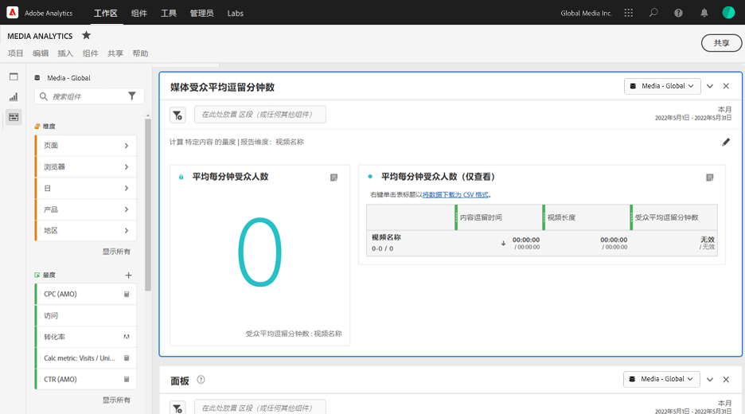

# “媒体平均受众访问分钟数”面板 {#media-average-minute-audience-panel}

<!-- markdownlint-disable MD034 -->

>[!CONTEXTUALHELP]
>id="cja_workspace_mediaminuteaverageaudience_button"
>title="媒体平均受众访问分钟数"
>abstract="创建一个面板来分析特定内容或特定时段内的平均受众访问分钟数。"

<!-- markdownlint-enable MD034 -->

<!-- markdownlint-disable MD034 -->

>[!CONTEXTUALHELP]
>id="cja_workspace_mediaaverageminuteaudience_panel"
>title="媒体平均受众访问分钟数"
>abstract="显示特定媒体内容或自定义时段内的性能。  **常规参数&#x200B;** **计算量度**：选择面板使用的量度。选择&#x200B;**特定内容**&#x200B;以根据内容长度分析特定内容或事件的平均受众访问分钟数。**选择自定义时段**&#x200B;来分析平均受众访问分钟数在自定义选定时段内的变化情况。 **报告维度**：选择按&#x200B;**内容 ID** 维度的&#x200B;**视频名称**&#x200B;进行报告。仅当您选择特定内容作为量度时可用。 **粒度**：选择报告的粒度。仅当您选择自定义时段作为量度时可用。 **按以下条件过滤内容（可选）**：选择特定的节目、季、剧集，或选择自定义维度来过滤内容。  **高级设置&#x200B;** **表格设置**：选择是否在表格中显示计算值。 **逗留时间量度**：选择您想要用于特定内容计算的逗留时间量度。仅当您选择特定内容作为量度时可用。"
>additional-url="https://experienceleague.adobe.com/zh-hans/docs/analytics/analyze/analysis-workspace/panels/average-minute-audience-panel#specific-content" text="特定内容"
>additional-url="https://experienceleague.adobe.com/zh-hans/docs/analytics/analyze/analysis-workspace/panels/average-minute-audience-panel#custom-time-period" text="自定义时段"

<!-- markdownlint-enable MD034 -->

>[!NOTE]
>
>**[!UICONTROL 媒体平均受众访问分钟数]**&#x200B;面板仅适用于已购买流媒体收集加载项进行Customer Journey Analytics的客户。
>
>有关更多信息，请与您的Adobe销售代表或Adobe客户团队联系。
>

在Analysis Workspace中，平均受众访问分钟数可以提供

* 查看特定媒体流所花费的时间除以内容的持续时间，或者
* 在自定义时段内使用选定的粒度进行查看所用的时间。

通过“媒体平均受众访问分钟数”面板，您可以比较任何长度或类型的程序，从而了解内容的平均使用情况。 例如，您可以了解将30分钟的情景喜剧与3小时的体育赛事进行比较时的平均观看量。

此外，您可以使用“媒体平均受众访问分钟数”面板将此数字平均受众访问分钟数与线性电视平均访问分钟数指标进行比较或附加到其上。

与“平均受众访问分钟数”量度相比，“媒体平均受众访问分钟数”面板提供了以下优势：

* 支持自定义时间段

* 允许在处理视图后更新持续时间分类（如果持续时间分类不存在或需要更正）

  如果在使用量度时进行此更新，则持续时间分类不存在（如果不存在该分类）。 或者持续时间分类已过期（如果分类存在但不正确）。

## 使用

要使用&#x200B;**[!UICONTROL 媒体平均受众访问分钟数]**&#x200B;面板，请执行以下操作：

1. 创建&#x200B;**[!UICONTROL 媒体平均受众访问分钟数]**&#x200B;面板。 有关如何创建面板的信息，请参阅[创建面板](panels.md#create-a-panel)。

1. 确保为面板选择数据视图，该面板具有从流媒体收集加载项配置的组件。

1. 为面板指定[输入](#panel-input)。

1. 观察面板的[输出](#panel-output)。

### 面板输入

使用本节中所述的输入设置来配置“媒体平均受众访问分钟数”面板。

1. 配置以下输入设置：

   | 设置 | 描述 |
   |---------|------------|
   | **面板日期范围** | 面板日期范围的默认值为&#x200B;[!UICONTROL **本月**]。 您可以对其进行编辑以一次查看一天或几个月的数据。   这个可视化效果最多可显示 1440 行数据（例如，以分钟级别的粒度划分 24 小时）。如果日期范围和粒度的组合产生 1440 行以上，则将自动更新粒度以容纳这个完整的日期范围。 |
   | [!UICONTROL **在此处放置区段（或任何其他组件）**] | 与其他面板一样，此设置根据您创建的区段过滤您的选择。 此设置非常适合用于查看特定平台、直播或其他常见媒体区段。 |
   | [!UICONTROL **计算**]&#x200B;的量度 | 选择是否要查看[**[!UICONTROL 特定内容]**](#specific-content)的平均受众访问分钟数。 或者，如果您想查看[**[!UICONTROL 自定义时段]**](#custom-time-period)的平均受众访问分钟数。  选择&#x200B;[!UICONTROL **自定义时间段**]： <ul><li>如果持续时间不可用，或者 </li><li>如果要查看包含多个内容的时间系列的平均受众访问分钟数，或者</li><li>对于没有指定持续时间的内容（例如在直播或活动期间）</li></ul></li></li></ul> 
此设置更改工作流程和报表输出。
 |

1. 根据您在&#x200B;[!UICONTROL **计算**]&#x200B;的量度下拉列表中选择的选项，继续使用[特定内容](#specific-content)或[自定义时间段](#custom-time-period)。

#### 特定内容

1. 如果在[配置面板输入](#panel-inputs)时，在&#x200B;[!UICONTROL **计算**]&#x200B;的量度下拉菜单中选择了&#x200B;[!UICONTROL **特定内容**]，请指定以下配置选项：

   | 设置 | 描述 |
   |---------|------------|
   | [!UICONTROL **报告维度**] | 选择特定内容时，您可以选择报表输出以使用视频名称或内容ID字段显示内容及其关联的平均受众访问分钟数。 |
   | [!UICONTROL **内容筛选依据（可选）**] | 根据您想要的查看方式或数据的结构化方式，选择筛选特定内容的方式。 <ul>[!UICONTROL **节目、季、集**]：在下拉菜单中显示您可用的节目，您可以使用搜索（或通过从左列拖放节目名称）对其进行过滤。 可在这里结束选择以查看您的各季节目，也可按个别的季过滤，然后按个别的集过滤。此设置显示这些节目、季和集在所选时段的数据。</li><li>[!UICONTROL **自定义维度**]：如果您的节目名称在自定义维度下，可以通过在维度（可选）下拉列表中搜索或使用左列搜索来查找该节目。 该维度项根据该选择自动填充，并被视为一集。</li><li>[!UICONTROL **无**]：显示具有所选所选内容的平均受众访问分钟数数据的所有视频名称。 （默认情况下，此选项处于选中状态。）</li></ul> |

1. 继续使用[特定内容高级设置](#specific-content-advanced-settings)配置高级设置。

#### 特定内容高级设置

1. 在&#x200B;[!UICONTROL **计算**]&#x200B;的量度下拉菜单中选择&#x200B;[!UICONTROL **特定内容**]&#x200B;后，选择&#x200B;[!UICONTROL **显示高级设置**]，然后指定以下配置选项：

   | 选项 | 描述 |
   |---------|------------|
   | **[!UICONTROL 表设置]** | 默认选项&#x200B;**[!UICONTROL 在表]**&#x200B;中显示计算值将平均受众访问分钟数的分子和分母显示为表中的前几列。 取消选择此选项将删除这两列。 平均受众访问分钟数列将保留在视频名称或内容ID旁边的表中。 |
   | **[!UICONTROL 逗留时间量度]** | 您可以选择默认的&#x200B;**[!UICONTROL 内容逗留时间]**&#x200B;选项，该选项仅包括内容时间。 或者，您可以选择使用&#x200B;**[!UICONTROL 媒体逗留时间]**，其中包含内容和广告时间，并将其一起作为平均受众访问分钟数的分子计算。 |

1. 选择&#x200B;[!UICONTROL **生成**]&#x200B;以完成创建媒体平均受众访问分钟数面板。

1. 有关如何使用“媒体平均受众访问分钟数”面板的信息，请继续使用[面板输出](#panel-output)。

#### 自定义时段

1. 如果在[配置面板输入](#panel-inputs)时，在&#x200B;[!UICONTROL **计算**]&#x200B;的量度下拉菜单中选择&#x200B;[!UICONTROL **自定义时间段**]，请指定以下配置选项：

   | 选项 | 描述 |
   |---------|------------|
   | **[!UICONTROL 粒度]** | 默认粒度为&#x200B;[!UICONTROL **5分钟**]，但您可以选择在选定时间段内用作时间序列分母的任何粒度。 例如，选择下午12:00到下午12:30，粒度为5分钟，将返回这整个半小时的平均受众访问分钟数，以及每5分钟时段的平均受众访问分钟数，共6行。 这些行用作时间序列图的数据点。 |
   | [!UICONTROL **内容筛选依据（可选）**] | 根据您想要的查看方式或数据的结构化方式，选择筛选特定内容的方式。 <ul>[!UICONTROL **节目、季、集**]：在下拉菜单中显示您可用的节目，您可以使用搜索（或通过从左列拖放节目名称）对其进行过滤。 可在这里结束选择以查看您的各季节目，也可按个别的季过滤，然后按个别的集过滤。此设置显示这些节目、季和集在所选时段的数据。</li><li>[!UICONTROL **自定义维度**]：如果您的节目名称在自定义维度下，可以通过在维度（可选）下拉列表中搜索或使用左列搜索来查找该节目。 该维度项根据该选择自动填充，并被视为一集。</li><li>[!UICONTROL **无**]：显示具有所选所选内容的平均受众访问分钟数数据的所有视频名称。 （默认情况下，此选项处于选中状态。）</li></ul> |

1. 继续使用[自定义时段高级设置](#custom-time-period-advanced-settings)配置高级设置。

#### 自定义时段高级设置

1. 在&#x200B;[!UICONTROL **计算**]&#x200B;的量度下拉菜单中选择&#x200B;[!UICONTROL **自定义时间段**]&#x200B;后，选择&#x200B;[!UICONTROL **显示高级设置**]，然后指定以下配置选项：

   | 选项 | 描述 |
   |---------|------------|
   | **[!UICONTROL 表设置]** | 默认设置在表格中显示计算的值，其中显示平均受众访问分钟数的分子和分母作为表中的前几列。取消选择此选项将删除这两列，这样在时段旁仅留下平均受众访问分钟数。 |

1. 选择&#x200B;[!UICONTROL **生成**]&#x200B;以完成创建媒体平均受众访问分钟数面板。

1. 有关如何使用“媒体平均受众访问分钟数”面板的信息，请继续使用[面板输出](#panel-output)。

### 面板输出

在[配置面板输入](#panel-inputs)时，根据您在&#x200B;[!UICONTROL **计算**]&#x200B;的量度下拉菜单中选择&#x200B;[!UICONTROL **特定内容**]&#x200B;还是&#x200B;[!UICONTROL **自定义时间段**]，面板输出会有所不同。

#### 特定内容

“媒体平均受众访问分钟数”面板返回以下各项：

* 您整个所选时段的总平均受众访问分钟数
* 过滤器和单个视频的平均受众访问分钟数，显示在表中
* 如果选择了高级设置，则返回逗留时间和视频长度（持续时间）

要随时编辑和重建面板，请选择右上角的。

#### 特定内容数据源

“媒体平均受众访问分钟数”面板仅使用平均受众访问分钟数量度来收集数据。 在面板中无法使用划分或其他量度。

| 量度 | 描述 |
|--------|-------------|
| **[!UICONTROL 平均受众访问分钟数]** | 查看您的媒体流的逗留时间除以通过“分类”提供的视频长度（持续时间）。 |

#### 自定义时段 {#custom-time-period-output}

“媒体平均受众访问分钟数”面板返回以下各项：

* 您整个所选时段的总平均受众访问分钟数

* 最大和最小平均观看分钟数

* 显示整个所选时段上平均受众访问分钟数的线系列图。

* 此表显示过滤器以及各粒度的平均受众访问分钟数以及每个时段的内容逗留时间和粒度

  仅当选择了名为&#x200B;[!UICONTROL **在表**]&#x200B;中显示计算值的高级设置下的选项时，才会显示此表。

要随时编辑和重建面板，请选择右上角的。

#### 自定义时段数据源

“媒体平均受众访问分钟数”面板仅使用平均受众访问分钟数量度来收集数据。 在面板中无法使用划分或其他量度。

| 量度 | 描述 |
|---|---|
| **[!UICONTROL 平均受众访问分钟数]** | 查看您的媒体流的逗留时间除以所选总时段或所选粒度（分钟）。 |

>[!MORELIKETHIS]
>
> [创建面板](/help/analysis-workspace/c-panels/panels.md#create-a-panel)
> [媒体并行查看者面板](media-concurrent-viewers.md)
> [“媒体播放耗时”面板](media-playback-time-spent.md)
>