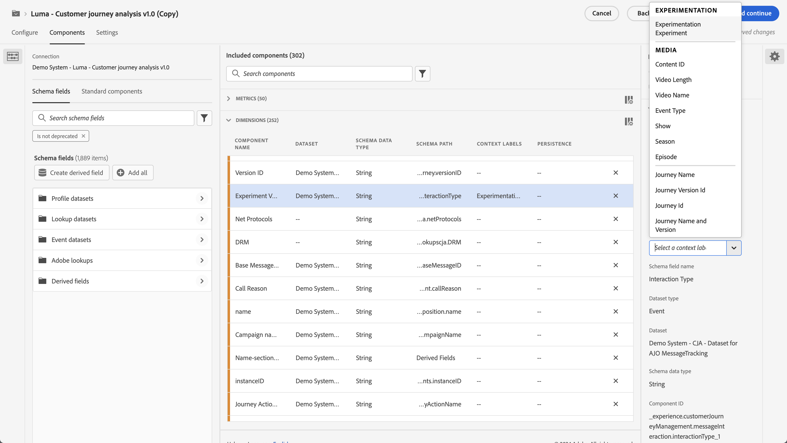

# 实验面板

>[!NOTE]
>
>此功能当前正在进行[小范围测试](/help/release-notes/releases.md)。

的 **[!UICONTROL 实验]** 通过面板，分析人员可以比较不同的用户体验、营销或消息传递变量，从而确定哪个变量最适合产生特定结果。 您可以评估来自任何实验平台(在线、离线、Adobe解决方案、Adobe Journey Optimizer甚至BYO（自带）数据)的任何A/B实验的提升度和置信度。

>[!IMPORTANT]
>
>此时， [Adobe Analytics for Target](https://experienceleague.adobe.com/docs/target/using/integrate/a4t/a4t.html?lang=zh-Hans) (A4T)数据通过Analytics Source Connector引入Adobe Experience Platform **无法** 在 [!UICONTROL 实验] 的上界。 我们期待在2023年解决这一问题。

## 访问控制

所有Customer Journey Analytics(CJA)用户都可以使用“实验”面板。 无需管理员权限或其他权限。 但是，设置（下面的步骤1和2）需要只有管理员才能执行的操作。

## 步骤1:创建与实验数据集的连接

在您的实验数据 [摄取](https://experienceleague.adobe.com/docs/experience-platform/ingestion/home.html?lang=zh-Hans) 进入Adobe Experience Platform, [在CJA中创建连接](/help/connections/create-connection.md) 到一个或多个实验数据集。

## 步骤2:在数据视图中添加上下文标签

在CJA数据视图设置中，管理员可以添加 [上下文标签](/help/data-views/component-settings/overview.md) 到维度或量度和CJA服务，例如 [!UICONTROL 实验] 面板可以将这些标签用于其用途。 实验面板使用两个预定义的标签：

* [!UICONTROL 实验]
* [!UICONTROL 变体]

在包含实验数据的数据视图中，选取两个维度，一个包含实验数据，一个包含变体数据。 然后，使用 **[!UICONTROL 实验]** 和 **[!UICONTROL 变体]** 标签。

如果没有这些标签，“实验”面板将不起作用，因为将没有可用的实验。

## 步骤3:配置“实验”面板

1. 在CJA工作区中，将“实验”面板拖到项目中。

>[!IMPORTANT]
>如果CJA数据视图中的必需设置尚未完成，则在继续操作之前，您将收到一则相关消息。

1. 配置面板输入设置。

   | 设置 | 定义 |
   | --- | --- |
   | **[!UICONTROL 实验]** | 面向最终用户的体验的一组变体，用于确定哪些体验最好永久保留。 实验由两个或多个变体组成，其中一个变体被视为控制变体。 此设置已预填充已标有的维度  **[!UICONTROL 实验]** 标签，以及最近3个月的实验数据。 |
   | **[!UICONTROL 控制变量]** | 为了确定更好的替代方案而正在比较的最终用户体验中的两个或多个更改之一。 必须选择一个变体作为控制，并且只能将一个变体视为控制变体。 此设置已预填充已标有的维度  **[!UICONTROL 变体]** 标签。 此设置将提取与此实验关联的变体数据。 |
   | **[!UICONTROL 成功量度]** | 用户比较变体的量度或量度。 对于转化量度（无论最高还是最低），具有最理想结果的变体将被声明为实验的“性能最佳的变体”。 您最多可以添加5个量度。 |
   | **[!UICONTROL 标准化量度]** | 基准([!UICONTROL 人员], [!UICONTROL 会话]或 [!UICONTROL 事件])。 例如，测试可能会比较多个变体的转化率，其中 **[!UICONTROL 转化率]** 计算为 **[!UICONTROL 每个会话的转化数]** 或 **[!UICONTROL 每人转化]**. |
   | **[!UICONTROL 日期范围]** | 日期范围会根据在CJA中收到的所选实验的首次点击自动设置。 您可以根据需要将日期范围限制或扩展到更具体的时间范围。 |

1. 单击&#x200B;**[!UICONTROL 生成]**。

## 步骤4:解释面板输出

“实验”面板可返回一组丰富的数据和可视化图表，帮助您更好地了解实验的效果。 在该面板顶部，提供了一个摘要行，用于提醒您选择的面板设置。您可以随时通过单击右上方的编辑铅笔图标来编辑面板。

您还会获得一个文本摘要，指示实验是否结果，并总结结果。 结论性基于统计意义。 （请参阅下面的“统计方法”。） 您可以看到具有最高提升度和置信度的最佳变体的概要数字。

>[!NOTE]
>
>提升度和置信度也 [高级计算量度函数](/help/components/calc-metrics/cm-adv-functions.md) ，以便您能够构建自己的提升度和置信度量度。

对于您选择的每个成功指标，将显示一个自由格式表和一个转化率趋势图：

的 [!UICONTROL 折线图] 图表为您提供 [!UICONTROL 控制] 与 [!UICONTROL 控制变量] 性能：

>[!NOTE]
>
>此面板当前不支持分析A/A测试。

## Adobe统计方法

为了提供易于解释和安全的统计推断，Adobe采用了基于 [任意有效置信序列](https://doi.org/10.48550/arXiv.2103.06476).

置信序列是置信区间的“连续”模拟值。 要了解置信度序列是什么，请设想重复您的实验100次，并计算平均业务量度（例如，电子邮件的打开率）及其关联的95%置信度序列的估计值，以便 *每位新用户* 进入实验。 95%置信度序列将在您运行的100个实验中的95个实验中包含业务量度的“true”值。 (95%的置信区间在每次实验中只能计算一次，以保证95%的覆盖率；而不是每个新用户)。 因此，置信序列允许您持续监控实验，而不增加误报率，即允许“偷窥”结果。

### 解释结果

1. **实验是决定性的**:每次您查看实验报告时，Adobe都会分析在实验中累计到此时刻的数据，并将在任何有效置信度超过95%的阈值时，声明实验为“结论性” *至少一个* （当有两个以上的臂时，应用Bonferonni校正，以校正多假设检验）。

2. **性能最佳的变体**:当实验被宣布为结论性时，转化率最高的变体将被标记为“性能最佳的变体”。 请注意，此变体必须是控制变体或基线变体，或者是在任何有效置信阈值（应用了Bonferonni校正）超过95%的变体之一。

3. **转化率**:显示的转化率是成功量度值与标准化量度值的比率。 请注意，如果量度不是二进制的，则这有时可能大于1（实验中每个单位为1或0）

4. **提升度**:“实验”报表摘要显示基线上的提升度，该提升度是衡量给定变量相对于基线转化率提高百分比的指标。 精确定义时，它是指给定变体与基线之间的性能差异除以基线的性能（以百分比表示）。

5. **置信度**:显示的“任何时间有效置信度”是一个概率度量，用于衡量有多少证据表明给定的变量与控制变量相同。 置信度越高，表明在假设控制变量和非控制变量具有同等性能时，证据就越少。 更准确地说，所显示的置信度是一种概率（以百分比表示），即如果实际上真实的基础转化率没有差异，我们观察到给定变体与控制体之间的转化率差异较小。 在 *p*-values，显示的置信度为1 - *p*-value。

但请注意，对结果的完整描述应考虑所有可用证据（即实验设计、样本量、转化率、置信度等），而不仅仅是结论性或无结论性声明。 即使结果尚未“确定”，仍有令人信服的证据表明一个变体与另一个变体不同（例如，置信区间几乎不重叠）。 理想情况下，决策应根据所有统计证据作出，并以连续谱解释。
