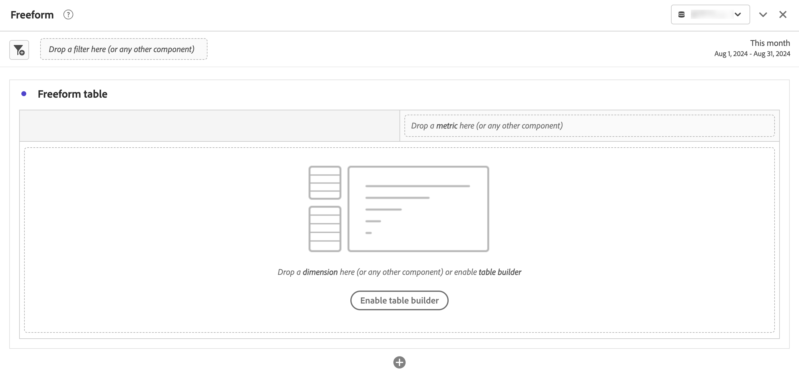

# “自由格式”面板

>[!BEGINSHADEBOX]

_本文在_  _&#x200B;**Customer Journey Analytics**&#x200B;_&#x200B;中记录了自由格式面板。 _有关本文的_  _&#x200B;**Adobe Analytics**&#x200B;版本，请参阅[自由格式面板](https://experienceleague.adobe.com/zh-hans/docs/analytics/analyze/analysis-workspace/panels/freeform-panel)。_

>[!ENDSHADEBOX]

**[!UICONTROL 自由格式面板]**&#x200B;是一个以[自由格式表](/help/analysis-workspace/visualizations/freeform-table/freeform-table.md)可视化图表为默认起始状态的空白面板。

## 使用

要使用&#x200B;**[!UICONTROL 自由格式面板]**：

1. 创建一个&#x200B;**[!UICONTROL 自由格式面板]**。 有关如何创建面板的信息，请参阅[创建面板](panels.md#create-a-panel)。

   

1. 请参阅[使用工作区内的组件](/help/components/use-components-in-workspace.md)，了解如何将组件添加到自由格式面板和[自由格式表](/help/analysis-workspace/visualizations/freeform-table/freeform-table.md)可视化图表。

>[!MORELIKETHIS]
>
>[创建面板](/help/analysis-workspace/c-panels/panels.md#create-a-panel)
>[在Workspace中使用组件](/help/components/use-components-in-workspace.md)
>[自由格式表可视化图表](/help/analysis-workspace/visualizations/freeform-table/freeform-table.md)
>