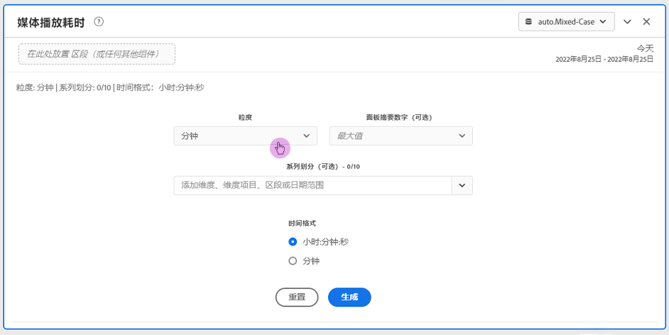
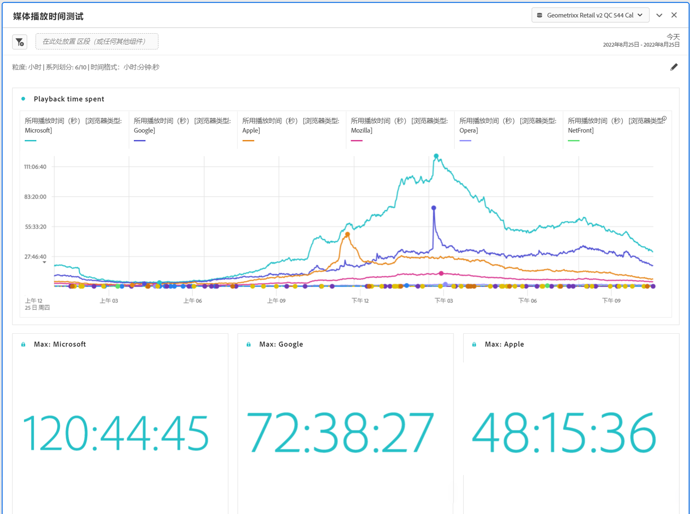

# “媒体播放耗时”面板 {#media-playback-time-spent-panel}

<!-- markdownlint-disable MD034 -->

>[!CONTEXTUALHELP]
>id="workspace_mediaplaybacktimespent_button"
>title="媒体播放耗时"
>abstract="创建一个面板来分析一段时间内的视频消耗情况，其中具有不同级别的粒度，以及细分和比较的能力。"

<!-- markdownlint-enable MD034 -->

<!-- markdownlint-disable MD034 -->

>[!CONTEXTUALHELP]
>id="workspace_mediaplaybacktimespent_panel"
>title="媒体播放耗时"
>abstract="分析一段时间内的视频消耗情况，选择各种粒度，并进行细分和比较。  **粒度**：选择查看并发查看者的时段。 **面板摘要数字（可选）**：选择显示每行带有日期或时间详细信息的摘要数字。最大值将会显示播放耗时峰值的详细信息。最小值显示低谷期的详细信息。总和显示播放耗时总和的详细信息。 **系列细分（可选）**：按区段、维度、维度项或日期范围细分可视化图表。一次最多查看 10 行。细分仅限一个级别。 **时间格式**：以小时或分钟显示可视化时间格式的选项。"

<!-- markdownlint-enable MD034 -->

>[!BEGINSHADEBOX]

_本文记录了_  _**Customer Journey Analytics**_&#x200B;中的“媒体播放耗时”面板。 _查看本文的_  _**Adobe Analytics**&#x200B;版本的[媒体播放耗时面板](https://experienceleague.adobe.com/en/docs/analytics/analyze/analysis-workspace/panels/media-playback-time-spent)。_

>[!ENDSHADEBOX]

>[!NOTE]
>
>“媒体平均受众访问分钟数”面板仅适用于已购买流媒体收集加载项进行Customer Journey Analytics的客户。
>有关更多信息，请与您的Adobe销售代表或Adobe客户团队联系。
>

**[!UICONTROL 媒体播放耗时]**&#x200B;面板支持分析一段时间内的播放，其中提供关于并发高峰的详细信息，并可进行分解和比较。

在Analysis Workspace中，播放耗时是在特定时间点观看媒体流所花费的时间。 它包括暂停、缓冲和开始时间。

已购买流媒体收集加载项的客户可以分析播放耗时，以获得关于内容质量和查看者参与情况的宝贵见解。 在排除故障或规划数量或规模时提供帮助。

播放耗时可帮助您了解：

* 出现并发高峰的位置。

* 下降发生在何处。

>[!BEGINSHADEBOX]

观看演示视频的[媒体播放耗时](https://video.tv.adobe.com/v/338699){target="_blank"}。

{{videoaa}}

>[!ENDSHADEBOX]

## 使用

要使用&#x200B;**[!UICONTROL 媒体播放耗时]**&#x200B;面板：

1. 创建&#x200B;**[!UICONTROL 媒体播放耗时]**&#x200B;面板。 有关如何创建面板的信息，请参阅[创建面板](panels.md#create-a-panel)。

1. 确保为具有从流媒体收集配置的组件的面板选择数据视图。

1. 指定面板的[输入](#panel-input)。

1. 观察面板的[输出](#panel-output)。

### 面板输入

您可以使用以下输入设置来配置“媒体播放耗时”面板：

| 设置 | 描述 |
|---|---|
| 面板日期范围 | 面板日期范围的默认值为“今天”。您可以对其进行编辑以一次查看一天或几个月的数据。 这个可视化图表限制为 1440 行数据（例如，以分钟作为粒度级别来表示 24 小时）。如果日期范围和粒度的组合产生的行数超过了 1440 行，则将自动更新粒度以适应完整的日期范围。 |
| 粒度 | 粒度的默认值为“分钟”。 这个可视化图表限制为 1440 行数据（例如，以分钟作为粒度级别来表示 24 小时）。如果日期范围和粒度的组合产生的行数超过了 1440 行，则将自动更新粒度以适应完整的日期范围。 |
| 面板概要数字 | 要查看播放耗时的日期或时间详细信息，可以使用概要数字。“最大值”显示并发峰值的详细信息。“最小值”显示低谷期的详细信息。“总和”将计算用于选择的播放耗时的总和。面板默认值仅显示“最大值”，不过您可以将其更改为显示“最小值”、“总和”或这三个值的任意组合。 如果您使用细分，则会为每一项显示概要数字。 |
| 系列细分 | （可选）您可以按筛选器、维度、维度项或日期范围细分可视化图表。
– 一次最多可以查看 10 行。细分仅限一个级别。

 — 在拖动一个维度时，将根据所选面板日期范围，自动选择顶部维度项。
– 要比较日期范围，请将 2 个或更多日期范围拖动到系列细分过滤器中。 |
| 时间格式 | 您可以查看`Hours:Minutes:Seconds`（默认）或`Minutes`（以整数显示，四舍五入为0.5）中花费的播放时间。 |
| 日期序列显示 | 如果您已放置至少两个日期范围过滤器作为系列细分，您将看到用于选择叠加（默认）或顺序的选项。 “叠加”显示具有公共x轴起点的线，以便它们并行运行，而“顺序”显示具有特定x轴起点的线。 如果数据对齐（例如，过滤器1在下午8:44结束，过滤器2在下午8:45开始），则这些线将按顺序显示。 |

### 面板输出

“媒体播放耗时”面板可以返回一个线形图和概要数字，以包括播放耗时的最大值、最小值和/或总和。在该面板顶部，提供了一个摘要行，用于提醒您选择的面板设置。

在任何时候，选择以编辑和重建面板。

如果选择系列细分，则会为每一项在线形图上显示一条线以及概要数字：

### 数据源

可在此面板中使用的唯一量度是“播放耗时”。

| 量度 | 描述 |
|---|---|
| 播放耗时 | 在选定粒度期间查看的内容总数`hours:minutes:seconds`（或`minutes`），包括暂停、缓冲和开始时间。 |

## 常见问题解答

| 问题 | 回答 |
|---|---|
| 自由格式表在什么位置？如何查看数据源？ | 

自由格式表在此视图中不可用。要下载数据源，请从折线图的上下文菜单中选择用于下载CSV文件的选项。
 |
| 
为什么我的粒度发生了变化？
 | 
这个可视化图表限制为 1440 行数据（例如，以分钟作为粒度级别来表示 24 小时）。如果日期范围和粒度的组合产生 1440 行以上，则将自动更新粒度以容纳这个完整的日期范围。

如果从较大的日期范围更改到较小的日期范围，粒度将在日期范围更改后自动更新为允许的最低明细级别。 要查看较高的粒度，请编辑面板并重建。
 |
| 

如何比较视频名称、过滤器、内容类型等？
 | 
要在单个可视化图表中比较这些内容，请将过滤器、维度或特定维度项拖动到系列细分过滤器中。

视图限制为 10 个细分。要查看 10 个以上的细分，您必须使用多个面板。
 |
| 如何比较日期范围？ | 要在单个可视化图表中比较日期范围，请通过拖动 2 个或更多日期范围来使用系列细分。这些日期范围将覆盖面板日期范围。 |
| 如何更改可视化图表类型？ | 

此面板仅允许时间系列的线形可视化图表。
 |
| 能否运行异常检测？ | 

否。异常检测对此面板不可用。
 |

>[!MORELIKETHIS]
>
>[Create a panel](/help/analysis-workspace/c-panels/panels.md#create-a-panel)
>[“媒体平均受众访问分钟数”面板](average-minute-audience-panel.md)
>[媒体并行查看者面板](media-concurrent-viewers.md)
>
