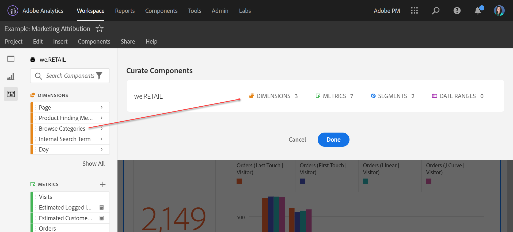

# 组织项目

“特选”允许您在共享项目之前限制组件(维度、量度、过滤器、日期范围)。 当收件人打开项目时，他们将看到您为其策划的有限组件。策划虽然是一个可选步骤，但建议在共享项目前执行此步骤。

>[!NOTE]
> 产品配置文件是控制用户可以查看哪些组件的主要机制。它们通过[Adobe Experience Cloud Admin Console](https://docs.adobe.com/content/help/zh-Hans/core-services/interface/manage-users-and-products/admin-getting-started.html)进行管理。 “策划”是一个次级过滤器。

## 应用项目策划

1. 单击&#x200B;**[!UICONTROL 共享]** > **[!UICONTROL 策划项目数据]**。将自动添加项目中使用的组件。
1. （可选）要添加更多组件，请将要共享的组件从左边栏拖到[!UICONTROL 策划组件]字段。
1. 单击&#x200B;**[!UICONTROL 完成]**。

也可以通过单击&#x200B;**[!UICONTROL 策划和共享]**&#x200B;从[!UICONTROL 共享]菜单中应用策划。此选项会自动将项目策划为项目中使用的组件。您可以按照上述步骤添加更多组件。

## 应用策划后的项目视图

当收件人打开应用策划后的项目时，他们将只看到您在策划时定义的组件集：

## 删除项目策划

要删除项目策划并恢复左边栏中的完整组件集，请执行以下操作：

1. 单击&#x200B;**[!UICONTROL 共享]** > **[!UICONTROL 策划项目数据]**。
1. 单击&#x200B;**[!UICONTROL 删除策划]**。
1. 单击&#x200B;**[!UICONTROL 完成]**。

## 组件特选选项

在精选的项目中，收件人将显示左边栏中的&#x200B;**[!UICONTROL 显示所有]**&#x200B;组件选项。 [!UICONTROL 显示所有组件]选项将显示不同的组件集，具体取决于：

* 用户的权限级别（管理员或非管理员）
* 项目角色（所有者/编辑者或非所有者/编辑者）
* 应用的特选类型（在项目级别）

| 特选类型 | 管理员可以 | 非管理员项目所有者（或编辑角色）可以 | 非管理员重复角色可以 |
| --- | --- | --- | --- |
| **组件在数据视图中“隐藏”** | 所有可用于报告的视图组件（隐藏的组件需要单击“显示全部”） | 不可用于报告 | 不可用于报告 |
| **从数据视图添加或删除的组件** | 仅添加到数据视图的组件（隐藏或未隐藏）。 管理员无法报告未由数据视图定义的字段或组件。 | 仅添加到数据视图的组件，或由用户拥有或与用户共享的组件。 隐藏的组件不可用（如VRS特选）。 | 只有添加到DV的组件不会隐藏，并且已包含在“项目”特选中。 |
| **项目中的精选组件** | 所有可用于报告的视图组件（隐藏的组件需要单击“显示全部”） | 所有非隐藏的数据视图组件（需要单击“显示全部”） | 仅限精选的组件，以及拥有或与用户共享的任何组件 |
| **使用包含隐藏组件的数据视图的精选项目** | 所有可用于报告的数据组件（隐藏和非特选组件需要单击“显示全部”） | 所有非精选项目组件、所有非隐藏数据视图组件，以及用户拥有或共享的任何组件 | 仅限精选的组件，以及用户拥有或共享的任何组件 |
