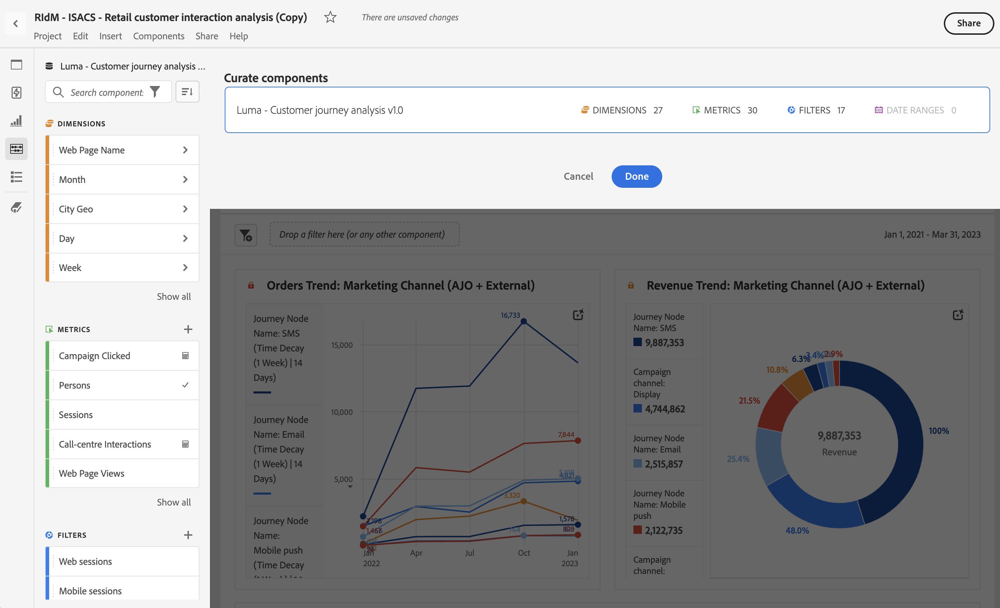

# 策划项目

策划功能可让您在共享项目之前，限制可用的组件（维度、量度、区段和日期范围）。 当接收者打开项目时，他们将仅看到您为其策划的限定组件集。 策划虽然是一个可选步骤，但建议在共享项目前执行此步骤。

>[!NOTE]
> 产品轮廓是控制用户可以查看哪些组件的主要机制。 此类轮廓通过 [Adobe Experience Cloud Admin Console](https://experienceleague.adobe.com/zh-hans/docs/core-services/interface/administration/admin-tool-experience-cloud) 进行管理。 “策划”是一个辅助区段。

## 应用项目策划

1. 选择&#x200B;**[!UICONTROL 共享]** > **[!UICONTROL 策划项目数据]**。
项目中使用的组件将会自动添加。
如果一个项目包含多个数据视图，您将在项目中看到每个数据视图对应的策划投放区域。
1. （可选）如需添加更多组件，请将您希望共享的组件从左侧面板拖动至该数据视图的&#x200B;**[!UICONTROL 策划组件]**&#x200B;投放区域。
1. 选择&#x200B;**[!UICONTROL 完成]**。

<!--
Curation can also be applied from the [!UICONTROL Share] menu by selecting **[!UICONTROL Curate and Share]**. This option automatically curates the project to the components in use in the project. You can add additional components following the steps above.
-->

当收件人打开经过策划的项目时，他们将只看到您在策划时定义的组件集：

## 删除项目策划

要删除项目策划并恢复左边面板中的完整组件集，请执行以下操作：

1. 选择&#x200B;**[!UICONTROL 共享]** > **[!UICONTROL 策划项目数据]**。
1. 选择&#x200B;**[!UICONTROL 移除策划]**。
1. 选择&#x200B;**[!UICONTROL 完成]**。

## 组件策划选项

在经过策划的项目中，接收者可以选择在左侧面板中&#x200B;**[!UICONTROL 显示全部]**&#x200B;组件。 [!UICONTROL 显示所有组件]根据以下各项显示不同的组件集：

* 用户的权限级别（管理员或非管理员）
* 项目角色（所有者/编辑者或非所有者/编辑者）
* 应用的策划类型（在项目级别）

| 策划类型 | 管理员可以看到 | 非管理员项目所有者（或编辑角色）可以看到 | 非管理员重复角色可以看到 |
| --- | --- | --- | --- |
| **从数据视图中&#x200B;*隐藏的*组件** | 所有数据视图组件均可用于报表分析（如需查看隐藏组件，请选择&#x200B;**[!UICONTROL 显示全部]**）。 | 不可用于报告 | 不可用于报告 |
| **从数据视图添加或删除的组件** | 仅限添加到数据视图的组件（隐藏或不隐藏）。 管理员无法对数据视图中未定义的字段或组件进行报表分析。 | 仅限添加至数据视图的组件，或由用户拥有或共享给用户的组件。 隐藏组件不可用（例如虚拟报告包策划）。 | 仅添加到数据视图中的组件不会被隐藏，并会包含在项目内容策划中。 |
| **项目中策划的组件** | 所有可用于报表分析的数据视图组件（如需查看隐藏组件，请选择&#x200B;**[!UICONTROL 显示全部]**）。 | 所有非隐藏数据视图组件（需要单击“全部显示”） | 仅限策划的组件，以及由用户拥有或与用户共享的任何组件 |
| **使用包含隐藏组件的数据视图的策划项目** | 所有可用于报表分析的数据组件（如需查看隐藏和未经过策划的组件，请选择&#x200B;**[!UICONTROL 显示全部]**）。 | 所有非经过策划的项目组件、所有非隐藏的数据视图组件，以及由用户拥有或与用户共享的任何组件 | 仅限策划的组件，以及由用户拥有或与用户共享的任何组件 |
