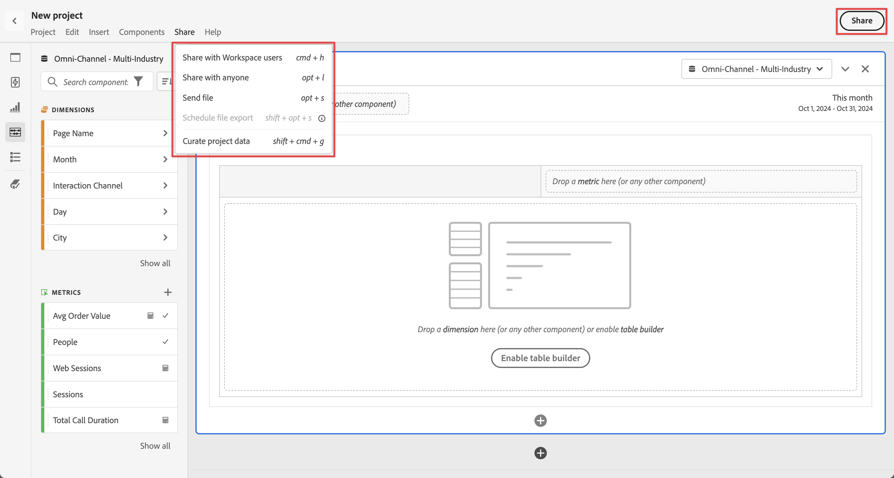

# 简化和共享项目概述

您可以使用Analysis Workspace中的&#x200B;**[!UICONTROL 共享]**&#x200B;菜单中的选项或者选择界面右上角的&#x200B;**[!UICONTROL 共享]**&#x200B;中的选项，来组织和共享项目，或者将项目作为PDF或CSV文件发送给组织中的收件人或与任何其他人。

| 选项 | 描述 |
|---|---|
| **[!UICONTROL 策划项目数据]** | 限制项目中可用的组件（维度、量度、区段、日期范围）。[了解详情](/help/analysis-workspace/curate-share/curate.md) |
| **[!UICONTROL 与 Workspace 用户共享]** | 使某个项目可供贵组织中的其他 Analysis Workspace 用户使用。与特定用户共享或创建可共享的链接以快速访问某个项目。要求用户登录。[了解详情](/help/analysis-workspace/curate-share/share-projects.md) |
| **[!UICONTROL 与任何人共享]** | 向无权访问Analysis Workspace的用户授予对Customer Journey Analytics项目的只读访问权限。 [了解详情](/help/analysis-workspace/curate-share/share-projects.md) |
| **[!UICONTROL 发送文件]** | 将项目以 CSV 或 PDF 格式立即发送给指定收件人。[了解详情](/help/analysis-workspace/export/t-schedule-report.md) |
| **[!UICONTROL 安排文件导出]** | 将项目以 CSV 或 PDF 格式按计划发送给指定收件人。[了解详情](/help/analysis-workspace/export/t-schedule-report.md) |

