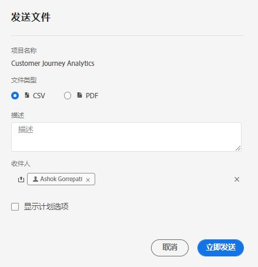
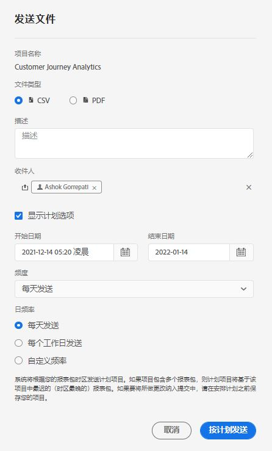

# 计划项目

从工作区的&#x200B;**“共享”菜单**&#x200B;中，您可以通过电子邮件将 Analysis Workspace 项目发送给选定的收件人。可以采用 CSV 或 PDF 格式发送文件。

## 立即发送文件 {#now}

要通过电子邮件立即将文件发送给收件人，请执行以下步骤：

1. 单击&#x200B;**共享 > 立即发送文件**。
1. 指定文件类型（CSV 或 PDF）。
1. （可选）添加要包含在电子邮件中的说明，以阐述所发送的文件。
1. 添加收件人或组。也可以输入电子邮件地址。
1. （仅适用于Healthcare Shield客户）提供密码。 请参阅密码保护计划报表一节。
1. 单击&#x200B;**立即发送**。
1. （可选）单击&#x200B;**显示计划选项**&#x200B;以指定发送计划。

## 按计划发送文件 {#schedule}

要通过电子邮件按重复计划将文件发送给收件人，请执行以下操作：

1. 单击&#x200B;**共享 > 按计划发送文件**。
1. 指定文件类型（CSV 或 PDF）。
1. （可选）添加要包含在电子邮件中的说明，以阐述所发送的文件。
1. 添加收件人或组。也可以输入电子邮件地址。
1. （仅适用于Healthcare Shield客户）提供密码。 请参阅密码保护计划报表一节。
1. 通过修改开始日期和结束日期输入值来指定计划发送文件的日期范围。结束日期必须在自创建或修改计划之日起的一年内。
1. 指定发送频率。每种频率均允许进行不同的自定义。
1. 单击&#x200B;**按计划发送**。

## 计划项目管理器 {#manager}

可以在 **Analytics > 组件 > 计划项目**&#x200B;下管理计划的 Analysis Workspace 项目。

在计划项目管理器中，您可以编辑和删除重复的项目计划。在搜索栏中搜索计划，或者使用左边栏中的过滤器选项搜索计划。您可以按标记、批准的计划、所有者等进行过滤。

以下是计划项目管理器中的常见操作：

| 操作 | 描述 |
|---|---|
| **编辑计划** | 单击计划的标题以更新其发送设置。 |
| **删除计划** | 在列表中选择计划项目，然后从菜单中选择“删除”。这将删除项目的选定计划；但不会删除项目本身。 |
| **添加标记** | 在列表中选择计划项目，然后选择“标记”或“批准”以整理计划并使这些计划更易于搜索。 |
| **查看失败的计划** | 导航到左边栏中的“其他过滤器”>“失败”以查看已失败的计划。 |
| **查看过期的计划** | 导航到左边栏中的“其他过滤器”>“过期”以查看已过期的计划。单击计划的标题以设置新的发送计划。 |
| **查看计划 ID** | 导航到右上方的列选项，并将“计划 ID”列添加到表中。计划 ID 通常对调试有用。 |

计划项目管理器可显示特定用户已创建的项目。若应用程序中禁用此用户帐户，则会停止所有计划的提交。

## 密码保护计划项目 {#password}

>[!NOTE]
>
>对计划项目进行密码保护的选项仅对购买了 [医疗盾](https://experienceleague.adobe.com/docs/blueprints-learn/architecture/vertical-blueprints/healthcare-vertical.html%3Flang%3Den) 附加产品。

Adobe使用密码加密计划项目，无论这些项目是以.pdf格式还是.csv格式发送。

在您的公司购买了Healthcare Shield SKU并为其启用后，在两种情况下会弹出为计划项目创建密码的提示：

* 当某人创建新的计划项目时。

* 将要发送现有计划项目时。 在密码保护到位之前，将禁用当前计划的项目。 计划项目的所有者将收到一封针对此效果的电子邮件。

### 密码要求

密码要求符合Adobe标准，要求至少8个字符，其中至少1个数字和1个特殊字符。

### 新建计划项目

1. 保存项目后，转到共享>立即发送文件，或按计划共享>发送文件。
1. 按照上面“立即共享文件”或“按计划共享文件”下的说明操作。

### 现有计划项目

在计划项目的时间之前，项目的所有者将收到类似于以下内容的电子邮件：

1. 单击 **[!UICONTROL 查看计划项目]**.
1. 在 **[!UICONTROL 编辑计划项目]** 对话框，输入并重新输入密码。
1. （仅）计划项目的收件人知晓此密码。

