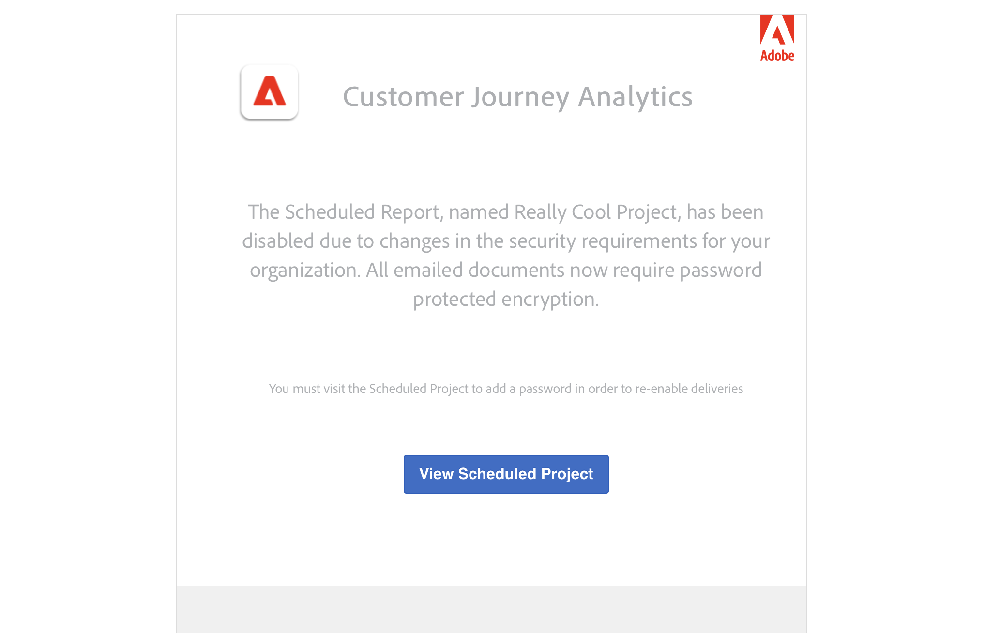

# 发送和计划

您可以通过电子邮件将Customer Journey Analytics项目作为文件发送给选定的用户。 您可以临时发送文件，也可以配置项目以按计划发送。 项目可以采用CSV或PDF格式发送。

任何应用于项目的标记都会自动应用于导出文件。

如[导出概述](/help/analysis-workspace/export/export-project-overview.md)中所述，还有其他导出 Customer Journey Analytics 数据的方法。

## 发送文件

通过电子邮件将文件发送给收件人：

1. 选择&#x200B;**[!UICONTROL 共享] > [!UICONTROL 发送文件]**。
1. 指定文件类型：
   * [!UICONTROL **CSV**]：如果您需要纯文本数据，请选择此选项。
   * [!UICONTROL **PDF**]：如果您希望下载的文件包含项目中所有显示（可见）的表和可视化，请选择此选项。
1. （可选）使用&#x200B;**[!UICONTROL Description]**&#x200B;添加要包含在电子邮件中的描述。
1. 添加收件人或组。您还可以输入电子邮件地址。
1. （仅适用于Healthcare Shield客户）提供[密码保护计划报告](#password-protect-a-new-scheduled-project)的密码。
1. （可选）选择&#x200B;**[!UICONTROL 显示计划选项]**&#x200B;到[计划文件导出](#schedule-file-export)。
1. 单击&#x200B;**[!UICONTROL 立即发送]**。 选择&#x200B;**[!UICONTROL 取消]**&#x200B;即可取消。

## 安排文件导出 {#schedule}

通过电子邮件按计划将文件发送给收件人

1. 选择&#x200B;**[!UICONTROL 共享] > [!UICONTROL 计划文件导出]**。
1. 指定文件类型：
   * [!UICONTROL **CSV**]：如果您需要纯文本数据，请选择此选项。
   * [!UICONTROL **PDF**]：如果您希望下载的文件包含项目中所有显示（可见）的表和可视化，请选择此选项。
1. （可选）使用&#x200B;**[!UICONTROL Description]**&#x200B;添加要包含在电子邮件中的描述。
1. 添加收件人或组。您还可以输入电子邮件地址。
1. （仅适用于Healthcare Shield客户）提供[密码保护计划报告](#password-protect-a-new-scheduled-project)的密码。
1. 确保已选择&#x200B;**[!UICONTROL 显示计划选项]**。
1. 选择&#x200B;**[!UICONTROL 频率]**。 您可以在以下各项之间进行选择：

   | 频率 | 选项 |
   |---|---|
   | **[!UICONTROL 每小时发送]** | 为&#x200B;**[!UICONTROL 发送间隔小时数]**&#x200B;输入一个值。 |
   | **[!UICONTROL 每日发送]** | 选择&#x200B;**[!UICONTROL 每日频率]**：**[!UICONTROL 每天发送]**、**[!UICONTROL 每个工作日发送]**&#x200B;或&#x200B;**[!UICONTROL 自定义频率]**。 如果您选择&#x200B;**[!UICONTROL 自定义频率]**，请为&#x200B;**[!UICONTROL 发送间隔天数]**&#x200B;输入一个值。 |
   | **[!UICONTROL 每周发送]** | 为&#x200B;**[!UICONTROL 发送间隔周数]**&#x200B;输入一个值。 并选择一周中的&#x200B;**[!UICONTROL 天]**。 |
   | **[!UICONTROL 按星期几发送月报表]** | 选择&#x200B;**[!UICONTROL 周中某天]**&#x200B;和&#x200B;**[!UICONTROL 月中某周]**。 |
   | **[!UICONTROL 每月按月发送]** | 从&#x200B;**[!UICONTROL 发送日期]**&#x200B;中选择一个值。 |
   | **[!UICONTROL 按月份中的日期每年发送]** | 选择&#x200B;**[!UICONTROL 周中日]**，选择&#x200B;**[!UICONTROL 月中周]**，然后选择&#x200B;**[!UICONTROL 月中月]**。 |
   | **[!UICONTROL 按特定日期每年发送]** | 选择&#x200B;**[!UICONTROL 月份]**&#x200B;并从&#x200B;**[!UICONTROL 发送日期]**&#x200B;中选择一个值。 |

1. 输入从&#x200B;**开始的**&#x200B;开始日期。 或者，选择以从日历中选择开始日期。

1. 在&#x200B;**[!UICONTROL 结束日期]**&#x200B;中输入结束日期。 或者，选择以从日历中选择结束日期。
1. 选择&#x200B;**[!UICONTROL 按计划]**&#x200B;发送。 选择&#x200B;**[!UICONTROL 取消]**&#x200B;即可取消。

## 密码保护计划项目 {#password}

<!-- markdownlint-disable MD034 -->

>[!CONTEXTUALHELP]
>id="workspace_sendfile_password"
>title="密码加密"
>abstract="所提供的密码将会用于对计划项目的文件进行加密。您组织的安全要求需要密码加密。"

<!-- markdownlint-enable MD034 -->

>[!NOTE]
>
>只有购买了 [Healthcare Shield](https://business.adobe.com/solutions/industries/healthcare.html) 附加产品的 Customer Journey Analytics 客户，才能使用密码保护计划项目的选项。

Adobe 使用密码来加密计划项目，无论它们是以 .pdf 还是 .csv 格式发送均是如此。

在您的公司购买并启用 Healthcare Shield SKU 后，在以下情况下，系统会提示为计划的项目创建密码：

* 当有人创建一个新的计划项目时。

* 即将发送现有的计划项目时。在设置好密码保护之前，当前计划的项目会被禁用。计划项目的所有者会收到一封电子邮件，通知他们这一要求。

### 密码要求

密码要求符合 Adobe 标准，要求至少 8 个字符，并且其中至少有一个数字和一个特殊字符。

### 密码保护新的计划项目

1. 保存项目后，转到&#x200B;**[!UICONTROL 分享]** > **[!UICONTROL 立即发送文件]**，或&#x200B;**[!UICONTROL 分享]** > **[!UICONTROL 按计划发送文件]**。
1. 在[立即发送文件](https://experienceleague.adobe.com/docs/analytics-platform/using/cja-workspace/curate-share/t-schedule-report.html?lang=zh-Hans#now)或[按计划发送文件](https://experienceleague.adobe.com/docs/analytics-platform/using/cja-workspace/curate-share/t-schedule-report.html?lang=zh-Hans#schedule)下面，按照上面的说明操作。

### 密码保护现有计划项目

使用密码保护现有计划项目时，项目所有者会收到类似于以下内容的电子邮件：

1. 登录 Customer Journey Analytics。
1. 选择&#x200B;**[!UICONTROL 查看计划项目]**。
1. 在&#x200B;**[!UICONTROL 编辑计划项目]**&#x200B;对话框中，输入密码，然后再输入一次。
1. 让计划项目的接收者知晓此密码。请不要将密码分发给不是计划项目接受者的人员。

## 计划项目管理器 {#manager}

使用&#x200B;**[!UICONTROL 组件]** > **[!UICONTROL 计划项目]**，可从主界面管理计划的Analysis Workspace项目。 有关更多信息，请参阅[计划项目](/help/components/scheduled-projects-manager.md)。
