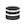

# 将Customer Journey Analytics报表导出到云端

您可以从Customer Journey Analytics中导出工作区完整表，并将导出发送到指定的云目标。

此外，还提供了导出Customer Journey Analytics报表的其他方法，如中所述 [导出概述](/help/analysis-workspace/export/export-project-overview.md).

## 了解完整的表导出

您可以将完整的表从Analysis Workspace导出到Google、Azure、Amazon和Adobe等云提供商。

[将全部表导出到云的优势](#advantages-of-exporting-to-the-cloud) 包括导出数百万行的功能，包括计算量度、将数据输出结构为串联值等。

导出完整表时，请考虑以下事项：

* 在导出到云之前，请确保您的表、环境和权限符合 [导出要求](#export-requirements).

* 部分 [功能](#unsupported-features) 和 [组件](#unsupported-components) 将完整的表导出到云时不支持。

将完整的表导出到云时，请使用以下流程：

1. [配置云帐户](/help/components/exports/cloud-export-accounts.md)

1. [在帐户上配置位置](/help/components/exports/cloud-export-locations.md)

1. [从工作区中导出完整表](#export-full-tables-from-analysis-workspace)

1. [在云中访问数据](#view-exported-data-and-manifest-file) 和 [在Adobe中管理导出](/help/components/exports/manage-exports.md)

## 从Analysis Workspace导出完整表

>[!NOTE]
>
>在按本节所述导出数据之前，请参阅以了解有关完整表导出的更多信息。 [了解完整的表导出](#understand-full-table-export) 部分。

要从Analysis Workspace导出完整表，请执行以下操作：

1. 如果尚未配置，请按照中的说明配置导出帐户和位置 [配置云导出帐户](/help/components/exports/cloud-export-accounts.md).

1. 在Analysis Workspace中，右键单击包含要导出数据的自由格式表。

1. 选择 [!UICONTROL **导出完整表**].

   

1. 在 [!UICONTROL **新的完整表导出**] 对话框，请指定以下信息：

   | 字段名称 | 功能 |
   |---------|----------|
   | 名称 | 指定导出的名称。 此名称将显示在导出列表中。 |
   | 标记 | 您可以将现有标记应用于导出，也可以创建新标记并应用它。 
要将现有标记应用于导出，请从下拉菜单中选择任意标记。 您公司中的任何标记均可供应用<!-- double-check this -->.
 
要创建新标记，请键入新标记的名称，然后按Enter。

将标记应用于导出时，请考虑以下事项： <ul><li>您可以在导出表中过滤或搜索您应用的标记。</li> <li>导出完整表格时，不会自动应用应用于项目的标记，如中的配置导出页面上的列中所述 [管理导出](/help/components/exports/manage-exports.md). (或者，当 [计划整个项目以供导出](/help/analysis-workspace/export/t-schedule-report.md)，则应用于项目的所有标记都会自动应用于导出。)  <!-- Right now we don't have a column for them on the exports table, so this isn't true. Jaden is adding the column. --></li></ul> |
   | 描述 | 为导出添加描述。 您可以选择在中以列的形式查看说明 [“导出”页面](/help/components/exports/manage-exports.md) 查看导出时。 |
   | 数据视图 | 选择包含要包含在导出中的组件的数据视图。 数据视图下拉菜单位于对话框的左上角，可通过数据视图图标进行标识.  
**注意：** 如果选择的数据视图缺少已包括在数据表中的组件，则系统会提示您清除数据表并使用选定数据视图中包含的组件重新创建数据表。 
 |
   | 回顾时间范围 | 选择要包含在每个导出文件中的报表时间范围。 选项包括 [!UICONTROL **今天**]， [!UICONTROL **昨天**]， [!UICONTROL **最近7天**]， [!UICONTROL **最近30天**]， [!UICONTROL **本周**]、和 [!UICONTROL **本月**]. 
在以下情况下，不会显示此选项： [!UICONTROL **导出频率**] 设置为 [!UICONTROL **立即发送（一次性）**]. |
   | 数据表 | 显示要导出的自由格式表。 您可以通过将组件从左边栏拖到表来修改数据表。 在将组件添加到画布时，表格会动态更新。  
应用于项目中整个表的任何区段都会显示在表中每个单独列的顶部。
 |
   | 清除 | 清除数据表的内容。 这样，您就可以直接在新增完整表格导出对话框中开始构建新表格。 |
   | 导出频率 | 设置导出的频率计划。 
您可以选择 [!UICONTROL **立即发送（一次性）**] 以仅发送一次导出。 选择此选项后，将立即启动导出。
或者，您可以选择按定义的计划发送导出。 按计划发送时，选项包括 [!UICONTROL **每日**]， [!UICONTROL **每周**]， [!UICONTROL **按工作日的月度**]， [!UICONTROL **按月份日期**]， [!UICONTROL **按月份日期，每年**]、和 [!UICONTROL **按特定日期按年**]. 

选择导出频率时，请考虑以下事项：
<ul><li>中的选项 [!UICONTROL **回看窗口期**] 字段根据您在此处选择的内容而更改。<!-- if they're doing Daily, then we might not let them look back to the last year... --></li><li>根据您选择的选项，还会显示其他配置字段。</li></ul> |
   | 开始日期 | 计划导出应开始的日期和时间。 
仅当选择计划的导出频率时，此选项才可用。
 |
   | 结束日期 | 计划导出过期的日期和时间。 计划导出在设置的日期和时间后不再运行。 
仅当选择计划的导出频率时，此选项才可用。
 |
   | 文件格式 | 选择导出的数据应采用.csv还是.json格式。 |
   | 帐户 | 选择要将数据发送到的云导出帐户。 
或者，如果您尚未配置要使用的云帐户，则可以配置新帐户：<ol><li>选择&#x200B;[!UICONTROL **添加帐户**]，然后指定以下信息：<ul><li>[!UICONTROL **位置帐户名称**]：指定位置帐户的名称。 创建位置时将显示此名称 </li><li>[!UICONTROL **位置帐户说明**]：提供帐户的简短描述，以帮助将其与同一帐户类型的其他帐户区分开来。</li><li>[!UICONTROL **帐户类型**]：选择您要导出到的云帐户类型。 可用的帐户类型包括Amazon S3 Role ARN、Google Cloud Platform、Azure SAS、Azure RBAC、Snowflake和AEP Data Landing Zone。</li></ul><li>要完成帐户配置，请继续使用以下与对应的链接 [!UICONTROL **帐户类型**] 您已选择：<ul><li>[AEP数据登陆区](/help/components/exports/cloud-export-accounts.md#aep-data-landing-zone)</li><li>[Amazon S3角色ARN](/help/components/exports/cloud-export-accounts.md#amazon-s3-role-arn)</li><li>[Google Cloud平台](/help/components/exports/cloud-export-accounts.md#google-cloud-platform)</li><li>[Azure SAS](/help/components/exports/cloud-export-accounts.md#azure-sas)</li><li>[Azure RBAC](/help/components/exports/cloud-export-accounts.md#azure-rbac)</li><li>[Snowflake](/help/components/exports/cloud-export-accounts.md#snowflake)</li></ul></ol> |
   | 位置名称 | 选择您希望发送导出数据的帐户位置。
或者，如果您尚未在选定的帐户上配置要使用的位置，则可以配置一个新位置：<ol><li>选择 [!UICONTROL **添加位置**]，然后指定以下信息： <ul><li>[!UICONTROL **名称**]：位置的名称。</li><li>[!UICONTROL **描述**]：提供位置的简短描述，以帮助将其与帐户上的其他位置区分开来。</li><li>[!UICONTROL **位置帐户**]：选择要创建位置的帐户。</li></ul><li>要完成位置配置，请继续下面的链接，该链接与您在 [!UICONTROL **位置帐户**] 字段：<ul><li>[AEP数据登陆区](/help/components/exports/cloud-export-locations.md#aep-data-landing-zone).</li><li>[Amazon S3角色ARN](/help/components/exports/cloud-export-locations.md#amazon-s3-role-arn)</li><li>[Google Cloud平台](/help/components/exports/cloud-export-locations.md#google-cloud-platform)</li><li>[Azure SAS](/help/components/exports/cloud-export-locations.md#azure-sas)</li><li>[Azure RBAC](/help/components/exports/cloud-export-locations.md#azure-rbac)</li><li>[Snowflake](/help/components/exports/cloud-export-locations.md#snowflake)</li></ul> |

   {style="table-layout:auto"}

1. 选择 [!UICONTROL **保存**] 以保存导出。

   数据会以您指定的频率发送到您指定的云帐户。

1. （可选）创建导出后，无论您选择立即发送还是按定义的计划发送，都可以在 [“导出”页面](/help/components/exports/manage-exports.md) 并在 [导出日志](/help/components/exports/manage-export-logs.md).

## 管理导出

从Analysis Workspace导出数据后，您可以编辑、重新导出、复制、标记或删除现有导出，如中所述 [管理导出](/help/components/exports/manage-exports.md).

## 查看导出的数据和清单文件

### 导出的数据

导出的数据可在您配置的云目标中作为压缩文件使用，如中所述 [配置云导出帐户](/help/components/exports/cloud-export-accounts.md) 和 [配置云导出位置](/help/components/exports/cloud-export-locations.md).

压缩文件的文件名如下所示，具体取决于您选择CSV还是JSON作为文件格式：

* `cja-export-{reportInstanceId}-{idx}.csv.gz`

* `cja-export-{reportInstanceId}-{idx}.json.gz`

>[!NOTE]
>
>选择文件格式 [!UICONTROL **文件格式**] 字段，如中所述 [从Analysis Workspace导出完整表](#export-full-tables-from-analysis-workspace).

### 清单文件

文件名为的清单文件 `cja-export-{reportInstanceId}-{idx}.json.gz` 包含在任何至少包含一个文件的成功导出投放中。 利用清单文件，可确认是否已成功提交所有文件。 它包括以下信息：

* 已传送的所有文件的列表

* 每个文件的MD5校验和

<!-- add in  what the file name, structure, and file format will be -->

## 导出到云的优势

将Customer Journey Analytics数据导出到云允许您：

* 导出到共享位置，如Adobe Experience Platform Data Landing Zone、Google Cloud Platform、Microsoft Azure、Amazon S3或Snowflake。

* 存储大量历史数据。

  此类数据可用于检测长期趋势，以获取业务情报，最终做出更好的业务决策。

* 导出包含数千行或数百万行的完整表（300万、3000万、1.5亿或3亿行，具体取决于许可证类型）。 其他导出方法最多允许50,000行。

* 在导出的Customer Journey Analytics数据中包含计算量度。

* 将数据输出构造为连接值。

* 导出一次或按计划。 (也适用于 [其他导出选项](/help/analysis-workspace/export/export-project-overview.md).)

* 以CSV或JSON格式导出文件。 (也适用于 [其他导出选项](/help/analysis-workspace/export/export-project-overview.md).)

* 导出包含多个维的表。

## 导出要求 {#export-requirements}

### 最低要求

确保您的表、环境和权限满足以下要求：

* **表：** 所有表必须在行中至少包含一个维度，并在每列中包含一个量度，才能支持完整表导出。

* **环境：** 确保 [IP地址](/help/technotes/ip-addresses.md) 和 [域](/help/technotes/domains.md) Customer Journey Analytics使用的防火墙允许。

* **权限：** 在Adobe Admin Console中，必须为用户分配一个产品配置文件，该配置文件具有 [!UICONTROL **完整表导出**] 为导出完整表而为其分配的权限。 有关在Admin Console中为产品配置文件分配权限的信息，请参阅 [Admin Console中的Customer Journey Analytics权限](/help/technotes/access-control.md).

  >[!NOTE]
  >
  >  分配了以下内容的用户： [产品管理员角色](/help/technotes/access-control.md#product-admin-role) 始终具有导出完整表的权限；无需为这些用户分配 [!UICONTROL **完整表导出**] 许可。

### 不支持的功能

以下功能不受支持，并且会自动从完整表导出中删除：

* 百分比
* 总计
* 搜索筛选
* 静态行
* 日期调整
* 动态维度

  有关更多信息，请参阅 [自由格式表中的动态维度项与静态维度项](/help/analysis-workspace/visualizations/freeform-table/column-row-settings/manual-vs-dynamic-rows.md).
* 第一个划分中的Dimension经过转换，作为辅助维度添加到导出表的行中；任何其他划分都不会包含在该表中
* 大多数数据集不支持排序；对于小型数据集，可能会对数据排序

### 不支持的组件

以下组件不受支持，Analysis Workspace在执行完整表导出时会提示您从表中删除它们：

* 在量度定义中使用基本或高级函数的计算量度(请参阅 [基本功能](/help/components/calc-metrics/cm-functions.md) 和 [高级功能](/help/components/calc-metrics/cm-adv-functions.md) 了解更多信息)
* 管理员限制无法导出的组件(请参阅 *筛选数据视图中的数据治理策略* 中的部分 [标签和策略](/help/data-views/data-governance.md) 了解更多信息)
* 满足以下所有条件的任何维度：
   * 是从属于的字段创建的 [对象数组](/help/use-cases/object-arrays.md) (与Adobe Analytics中的多值变量类似)
   * 具有 [已启用持久性](/help/data-views/component-settings/persistence.md)
   * 未使用 [绑定维度](/help/use-cases/data-views/binding-dimensions-metrics.md)
* 每个报表有超过5个维度和5个量度（最多支持5个维度和5个量度）
* 在表列中：
   * 日期范围
   * 维度
* 在表行中：
   * 计算量度
   * 量度
   * 日期范围
   * 过滤器

### 归因行为

完全表导出支持使用非默认归因模型的计算量度(如 *使用非默认归因模型* 中的部分 [列设置](/help/analysis-workspace/visualizations/freeform-table/column-row-settings/column-settings.md))。

如果在报表中使用非默认归因模型，则忽略或保留报表中使用的分配模型，具体取决于报表是具有一个维度还是多个维度：

* **对于在单个维度中包含量度归因的报表：** [量度归因](/help/data-views/component-settings/attribution.md) 覆盖 [分配模型](/help/data-views/component-settings/persistence.md) 与通常使用量度归因时一样。

  例如，“首次接触”量度归因会覆盖“最近”维度分配。

* **对于同时包含多个维度的量度归因的报表：** [量度归因](/help/data-views/component-settings/attribution.md) 在维之外应用 [分配模型](/help/data-views/component-settings/persistence.md).

  例如，除了“最近”维度分配之外，还应用了“首次联系”量度归因。 此外，量度归因将应用于后分配的维度项目对，就像它们是单个维度项目一样，而不是像通常在自由格式表中那样单独应用于每个维度项目。

  >[!NOTE]
  >
  >仅当将数据导出到云中时，才支持多维报表，如本文所述。

## 完整表格导出(在Customer Journey Analytics中)与Data Warehouse(在Adobe Analytics中)的比较

如果您之前使用Data Warehouse导出Adobe Analytics数据，则下表可以帮助您了解在Customer Journey Analytics中导出完整表与在Adobe Analytics中导出带有Data Warehouse的数据之间的区别。

| 功能 | Customer Journey Analytics中的完整表导出 | Adobe Analytics中的Data Warehouse |
|---------|----------|---------|
| 构建自定义报表 | 是 | 是 |
| 计算量度 | 是 | 否 |
| 区段 | 是 | 有限制 |
| 维度 | 限制为5 | 无限制 |
| 量度 | 限制为5 | 无限制 |
| 报告行 | 限制为300万、3000万、1.5亿或3亿，具体取决于层级 | 无限制 |
| 报告数量 | 无限制 | 无限制 |
| 临时（一次性）投放 | 是 | 是 |
| 计划定期投放 | 是 | 是 |
| 电子邮件投放 | 否 | 是 |
| FTP/SFTP | 否 | 旧版支持 |
| Azure | 是 | 是 |
| Amazon S3 | 是 | 是 |
| Google Cloud Platform | 是 | 是 |
| Snowflake | 是 | 否 |
| 投放频率 | 每日 | 每小时 |
