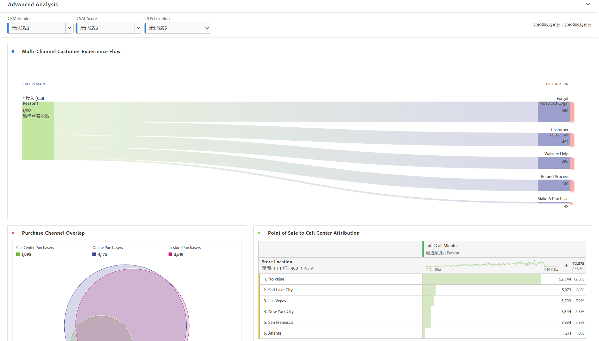
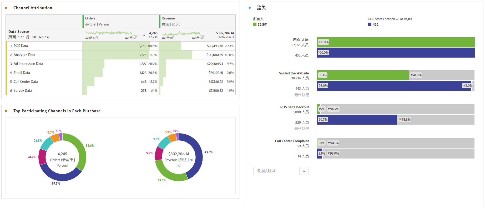

# 执行高级分析

高级分析利用[流量](/help/analysis-workspace/visualizations/c-flow/flow.md)图、[Attribution IQ](/help/analysis-workspace/attribution/overview.md)、[流失](/help/analysis-workspace/visualizations/fallout/fallout-flow.md)图和[维度细分](/help/components/dimensions/t-breakdown-fa.md)等功能。

