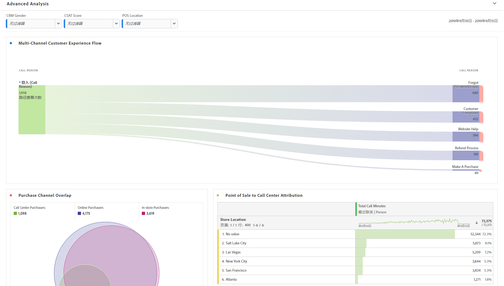
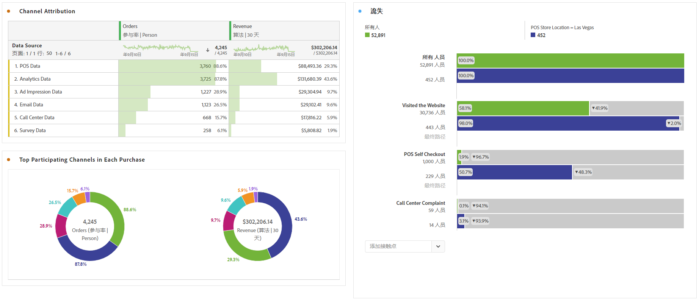

# 执行高级分析

在开始构建高级分析报告和可视化内容之前（如下所述），请确保您了解[基本分析](/help/analysis-workspace/perform-basic-analysis.md)。

高级分析利用[流量](/help/analysis-workspace/visualizations/c-flow/flow.md)图、[归因](/help/analysis-workspace/c-panels/attribution.md)、[流失](/help/analysis-workspace/visualizations/fallout/fallout-flow.md)图和[维度细分](/help/components/dimensions/t-breakdown-fa.md)等功能。

