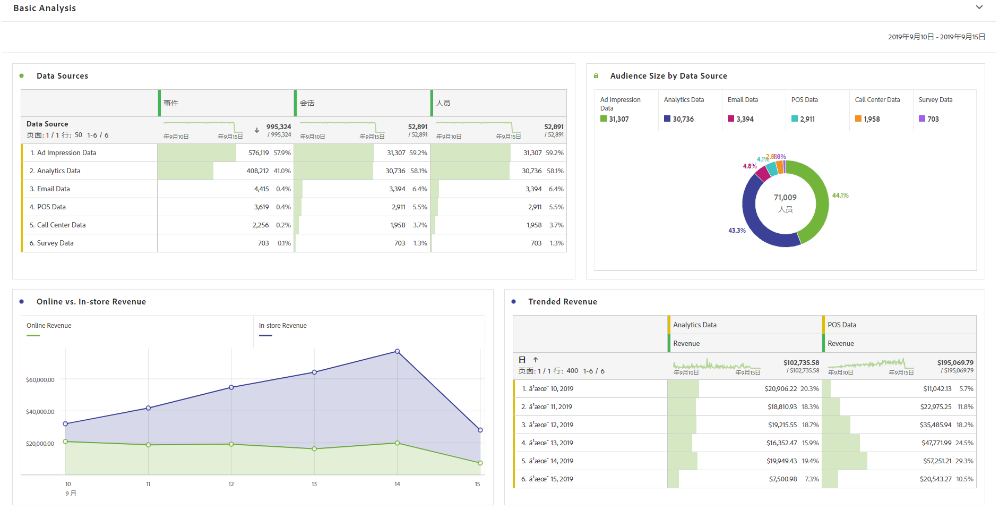
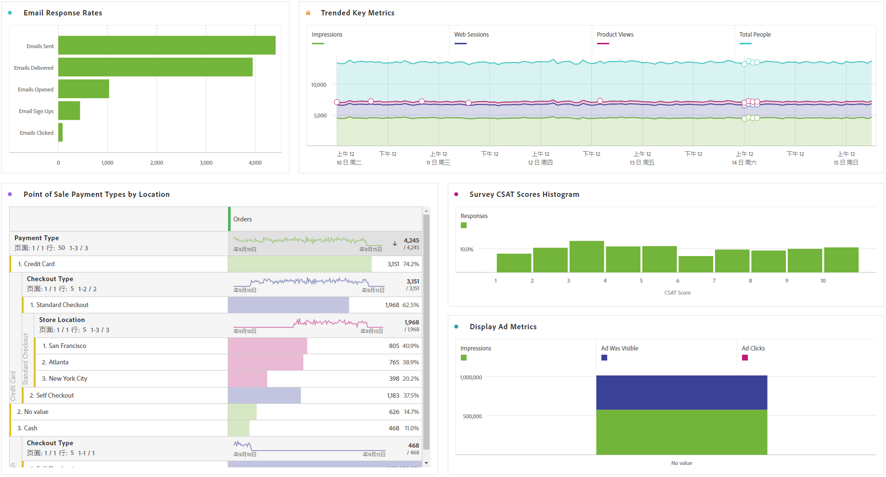

# 执行基本分析

>[!NOTE]
>
>您正在查看Customer Journey Analytics中的Analysis Workspace文档。 其功能集与传统Adobe [Analytics的Analysis Workspace略有不同](https://docs.adobe.com/content/help/zh-Hans/analytics/analyze/analysis-workspace/home.html)。 [了解更多...](/help/getting-started/cja-aa.md)

创建连接和数据视图后，利用 Analysis Workspace 的强大功能和灵活性分析导入的数据。您可以随意尝试和拖动维度和量度，更改维度和量度归因设置、友好名称、时区、会话设置等。

以下是工作区中基础的可视化图表示例。例如，您可以：

* 创建排名报表，其中数据源显示排名最靠前的事件、会话和人员。

* 创建在线商店收入与实体店收入的趋势报表，比较两个数据源随时间推移发生的变化。

* 按数据源描述受众大小，如广告印象数据、AdobeAnalytics数据、电子邮件数据、POS数据、呼叫中心数据和调查数据。

