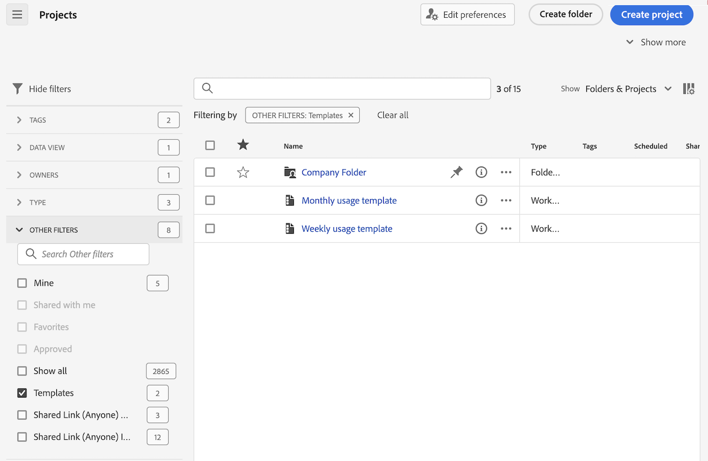
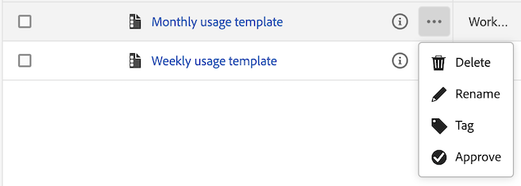

# 创建和管理模板

管理员可以创建并保存模板，供登录公司的其他人使用。

登录公司中的人员可以按照[使用模板](/help/analysis-workspace/templates/use-templates.md)中所述使用这些公司模板。

## 创建模板 {#create-templates}

<!-- markdownlint-disable MD034 -->

>[!CONTEXTUALHELP]
>id="use-case-ajo-template"
>title="在Journey Optimizer中使用模板"
>abstract="在Journey Optimizer中使用此模板时，无论在Customer Journey Analytics中使用此模板选择了什么数据视图，都将使用Adobe Journey Optimizer中设置为默认数据视图的数据视图。"

<!-- markdownlint-enable MD034 -->

要创建可供您登录公司中的人员使用的新模板：

1. 在 Analysis Workspace 中，按照所需状态生成项目。

1. 选择&#x200B;[!UICONTROL **项目**] > **[!UICONTROL 另存为模板……]**。

   

1. 在[!UICONTROL 另存为模板]对话框中指定以下信息：

   | 字段 | 描述 |
   |---------|----------|
   | **[!UICONTROL 名称]** | 为模板提供一个描述性名称。 |
   | **[!UICONTROL 描述]** | 为模板提供简短描述，说明其预期用途。 |
   | **[!UICONTROL 为什么使用此模板]** | 提供简短的说明，告知组织中的人员如何使用该模板。此说明显示在模板的预览页面上。 |
   | **[!UICONTROL 渠道]** | 选择适用于此模板的任何适用渠道。您可以选择多个渠道：**[!UICONTROL 网页]**、**[!UICONTROL 移动设备]**、**[!UICONTROL 跨渠道]**、**[!UICONTROL 呼叫中心]**&#x200B;和&#x200B;**[!UICONTROL 店内]**。
您选择的选项决定了显示模板的位置，以及哪些区段适用于从“组织模板”页访问模板的用户。
 |
   | **[!UICONTROL 用例]** | 选择适用于此模板的任何用例。您可以选择多个用例：**[!UICONTROL 参与度]**、**[!UICONTROL 转化]**、**[!UICONTROL 受众]**、**[!UICONTROL 客户获取]**&#x200B;和 **[!UICONTROL Journey Optimizer]**。 
您的选择决定了模板在“组织模板”页面上的位置。用户可以导航到模板，也可以按用例过滤列表。 

**注意：**&#x200B;当您选择&#x200B;**[!UICONTROL Journey Optimizer]**&#x200B;选项时，该模板可在Adobe Journey Optimizer中使用。 在 Journey Optimizer 中，**[!UICONTROL 报告]**&#x200B;页面有一个下拉菜单，以便用户选择该模板或者默认模板。有关详细信息，请参阅 Journey Optimizer 文档中的[开始体验更新后的报告体验](https://experienceleague.adobe.com/zh-hans/docs/journey-optimizer/using/reporting/channel-report/report-gs-cja)。

选择Journey Optimizer选项时，请考虑以下事项：
<ul><li>仅当您在Customer Journey Analytics中使用的数据视图中存在Journey Optimizer数据时，此选项才可用。</li><li>在Journey Optimizer中使用此模板时，无论在Customer Journey Analytics中使用此模板选择了什么数据视图，都将使用Adobe Journey Optimizer中设置为默认数据视图的数据视图。  有关将数据视图设置为Journey Optimizer中的默认数据视图的详细信息，请参阅[创建或编辑数据视图](/help/data-views/create-dataview.md)中的[兼容性](/help/data-views/create-dataview.md#compatibility)。</li></ul> |
   | **[!UICONTROL Journey Optimizer 活动类型]** | 选择要与此模板关联的 Journey Optimizer 活动类型：**[!UICONTROL 营销活动]**、**[!UICONTROL 历程]**、**[!UICONTROL 登陆页面]**、**[!UICONTROL 报告]**，或者&#x200B;**[!UICONTROL 订阅]**。 
如果您希望将此模板与所有活动类型关联，请将此字段留空。

仅当在&#x200B;**[!UICONTROL 用例]**&#x200B;字段中选择 **[!UICONTROL Journey Optimizer]** 时，该字段才会显示。
 |
   | **[!UICONTROL Journey Optimizer 活动]** | 选择要与此模板关联的 Journey Optimizer 活动。 
如果希望将此模板与所选活动类型的所有活动相关联，请将此字段留空。

仅当在&#x200B;**[!UICONTROL 用例]**&#x200B;字段中选择 **[!UICONTROL Journey Optimizer]** 时，该字段才会显示。
 |
   | **[!UICONTROL 标记]** | 指定您想要应用于模板的任何标记。人们可以根据您添加的标记来过滤模板列表。 |

1. 选择&#x200B;[!UICONTROL **另存为模板**]。

有关用户如何基于模板创建项目的信息，请参阅[使用模板](/help/analysis-workspace/templates/use-templates.md)中的[基于模板创建项目](/help/analysis-workspace/templates/use-templates.md#create-a-project-based-on-a-template)。

## 编辑或删除模板

管理员可以编辑或删除公司模板。

1. 在 Analysis Workspace 中，选择&#x200B;[!UICONTROL **工作区**]&#x200B;选项卡，然后在位于左侧边栏中的&#x200B;**[!UICONTROL 模板]**&#x200B;下，选择 **[!UICONTROL _login_company_name _模板]**。

1. 如果您正在列视图中查看模板：

   1. 转到要编辑或删除的模板，选择模板名称旁边的信息图标。

      

   1. 选择&#x200B;**[!UICONTROL 预览]**。

   1. 选择更多图标，然后选择&#x200B;**[!UICONTROL 编辑]**&#x200B;或&#x200B;**[!UICONTROL 删除]**。

      

1. 如果您正在卡片视图中查看模板：

   1. 找到您要编辑或删除模板的位置。

      

   1. 将鼠标悬停在该模板上，然后选择&#x200B;**[!UICONTROL 预览]**。

   1. 选择更多图标，然后选择&#x200B;**[!UICONTROL 编辑]**&#x200B;或&#x200B;**[!UICONTROL 删除]**。

      

1. 如果您正在编辑模板，请进行所需的编辑，然后选择&#x200B;[!UICONTROL **项目**] > **[!UICONTROL 另存为模板……]**。

   

1. 在[!UICONTROL 另存为模板]对话框中指定以下信息：

   | 字段 | 描述 |
   |---------|----------|
   | **[!UICONTROL 名称]** | 为模板提供一个描述性名称。 |
   | **[!UICONTROL 描述]** | 为模板提供简短描述，说明其预期用途。 |
   | **[!UICONTROL 为什么使用此模板]** | 提供简短的说明，告知组织中的人员如何使用该模板。此说明显示在模板的预览页面上。 |
   | **[!UICONTROL 渠道]** | 选择适用于此模板的任何适用渠道。您可以选择多个渠道：**[!UICONTROL 网页]**、**[!UICONTROL 移动设备]**、**[!UICONTROL 跨渠道]**、**[!UICONTROL 呼叫中心]**&#x200B;和&#x200B;**[!UICONTROL 店内]**。如果未选择任何渠道，则所有渠道内都会包含该模板。
您选择的选项将决定模板的显示位置，以及用户从组织模板页面访问模板时适用的过滤器。
 |
   | **[!UICONTROL 用例]** | 选择适用于此模板的任何用例。您可以选择多个用例：**[!UICONTROL 参与度]**、**[!UICONTROL 转化]**、**[!UICONTROL 受众]**、**[!UICONTROL 客户获取]**&#x200B;和 **[!UICONTROL Journey Optimizer]**。 
您的选择决定了模板在“组织模板”页面上的位置。用户可以导航到模板，也可以按用例过滤列表。 

**注意：**&#x200B;当您选择&#x200B;**[!UICONTROL Journey Optimizer]**&#x200B;选项时，该模板可在Adobe Journey Optimizer中使用。 在 Journey Optimizer 中，**[!UICONTROL 报告]**&#x200B;页面有一个下拉菜单，以便用户选择该模板或者默认模板。有关详细信息，请参阅 Journey Optimizer 文档中的[开始体验更新后的报告体验](https://experienceleague.adobe.com/zh-hans/docs/journey-optimizer/using/reporting/channel-report/report-gs-cja)。

选择Journey Optimizer选项时，请考虑以下事项：
<ul><li>仅当您在Customer Journey Analytics中使用的数据视图中存在Journey Optimizer数据时，此选项才可用。</li><li>在Journey Optimizer中使用此模板时，无论在Customer Journey Analytics中使用此模板选择了什么数据视图，都将使用Adobe Journey Optimizer中设置为默认数据视图的数据视图。  有关将数据视图设置为Journey Optimizer中的默认数据视图的详细信息，请参阅[创建或编辑数据视图](/help/data-views/create-dataview.md)中的[兼容性](/help/data-views/create-dataview.md#compatibility)。</li></ul> |
   | **[!UICONTROL Journey Optimizer 活动类型]** | 选择要与此模板关联的 Journey Optimizer 活动类型：**[!UICONTROL 营销活动]**、**[!UICONTROL 历程]**、**[!UICONTROL 登陆页面]**、**[!UICONTROL 报告]**，或者&#x200B;**[!UICONTROL 订阅]**。 
如果您希望将此模板与所有活动类型关联，请将此字段留空。

仅当在&#x200B;**[!UICONTROL 用例]**&#x200B;字段中选择 **[!UICONTROL Journey Optimizer]** 时，该字段才会显示。
 |
   | **[!UICONTROL Journey Optimizer 活动]** | 选择要与此模板关联的 Journey Optimizer 活动。 
如果希望将此模板与所选活动类型的所有活动相关联，请将此字段留空。

仅当在&#x200B;**[!UICONTROL 用例]**&#x200B;字段中选择 **[!UICONTROL Journey Optimizer]** 时，该字段才会显示。
 |
   | **[!UICONTROL 标记]** | 指定您想要应用于模板的任何标记。人们可以根据您添加的标记来过滤模板列表。 |

1. 选择&#x200B;[!UICONTROL **另存为模板**]。

## 重命名、标记或批准模板

管理员可以重命名、标记和批准公司模板。

1. 在 Analysis Workspace 中，选择&#x200B;[!UICONTROL **工作区**]&#x200B;选项卡，然后选择左边栏中的&#x200B;**[!UICONTROL 项目]**。

1. 选择过滤器图标来过滤项目列表。

1. 在筛选器边栏中，选择&#x200B;**[!UICONTROL 其他筛选器]**，然后选择&#x200B;**[!UICONTROL 公司模板]**。

   显示公司模板的列表。不会显示所有常规项目（除非已固定）。

   公司模板可通过模板名称前的识别。

   

1. 单击&#x200B;**...**&#x200B;模板旁边的省略号图标，查看可用选项。

   

1. 选择&#x200B;**[!UICONTROL 重命名]**、**[!UICONTROL 标记]**&#x200B;或&#x200B;**[!UICONTROL 批准]**。

   您还可以删除模板，或按[编辑或删除模板](#edit-or-delete-templates)中所述删除模板。

1. （可选）要返回常规视图，请在过滤器边栏中取消选择&#x200B;**[!UICONTROL 公司模板]**。

## 将缺失的组件添加到给定模板的数据视图中

默认情况下，Adobe 提供的一些模板无法使用，因为它们包含数据视图中没有的组件。

对于每个缺失的组件，数据视图中都会提供一个匹配的上下文标签。您需要将匹配的上下文标签添加到数据视图中已有的组件，或者向数据视图添加新组件并向其中添加上下文标签。

要将缺失的组件添加到模板：

1. 在 Analysis Workspace 中，选择&#x200B;[!UICONTROL **工作区**]&#x200B;选项卡，然后在位于左侧边栏的&#x200B;**[!UICONTROL 模板]**&#x200B;中选择 **[!UICONTROL Adobe 模板]**。

1. 选择过滤器图标来过滤模板列表。

1. 选择&#x200B;**[!UICONTROL 尚未准备好使用]**，以显示需要数据视图中没有的组件的模板。

   

1. 找到尚未准备好用于数据视图的模板。

1. 执行以下其中一项操作：

   * **如果您正在列视图**  中查看模板：

      1. 转到尚未准备好用于数据视图的模板，然后选择模板名称旁边的信息图标。

         

      1. 选择&#x200B;**[!UICONTROL 预览]**。

         

   * **如果您正在卡片视图**  中查看模板：

      1. 找到尚未准备好用于数据视图的模板。

         

      1. 将鼠标悬停在该模板上，然后选择&#x200B;**[!UICONTROL 预览]**。

         

1. 在&#x200B;**[!UICONTROL 缺失的组件]**&#x200B;部分，会显示数据视图中缺失的组件列表。选择&#x200B;**[!UICONTROL 将这些组件添加到您的数据视图]**。

   数据视图的配置页面会在新选项卡中显示。

1. 选择数据视图的&#x200B;**[!UICONTROL 组件]**&#x200B;选项卡。

   

1. 对于所列出的模板中缺失的每个组件，请在&#x200B;**[!UICONTROL 组件]**&#x200B;选项卡上执行以下操作之一：

   * 在&#x200B;**[!UICONTROL 包含的组件]**&#x200B;部分中，选择一个已经包含在数据视图中的组件，用于替代缺失的组件。

   * 在数据视图中添加一个新组件，用于替换缺失的组件，然后选择该组件。

     要向数据视图添加新组件，请搜索架构字段列表，然后将其拖到&#x200B;**[!UICONTROL 包含的组件]**&#x200B;部分。

1. 选择该组件后，找到右侧边栏中的&#x200B;**[!UICONTROL 上下文标签]**&#x200B;下拉菜单。

   

1. 在&#x200B;**[!UICONTROL 上下文标签]**&#x200B;下拉菜单中，选择与缺失组件同名的上下文标签。

1. 选择&#x200B;**[!UICONTROL 保存并继续]**。

1. 对于每个缺失的组件，重复在数据视图中为组件添加匹配的上下文标签的过程。

## 访问公司模板

与 Adobe 提供的模板一样，组织中的用户可以访问管理员创建的模板。

有关如何访问公司模板的信息，请参阅[使用模板](/help/analysis-workspace/templates/use-templates.md)中的[访问并运行模板](/help/analysis-workspace/templates/use-templates.md#access-and-run-a-template)。

## 隐藏模板选项卡

管理员可以为其组织内的所有用户隐藏模板选项卡。

1. 前往 **[!UICONTROL Customer Journey Analytics]** > **[!UICONTROL 组件]** > **[!UICONTROL 偏好设置]** > **[!UICONTROL 公司]**。
1. 选择&#x200B;**[!UICONTROL 隐藏模板选项卡]**&#x200B;选项。
