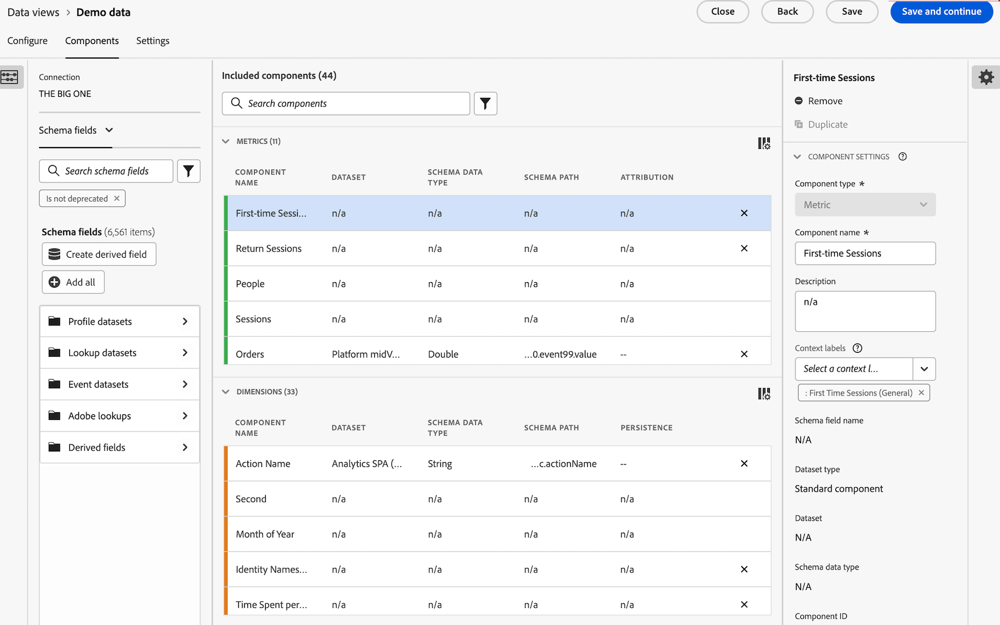

# 创建和管理模板

管理员可以创建模板并将其保存以供登录公司中的其他人使用。

登录公司中的人员可以使用[使用模板](/help/analysis-workspace/templates/use-templates.md)中所述的这些公司模板。

## 创建模板

要创建可供登录公司人员使用的新模板，请执行以下操作：

1. 在Analysis Workspace中，将项目构建到所需的状态。

1. 选择&#x200B;[!UICONTROL **项目**] > **[!UICONTROL 另存为模板……]**。

   

1. 在[!UICONTROL 另存为模板]对话框中指定以下信息：

   | 字段 | 描述 |
   |---------|----------|
   | **[!UICONTROL 名称]** | 为模板提供描述性名称。 |
   | **[!UICONTROL 描述]** | 提供模板的简短描述，描述其预期用途。 |
   | **[!UICONTROL 为何使用此模板]** | 提供简短说明，以告知组织中的人员如何使用此模板。 此说明将显示在模板的“预览”页面上。 |
   | **[!UICONTROL 渠道]** | 选择适用于此模板的任何适用渠道。 您可以选择多个渠道： **[!UICONTROL Web]**、**[!UICONTROL 移动设备]**、**[!UICONTROL 跨渠道]**、**[!UICONTROL 呼叫中心]**&#x200B;和&#x200B;**[!UICONTROL 店内]**。
您选择的选项决定了显示模板的位置，以及哪些过滤器适用于从“组织模板”页访问模板的用户。
 |
   | **[!UICONTROL 用例]** | 选择适用于此模板的任何用例。 您可以选择多个用例：**[!UICONTROL 参与]**、**[!UICONTROL 转化]**、**[!UICONTROL 受众]**、**[!UICONTROL 客户获取]**&#x200B;和&#x200B;**[!UICONTROL Journey Optimizer]**。 
您选择的选项决定了“组织模板”页面上的模板位置。 用户可以导航到模板，也可以按用例筛选列表。 

**注意：**&#x200B;选择&#x200B;**[!UICONTROL Journey Optimizer]**&#x200B;也会使模板在Adobe Journey Optimizer中可用。 在Journey Optimizer中，**[!UICONTROL 报表]**&#x200B;页面上有一个下拉菜单，允许用户选择此模板或默认模板。 有关详细信息，请参阅Journey Optimizer文档中的[开始使用更新的报表体验](https://experienceleague.adobe.com/zh-hans/docs/journey-optimizer/using/reporting/channel-report/report-gs-cja)。 |
   | **[!UICONTROL Journey Optimizer活动类型]** | 选择要与此模板关联的Journey Optimizer活动类型： **[!UICONTROL 营销活动]**、**[!UICONTROL 历程]**、**[!UICONTROL 登陆页面]**、**[!UICONTROL 报告]**&#x200B;或&#x200B;**[!UICONTROL 订阅]**。 
如果要将此模板与所有活动类型关联，请将此字段留空。

仅当在&#x200B;**[!UICONTROL 用例]**&#x200B;字段中选择&#x200B;**[!UICONTROL Journey Optimizer]**&#x200B;时，才会显示此字段。
 |
   | **[!UICONTROL Journey Optimizer活动]** | 选择要与此模板关联的Journey Optimizer活动。 
如果要将此模板与选定活动类型的所有活动相关联，请将此字段留空。

仅当在&#x200B;**[!UICONTROL 用例]**&#x200B;字段中选择&#x200B;**[!UICONTROL Journey Optimizer]**&#x200B;时，才会显示此字段。
 |
   | **[!UICONTROL 标记]** | 指定要应用于模板的任何标记。 用户可按您添加的标记筛选模板列表。 |

1. 选择&#x200B;[!UICONTROL **另存为模板**]。

有关用户如何基于模板创建项目的信息，请参阅[使用模板](/help/analysis-workspace/templates/use-templates.md)中的[基于模板创建项目](/help/analysis-workspace/templates/use-templates.md#create-a-project-based-on-a-template)。

## 编辑或删除模板

管理员可以编辑或删除公司模板。

1. 在Analysis Workspace中，选择&#x200B;[!UICONTROL **Workspace**]&#x200B;选项卡，然后在左边栏中的&#x200B;**[!UICONTROL 模板]**&#x200B;下选择&#x200B;**[!UICONTROL _login_company_name _模板]**。

1. 如果您在列视图中查看模板：

   1. 转到要编辑或删除的模板，选择模板名称旁边的信息图标。

      

   1. 选择&#x200B;**[!UICONTROL 预览]**。

   1. 选择更多图标，然后选择&#x200B;**[!UICONTROL 编辑]**&#x200B;或&#x200B;**[!UICONTROL 删除]**。

      

1. 如果您在卡片视图中查看模板：

   1. 找到要编辑或删除的模板。

      

   1. 将鼠标悬停在模板上，然后选择&#x200B;**[!UICONTROL 预览]**。

   1. 选择更多图标，然后选择&#x200B;**[!UICONTROL 编辑]**&#x200B;或&#x200B;**[!UICONTROL 删除]**。

      

1. 如果您正在编辑模板，请进行任何所需的编辑，然后选择&#x200B;[!UICONTROL **项目**] > **[!UICONTROL 另存为模板……]**。

   

1. 在[!UICONTROL 另存为模板]对话框中指定以下信息：

   | 字段 | 描述 |
   |---------|----------|
   | **[!UICONTROL 名称]** | 为模板提供描述性名称。 |
   | **[!UICONTROL 描述]** | 提供模板的简短描述，描述其预期用途。 |
   | **[!UICONTROL 为何使用此模板]** | 提供简短说明，以告知组织中的人员如何使用此模板。 此说明将显示在模板的“预览”页面上。 |
   | **[!UICONTROL 渠道]** | 选择适用于此模板的任何适用渠道。 您可以选择多个渠道： **[!UICONTROL Web]**、**[!UICONTROL 移动设备]**、**[!UICONTROL 跨渠道]**、**[!UICONTROL 呼叫中心]**&#x200B;和&#x200B;**[!UICONTROL 店内]**。 如果未选择任何渠道，则模板将包含在所有渠道中。
您选择的选项决定了显示模板的位置，以及哪些过滤器适用于从“组织模板”页访问模板的用户。
 |
   | **[!UICONTROL 用例]** | 选择适用于此模板的任何用例。 您可以选择多个用例：**[!UICONTROL 参与]**、**[!UICONTROL 转化]**、**[!UICONTROL 受众]**、**[!UICONTROL 客户获取]**&#x200B;和&#x200B;**[!UICONTROL Journey Optimizer]**。 
您选择的选项决定了“组织模板”页面上的模板位置。 用户可以导航到模板，也可以按用例筛选列表。 

**注意：**&#x200B;选择&#x200B;**[!UICONTROL Journey Optimizer]**&#x200B;也会使模板在Adobe Journey Optimizer中可用。 在Journey Optimizer中，**[!UICONTROL 报表]**&#x200B;页面上有一个下拉菜单，允许用户选择此模板或默认模板。 有关详细信息，请参阅Journey Optimizer文档中的[开始使用更新的报表体验](https://experienceleague.adobe.com/zh-hans/docs/journey-optimizer/using/reporting/channel-report/report-gs-cja)。 |
   | **[!UICONTROL Journey Optimizer活动类型]** | 选择要与此模板关联的Journey Optimizer活动类型： **[!UICONTROL 营销活动]**、**[!UICONTROL 历程]**、**[!UICONTROL 登陆页面]**、**[!UICONTROL 报告]**&#x200B;或&#x200B;**[!UICONTROL 订阅]**。 
如果要将此模板与所有活动类型关联，请将此字段留空。

仅当在&#x200B;**[!UICONTROL 用例]**&#x200B;字段中选择&#x200B;**[!UICONTROL Journey Optimizer]**&#x200B;时，才会显示此字段。
 |
   | **[!UICONTROL Journey Optimizer活动]** | 选择要与此模板关联的Journey Optimizer活动。 
如果要将此模板与选定活动类型的所有活动相关联，请将此字段留空。

仅当在&#x200B;**[!UICONTROL 用例]**&#x200B;字段中选择&#x200B;**[!UICONTROL Journey Optimizer]**&#x200B;时，才会显示此字段。
 |
   | **[!UICONTROL 标记]** | 指定要应用于模板的任何标记。 用户可按您添加的标记筛选模板列表。 |

1. 选择&#x200B;[!UICONTROL **另存为模板**]。

## 重命名、标记或批准模板

管理员可以重命名、标记和批准公司模板。

1. 在Analysis Workspace中，选择&#x200B;[!UICONTROL **Workspace**]&#x200B;选项卡，然后在左边栏中选择&#x200B;**[!UICONTROL 项目选项卡]**。

1. 选择过滤器图标以过滤项目列表。

1. 在筛选器边栏中，选择&#x200B;**其他筛选器**，然后选择&#x200B;**公司模板**。

   此时将显示公司模板的列表。 不会显示所有常规项目（除非已固定）。

   公司模板可由模板名称前面的来标识。

   

1. 单击模板旁边的&#x200B;**...**&#x200B;省略号图标以查看可用选项。

   

1. 选择&#x200B;**[!UICONTROL 重命名]**、**[!UICONTROL 标记]**&#x200B;或&#x200B;**[!UICONTROL 批准]**。

   您也可以删除模板，也可以按照[编辑或删除模板](#edit-or-delete-templates)中的说明删除模板。

1. （可选）要返回到常规视图，请在筛选器边栏中取消选择&#x200B;**[!UICONTROL 公司模板]**。

## 将缺少的组件添加到给定模板的数据视图

默认情况下，Adobe提供的某些模板将无法使用，因为它们包含的数据视图中没有的组件。

对于每个缺少的组件，您的数据视图中都提供了匹配的上下文标签。 您需要将匹配的上下文标签添加到数据视图中已存在的组件，或者您需要将新组件添加到数据视图并将上下文标签添加到其中。

要将缺少的组件添加到模板，请执行以下操作：

1. 在Analysis Workspace中，选择&#x200B;[!UICONTROL **Workspace**]&#x200B;选项卡，然后在左边栏中的&#x200B;**[!UICONTROL 模板]**&#x200B;下，选择&#x200B;**[!UICONTROL Adobe模板]**。

1. 选择过滤器图标以过滤模板列表。

1. 选择&#x200B;**[!UICONTROL 未准备就绪]**&#x200B;以显示需要不在数据视图中的组件的模板。

   

1. 找到尚未准备好用于数据视图的模板。

1. 执行以下任一操作：

   * **如果您在列视图中查看模板** ：

      1. 转到尚未准备好用于数据视图的模板，然后选择模板名称旁边的信息图标。

         

      1. 选择&#x200B;**[!UICONTROL 预览]**。

         

   * **如果您在卡片视图中查看模板** ：

      1. 找到尚未准备好用于数据视图的模板。

         

      1. 将鼠标悬停在模板上，然后选择&#x200B;**[!UICONTROL 预览]**。

         

1. 在&#x200B;**[!UICONTROL 缺少的组件]**&#x200B;部分中，将显示数据视图中缺少的组件列表。 选择&#x200B;**[!UICONTROL 将这些组件添加到您的数据视图]**。

   数据视图的配置页面将显示在新选项卡中。

1. 为数据视图选择&#x200B;**[!UICONTROL 组件]**&#x200B;选项卡。

   

1. 对于模板中列为缺失的每个组件，在&#x200B;**[!UICONTROL 组件]**&#x200B;选项卡上执行以下任一操作：

   * 在&#x200B;**[!UICONTROL 包含的组件]**&#x200B;部分中，选择要用于缺少的组件的数据视图中已包含的组件。

   * 将新组件添加到要用于缺失组件的数据视图，然后选择该组件。

     要向数据视图添加新组件，请搜索架构字段列表，然后将其拖到&#x200B;**[!UICONTROL 包含的组件]**&#x200B;部分。

1. 选择组件后，在右列找到&#x200B;**[!UICONTROL 上下文标签]**&#x200B;下拉菜单。

   

1. 在&#x200B;**[!UICONTROL 上下文标签]**&#x200B;下拉菜单中，选择与缺少的组件同名的上下文标签。

1. 选择&#x200B;**[!UICONTROL 保存并继续]**。

1. 对于每个缺少的组件，重复将匹配的上下文标签添加到数据视图中的组件的过程。

## 访问公司模板

与Adobe提供的模板一样，组织内的用户可以访问管理员创建的模板。

有关如何访问公司模板的信息，请参阅[使用模板](/help/analysis-workspace/templates/use-templates.md)中的[访问和运行模板](/help/analysis-workspace/templates/use-templates.md#access-and-run-a-template)。
