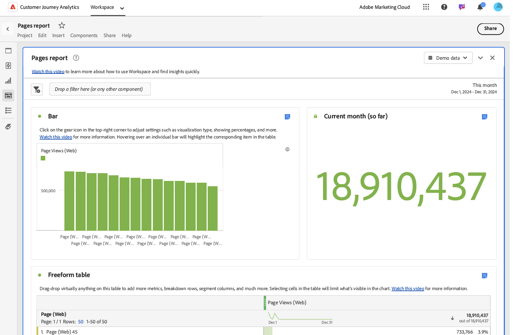

# 使用模板

Analysis Workspace中的模板（或公司模板）可快速分析最常见的报表方案。 以下是您可以使用模板回答的一些问题示例：

* 访问网站的人数
* 其中多少访客是独特访客（只算一次）
* 访问网站的途径（例如是通过链接访问还是直接访问）
* 访客搜索网站内容所使用的关键字
* 访客在特定页面或整个网站逗留的时间
* 访客单击了哪些链接，访客离开网站的时间
* 哪些营销渠道对产生收入或转化事件效果最好
* 他们观看视频花费多长时间
* 他们访问网站使用哪些浏览器和设备

以下信息介绍了如何从Analysis Workspace的[!UICONTROL 模板]选项卡访问和使用模板。

## 访问和运行模板

1. 在 Analysis Workspace 中，选择 [!UICONTROL **Workspace**] 选项卡。

1. 选择&#x200B;[!UICONTROL **模板**]。

   

1. 在搜索字段中，开始键入要查找的模板的名称，然后从模板列表中选择该模板。

   或

   选择要查看的模板类别，然后从模板列表中选择模板。

   >[!TIP]
   >
   >要使用箭头键导航菜单，请按正斜杠键 (/)，然后按向下箭头键。按Enter加载选定的模板。

   有关可用模板的列表，请参阅下面的[可用模板](#available-templates)部分。

1. （可选）查看并使用包含数据视图中不可用组件的模板。 （默认情况下，显示的模板仅限于使用数据视图中可用组件的模板。）

   1. 选择（筛选器选项的名称？） 以显示需要其他组件的模板。

      <!-- add screenshot -->

   1. 选择要使用的模板。

   1. 如果模板包含数据视图中不可用的组件，则会显示一条消息，指示缺少哪些组件。 单击（按钮？） 转到数据视图，您可以在其中自动创建它们。<!--how do you do this? Walk through the process -->

1. 选择模板以根据所选模板创建报告。

## 自定义并保存模板 {#use-reports}

模板可能并不完全适合您的需求，但它可以让您接近模板。 在这些情况下，您可以使用模板作为起点，然后对其进行自定义以最符合您的特定目的。

如果在进行更改后离开模板，系统将提示您保存或放弃更改。 将更改保存到模板可将模板另存为新项目。

要自定义并保存模板，请执行以下操作：

1. 在 Adobe Analytics 中，选择 [!UICONTROL **Workspace**] 选项卡。

1. 选择&#x200B;[!UICONTROL **模板**]&#x200B;选项卡。

1. 选择要查看的模板。 例如，在&#x200B;[!UICONTROL **最受欢迎**]&#x200B;部分，选择&#x200B;[!UICONTROL **页面**]&#x200B;报告。

   Analysis Workspace中显示的“页面”模板显示了两个[可视化图表](/help/analysis-workspace/visualizations/freeform-analysis-visualizations.md)（[条状图](/help/analysis-workspace/visualizations/bar.md)和[摘要数字](/help/analysis-workspace/visualizations/summary-number-change.md)）和一个[自由格式表](/help/analysis-workspace/visualizations/freeform-table/freeform-table.md)。 使用的量度为“发生次数”。

   

1. 执行下列任一操作：

   * 查看模板。
   * 将一个或多个区段拖到顶部的“区段”放置区中。例如，拖动区段&#x200B;[!UICONTROL **移动客户**]&#x200B;并查看结果。
   * 转到右上方的日历来更改日期范围。
   * 添加维度细分、拖入其他量度，并且通常根据您的需求自定义模板。

1. （可选）通过选择&#x200B;[!UICONTROL **项目**] > [!UICONTROL **保存**]，将模板另存为项目。

   模板另存为新项目；它不会修改现有报表。 有关将报告另存为项目的详细信息，请参阅[保存项目](/help/analysis-workspace/build-workspace-project/save-projects.md)。

## 可用模板

要访问所有可用的预建模板，请执行以下操作：

1. 在Adobe Analytics中，选择&#x200B;[!UICONTROL **Workspace**]&#x200B;选项卡，然后选择&#x200B;[!UICONTROL **模板**]&#x200B;选项卡。

   预建模板按类别组织。

   <!--add screenshot-->

1. 选择一个类别以查看其中的模板。

   以下部分对应于可用的类别，并提供了有关每个模板的信息。

   * [[！UICONTROL ](#most-popular)

   * [[！UICONTROL ](#engagement)

   * [[！UICONTROL ](#web-conversion)

   * [[！UICONTROL ](#web-audience)

   * [[！UICONTROL ](#web-acquisition)

   * [[！UICONTROL ](#mobile-mobile-app)

   * [[！UICONTROL ](#mobile-mobile-device-information)

   * [[！UICONTROL ](#time-parting)

   * [[！UICONTROL ](#cross-channel)

   * [[！UICONTROL ](#other-channels)

   * [[！UICONTROL ](#ajo)

### 最受欢迎 {#most-popular}

<!-- markdownlint-disable MD034 -->

>[!CONTEXTUALHELP]
>id="cja_template_desc_training_tutorial"
>title="培训教程模板"
>abstract="了解常用的Analysis Workspace术语和构建首个分析的步骤。"

<!-- markdownlint-enable MD034 -->

<!-- markdownlint-disable MD034 -->

>[!CONTEXTUALHELP]
>id="cja_template_desc_pages"
>title="页面模板"
>abstract="识别最受欢迎和最不受欢迎的页面。  **这可以帮助您**&#x200B;更好地了解您的受众以及他们最感兴趣的信息。 **根据您了解的情况，您可能**&#x200B;会执行任意数量的操作，例如调整页面元数据以提高查看次数较少的页面的可见性，或者花时间改进查看次数最多的页面的内容。 此模板使用页面维度和页面查看次数量度。"

<!-- markdownlint-enable MD034 -->

<!-- markdownlint-disable MD034 -->

>[!CONTEXTUALHELP]
>id="cja_template_desc_page_views"
>title="页面查看次数模板"
>abstract="查看页面查看总数。 会显示某个时段的数据并与之前的时段的数据进行比较。  **这可以帮助您**&#x200B;更好地了解您网站上的流量如何随着时间的推移而增加或减少。 **根据您所了解的情况，您可以**&#x200B;执行任意数量的操作，例如，通过比较营销活动启动前后的网站流量，评估最近启动的营销活动的有效性。 或者，您也可以比较年同比假期流量。 此模板使用天维度和页面查看次数量度。"

<!-- markdownlint-enable MD034 -->

<!-- markdownlint-disable MD034 -->

>[!CONTEXTUALHELP]
>id="cja_template_desc_web_visits"
>title="Web访问模板"
>abstract="查看访问总数。 会显示某个时段的数据并与之前的时段的数据进行比较。  **这可以帮助您**&#x200B;更好地了解您网站上的流量如何随着时间的推移而增加或减少。 **根据您所了解的情况，您可以**&#x200B;执行任意数量的操作，例如，通过比较营销活动启动前后的网站流量，评估最近启动的营销活动的有效性。 或者，您也可以比较年同比假期流量。 此模板使用天维度和访问次数量度。"

<!-- markdownlint-enable MD034 -->

<!-- markdownlint-disable MD034 -->

>[!CONTEXTUALHELP]
>id="cja_template_desc_multi_channel_overview"
>title="多渠道概述模板"
>abstract=" "

<!-- markdownlint-enable MD034 -->

<!-- markdownlint-disable MD034 -->

>[!CONTEXTUALHELP]
>id="cja_template_desc_multi_channel_comparison"
>title="多渠道比较模板"
>abstract=" "

<!-- markdownlint-enable MD034 -->

<!-- markdownlint-disable MD034 -->

>[!CONTEXTUALHELP]
>id="cja_template_desc_key_metrics"
>title="关键量度模板"
>abstract="查看可并排显示页面查看次数、访问次数和独特访客次数量度的报表。 会显示某个时段的数据并与之前的时段的数据进行比较。  **这可以帮助您**&#x200B;比较这些重要量度，以便更全面地了解访问网站的独特用户数、页面被访问次数和会话数。 **根据您了解的情况，您可以**&#x200B;执行任意数量的操作，例如，评估每个人在给定的一周或一个月内访问网站时查看的平均页面数量，以及在一年中的特定时间或运行营销活动之前和之后该数量的变化情况。  此模板使用“日”维度、“页面查看次数”量度、“访问次数”量度和“独特访客”量度。"

<!-- markdownlint-enable MD034 -->

可以使用以下模板：

| 模板名称 | 为何使用此模板<!-- What do you do with it? What can it help you learn? and What are the potential actions? --> |
| --- | --- | 
| [!UICONTROL **培训教程**] | 了解常用的Analysis Workspace术语和构建首个分析的步骤 |
| [!UICONTROL **页面**] | <!--duplicated in Engagement section--> 识别最受欢迎和最不受欢迎的页面。 
**这可以帮助您**&#x200B;更好地了解您的受众以及他们最感兴趣的信息。

**根据您了解的情况，您可能**&#x200B;会执行任意数量的操作，例如调整页面元数据以提高查看次数较少的页面的可见性，或者花时间改进查看次数最多的页面的内容。

此模板使用页面维度和页面查看次数量度。
 |
| [!UICONTROL **页面查看次数**] | <!--duplicated in Engagement section--> 查看页面查看总数。 会显示某个时段的数据并与之前的时段的数据进行比较。 
**这可以帮助您**&#x200B;更好地了解您网站上的流量如何随着时间的推移而增加或减少。

**根据您所了解的情况，您可以**&#x200B;执行任意数量的操作，例如，通过比较营销活动启动前后的网站流量，评估最近启动的营销活动的有效性。 或者，您也可以比较年同比假期流量。

此模板使用天维度和页面查看次数量度。
 |
| [!UICONTROL **Web访问**] | <!--duplicated in Engagement section--> 查看访问总数。 会显示某个时段的数据并与之前的时段的数据进行比较。 
**这可以帮助您**&#x200B;更好地了解您网站上的流量如何随着时间的推移而增加或减少。

**根据您所了解的情况，您可以**&#x200B;执行任意数量的操作，例如，通过比较营销活动启动前后的网站流量，评估最近启动的营销活动的有效性。 或者，您也可以比较年同比假期流量。

此模板使用天维度和访问次数量度。
 |
| [!UICONTROL **Web访客**] | <!--duplicated in Engagement section--> 查看独特访客总数。 会显示某个时段的数据并与之前的时段的数据进行比较。 
**这可以帮助您**&#x200B;更好地了解您网站的访问范围和受众规模如何随时间增长或减少，或者与前期相比。

**根据您了解的情况，您可以**&#x200B;执行任意数量的操作，例如，通过比较营销活动启动前后的独特访客，评估最近启动的营销活动是否成功吸引新访客访问网站。 或者，您也可以比较假日期间和去年同期访问网站的人员数量。

此模板使用天维度和独特访客量度。
 |
| **[!UICONTROL 多渠道概述]** |  |
| **[!UICONTROL 跨渠道比较]** |  |
| [!UICONTROL **关键量度**] | <!--duplicated in Engagement section--> 查看可并排显示页面查看次数、访问次数和独特访客次数量度的报表。 会显示某个时段的数据并与之前的时段的数据进行比较。 
**这可以帮助您**&#x200B;比较这些重要量度，以便更全面地了解访问网站的独特用户数、页面被访问次数和会话数。

**根据您了解的情况，您可以**&#x200B;执行任意数量的操作，例如，评估每个人在给定的一周或一个月内访问网站时查看的平均页面数量，以及在一年中的特定时间或运行营销活动之前和之后该数量的变化情况。 

此模板使用日维度、页面查看次数量度、访问次数量度以及独特访客数量度。
 |
| [!UICONTROL **网站区域**] | 查看网站中最受欢迎或性能最高的部分。 
**这可以帮助您**&#x200B;更好地了解您网站的哪些区域被访问最多。

**根据您了解的情况，您可能**&#x200B;会执行任意数量的操作，例如，评估您提供的哪些产品或服务最受欢迎。
 
此模板使用网站区域维度和访问次数量度。
 |
| [!UICONTROL **下一页和上一页**] | 查看访客在访问之后或访问特定位置之前访问的最常见位置。 
**这可以帮助您**&#x200B;了解流量如何从给定页面移动到网站的其他部分，并了解人们到达给定页面所走的路径。

**根据您了解的情况，您可能**&#x200B;执行任意数量的操作，如评估页面设计或布局是否可以优化以将用户引导至更理想的页面，如购买或留下审核的页面。 或者，评估当前页面上的信息是否可能提供用户从上一页到达时正在寻找的方向或操作。 或者，您可以评估未显示为以前页面的页面是否需要指向当前页面的更显眼的链接。

此模板使用下一个或上一个项目面板。
 |
| [!UICONTROL **促销活动（跟踪代码）**] | 查看在增加网站流量方面最成功的链接。 
**这可以帮助您**&#x200B;更好地了解哪些跟踪代码（及其关联的链接）最常用于访问您的网站。

**根据您所学到的内容，您可能**&#x200B;会执行任意数量的操作，例如，调整您向网站添加链接的策略。

此模板使用跟踪代码维度和访问次数量度。
 |
| [!UICONTROL **产品**] | 按产品查看订单数。 数据会显示在某个时间段内。 
**这可以帮助您**&#x200B;了解哪些产品是最高需求或最低需求。

**根据您所学到的内容，您可能**&#x200B;会执行许多操作，例如，调整营销策略以促销性能良好的产品，或者改进或停用性能不佳的产品。 您还可以根据对数据分析的不同来调整产品库存。

此模板使用产品维度和订单量度。
 |
| [!UICONTROL **最近联系营销渠道**] | 查看访客在其参与期（默认为30天）内与之匹配的最新营销渠道。
**这可以帮助您**&#x200B;了解哪些营销渠道在吸引用户访问您的网站进而产生转化方面最有效。

**根据您所了解的情况，您可能**&#x200B;会执行任意数量的操作，例如将更多资源分配给高性能渠道，或者将更少资源分配给性能不佳的渠道。

此模板使用“最近联系渠道”维度和独特访客量度。
 |
| [!UICONTROL **最近联系营销渠道详细信息**] | 查看访客在其参与期（默认为30天）内与之匹配的最新营销渠道的详细信息。
**这有助于您**&#x200B;不仅了解哪些营销渠道在吸引用户访问您的网站从而带来转化方面最有效，而且还可以了解这些营销渠道的详细信息。 例如，如果访客到达您的网站且与“付费搜索”营销渠道匹配，则您可以使用渠道详细信息来查看使用了哪个搜索引擎或搜索了哪个关键词。

**根据您所了解的情况，您可能**&#x200B;会执行任意数量的操作，例如将更多资源分配给高性能渠道，或者将更少资源分配给性能不佳的渠道。

此模板使用最近联系渠道详细信息维度和独特访客量度。
 |
| [!UICONTROL **收入**] | 查看所有订单中购买产品的货币金额。 会显示某个时段的数据并与之前的时段的数据进行比较。
**这可以帮助您**&#x200B;了解收入如何随时间的推移而增加或减少。 您可以将此量度与任何维度组合，以了解哪些维度项目对收入做出了贡献。

**根据您了解的情况，您可能**&#x200B;会执行任意数量的操作，例如根据以前的趋势预测项目未来收入。 您还可以添加其他维度（如跟踪代码维度）以了解哪些营销活动产生的收入最多。

此模板使用天维度和收入量度。
 |
| [!UICONTROL **订单数**] | 查看购买事件的总数。 会显示某个时段的数据并与之前的时段的数据进行比较。 
**这可以帮助您**&#x200B;更好地了解对您的产品和服务的兴趣如何随着时间的推移而增加或减少。 您可以应用区段以了解哪些客户或地理区域下的订单最多，以及这些订单在一段时间内的趋势。

**根据您所了解的情况，您可以**&#x200B;执行任意数量的操作，例如，通过比较营销活动启动前后的订单来评估最近启动的营销活动的有效性。 或者，您也可以比较年度同期假期订单。

此模板使用天维度和订单量度。
 |

### Web：参与

可以使用以下模板：

| 模板名称 | 为何使用此模板<!-- What do you do with it? What can it help you learn? and What are the potential actions? --> |
| --- | --- | 
| [!UICONTROL **关键量度**] | <!--duplicated in Most popular section--> 查看可并排显示页面查看次数、访问次数和独特访客次数量度的报表。 会显示某个时段的数据并与之前的时段的数据进行比较。 
**这可以帮助您**&#x200B;比较这些重要量度，以便更全面地了解访问网站的独特用户数、页面被访问次数和会话数。

**根据您了解的情况，您可以**&#x200B;执行任意数量的操作，例如，评估每个人在给定的一周或一个月内访问网站时查看的平均页面数量，以及在一年中的特定时间或运行营销活动之前和之后该数量的变化情况。 

此模板使用日维度、页面查看次数量度、访问次数量度以及独特访客数量度。
 |
| [!UICONTROL **页面查看次数**] | <!--duplicated in Most popular section-->查看页面查看总数。 会显示某个时段的数据并与之前的时段的数据进行比较。 
**这可以帮助您**&#x200B;更好地了解您网站上的流量如何随着时间的推移而增加或减少。

**根据您所了解的情况，您可以**&#x200B;执行任意数量的操作，例如，通过比较营销活动启动前后的网站流量，评估最近启动的营销活动的有效性。 或者，您也可以比较年同比假期流量。

此模板使用天维度和页面查看次数量度。
 |
| [!UICONTROL **页面**] | <!--duplicated in Most popular section-->识别最受欢迎和最不受欢迎的页面。 
**这可以帮助您**&#x200B;更好地了解您的受众以及他们最感兴趣的信息。

**根据您了解的情况，您可能**&#x200B;会执行任意数量的操作，例如调整页面元数据以提高查看次数较少的页面的可见性，或者花时间改进查看次数最多的页面的内容。

此模板使用页面维度和页面查看次数量度。
 |
| [!UICONTROL **访问次数**] | <!--duplicated in Most popular section-->查看访问总数。 会显示某个时段的数据并与之前的时段的数据进行比较。 
**这可以帮助您**&#x200B;更好地了解您网站上的流量如何随着时间的推移而增加或减少。

**根据您所了解的情况，您可以**&#x200B;执行任意数量的操作，例如，通过比较营销活动启动前后的网站流量，评估最近启动的营销活动的有效性。 或者，您也可以比较年同比假期流量。

此模板使用天维度和访问次数量度。
 |
| [!UICONTROL **访客**] | <!--duplicated in Most popular section-->查看独特访客总数。 会显示某个时段的数据并与之前的时段的数据进行比较。 
**这可以帮助您**&#x200B;更好地了解您网站的访问范围和受众规模如何随时间增长或减少，或者与前期相比。

**根据您了解的情况，您可以**&#x200B;执行任意数量的操作，例如，通过比较营销活动启动前后的独特访客，评估最近启动的营销活动是否成功吸引新访客访问网站。 或者，您也可以比较假日期间和去年同期访问网站的人员数量。

此模板使用天维度和独特访客量度。
 |
| [!UICONTROL **逗留时间**] | 查看访客每次访问您网站时逗留的平均时间，以及用户在成功事件之前逗留的平均时间。 会显示某个时段的数据并与之前的时段的数据进行比较。 
**这有助于您**&#x200B;更好地了解访客参与级别以及访客执行所需操作（如购买）所花费的时间。

**根据您了解的情况，您可能**&#x200B;执行任意数量的操作，例如评估对您的网站所做的更改是否提高了访客快速获得成功事件的能力。

此模板使用天维度和每次访问逗留时间（秒）量度、天维度和每次访问逗留时间（秒）量度。
 |
| [!UICONTROL **网站区域**] | <!--duplicated in Most popular section-->查看网站中最受欢迎或性能最高的部分。 
**这可以帮助您**&#x200B;更好地了解您网站的哪些区域被访问最多。

**根据您了解的情况，您可能**&#x200B;会执行任意数量的操作，例如，评估您提供的哪些产品或服务最受欢迎。
 
此模板使用网站区域维度和访问次数量度。
 |
| [!UICONTROL **Web内容使用**] | 查看哪些Web内容使用最多，并且吸引用户。
**这可以帮助您**&#x200B;更好地了解用户首次进入网站时的位置、用户最常访问的网站区域，以及哪些页面最可能促使用户离开网站。

**根据您了解的情况，您可能**&#x200B;会执行任意数量的操作，例如，评估网站上的哪些路径会将用户引导至最重要的页面，以及哪些页面更有可能将用户引导至离开网站<!-- not sure about these takeaways... -->。
 
此模板使用页面维度和页面查看次数量度、访问次数量度、独特访客数量度、进入率量度、跳出率量度、退出率量度以及内容速度量度。 它还对登入、退出和顶部区域使用“流量”可视化。
 |
| [!UICONTROL **媒体内容使用**] | 查看最常使用且吸引用户的媒体内容。
**这可以帮助您**&#x200B;更好地了解用户首次进入网站时的位置、用户最常访问的网站区域，以及哪些页面最可能促使用户离开网站。

**根据您了解的情况，您可能**&#x200B;会执行任意数量的操作，例如，评估网站上的哪些路径会将用户引导至最重要的页面，以及哪些页面更有可能将用户引导至离开网站<!-- not sure about these takeaways... -->。
 
此模板使用页面维度和页面查看次数量度、访问次数量度、独特访客数量度、进入率量度、跳出率量度、退出率量度以及内容速度量度。 它还对登入、退出和顶部区域使用流量可视化图表；使用状态图可视化图表显示最常见页面的页面查看次数；使用条形图可视化图表按存储段时间显示页面查看次数；使用折线图可视化图表显示网站平均逗留时间的趋势视图。
 |
| [!UICONTROL **下一页和上一页**] | 查看访客在访问特定位置之前或之后最常前往的位置。
**这可以帮助您**&#x200B;更好地了解用户第一次进入网站时的去向、用户最常访问的网站区域，以及离开网站之前最有可能访问的页面。

**根据您了解的情况，您可能**&#x200B;会执行任意数量的操作，例如，评估网站上的哪些路径会将用户引导至最重要的页面，以及哪些页面更有可能将用户引导至网站之外的位置<!-- not sure about these takeaways... -->。
 
此模板使用“页面”维度、“页面查看次数”量度、“访问次数”量度、“独特访客”量度、“进入率”量度、“跳出率”量度、“退出率”量度和“内容速度”量度。 它还对登入、退出和顶部区域使用流量可视化图表；使用散点图可视化图表显示最常见页面的页面查看次数；使用条形图可视化图表按存储段时间显示页面查看次数；使用折线图可视化图表显示网站平均逗留时间的趋势视图。
 |
| **页面概要** | 查看有关资产中任何页面的关键信息。 显示页面查看次数、趋势线、流量可视化等。  
**这有助于您**&#x200B;更好地了解人们如何与给定页面进行交互。

**根据您了解的情况，您可能**&#x200B;执行任意数量的操作，例如，分析页面在一段时间内的性能，或更好地了解哪些因素会推动流量进入页面。

此模板使用页面查看次数量度。 它还使用折线图和流量可视化图表。
 |
| **登录页面** | 查看访客首次访问您的网站时访问的排名最前的页面。 
**这有助于您**&#x200B;更好地了解哪些页面给您的网站带来了最多的流量，或者更好地了解访客在您网站上的第一印象。

**根据您了解的情况，您可以**&#x200B;执行任意数量的操作，例如优化用户访问您网站的初始体验，或确保用户访问您网站时首先看到的页面受到欢迎，并提供指向您网站其他区域的必要链接。

此模板使用“会话”量度。 它还使用条形图可视化和自由格式表可视化。
 |
| **退出页面** | 查看用户在离开您的网站前立即访问的前几名的页面。
**这可以帮助您**&#x200B;更好地了解哪些页面正在将人们带离网站。 

**根据您了解的情况，您可以**&#x200B;执行任意数量的操作，例如更新常见的退出页面以优化访客离开网站前的体验，或者包含内容或链接以鼓励访客留在您的网站上。

此模板使用“会话”量度。 它还使用条形图可视化和自由格式表可视化。
 |

### Web：转化

可以使用以下模板：

| 模板名称 | 为何使用此模板<!-- What do you do with it? What can it help you learn? and What are the potential actions? --> |
| --- | --- | 
| [!UICONTROL **产品转化漏斗**] | 
**这有助于您更好地了解**

**根据您学到的内容，您可能**&#x200B;会执行任意数量的操作，例如 

此模板使用 |
| **产品** | 查看哪些产品可驱动关键量度，例如最畅销的产品或查看次数最多的产品。 
**这可以帮助您**&#x200B;更好地了解哪些产品最成功。

**根据您了解的情况，您可能**&#x200B;会执行任意数量的操作，如增加成功产品的资金投入，减少不太成功产品的资金投入。

此模板使用订单量度和产品维度。 |
| **产品性能** | 查看哪些产品具有最高性能。
**这可以帮助您**&#x200B;更好地了解哪些产品最成功。

**根据您了解的情况，您可能**&#x200B;会执行任意数量的操作，如增加成功产品的资金投入，减少不太成功产品的资金投入。

此模板使用“产品查看”、“购物车添加”、“订单”、“收入”和“件数”量度。 它还使用产品维度。 |
| **购物车转化漏斗** | 查看人员执行关键结账事件的次数，例如将商品添加到购物车、查看购物车、从购物车中删除商品以及结账。 
**这有助于您**&#x200B;更好地了解结帐流程漏斗中哪些部分会导致转化，哪些部分更易被购物车放弃。

**根据您所学到的内容，您可以**&#x200B;执行任意数量的操作，例如在结账流程的特定步骤中减少摩擦。

此模板使用 |
| **购物车** | 查看将产品添加到购物车的人员数量。
**这有助于您**&#x200B;更好地了解将产品添加到购物车的人数，而不是添加到购物车中的产品总数。

**根据您了解的情况，您可能**&#x200B;会执行任意数量的操作，例如衡量产品页面的有效性。

此模板使用购物车量度。 |
| **购物车查看** | 查看访客查看其购物车的次数。 
**这有助于您**&#x200B;更好地了解结账体验，以降低购物车放弃率，或分析不同产品之间购物车添加和结账之间的时间。

**根据您了解的情况，您可能**&#x200B;会执行任意数量的操作，例如为购物车中停留时间最长且最容易被放弃的产品提供促销活动。

此模板使用购物车查看次数量度。 |
| **购物车加货** | 查看访客将商品添加到购物车的次数。 
**这有助于您**&#x200B;更好地了解转化漏斗中客户对产品的兴趣度足以将其添加到购物车中。

**根据您了解的情况，您可以**&#x200B;执行任意数量的操作，例如为所有客户改进产品推荐。 可以通过分析哪些产品经常添加到同一购物车，并根据购物车中已有的商品提出相关产品建议来完成这项操作。 |
| **购物车减货** | 查看用户从购物车中删除商品的次数。
**这有助于您**&#x200B;更好地了解客户对产品不再感兴趣的转化漏斗部分，或者有助于您了解结账过程中可能存在问题的位置。

**根据您所学到的内容，您可能**&#x200B;会执行任意数量的操作，如消除结账过程中可能存在的任何潜在障碍，如复杂的用户体验。

此模板使用购物车减货量度。 |
| **购买转化漏斗** | 
**这有助于您更好地了解**

**根据您学到的内容，您可能**&#x200B;会执行任意数量的操作，例如 

此模板使用 |
| **收入** | 查看所有订单中购买产品的货币金额。
**通过将“收入”量度与任何维度组合，这可帮助您**&#x200B;更好地了解哪些维度项目对收入做出了贡献。 例如，您可以看到对收入贡献最大的热门促销活动（使用跟踪代码维度）。 

**根据您了解的情况，您可能**&#x200B;会执行任意数量的操作，例如调整未达到预期收入目标的促销活动。

此模板使用收入量度。 |
| **订单数** | 查看您的网站上发生的购买事件总数。 
**通过将“订单”量度与任何维度组合，这可以帮助您**&#x200B;更好地了解哪些维度项目对订单做出了贡献。 例如，您可以看到促成购买的热门促销活动（使用跟踪代码维度）。

**根据您了解的情况，您可能**&#x200B;会执行任意数量的操作，例如调整未达到预期购买目标的促销活动。 

此模板使用订单量度。 |

### Web：受众

可以使用以下模板：

| 模板名称 | 为何使用此模板<!-- What do you do with it? What can it help you learn? and What are the potential actions? --> |
| --- | --- | 
| [!UICONTROL **首次与重复用户**] | 查看首次访客与回访访客的比较。 
**这可以帮助您**&#x200B;更好地了解您的网站在保持客户忠诚度方面的效率或您获得新客户的比率。

**根据您了解的情况，您可能**&#x200B;会执行任意数量的操作，例如为首次访客购买产品提供激励，以吸引他们回访。

此模板使用 |
| **人员Id/命名空间** | 
**这有助于您更好地了解**

**根据您学到的内容，您可能**&#x200B;会执行任意数量的操作，例如 

此模板使用 |
| **位置概述** | 在地图可视化图表中查看访客位置概述。
**这可以帮助您**&#x200B;更好地了解访问您网站的访客所在的位置。 

**根据您了解的情况，您可能**&#x200B;会执行任意数量的操作，例如，将营销资源集中在您最感兴趣和最有机会的地方。

此模板使用 |
| **地理国家/地区** | 查看访问站点的人员来自的国家/地区。
**这可以帮助您**&#x200B;更好地了解访问您网站的访客来自哪些最受欢迎的国家/地区。

**根据您所学到的内容，您可能**&#x200B;会执行任意数量的操作，例如，使用数据来专注于这些国家/地区的营销工作，或确保您的网站体验在具有不同主要语言的国家/地区达到最佳效果。

此模板使用国家/地区维度。 |
| **美国地理州** | 查看访问站点的人员来自的州（美国）。 这与地域模板类似，只是该模板特定于美国。
**这可以帮助您**&#x200B;更好地了解访问您网站的美国最受欢迎访客来源。

**根据您所学到的内容，您可能**&#x200B;会执行任意数量的操作，例如，使用这些数据集中在这些状态下的营销工作。

此模板使用美国州维度。 |
| **地理区域** | 查看访问站点的人员来自的地理区域。 区域是小于国家/地区、大于城市的地理区域。 在某些国家，地区是一个州、省或专区。在其他地区，它是一个组成国家、部门或都市地区。 
**这可以帮助您**&#x200B;更好地了解访问您网站的最受欢迎区域访客。

**根据您所学到的内容，您可能**&#x200B;会执行任意数量的操作，例如，使用数据来集中在这些地区的营销工作，或确保您的网站体验在具有不同主要语言的地区是最佳的。 

此模板使用ID（变量/地理国家/地区）和区域维度。 |
| **地理城市** | 查看访问站点的人员来自的城市。 
**这可以帮助您**&#x200B;更好地了解访客来自访问您网站的最受欢迎城市。

**根据您了解的情况，您可能**&#x200B;会执行任意数量的操作，例如，使用这些数据集中在这些城市的营销工作。 

此模板使用 |
| **地域美国DMA** | 查看访问站点的用户来自的美国境内的指定营销区域(DMA)。
**这可以帮助您**&#x200B;更好地了解访问您网站的最受欢迎区域访客。

**根据您所学到的内容，您可能**&#x200B;会执行任意数量的操作，例如，使用数据专注于最成功地区的营销工作。 

此模板使用 |
| **语言** | 查看访客喜欢在其中查看内容的最常用语言。 
**这可以帮助您**&#x200B;更好地了解访客最常使用的语言。

**根据您所学到的内容，您可以**&#x200B;执行任意数量的操作，例如针对最流行的语言进行集中本地化或营销工作。

此模板使用语言维度。 |
| **技术概述** | 
**这有助于您更好地了解**

**根据您学到的内容，您可能**&#x200B;会执行任意数量的操作，例如 

此模板使用 |
| **浏览器** | 查看用户用于访问网站的常用浏览器的名称和版本。
**这有助于您**&#x200B;更好地了解访客最常使用的浏览器。

**根据您所了解的情况，您可以**&#x200B;执行任意数量的操作，例如通过使用最热门的浏览器测试网站的新版本来提高网站质量。 这样做可以最大限度地加强质量控制工作。

此模板使用浏览器维度。 |
| **浏览器类型** | 查看组织名称，这些组织开发了人们用于访问网站的热门浏览器。 这与浏览器模板的不同之处在于，它不会将同一浏览器的不同版本列为单独的维度项目。
**这有助于您**&#x200B;更好地了解访客最常使用的浏览器

**根据您所了解的情况，您可以**&#x200B;执行任意数量的操作，例如通过使用最热门的浏览器测试网站的新版本来提高网站质量。 这样做可以最大限度地加强质量控制工作。 

此模板使用浏览器类型维度。 |

### Web：客户获取

可以使用以下模板：

| 模板名称 | 为何使用此模板<!-- What do you do with it? What can it help you learn? and What are the potential actions? --> |
| --- | --- | 
| [!UICONTROL **营销渠道**] > [!UICONTROL **营销渠道概述报表**] | 使用自定义归因时，此模板显示访客如何到达您的网站。
**这有助于您**&#x200B;更好地了解您的哪些营销渠道最有效。

**根据您了解的情况，您可能**&#x200B;会执行任意数量的操作，例如，在有效的营销渠道上投入更多资金，从效果较低的营销渠道中抽身。

此模板使用ID（变量/营销渠道）维度和收入量度。 |
| [!UICONTROL **营销渠道**] > [!UICONTROL **首次联系营销渠道**] | 查看访客在该访客的参与期（默认为30天）内与之匹配的第一个营销渠道。 
**这有助于您**&#x200B;更好地了解哪些营销渠道为您的网站带来了初始流量。

**根据您了解的情况，您可能**&#x200B;会执行任意数量的操作，例如在最有效的领域集中营销工作。

此模板使用首次接触渠道维度。 |
| [!UICONTROL **营销渠道**] > [!UICONTROL **首次联系营销渠道详细信息**] | 查看有关访客在该访客的参与期（默认为30天）内与之匹配的第一个营销渠道的详细信息。
**这有助于您**&#x200B;更好地了解促使点击与营销渠道匹配的因素。 例如，如果访客到达您的网站且与“付费搜索”营销渠道匹配，则您可以使用渠道详细信息来查看使用了哪个搜索引擎或搜索了哪个关键词。

**根据您了解的情况，您可能**&#x200B;会执行任意数量的操作，例如在最有效的领域集中营销工作。

此模板使用首个联系渠道详细信息维度， |
| [!UICONTROL **营销渠道**] > [!UICONTROL **最近联系营销渠道**] | 查看访客在该访客的参与期（默认为30天）内与之匹配的最新营销渠道。
**这有助于您**&#x200B;更好地了解哪些营销渠道给您的网站带来了流量，从而导致转化。

**根据您了解的情况，您可能**&#x200B;会执行任意数量的操作，例如在最有效的领域集中营销工作。

此模板使用“最近联系渠道”维度。 |
| [!UICONTROL **营销渠道**] > [!UICONTROL **最近联系营销渠道详细信息**] | 查看有关访客在该访客的参与期（默认为30天）内与之匹配的最新营销渠道的详细信息
**这有助于您**&#x200B;更好地了解促使点击与营销渠道匹配的因素。 例如，如果访客到达您的网站且与“付费搜索”营销渠道匹配，则您可以使用渠道详细信息来查看使用了哪个搜索引擎或搜索了哪个关键词。

**根据您了解的情况，您可能**&#x200B;会执行任意数量的操作，例如在最有效的领域集中营销工作。 

此模板使用“最近联系渠道详细信息”维度。 |
| [!UICONTROL **促销活动**] > [!UICONTROL **促销活动（跟踪代码）**] | 查看您网站上的跟踪代码的名称。 您可以将具有不同查询字符串参数值的链接放在Internet的不同位置。
**这有助于您**&#x200B;更好地了解哪些链接最能成功吸引流量进入您的网站。 附加跟踪代码查询字符串在电子邮件、广告、社交媒体帖子以及您的组织使用的其他营销工作中很常见

**根据您了解的情况，您可能**&#x200B;会执行任意数量的操作，例如，将营销工作重点放在带来最多收入的营销活动中。

此模板使用跟踪代码维度。 |
| [!UICONTROL **促销活动**] > [!UICONTROL **促销活动转化漏斗**] | 
**这有助于您更好地了解**

**根据您学到的内容，您可能**&#x200B;会执行任意数量的操作，例如 

此模板使用 |
| [!UICONTROL **促销活动**] > [!UICONTROL **促销活动效果**] | 查看有关营销活动表现的详细信息。
**这有助于您**&#x200B;更好地了解与促销活动关联的各种成功指标，如收入、产品查看次数、订单数等。

**根据您了解的情况，您可能**&#x200B;会执行任意数量的操作，例如，将营销工作重点放在带来最多收入的营销活动中。 

此模板使用收入量度、产品查看量度、购物车添加量度、订单量度和件数量度。 它还使用跟踪代码维度和反向链接域维度。 |
| **Web客户获取** | 查看网站获取访客的方式。
**这有助于您**&#x200B;更好地了解导致客户获取的各种因素，例如搜索关键字、反向链接域等。

**根据您学到的内容，您可能**&#x200B;会执行任意数量的操作，例如 

此模板使用“跳出率”量度和“跳出次数”量度。 此外，它还使用搜索引擎维度、搜索关键词维度、登入页面维度、反向链接域维度、跟踪代码维度和反向链接维度。 |
| **搜索关键字 — 全部** | 查看访客用来访问您的网站的搜索关键词，无论是付费搜索还是免费搜索。 
**这有助于您**&#x200B;更好地了解用户在导致网站流量的搜索中使用的关键词。 

**根据您了解的情况，您可能**&#x200B;执行任意数量的操作，例如识别并填补正在使用的关键字与增加网站流量的关键字之间的SEO差距。

此模板使用“搜索关键字”维度。 |
| **搜索付费关键字** | 查看访客用来访问您的网站的搜索关键词，这些关键词与付费搜索检测相匹配。
**这有助于您**&#x200B;更好地了解用户在导致网站流量的搜索中使用的关键词。

**根据您了解的情况，您可能**&#x200B;执行任意数量的操作，例如识别并填补正在使用的关键字与增加网站流量的关键字之间的SEO差距。 

此模板使用“搜索关键字 — 付费”维度。 |
| **搜索关键字 — 免费** | 查看访客用于访问网站的搜索关键词，这些关键词与付费搜索检测不匹配。
**这有助于您**&#x200B;更好地了解用户在导致网站流量的搜索中使用的关键词。

**根据您了解的情况，您可能**&#x200B;执行任意数量的操作，例如识别并填补正在使用的关键字与增加网站流量的关键字之间的SEO差距。

此模板使用“搜索关键字 — 免费”维度。 |
| **搜索引擎 — 全部** | 查看访客用来访问您的网站的搜索引擎，无论是付费搜索引擎，还是免费搜索引擎。 
**这有助于您**&#x200B;更好地了解用户使用搜索引擎产生网站流量。 

**根据您了解的情况，您可以**&#x200B;执行任意数量的操作，例如，将您的SEO工作重点放在为网站带来最多流量的搜索引擎上。

此模板使用搜索引擎维度。 |
| **付费搜索引擎** | 查看访客用来访问您的网站的搜索引擎，这些搜索引擎与付费搜索检测相匹配。
**这有助于您**&#x200B;更好地了解用户使用搜索引擎产生网站流量。

**根据您了解的情况，您可以**&#x200B;执行任意数量的操作，例如，将您的SEO工作重点放在为网站带来最多流量的搜索引擎上。 

此模板使用搜索引擎 — 付费维度。 |
| **搜索引擎 — 免费** | 查看访客用于访问网站的搜索关键词，这些关键词与付费搜索检测不匹配。
**这有助于您**&#x200B;更好地了解用户使用搜索引擎产生网站流量。

**根据您了解的情况，您可以**&#x200B;执行任意数量的操作，例如，将您的SEO工作重点放在为网站带来最多流量的搜索引擎上。

此模板使用“搜索引擎 — 免费”维度。 |
| **反向链接域名** | 查看用户通过点击哪些域来访问您的网站。
**这可以帮助您**&#x200B;更好地了解哪些第三方网站给您的网站带来了最多的流量。 （链接必须存在于外部网站上，且访客必须单击该链接才能显示维度项目。）

**根据您了解的情况，您可以**&#x200B;执行任意数量的操作，例如创建或调整内容，以更好地与来自顶级反向链接域的访客的兴趣保持一致。 

此模板使用反向链接域维度。 |
| **原始反向链接域名** | 查看用户为访问您的网站而点击的第一个反向链接域。 （设置后，它在该访客ID的整个生命周期内包含相同的值。）
**这可以帮助您**&#x200B;更好地了解哪些第三方网站最初为您的网站带来了流量。

**根据您了解的情况，您可以**&#x200B;执行任意数量的操作，例如创建或调整内容，以更好地与来自顶级原始反向链接域的访客的兴趣保持一致。 

此模板使用原始反向链接域维度。 |
| **反向链接** | 查看访客点击进入您的网站前所在的URL。 （链接必须存在于外部URL上，且访客必须单击该链接才能显示维度项目。）  
**这有助于您**&#x200B;更好地了解哪些特定URL给您的网站带来了最多的流量。

**根据您了解的情况，您可以**&#x200B;执行任意数量的操作，例如创建或调整内容以更好地与来自顶级URL的访客的兴趣保持一致。 

此模板使用反向链接域维度 

此模板使用反向链接维度。 |
| **反向链接类型** | 查看访客点击了哪些通用渠道来访问您的网站。 Adobe维护每个渠道的规则。 可能的渠道包括搜索引擎、社交网络、其他网站、硬盘或电子邮件。
**这可以帮助您**&#x200B;更好地了解哪种类型的反向链接为您的网站带来最多流量。

**根据您了解的情况，您可能**&#x200B;执行任意数量的操作，例如创建或调整内容以更好地与来自特定渠道的访客的兴趣保持一致。

此模板使用反向链接类型维度。 |

### 移动设备：移动设备应用程序

可以使用以下模板：

| 模板名称 | 为何使用此模板<!-- What do you do with it? What can it help you learn? and What are the potential actions? --> |
| --- | --- | 
| [!UICONTROL **移动应用Screens**] | 查看有关访问网站时用户使用的移动设备屏幕的信息，如屏幕大小、屏幕宽度和屏幕高度。 
**这可以帮助您**&#x200B;更好地了解人们如何体验您的网站。

**根据您了解的情况，您可以**&#x200B;执行任意数量的操作，例如针对最常见的屏幕大小优化网站的呈现。

此模板使用 |
| **移动应用操作** | 
**这有助于您更好地了解**

**根据您学到的内容，您可能**&#x200B;会执行任意数量的操作，例如 

此模板使用 |
| **移动应用程序使用情况** | 
**这有助于您更好地了解**

**根据您学到的内容，您可能**&#x200B;会执行任意数量的操作，例如 

此模板使用 |
| **移动应用历程** | 
**这有助于您更好地了解**

**根据您学到的内容，您可能**&#x200B;会执行任意数量的操作，例如 

此模板使用 |
| **移动应用指标** | 
**这有助于您更好地了解**

**根据您学到的内容，您可能**&#x200B;会执行任意数量的操作，例如 

此模板使用 |
| **移动应用消息** | 
**这有助于您更好地了解**

**根据您学到的内容，您可能**&#x200B;会执行任意数量的操作，例如 

此模板使用 |
| **移动应用性能** | 
**这有助于您更好地了解**

**根据您学到的内容，您可能**&#x200B;会执行任意数量的操作，例如 

此模板使用 |
| **移动应用保留** | 
**这有助于您更好地了解**

**根据您学到的内容，您可能**&#x200B;会执行任意数量的操作，例如 

此模板使用 |

### 移动设备：移动设备信息

可以使用以下模板：

| 模板名称 | 为何使用此模板<!-- What do you do with it? What can it help you learn? and What are the potential actions? --> |
| --- | --- | 
| [!UICONTROL **移动设备运营商**] | 查看用户用来访问您的网站的移动运营商。
**这可以帮助您**&#x200B;更好地了解哪些移动运营商在您的用户群中最受欢迎。

**根据您了解的情况，您可以**&#x200B;执行任意数量的操作，例如根据不同运营商的网络功能定制内容交付，以确保流畅的用户体验。

此模板使用“移动设备运营商”维度。 |
| **移动设备** | 查看用户用于访问网站的移动设备。
**这可以帮助您**&#x200B;更好地了解哪些移动设备在你的用户群中最受欢迎。

**根据您所了解的情况，您可以**&#x200B;执行任意数量的操作，例如针对最常见的移动设备优化网站的呈现。

此模板使用移动设备名称维度。 |
| **移动设备类型** | 查看用户用于访问网站的移动设备类型，如手机和平板电脑。
**这可以帮助您**&#x200B;更好地了解用于访问您网站的各种移动设备。

**根据您所了解的情况，您可以**&#x200B;执行任意数量的操作，例如针对使用最多的移动设备类型优化您的网站。

此模板使用移动设备类型维度。 |
| **制造商** | 查看哪些制造商生产人们用来访问网站的移动设备，如Apple和三星。
**这可以帮助您**&#x200B;更好地了解哪些制造商在您的用户群中最受欢迎。

**根据您所学到的内容，您可以**&#x200B;执行任意数量的操作，例如根据不同制造商的能力定制内容交付，以确保流畅的用户体验。

此模板使用移动设备制造商维度。 |

### 时间分段

可以使用以下模板：

| 模板名称 | 为何使用此模板<!-- What do you do with it? What can it help you learn? and What are the potential actions? --> |
| --- | --- | 
| [!UICONTROL **分钟（小时）**] | 查看给定量度出现的分钟（向下舍入）。 第一个维度项是日期范围中的第一分钟，最后一个维度项是日期范围中的最后一分钟。 
**这有助于您更好地了解**

**根据您学到的内容，您可能**&#x200B;会执行任意数量的操作，例如 

此模板使用 |
| **小时** | 
**这有助于您更好地了解**

**根据您学到的内容，您可能**&#x200B;会执行任意数量的操作，例如 

此模板使用 |
| **上午/下午** | 
**这有助于您更好地了解**

**根据您学到的内容，您可能**&#x200B;会执行任意数量的操作，例如 

此模板使用 |
| **每周时间** | 
**这有助于您更好地了解**

**根据您学到的内容，您可能**&#x200B;会执行任意数量的操作，例如 

此模板使用 |
| **日期** | 
**这有助于您更好地了解**

**根据您学到的内容，您可能**&#x200B;会执行任意数量的操作，例如 

此模板使用 |
| **每年的某一天** | 
**这有助于您更好地了解**

**根据您学到的内容，您可能**&#x200B;会执行任意数量的操作，例如 

此模板使用 |
| **工作日/周末** | 
**这有助于您更好地了解**

**根据您学到的内容，您可能**&#x200B;会执行任意数量的操作，例如 

此模板使用 |
| **年周** | 
**这有助于您更好地了解**

**根据您学到的内容，您可能**&#x200B;会执行任意数量的操作，例如 

此模板使用 |
| **月份** | 
**这有助于您更好地了解**

**根据您学到的内容，您可能**&#x200B;会执行任意数量的操作，例如 

此模板使用 |
| **季度** | 
**这有助于您更好地了解**

**根据您学到的内容，您可能**&#x200B;会执行任意数量的操作，例如 

此模板使用 |

### 跨渠道

可以使用以下模板：

| 模板名称 | 为何使用此模板<!-- What do you do with it? What can it help you learn? and What are the potential actions? --> |
| --- | --- | 
| [!UICONTROL **多渠道概述**] | 
**这有助于您更好地了解**

**根据您学到的内容，您可能**&#x200B;会执行任意数量的操作，例如 

此模板使用 |
| **跨渠道比较** | 
**这有助于您更好地了解**

**根据您学到的内容，您可能**&#x200B;会执行任意数量的操作，例如 

此模板使用 |
| **呼叫中心偏转（Web+呼叫中心）** | 查看Web流量对呼叫中心流量有何影响。
**这可以帮助您**&#x200B;更好地了解网站上的自助服务内容如何成功地将流量转移到您的呼叫中心。

**根据您了解的情况，您可以**&#x200B;执行任意数量的操作，如增强自助服务内容以减少呼叫中心的流量，或通过计算通过减少支持呼叫节省的金额来衡量自助服务内容的ROI。

此模板使用 |
| **Web+应用** | 同时查看Web流量和移动流量。
**这可以帮助您**&#x200B;更好地了解您网站的Web和移动流量分布。

**根据您了解的情况，您可能**&#x200B;会执行任意数量的操作，例如，当您的移动应用程序体验达到特定流量级别时，为您的移动应用程序体验投入更多资源。

此模板使用 |
| **在线/离线** | 同时查看在线和离线流量。
**这可以帮助您**&#x200B;更好地了解您网站的在线和离线流量分布。

**根据您了解的情况，您可能**&#x200B;会执行任意数量的操作，例如，当您的在线体验达到特定流量级别时，为您的在线体验投入更多资源。

此模板使用 |

### 其他渠道

可以使用以下模板：

| 模板名称 | 为何使用此模板<!-- What do you do with it? What can it help you learn? and What are the potential actions? --> |
| --- | --- | 
| [!UICONTROL **呼叫中心仪表板**] | 
**这有助于您更好地了解**

**根据您学到的内容，您可能**&#x200B;会执行任意数量的操作，例如 

此模板使用 |
| **POS/脱机** | 查看销售点(POS)和离线交易数据。
**这有助于您更好地了解**

**根据您学到的内容，您可能**&#x200B;会执行任意数量的操作，例如 

此模板使用 |
| **电子邮件/AJO** | 
**这有助于您更好地了解**

**根据您学到的内容，您可能**&#x200B;会执行任意数量的操作，例如 

此模板使用 |
| **调查** | 
**这有助于您更好地了解**

**根据您学到的内容，您可能**&#x200B;会执行任意数量的操作，例如 

此模板使用 |

### Adobe 历程优化器

可以使用以下模板：

| 模板名称 | 为何使用此模板<!-- What do you do with it? What can it help you learn? and What are the potential actions? --> |
| --- | --- | 
| [!UICONTROL **AJO促销活动**] | 
**这有助于您更好地了解**

**根据您学到的内容，您可能**&#x200B;会执行任意数量的操作，例如 

此模板使用 |
| **AJO历程** | 
**这有助于您更好地了解**

**根据您学到的内容，您可能**&#x200B;会执行任意数量的操作，例如 

此模板使用 |
| **AJO登录页面** | 
**这有助于您更好地了解**

**根据您学到的内容，您可能**&#x200B;会执行任意数量的操作，例如 

此模板使用 |
| **AJO概述报告** | 
**这有助于您更好地了解**

**根据您学到的内容，您可能**&#x200B;会执行任意数量的操作，例如 

此模板使用 |
| **AJO订阅** | 
**这有助于您更好地了解**

**根据您学到的内容，您可能**&#x200B;会执行任意数量的操作，例如 

此模板使用 |

<!-- deleted: 

| [!UICONTROL **Real-Time**] | View the dimensions and metrics that are currently being collected on your site. 
**This can help you** better understand what is trending on your site.

**Based on what you learn, you might** respond to and actively manage the performance of your current marketing content and campaigns.
 
This template uses the [Real-time report](/help/admin/admin/c-manage-report-suites/c-edit-report-suites/realtime/realtime.md).
 | 
| [!UICONTROL **Fallout**] | View where people leave or continue through a predefined sequence of pages.
**This can help you** better understand where people are falling out of the user journey.

**Based on what you learn, you might** do any number of things, like analyze conversion rates through specific processes on your site (such as a purchase or registration process), or analyze correlations between events on your site. (For example, what percentage of people who looked at your privacy policy went on to purchase a product.) You can also use this template to perform side-by-side comparisons of two different segments in the same report.
 
This template uses the [Fallout visualization](/help/analyze/analysis-workspace/visualizations/fallout/fallout-flow.md).
 | 
| [!UICONTROL **Cross-device analysis**] | View which devices people used across all points of the journey.
**This can help you** better understand how many people interact with your brand, the types of devices they use, and how their use of multiple devices affects their experience. For example, how often do people begin a task on a mobile device and then later move to a desktop to complete a task? What are the most common paths users take from one device to another? Where do they drop out? Where do they succeed? And so forth.

**Based on what you learn, you might** do any number of things, like optimize certain parts of the user journey for a mobile experience.
 
This template uses the [Flow visualization](/help/analyze/analysis-workspace/visualizations/c-flow/flow.md), [Fallout visualization](/help/analyze/analysis-workspace/visualizations/fallout/fallout-flow.md), [Cohort analysis](/help/analyze/analysis-workspace/visualizations/cohort-table/cohort-analysis.md), [the People metric](/help/components/metrics/people.md), and [the Unique devices metric](/help/components/metrics/unique-devices.md).
 |
| [!UICONTROL **Web retention**] | View who your loyal users are and what they are doing on your site.
**This can help you** better understand the number of times the average person visits your site, the frequency with which people return to the site, and the number of days between return visits.

**Based on what you learn, you might** do any number of things, like analyze what content is most effective at bringing people back to the site.
This template uses the [Visits metric](/help/components/metrics/visits.md) and the [Unique visitors metric](/help/components/metrics/unique-visitors.md).
 | 
| [!UICONTROL **Streaming Media Consumption**] | View  trends and top metrics of media consumption across all digital devices.
**This can help you** better understand the number of times the average person visits your site, the frequency with which people return to the site, and the number of days between return visits.

**Based on what you learn, you might** do any number of things, like analyze what content is most effective at bringing people back to the site.
This template uses the [Visits metric](/help/components/metrics/visits.md) and the [Unique visitors metric](/help/components/metrics/unique-visitors.md).
 | 

-->

<!--

Ignore below this 

| Menu item | Reports under this menu item |
| --- | --- | 
| **[!UICONTROL Most Popular]** | <ul><li>Training Tutorial (Pre-existing Workspace template)</li><li>Pages (What are my top pages?)</li><li>Page views (How many page views am I generating?)</li><li>Visits (How many visits am I getting?)</li><li>Visitors (How many visitors am I getting?)</li><li>Key metrics (How are my most important metrics performing?)</li><li>Site sections (Which sections of my site generated the most page views?)</li><li>Real-Time (What is trending on my site, and why?)</li><li>Next page (What are the next pages my visitors go to?)</li><li>Previous page (What are the previous pages my visitors went to?)</li><li>Campaigns (What campaigns are driving my key metrics?)</li><li>Products (What products are driving my key metrics?)</li><li>Last touch channel (Which last touch channel is performing best?</li><li>Last touch channel detail (Which specific last touch channel is outperforming others?)</li><li>Revenue (How is my revenue performing?)</li><li>Orders (How are my orders performing?)</li><li>Units (How many units am I selling?)</li></ul> | 
| **[!UICONTROL Engagement]** | <ul><li>Key metrics (How are my most important metrics performing?)</li><li>Page views (How many page views am I generating?)</li><li>Pages (What are my top pages?)</li><li>Visits (How many visits am I getting?)</li><li>Visitors (How many visitors am I getting?)</li><li>Time spent per visit (How much time do my users spend per visit?)</li><li>Time prior to event (How much time do my users spend prior to a success event?)</li><li>Site sections (Which sections of my site generated the most page views?</li><li>Web content consumption (Which content is consumed most and is engaging users?)</li><li>Media content consumption (Which content is consumed most and is engaging users?)</li><li>Next and previous page flow (What are/were the next/previous paths my visitors take/took?)</li><li>Fallout (Where am I seeing fallout through my digital properties?)</li><li>Cross-device analysis (Using cross-device analysis in Analysis Workspace)</li><li>Web retention (Who are my loyal users and what do they do?)</li><li>Media audio consumption (What are trends and top metrics of audio consumption?)</li><li>Media recency, frequency, loyalty (Who are my loyal readers?)</li><li>Page analysis > Reloads (Which pages generate the most reloads?)</li><li>Page analysis > Time spent on page (How much time do my users spend on my pages?)</li><li>Entries & exits > Entry pages (What are my top entry pages?)</li><li>Entries & exits > Original entry pages (What page did my visitor originally enter from?)</li><li>Entries & exits > Single-page visits (Which pages generated the most single-page visits?)</li><li>Entries & exits > Exit pages (What are my top exit pages?)</li><li>Page Analysis > Page summary</li></ul> |
| **[!UICONTROL Conversion]** | <ul><li>Products > Products (Which products are driving my key metrics?)</li><li>Products > Product performance (Which products are performing best?)</li><li>Products > Categories (What are my best performing product categories?</li><li>Shopping cart > Carts (How many users added a product to cart?</li><li>Shopping cart > Cart views (How many times did my visitors view their carts?)</li><li>Shopping cart > Cart additions (How often are users adding a product to their cart?)</li><li>Shopping cart > Cart removals (How often are users removing a product from their cart?)</li><li>Purchases > Revenue (How is my revenue performing?)</li><li>Purchases > Orders (How are my orders performing?)</li><li>Purchases > Units (How many units am I selling?)</li><li>[Magento: marketing and commerce](https://experienceleague.adobe.com/docs/analytics/analyze/analysis-workspace/build-workspace-project/starter-projects.html#commerce)</li></ul> |
| **[!UICONTROL Audience]** |<ul><li>People metric (How many people are interacting with my brand?)</li><li>Visitor profile > Location overview (Which locations are driving the most usage among users)</li><li>Visitor profile > Geosegmentation > Geo Counties, Geo US States, Geo Regions, Geo Cities, Geo US DMA (Which geographies are my users visiting from?)</li><li>Visitor profile > Languages (Which language do my users prefer?)</li><li>Visitor profile > Time zones (Which time zones are my users visiting from?)</li><li>Visitor profile > Domains (Which ISPs are my visitors using to access my site?)</li><li>Visitor profile > Top level domains (Which domains are driving traffic to my site?)</li><li>Visitor profile > Technology > Technology overview (What technologies are people using to access my site?)</li><li>Visitor profile > Technology > Browsers, Browser type, Browser width, Browser height (Which company's browser, browser version, and its width and height, are people using to access my site?)</li><li>Visitor profile > Technology > Operating system, Operating system types (Which OS and which version of it do my visitors use?)</li><li>Visitor profile > Technology > Mobile carrier (Which mobile carriers do my visitors use to access my site?)</li><li>Visitor retention > Return frequency (How much time passes between my user's current visit and previous visits?)</li><li>Visitor retention > Return visits (How many of my visits are returning users?)</li><li>Visitor retention > Visit number (Which visit number bucket drives most of my key metrics)</li><li>Visitor retention > Sales cycle > Customer loyalty (Which loyalty segment do my users belong to?)</li><li>Visitor retention > Sales cycle > Days before first purchase (How many days passed between my users' first visit and their first purchase?)</li><li>Visitor retention > Sales cycle > Days since last purchase (How many days have passed between my users' current visit and their last purchase? )</li><li>Visitor retention > Mobile > Devices and Device types (Which devices and device types are my visitors using?)</li><li>Visitor retention > Mobile > Manufacturer (Which mobile device manufacturer do my visitors use?)</li><li>Visitor retention > Mobile > Screen size, Screen height, Screen width (Which mobile screen size/height/width do my visitors have?)</li><li>Visitor retention > Mobile > [Mobile app usage](https://experienceleague.adobe.com/docs/analytics/analyze/analysis-workspace/build-workspace-project/starter-projects.html#mobile)</li><li>Visitor retention > Mobile > [Mobile app journeys](https://experienceleague.adobe.com/docs/analytics/analyze/analysis-workspace/build-workspace-project/starter-projects.html#mobile)</li><li>Visitor retention > Mobile > [Mobile app metrics](https://experienceleague.adobe.com/docs/analytics/analyze/analysis-workspace/build-workspace-project/starter-projects.html#mobile)</li><li>Visitor retention > Mobile > [Mobile app messaging](https://experienceleague.adobe.com/docs/analytics/analyze/analysis-workspace/build-workspace-project/starter-projects.html#mobile)</li><li>Visitor retention > Mobile > [Mobile app performance](https://experienceleague.adobe.com/docs/analytics/analyze/analysis-workspace/build-workspace-project/starter-projects.html#mobile)</li><li>Visitor retention > Mobile > [Mobile app retention](https://experienceleague.adobe.com/docs/analytics/analyze/analysis-workspace/build-workspace-project/starter-projects.html#mobile)</li></ul> |
| **[!UICONTROL Acquisition]** |<ul><li>Marketing channels > First touch channel, First touch channel detail (Which first touch channel, and which specific first touch channel is performing best?)</li><li>Marketing channels > First last channel, First last channel detail (Which last touch channel, and which specific last touch channel is performing best?)</li><li>Campaigns > Campaigns (Which campaigns are driving my key metrics?)</li><li>Campaigns > Campaign performance (What campaigns are driving the most revenue?)</li><li>Campaigns > Tracking code (Which campaign tracking codes perform the best?)</li><li>[Web acquisition](https://experienceleague.adobe.com/docs/analytics/analyze/analysis-workspace/build-workspace-project/starter-projects.html#web)</li><li>[Mobile acquisition](https://experienceleague.adobe.com/docs/analytics/analyze/analysis-workspace/build-workspace-project/starter-projects.html#mobile)</li><li>[Advertising Analytics: paid search](https://experienceleague.adobe.com/docs/analytics/analyze/analysis-workspace/build-workspace-project/starter-projects.html#advertising)</li><li>Search keywords - all, paid, natural (Which search keywords and paid/natural search keywords drive my key metrics the best?)</li><li>Search engines - all, paid, natural (Which search engines and paid/natural search engines drive my key metrics the best?)</li><li>All search page ranking (Which search page are my users visiting from?)</li><li>Referring domains (Which domains are driving traffic to my site?)</li><li>Original referring domains (What was the first domain users were on before visiting my site?)</li><li>Referrers (Which URLs were my users on before clicking through to my site?)</li><li>Referrer types (Which category do my referring URLs belong to?)</li></ul> |

-->
