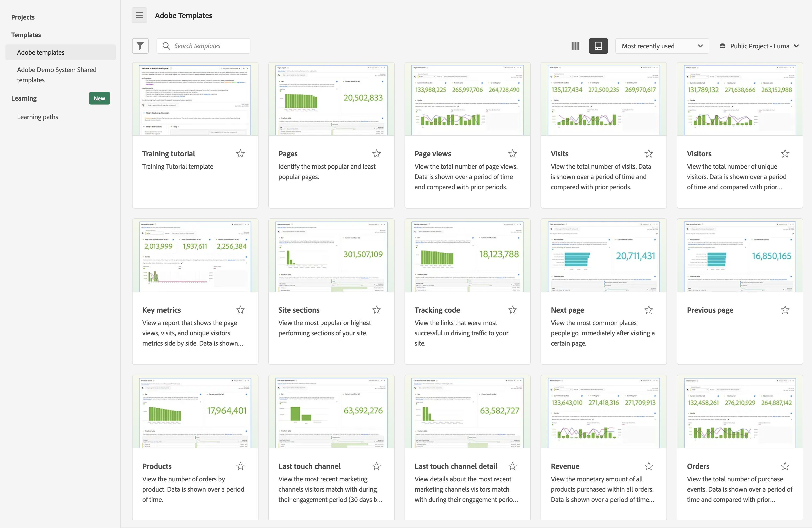

# 使用模板

Analysis Workspace 中的模板（或公司模板）可帮助您快速洞察最常见的报告场景。以下是您可以使用模板回答的一些问题示例：

* 有多少人访问您的网站。
* 其中有多少访客是独特访客（只计数一次）。
* 访客如何访问网站（例如，访客是通过点击链接还是直接访问网站）。
* 访客用于搜索网站内容的关键字。
* 访客在给定页面或整个网站上停留的时长。
* 访客点击的链接以及离开网站的时间。
* 哪些营销渠道在生成收入或转化事件方面最有效。
* 他们看视频花了多少时间。
* 他们使用哪些浏览器和设备访问您的网站。

以下信息介绍如何从 Analysis Workspace 中的[!UICONTROL 模板]选项卡访问和使用模板。

## 访问并运行模板

1. 在 Analysis Workspace 中，选择&#x200B;[!UICONTROL **工作区**]&#x200B;选项卡。

   

1. 在&#x200B;[!UICONTROL **模板**]&#x200B;部分中，选择以下任一选项卡：

   * **[!UICONTROL Adobe 模板]**：显示 Adobe 提供的所有模板。

   * **[!UICONTROL _login_company_name _模板]**：显示为您的组织创建的所有公司模板。

     只有管理员可以创建公司模板。有关如何创建公司模板的信息，请参阅[创建和管理模板](/help/analysis-workspace/templates/create-templates.md)。

1. 使用以下任一选项来更改查看可用模板的方式：

   * 通过选择列视图 或卡片视图  图标，可选择是否以列视图或卡片视图查看模板。

   * 使用卡片视图  时，请从以下排序顺序中选择：**[!UICONTROL 最近使用]**、**[!UICONTROL 最受欢迎]**、**[!UICONTROL 字母顺序]**、**[!UICONTROL 分类]**。

1. 在搜索字段中，开始输入要查找的模板名称，然后从模板列表中选择它。

   或

   选择要查看的模板类别，然后从模板列表中选择模板。

   >[!TIP]
   >
   >要使用箭头键导航菜单，请按正斜杠键 (/)，然后按向下箭头键。按 Enter 键加载选定的模板。

   有关可用模板列表，请参阅下面的[可用模板](#available-templates)部分。

1. （可选）您可以查看包含数据视图中不可用的组件的模板。（默认情况下，仅当模板使用数据视图中可用的组件时才会显示。）

   >[!NOTE]
   >
   >在使用这些模板之前，管理员必须首先将这些缺失组件所需的上下文标签添加到数据视图中。有关详细信息，请参阅[使用模板](/help/analysis-workspace/templates/create-templates.md)中的[将缺失的组件添加到给定模板的数据视图](/help/analysis-workspace/templates/create-templates.md#add-missing-components-to-the-data-view-for-a-given-template)。
   >
   >有关上下文标签的更多信息，请参阅[组件设置](/help/data-views/component-settings/overview.md)。

   1. 选择区段图标。

   1. 选择&#x200B;**[!UICONTROL 尚未准备好使用]**，以显示需要附加组件的模板。

      

1. 选择模板以根据您选择的模板创建报告。

1. （有条件）如果模板包含数据视图中不可用的组件，则会显示不兼容的数据视图对话框，指出数据视图与模板不兼容并会显示缺少哪些组件。

   执行以下其中一项操作：

   * 在&#x200B;**[!UICONTROL 更改数据视图]**&#x200B;下拉菜单中选择不同的数据视图。

   * 选择&#x200B;**[!UICONTROL 仍然继续]**&#x200B;以查看缺少组件的模板。

## 基于模板创建项目 {#use-reports}

模板也许不能完全满足您的需求，但是可以接近您的需求。在这些情况下，您可以使用模板作为项目的起点，然后对其进行自定义，使其最适合您的特定用途。

如果您在进行更改后离开模板，系统会提示您保存或放弃更改。保存对模板的更改会将模板另存为新项目。

要自定义模板并将其保存为项目：

1. 在 Customer Journey Analytics 中，选择&#x200B;[!UICONTROL **工作区**]&#x200B;选项卡。

1. 选择&#x200B;[!UICONTROL **模板**]&#x200B;选项卡。

1. 选择要查看的模板。例如，在&#x200B;[!UICONTROL **最受欢迎**]&#x200B;部分，选择&#x200B;[!UICONTROL **页面**]&#x200B;模板。

   Analysis Workspace 中显示的页面模板显示两个[可视化图表](/help/analysis-workspace/visualizations/freeform-analysis-visualizations.md)（[条形图](/help/analysis-workspace/visualizations/bar.md)和[摘要数字](/help/analysis-workspace/visualizations/summary-number-change.md)）和[自由格式表](/help/analysis-workspace/visualizations/freeform-table/freeform-table.md)。使用的量度为“发生次数”。

   <!--update screenshot. The following is AA -->

   

1. 执行下列任一操作：

   * 查看模板。
   * 将一个或多个区段拖到顶部的“区段”放置区中。例如，拖动区段&#x200B;[!UICONTROL **移动客户**]&#x200B;并查看结果。
   * 转到右上方的日程表来更改日期范围。
   * 添加维度细分、拖入其他量度，并根据您的需求对模板进行总体定制。

1. （可选）通过选择&#x200B;[!UICONTROL **项目**] > [!UICONTROL **保存**]，将模板另存为项目。

   模板将另存为新项目；这不会修改现有模板。有关保存项目的更多信息，请参阅[保存项目](/help/analysis-workspace/build-workspace-project/save-projects.md)。

## 可用模板

要访问所有可用的预建模板：

1. 在 Adobe Analytics 中，选择&#x200B;[!UICONTROL **工作区**]&#x200B;选项卡，然后选择&#x200B;[!UICONTROL **模板**]&#x200B;选项卡。

   预建模板按类别进行组织。

   <!--add screenshot-->

1. 选择一个类别来查看其中的模板。

   以下部分对应可用的类别并提供有关每个模板的信息。

   * **[[!UICONTROL 最受欢迎]](#most-popular)**

   * **[[!UICONTROL Web]** > **[!UICONTROL 参与度]](#engagement)**

   * **[[!UICONTROL Web]** > **[!UICONTROL 转化]](#web-conversion)**

   * **[[!UICONTROL Web]** > **[!UICONTROL 受众]](#web-audience)**

   * **[[!UICONTROL Web]** > **[!UICONTROL 客户获取]](#web-acquisition)**

   * **[[!UICONTROL Mobile]** > **[!UICONTROL 移动设备应用程序]](#mobile-mobile-app)**

   * **[[!UICONTROL Mobile]** > **[!UICONTROL 移动设备信息]](#mobile-mobile-device-information)**

   * **[[!UICONTROL Time Parting]](#time-parting)**

   * **[[!UICONTROL 跨渠道]](#cross-channel)**

   * **[[!UICONTROL 其他渠道]](#other-channels)**

   * **[[!UICONTROL AJO]](#ajo)**

### 最受欢迎 {#most-popular}

<!--AA only-->

>[!CONTEXTUALHELP]
>id="aa-template--unitsOvertimeReport"
>title="查看所有订单内购买的单位总数。数据显示了某段时间内的数据，并与之前的时间段进行了比较。"
>abstract="**这可以帮助您**&#x200B;更好地了解单位销售额随着时间的推移如何增加或减少。您可以应用区段来了解哪些客户或地区购买的单位最多，以及这些单位销售额随时间的变化趋势。 **根据您所了解的情况，您可以**&#x200B;采取多种行动，例如通过比较启动营销活动前后的单位销售额来评估最近发起的营销活动的有效性。也可以比较假期期间的同比单位销售额。 此模板使用“天”维度和“单位”量度。"

<!--both AA and CJA-->

>[!CONTEXTUALHELP]
>id="template--training"
>title="培训教程模板"
>abstract="了解常见的 Analysis Workspace 术语，以及生成首个分析的步骤。"

>[!CONTEXTUALHELP]
>id="template--pagesRankedReport"
>title="找出最受欢迎和最不受欢迎的页面。"
>abstract="**这可以帮助您**&#x200B;更好地了解您的受众，以及他们最感兴趣的信息类型。 **根据您所了解的情况，您可以**&#x200B;采取多种行动，例如调整页面元数据以提高查看次数较少的页面的可见性，或者花时间改进查看次数最多的页面的内容。 此模板使用“页面”维度和“页面查看次数”量度。"

>[!CONTEXTUALHELP]
>id="template--pageViewsOvertimeReport"
>title="查看页面总查看次数。数据显示了某段时间内的数据，并与之前的时间段进行了比较。 "
>abstract="**这可以帮助您**&#x200B;更好地了解您网站的流量随着时间的推移如何增加或减少。 **根据您所了解的情况，您可以**&#x200B;采取多种行动，例如通过比较启动营销活动前后的网站流量来评估最近发起的营销活动的有效性。或者您可以比较一下同比假期期间的流量。 此模板使用“天”维度和“页面查看次数”量度。"

>[!CONTEXTUALHELP]
>id="template--visitsOvertimeReport"
>title="查看总访问次数。数据显示了某段时间内的数据，并与之前的时间段进行了比较。"
>abstract="**这可以帮助您**&#x200B;更好地了解您网站的流量随着时间的推移如何增加或减少。 **根据您所了解的情况，您可以**&#x200B;采取多种行动，例如通过比较启动营销活动前后的网站流量来评估最近发起的营销活动的有效性。或者您可以比较一下同比假期期间的流量。 此模板使用“天”维度和“访问次数”量度。"

>[!CONTEXTUALHELP]
>id="template--visitorsOvertimeReport"
>title="查看独特访客的总数。数据显示了某段时间内的数据，并与之前的时间段进行了比较。 "
>abstract="**这可以帮助您**&#x200B;更好地了解您网站的覆盖面和受众规模随着时间的推移或与前一时期相比是如何增加或减少的。 **根据您所了解的情况，您可以**&#x200B;采取多种行动，例如，通过比较启动营销活动前后的独特访客数量来评估最近发起的营销活动是否成功吸引了新用户访问网站。或者您可以比较一下假期期间访问该网站的人数与去年同期相比的情况。 此模板使用“天”维度和“独特访客量”量度。 "

>[!CONTEXTUALHELP]
>id="template--keyMetricsReport"
>title="查看并排显示页面查看次数、访问次数和独特访客量度的报告。数据显示了某段时间内的数据，并与之前的时间段进行了比较。"
>abstract="**这可以帮助您**&#x200B;比较这些重要的量度，以更全面地了解访问网站的独特人员数量、页面访问次数以及会话次数。 **根据您所了解的情况，您可以**&#x200B;采取多种行动，例如评估每个人在特定一周或一个月内访问网站时查看的平均页面数，以及在一年中的某些时间或开展营销活动前后这些页面数的变化情况。 此模板使用“天”维度、“页面查看次数”量度、“访问次数”量度和“独特访客量”量度。"

>[!CONTEXTUALHELP]
>id="template--siteSectionRankedReport"
>title="查看您网站上最受欢迎或表现最好的部分。"
>abstract="**这可以帮助您**&#x200B;更好地了解您网站中哪些部分的访问次数最多。 **根据您所了解的情况，您可以**&#x200B;采取多种行动，例如评估您提供的哪些产品或服务最能引起人们的兴趣。 此模板使用“网站分区”维度和“访问次数”量度。"

>[!CONTEXTUALHELP]
>id="template--next-page-report"
>title="查看人们访问某个页面后最常去的地方。"
>abstract="**这可以帮助您**&#x200B;更好地了解用户访问某个页面后的行为。 **根据您所了解的情况，您可以**&#x200B;采取多种行动，例如评估是否可以优化页面设计或布局，以将人们引导到更理想的页面，例如进行购买或留下评论的页面。 此模板使用“页面”维度和“事件”量度。"

>[!CONTEXTUALHELP]
>id="template--previous-page-report"
>title="查看人们访问某个页面前最常去的地方。"
>abstract="**这可以帮助您**&#x200B;更好地了解哪些页面为某个页面带来了最多的流量。 **根据您所了解的情况，您可以**&#x200B;采取多种行动，例如评估未作为前一个页面出现的页面是否需要更突出的指向当前页面的链接。"

>[!CONTEXTUALHELP]
>id="template--campaignRankedReport"
>title="查看那些最成功地为您的网站带来流量的链接。"
>abstract="**这可以帮助您**&#x200B;更好地了解在访问您的网站时，哪些跟踪代码（以及与它们关联的链接）使用得最多。 **根据您所了解的情况，您可以**&#x200B;采取多种行动，例如调整您在网站中添加链接的策略。 此模板使用“跟踪代码”维度和“访问次数”量度。"

>[!CONTEXTUALHELP]
>id="template--productsRankedReport"
>title="按产品查看订单数量。数据显示一段时期内的情况。"
>abstract="**这可以帮助您**&#x200B;了解哪些产品需求量最高或最低。 **根据您所了解的情况，您可以**&#x200B;采取多种行动，例如调整您的营销策略，以推广表现优异的产品，或者改进或停产表现不佳的产品。您还可以根据数据分析来调整产品库存。 此模板使用“产品”维度和“订单”量度。"

>[!CONTEXTUALHELP]
>id="template--lastTouchChannelRankedReport"
>title="查看访客在参与期间（默认为 30 天）匹配的最新营销渠道。"
>abstract="**这可以帮助您**&#x200B;了解哪些营销渠道在将人们吸引到您的网站并最终促成转化方面最为有效。 **根据您所了解的情况，您可以**&#x200B;采取多种行动，例如为表现优异的渠道分配更多资源，或者为表现不佳的渠道减少资源分配。 此模板使用“最近接触渠道”维度和“独特访客量”量度。"

>[!CONTEXTUALHELP]
>id="template--lastTouchChannelDetailRankedReport"
>title="查看访客在参与期间（默认为 30 天）匹配的最新营销渠道的详细信息。"
>abstract="**这可以帮助您**&#x200B;不仅了解哪些营销渠道在吸引人们访问您的网站并实现转化方面最有效，还可以了解这些营销渠道的详细信息。例如，如果访客到达您的网站且与“付费搜索”营销渠道匹配，则您可以使用渠道详细信息来查看使用了哪个搜索引擎或搜索了哪个关键词。 **根据您所了解的情况，您可以**&#x200B;采取多种行动，例如为表现优异的渠道分配更多资源，或者为表现不佳的渠道减少资源分配。 此模板使用“最近接触渠道详细信息”维度和“独特访客量”量度。 "

>[!CONTEXTUALHELP]
>id="template--revenueOvertimeReport"
>title="查看所有订单中购买的产品的货币数量。数据显示了某段时间内的数据，并与之前的时间段进行了比较。"
>abstract="**这可以帮助您**&#x200B;了解收入随着时间的推移如何增加或减少。您可以将此量度与任何维度组合，以了解哪些维度项对收入做出了贡献。 **根据您所了解的情况，您可以**&#x200B;采取多种行动，例如根据以前的趋势预测未来的收入。您还可以添加另一个维度，例如跟踪代码维度，以了解哪些营销活动产生的收入最多。 此模板使用“天”维度和“收入”量度。"

>[!CONTEXTUALHELP]
>id="template--ordersOvertimeReport"
>title="查看购买事件的总数。数据显示了某段时间内的数据，并与之前的时间段进行了比较。"
>abstract="**这可以帮助您**&#x200B;更好地了解对您的产品和服务的兴趣是如何随着时间的推移而增加或减少的。您可以应用区段来了解哪些客户或地区下的订单最多，以及这些订单随时间的变化趋势。 **根据您所了解的情况，您可以**&#x200B;采取多种行动，例如通过比较启动营销活动前后的订单来评估最近发起的营销活动的有效性。或者您可以比较一下同比假期期间的订单。 此模板使用“天”维度和“订单”量度。"

可使用以下模板：

| 模板名称 | 为什么使用此模板<!-- What do you do with it? What can it help you learn? and What are the potential actions? --> |
| --- | --- |
| [!UICONTROL **培训教程**] | 了解常见的 Analysis Workspace 术语，以及构建首个分析的步骤 |
| [!UICONTROL **页面**] | <!--duplicated in Engagement section--> 找出最受欢迎和最不受欢迎的页面。 
**这可以帮助您**&#x200B;更好地了解您的受众，以及他们最感兴趣的信息类型。

**根据您所了解的情况，您可以**&#x200B;采取多种行动，例如调整页面元数据以提高查看次数较少的页面的可见性，或者花时间改进查看次数最多的页面的内容。

此模板使用“页面”维度和“页面浏览次数”量度。
 |
| [!UICONTROL **页面浏览次数**] | <!--duplicated in Engagement section--> 查看页面总查看次数。数据显示了某段时间内的数据，并与之前的时间段进行了比较。 
**这可以帮助您**&#x200B;更好地了解您网站的流量随着时间的推移如何增加或减少。

**根据您所了解的情况，您可以**&#x200B;采取多种行动，例如通过比较启动营销活动前后的网站流量来评估最近发起的营销活动的有效性。或者您可以比较一下同比假期期间的流量。

此模板使用“天”维度和“页面浏览次数”量度。
 |
| [!UICONTROL **网站访问量**] | <!--duplicated in Engagement section--> 查看总访问次数。数据显示了某段时间内的数据，并与之前的时间段进行了比较。 
**这可以帮助您**&#x200B;更好地了解您网站的流量随着时间的推移如何增加或减少。

**根据您所了解的情况，您可以**&#x200B;采取多种行动，例如通过比较启动营销活动前后的网站流量来评估最近发起的营销活动的有效性。或者您可以比较一下同比假期期间的流量。

此模板使用“天”维度和“访问次数”量度。
 |
| [!UICONTROL **网站访客**] | <!--duplicated in Engagement section--> 查看独特访客的总数。数据显示了某段时间内的数据，并与之前的时间段进行了比较。 
**这可以帮助您**&#x200B;更好地了解您网站的覆盖面和受众规模随着时间的推移或与前一时期相比是如何增加或减少的。

**根据您所了解的情况，您可以**&#x200B;采取多种行动，例如，通过比较启动营销活动前后的独特访客数量来评估最近发起的营销活动是否成功吸引了新用户访问网站。或者您可以比较一下假期期间访问该网站的人数与去年同期相比的情况。

此模板使用“天”维度和“独特访客量”量度。
 |
| [!UICONTROL **关键量度**] | <!--duplicated in Engagement section--> 查看并排显示页面查看次数、访问次数和独特访客量度的报告。数据显示了某段时间内的数据，并与之前的时间段进行了比较。 
**这可以帮助您**&#x200B;比较这些重要的量度，以更全面地了解访问网站的独特人员数量、页面访问次数以及会话次数。

**根据您所了解的内容，您可以**&#x200B;采取多种行动，例如评估每个人在特定一周或一个月内访问网站时查看的平均页面数，以及在一年中的某些时间或开展营销活动前后这些页面数的变化情况。 

此模板使用“天”维度、“页面浏览次数”量度、“访问次数”量度和“独特访客量”量度。
 |
| [!UICONTROL **网站部分**] | 查看您网站上最受欢迎或表现最好的部分。 
**这可以帮助您**&#x200B;更好地了解您网站中哪些部分的访问次数最多。

**根据您所了解的情况，您可以**&#x200B;采取多种行动，例如评估您提供的哪些产品或服务最能引起人们的兴趣。
 
此模板使用“网站部分”维度和“访问次数”量度。
 |
| [!UICONTROL **下一页**] | 查看人们访问某个页面后最常去的地方。 
**这可以帮助您**&#x200B;更好地了解用户访问某个页面后的行为。

**根据您所了解的情况，您可以**&#x200B;采取多种行动，例如评估是否可以优化页面设计或布局，以将人们引导到更理想的页面，例如进行购买或留下评论的页面。
 
此模板使用“页面”维度和“事件”量度。
 |
| [!UICONTROL **上一页**] | 查看人们访问某个页面前最常去的地方。 
**这可以帮助您**&#x200B;更好地了解哪些页面为某个页面带来了最多的流量。

**根据您所了解的情况，您可以**&#x200B;采取多种行动，例如评估未作为前一个页面出现的页面是否需要更突出的指向当前页面的链接。

此模板使用“页面”维度和“事件”量度。
 |
| [!UICONTROL **跟踪代码**] | 查看那些最成功地为您的网站带来流量的链接。 
**这可以帮助您**&#x200B;更好地了解在访问您的网站时，哪些跟踪代码（以及与它们关联的链接）使用得最多。

**根据您所了解的情况，您可以**&#x200B;采取多种行动，例如调整您在网站中添加链接的策略。

此模板使用“跟踪代码”维度和“访问次数”量度。
 |
| [!UICONTROL **产品**] | 按产品查看订单数量。数据显示一段时期内的情况。 
**这可以帮助您**&#x200B;了解哪些产品需求量最高或最低。

**根据您所了解的情况，您可以**&#x200B;采取多种行动，例如调整您的营销策略，以推广表现优异的产品，或者改进或停产表现不佳的产品。您还可以根据数据分析来调整产品库存。

此模板使用“产品”维度和“订单”量度。
 |
| [!UICONTROL **最近联系渠道**] | 查看访客在参与期间（默认为 30 天）匹配的最新营销渠道。
**这可以帮助您**&#x200B;了解哪些营销渠道在将人们吸引到您的网站并最终促成转化方面最为有效。

**根据您所了解的情况，您可以**&#x200B;采取多种行动，例如为表现优异的渠道分配更多资源，或者为表现不佳的渠道减少资源分配。

此模板使用“最近联系渠道”维度和“独特访客量”量度。
 |
| [!UICONTROL **最近联系渠道详细信息**] | 查看访客在参与期间（默认为 30 天）匹配的最新营销渠道的详细信息。
**这可以帮助您**&#x200B;不仅了解哪些营销渠道在吸引人们访问您的网站并实现转化方面最有效，还可以了解这些营销渠道的详细信息。例如，如果访客到达您的网站且与“付费搜索”营销渠道匹配，则您可以使用渠道详细信息来查看使用了哪个搜索引擎或搜索了哪个关键词。

**根据您所了解的情况，您可以**&#x200B;采取多种行动，例如为表现优异的渠道分配更多资源，或者为表现不佳的渠道减少资源分配。

此模板使用“最近接触渠道详细信息”维度和“独特访客量”量度。
 |
| [!UICONTROL **收入**] | <!--duplicated in Web Conversion section-->查看所有订单中购买的产品的货币数量。数据显示了某段时间内的数据，并与之前的时间段进行了比较。
**这可以帮助您**&#x200B;了解收入随着时间的推移如何增加或减少。您可以将此量度与任何维度组合，以了解哪些维度项对收入做出了贡献。

**根据您所了解的情况，您可以**&#x200B;采取多种行动，例如根据以前的趋势预测未来的收入。您还可以添加另一个维度，例如跟踪代码维度，以了解哪些营销活动产生的收入最多。

此模板使用“天”维度和“收入”量度。
 |
| [!UICONTROL **订单数**] | <!--duplicated in Web Conversion section-->查看购买事件的总数。数据显示了某段时间内的数据，并与之前的时间段进行了比较。 
**这可以帮助您**&#x200B;更好地了解对您的产品和服务的兴趣是如何随着时间的推移而增加或减少的。您可以应用区段来了解哪些客户或地区下的订单最多，以及这些订单随时间的变化趋势。

**根据您所了解的情况，您可以**&#x200B;采取多种行动，例如通过比较启动营销活动前后的订单来评估最近发起的营销活动的有效性。或者您可以比较一下同比假期期间的订单。

此模板使用“天”维度和“订单”量度。
 |

### 网络：参与 {#web-engagement}

<!--AA only-->

>[!CONTEXTUALHELP]
>id="aa-template--real-time"
>title="查看当前正在您的网站上收集的维度和量度。"
>abstract="**这可以帮助您**&#x200B;更好地了解您网站上的流行趋势。 **根据您所了解的情况，您可以**&#x200B;采取多种行动，例如回应和积极管理当前营销内容和活动的效果。"

>[!CONTEXTUALHELP]
>id="aa-template--timeSpentVisitOvertimeReport"
>title="查看访客每次访问时在您的网站所逗留的平均时间。数据显示了某段时间内的数据，并与之前的时间段进行了比较。"
>abstract="**这可以帮助您**&#x200B;更好地了解访客的参与度以及他们在网站上逗留的时间。 **根据您所了解的情况，您可以**&#x200B;采取多种行动，例如评估对您网站的更改是否会导致访客在网站上逗留更多时间。 此模板使用“天”维度和“每次访问的逗留时间（秒）”量度。"

>[!CONTEXTUALHELP]
>id="aa-template--timePriorRankedReport"
>title="查看用户在成功事件之前所逗留的平均时间。"
>abstract="**这可以帮助您**&#x200B;更好地了解访客执行所需操作（例如购买）所需的时间。 **根据您所了解的情况，您可以**&#x200B;采取多种行动，例如评估对网站的更改是否能提高访客快速达成某个成功事件的能力。 此模板使用“发生事件之前逗留的时间”维度和“独特访客量”量度。"

>[!CONTEXTUALHELP]
>id="aa-template--falloutReport"
>title="查看访客在哪些页面离开或继续浏览预定义的页面序列。"
>abstract="**这可以帮助您**&#x200B;更好地了解用户是在历程中的哪些地方流失的。 **根据您所了解的情况，您可以**&#x200B;采取多种行动，例如通过您网站上的特定流程（如购买或注册流程）分析转化率，或者分析您网站上各事件之间的关联。（例如，查看过隐私政策的用户中有多大比例会继续购买产品。）您还可以使用此模板在同一报告中对两个不同区段进行并排比较。 此模板使用了流失可视化图表。"

>[!CONTEXTUALHELP]
>id="aa-template--cross-device-analysis"
>title="查看人们在历程的各个阶段使用的设备。"
>abstract="**这可以帮助您**&#x200B;更好地了解有多少人与您的品牌互动、他们使用的设备类型，以及他们使用多种设备对体验的影响。例如，出现下面这种情况的频率是多少：人们先是在移动设备上开启一项任务，随后为了完成该任务而移至桌面？用户从一台设备转到另一台设备时最常用的路径是什么？他们在哪里退出？他们在哪里继续？依此类推。 **根据您所了解的情况，您可以**&#x200B;采取多种行动，例如优化用户历程的某些部分以获得移动体验。 此模板使用流量可视化图表、流失可视化图表、同类群组分析、“人员”量度和“独特设备”量度。"

>[!CONTEXTUALHELP]
>id="aa-template--web-retention"
>title="查看谁是您的忠实客户以及他们在您的网站上做些什么。"
>abstract="**这可以帮助您**&#x200B;更好地了解平均每个人访问网站的次数、再次访问网站的频率以及两次访问之间的间隔天数。 **根据您所了解的情况，您可以**&#x200B;采取多种行动，例如分析哪些内容最能有效地吸引人们回到网站。 此模板使用“访问次数”量度和“独特访客量”量度。"

>[!CONTEXTUALHELP]
>id="aa-template--audio-consumption-template"
>title="查看所有数字设备上的媒体音频消费的趋势和热门量度。"
>abstract="**这可以帮助您**&#x200B;更好地了解访客如何在您的网站上使用音频内容。 **根据您所了解的情况，您可以**&#x200B;采取多种行动，例如分析哪些内容被使用得最多。 此模板使用“访问次数”量度和“独特访客量”量度。"

>[!CONTEXTUALHELP]
>id="aa-template--media-recency-frequency-loyalty"
>title="查看所有数字设备上的媒体消费的趋势和热门量度。"
>abstract="**这可以帮助您**&#x200B;更好地了解平均每个人访问网站的次数、再次访问网站的频率以及两次访问之间的间隔天数。 **根据您所了解的情况，您可以**&#x200B;采取多种行动，例如分析哪些内容最能有效地吸引人们回到网站。 此模板使用“访问次数”量度和“独特访客量”量度。"

>[!CONTEXTUALHELP]
>id="aa-template--reloadsRankedReport"
>title="查看重新加载过程中维度项的出现次数。访客刷新其浏览器是触发重新载入的最常见方式。"
>abstract="**这可以帮助您**&#x200B;识别某个页面何时可能出现问题，提示访客重新加载页面。 **根据您所了解的情况，您可以**&#x200B;采取多种行动，例如评估哪些页面存在需要解决的问题。 此模板使用“重新加载次数”量度。"

>[!CONTEXTUALHELP]
>id="aa-template--timeSpentPageRankedReport"
>title="查看访客每次访问时在您的网站所逗留的平均时间。数据显示了某段时间内的数据，并与之前的时间段进行了比较。"
>abstract="**这可以帮助您**&#x200B;更好地了解访客的参与度以及他们在网站上逗留的时间。 **根据您所了解的情况，您可以**&#x200B;采取多种行动，例如评估对您网站的更改是否会导致访客在网站上逗留更多时间。 此模板使用“天”维度和“每次访问的逗留时间（秒）”量度。"

>[!CONTEXTUALHELP]
>id="aa-template--entryPageOriginalRankedReport"
>title="查看访客在存留期首次访问您的网站时访问的热门页面。"
>abstract="**这可以帮助您**&#x200B;更好地了解哪些页面为您的网站带来了最多的流量，或者更多地了解访客对您网站的第一印象。 **根据您所了解的情况，您可以**&#x200B;采取多种行动，例如优化人们在网站上获得的初步体验，或者确保人们在进入您的网站时首先看到的页面是友好的，并提供指向您网站其他区域的必要链接。 此模板使用“会话”量度。它还使用了条形图可视化图表和自由格式表可视化图表。"

>[!CONTEXTUALHELP]
>id="aa-template--singlePageVisitsRankedReport"
>title="查看单个唯一页面的访问次数。"
>abstract="**这可以帮助您**&#x200B;更好地了解访客的参与度以及他们在网站上逗留的时间。 **根据您所了解的情况，您可以**&#x200B;采取多种行动，例如评估对您网站的更改是否会导致访客在网站上逗留更多时间。 此模板使用“单页面访问次数”维度。"

>[!CONTEXTUALHELP]
>id="aa-template--sitePerformanceOverview"
>title="查看 Adobe Experience Manager 网站的性能数据。"
>abstract="**这可以帮助您**&#x200B;更好地了解 Adobe Experience Manager 的价值实现。 **根据您所了解的情况，您可以**&#x200B;采取多种行动，例如优化您的 Experience Manager 设置。"

>[!CONTEXTUALHELP]
>id="aa-template--formsPerformanceOverview"
>title="查看您的 Adobe Experience Manager Forms 的性能数据。"
>abstract="**这可以帮助您**&#x200B;更好地了解 Adobe Experience Manager 的价值实现。 **根据您所了解的情况，您可以**&#x200B;采取多种行动，例如优化您的 Experience Manager 设置。"

>[!CONTEXTUALHELP]
>id="aa-template--itp-impact"
>title="查看并分析智能防跟踪 (ITP) 对数据收集和报告的影响。"
>abstract="**这可以帮助您**&#x200B;更好地了解由于 ITP 实行的 Cookie 限制而造成的潜在数据丢失。 **根据您所了解的情况，您可以**&#x200B;采取多种行动，例如调整您的分析设置以最大限度地减少 ITP 的影响。"

<!--Both AA and CJA-->

>[!CONTEXTUALHELP]
>id="template_time_spent"
>title="查看访客每次访问您的网站时平均花费的时间，以及用户在成功事件发生前平均花费的时间。数据显示了某段时间内的数据，并与之前的时间段进行了比较。"
>abstract="**这可以帮助您**&#x200B;更好地了解访客参与度，以及访客执行所需操作（例如购买）所需的时间。 **根据您所了解的情况，您可以**&#x200B;采取多种行动，例如评估对网站的更改是否能提高访客快速达成某个成功事件的能力。 此模板使用“天”维度和“每次访问所花费的时间（秒）”量度。"

>[!CONTEXTUALHELP]
>id="template--web-content-consumption"
>title="查看哪些网络内容的使用量最高，并且最能吸引用户。"
>abstract="**这可以帮助您**&#x200B;更好地了解人们首次进入网站时会去哪里、人们最常访问网站的哪些部分，以及哪些页面最有可能让人们离开网站。 **根据您所了解的情况，您可以**&#x200B;采取多种行动，例如评估网站上的哪些路径会引导人们访问最重要的页面，以及哪些页面最有可能让人们离开网站。 此模板使用“页面”维度和“页面查看次数”量度、“访问次数”量度、“独特访客量”量度、“进入率”量度、“跳出率”量度、“退出率”量度和“内容速度”量度。它还使用流量可视化图表来表示进入、退出和热门部分。"

>[!CONTEXTUALHELP]
>id="template--media-content-consumption"
>title="查看哪些媒体内容的使用量最高，并且最能吸引用户。"
>abstract="**这可以帮助您**&#x200B;更好地了解人们首次进入网站时会去哪里、人们最常访问网站的哪些部分，以及哪些页面最有可能让人们离开网站。 **根据您所了解的情况，您可以**&#x200B;采取多种行动，例如评估网站上的哪些路径会引导人们访问最重要的页面，以及哪些页面最有可能让人们离开网站。 此模板使用“页面”维度和“页面查看次数”量度、“访问次数”量度、“独特访客量”量度、“进入率”量度、“跳出率”量度、“退出率”量度和“内容速度”量度。它还使用流量可视化图表来表示进入、退出和热门区域，通过散点图显示最常见页面的页面浏览次数，通过条形图显示按时间段划分的页面浏览次数，通过线形图显示在网站上平均逗留时间的趋势视图。"

>[!CONTEXTUALHELP]
>id="template--flowreport"
>title="查看人们在访问某个地方后或即将访问某个地方前，通常会去的地方。"
>abstract="**这可以帮助您**&#x200B;了解流量如何从给定页面流向您网站的其他部分，并了解人们到达给定页面所采用的路径。 **根据您所了解的情况，您可以**&#x200B;采取多种行动，例如评估是否可以优化页面设计或布局，以将人们引导到更理想的页面，例如进行购买或留下评论的页面。或者评估当前页面上的信息是否可能为从之前的页面来到这里的人们提供他们所寻找的方向或操作。或者，您可以评估那些没有像之前页面那样显示的页面，是否需要更显眼的链接来指向当前页面。 此模板使用“下一项或上一项”面板。"

>[!CONTEXTUALHELP]
>id="template--page-summary-report"
>title="查看您属性中任何页面的关键信息。显示页面查看次数、趋势线、流量可视化图表等。"
>abstract="**这可以帮助您**&#x200B;更好地了解人们如何与给定页面进行交互。 **根据您所了解的情况，您可以**&#x200B;采取多种行动，比如分析页面在一段时间内的性能，或者更好地理解是什么推动了页面流量的增长。 此模板使用“页面查看次数”量度。它还使用线形图可视化图表和流量可视化图表。"

>[!CONTEXTUALHELP]
>id="template--entryPageRankedReport"
>title="查看人们首次访问您的网站时访问的热门页面。"
>abstract="**这可以帮助您**&#x200B;更好地了解哪些页面为您的网站带来了最多的流量，或者更多地了解访客对您网站的第一印象。 **根据您所了解的情况，您可以**&#x200B;采取多种行动，例如优化人们在网站上获得的初步体验，或者确保人们在进入您的网站时首先看到的页面是友好的，并提供指向您网站其他区域的必要链接。 此模板使用“会话”量度。它还使用了条形图可视化图表和自由格式表可视化图表。"

>[!CONTEXTUALHELP]
>id="template--exitPageRankedReport"
>title="查看人们在即将离开您的网站之前访问的热门页面。"
>abstract="**这可以帮助您**&#x200B;更好地了解哪些页面会导致人们离开网站。 **根据您所了解的情况，您可以**&#x200B;采取多种行动，例如更新常见的退出页面，以优化人们在离开前获得的体验，或者包含内容或链接，以鼓励人们留在您的网站上。 此模板使用“会话”量度。它还使用了条形图可视化图表和自由格式表可视化图表。"

>[!CONTEXTUALHELP]
>id="template--productUsageOverviewReport"
>title="查看 Customer Journey Analytics 产品在您的组织内的使用情况。"
>abstract="**这可以帮助您**&#x200B;更好地了解有多少人正在使用 Customer Journey Analytics、他们使用的频率以及随时间变化的使用趋势。您还可以查看正在创建的项目数量和这些项目的详细信息（如最常用的组件、可视化图表和面板）以及许多其他使用统计数据。 **根据您获得的见解，您可以**&#x200B;采取多种行动，例如删除不使用的项目或组件，或者提供热门功能的用户培训。"

>[!CONTEXTUALHELP]
>id="template--content-analytics"
>title="了解哪些内容和内容属性表现最佳。"
>abstract="**这可以帮助您**&#x200B;了解您的内容在粒度级别上的表现。您可以查看单个资产或特定属性的表现。Content Analytics 使用 AI 自动生成属性，并用它们标记您的内容。<a href="https://experienceleague.adobe.com/zh-hans/docs/analytics-platform/using/content-analytics/content-analytics" target="&quot;_blank&quot;">了解详情</a>。 **根据您所了解的情况，您可以**&#x200B;采取多种行动，例如在主页上推广表现优异的资产，为特定区段市场提供个性化内容以包含表现优异的属性，或者轮换掉已经开始过时的内容。"

可使用以下模板：

| 模板名称 | 为什么使用此模板<!-- What do you do with it? What can it help you learn? and What are the potential actions? --> |
| --- | --- |
| [!UICONTROL **关键量度**] | <!--duplicated in Most popular section--> 查看并排显示页面查看次数、访问次数和独特访客量度的报告。数据显示了某段时间内的数据，并与之前的时间段进行了比较。 
**这可以帮助您**&#x200B;比较这些重要的量度，以更全面地了解访问网站的独特人员数量、页面访问次数以及会话次数。

**根据您所了解的内容，您可以**&#x200B;采取多种行动，例如评估每个人在特定一周或一个月内访问网站时查看的平均页面数，以及在一年中的某些时间或开展营销活动前后这些页面数的变化情况。 

此模板使用“天”维度、“页面浏览次数”量度、“访问量”量度和“独特访客量”量度。
 |
| [!UICONTROL **页面查看次数**] | <!--duplicated in Most popular section-->查看页面总查看次数。数据显示了某段时间内的数据，并与之前的时间段进行了比较。 
**这可以帮助您**&#x200B;更好地了解您网站的流量随着时间的推移如何增加或减少。

**根据您所了解的情况，您可以**&#x200B;采取多种行动，例如通过比较启动营销活动前后的网站流量来评估最近发起的营销活动的有效性。或者您可以比较一下同比假期期间的流量。

此模板使用“天”维度和“页面浏览次数”量度。
 |
| [!UICONTROL **页面**] | <!--duplicated in Most popular section-->找出最受欢迎和最不受欢迎的页面。 
**这可以帮助您**&#x200B;更好地了解您的受众，以及他们最感兴趣的信息类型。

**根据您所了解的情况，您可以**&#x200B;采取多种行动，例如调整页面元数据以提高查看次数较少的页面的可见性，或者花时间改进查看次数最多的页面的内容。

此模板使用“页面”维度和“页面浏览次数”量度。
 |
| [!UICONTROL **访问次数**] | <!--duplicated in Most popular section-->查看总访问次数。数据显示了某段时间内的数据，并与之前的时间段进行了比较。 
**这可以帮助您**&#x200B;更好地了解您网站的流量随着时间的推移如何增加或减少。

**根据您所了解的情况，您可以**&#x200B;采取多种行动，例如通过比较启动营销活动前后的网站流量来评估最近发起的营销活动的有效性。或者您可以比较一下同比假期期间的流量。

此模板使用“天”维度和“访问次数”量度。
 |
| [!UICONTROL **访客**] | <!--duplicated in Most popular section-->查看独特访客的总数。数据显示了某段时间内的数据，并与之前的时间段进行了比较。 
**这可以帮助您**&#x200B;更好地了解您网站的覆盖面和受众规模随着时间的推移或与前一时期相比是如何增加或减少的。

**根据您所了解的情况，您可以**&#x200B;采取多种行动，例如，通过比较启动营销活动前后的独特访客数量来评估最近发起的营销活动是否成功吸引了新用户访问网站。或者您可以比较一下假期期间访问该网站的人数与去年同期相比的情况。

此模板使用“天”维度和“独特访客量”量度。
 |
| [!UICONTROL **逗留时间**] | 查看访客每次访问您的网站时平均花费的时间，以及用户在成功事件发生前平均花费的时间。数据显示了某段时间内的数据，并与之前的时间段进行了比较。 
**这可以帮助您**&#x200B;更好地了解访客参与度，以及访客执行所需操作（例如购买）所需的时间。

**根据您所了解的情况，您可以**&#x200B;采取多种行动，例如评估对网站的更改是否能提高访客快速达成某个成功事件的能力。

此模板使用“天”维度和“每次访问所花费的时间（秒）”量度。
 |
| [!UICONTROL **网站部分**] | <!--duplicated in Most popular section-->查看您网站上最受欢迎或表现最好的部分。 
**这可以帮助您**&#x200B;更好地了解您网站中哪些部分的访问次数最多。

**根据您所了解的情况，您可以**&#x200B;采取多种行动，例如评估您提供的哪些产品或服务最能引起人们的兴趣。
 
此模板使用“网站部分”维度和“访问次数”量度。
 |
| [!UICONTROL **Web 内容使用**] | 查看哪些网络内容的使用量最高，并且最能吸引用户。
**这可以帮助您**&#x200B;更好地了解人们首次进入网站时会去哪里、人们最常访问网站的哪些部分，以及哪些页面最有可能让人们离开网站。

**根据您所了解的情况，您可以**&#x200B;采取多种行动，例如评估网站上的哪些路径会引导人们访问最重要的页面，以及哪些页面最有可能让人们离开网站。
 
此模板使用“页面”维度和“页面浏览次数”量度、“访问量”量度、“独特访客量”量度、“进入率”量度、“跳出率”量度、“退出率”量度和“内容速度”量度。它还使用 Flow 可视化图表来表示进入、离开和热门部分。
 |
| [!UICONTROL **媒体内容使用**] | 查看哪些媒体内容的使用量最高，并且最能吸引用户。
**这可以帮助您**&#x200B;更好地了解人们首次进入网站时会去哪里、人们最常访问网站的哪些部分，以及哪些页面最有可能让人们离开网站。

**根据您所了解的情况，您可能**&#x200B;会采取多种行动，例如评估网站上的哪些路径会引导人们访问最重要的页面，以及哪些页面最有可能让人们离开网站<!-- not sure about these takeaways... -->。
 
此模板使用“页面”维度和“页面浏览次数”量度、“访问量”量度、“独特访客量”量度、“进入率”量度、“跳出率”量度、“退出率”量度和“内容速度”量度。它还使用流量可视化图表来表示进入、退出和热门区域，通过散点图显示最常见页面的页面浏览次数，通过条形图显示按时间段划分的页面浏览次数，通过线形图显示在网站上平均逗留时间的趋势视图。
 |
| [!UICONTROL **下一页和上一页流量**] | 查看人们在访问某个地方后以及即将访问某个页面前，最常去的地方的流量可视化图。 
**这可以帮助您**&#x200B;了解流量如何从给定页面流向您网站的其他部分，并了解人们到达给定页面所采用的路径。

**根据您所了解的情况，您可以**&#x200B;采取多种行动，例如评估是否可以优化页面设计或布局，以将人们引导到更理想的页面，例如进行购买或留下评论的页面。或者评估当前页面上的信息是否可能为从之前的页面来到这里的人们提供他们所寻找的方向或操作。或者，您可以评估那些没有像之前页面那样显示的页面，是否需要更显眼的链接来指向当前页面。

此模板使用“下一项或上一项”面板。
 |
| **页面摘要** | 查看您属性中任何页面的关键信息。显示页面查看次数、趋势线、流量可视化图表等。  
**这可以帮助您**&#x200B;更好地了解人们如何与给定页面进行交互。

**根据您所了解的情况，您可以**&#x200B;采取多种行动，比如分析页面在一段时间内的性能，或者更好地理解是什么推动了页面流量的增长。

此模板使用“页面浏览次数”量度。它还使用 Line 可视化和 Flow 可视化。
 |
| **登入页面** | 查看人们首次访问您的网站时访问的热门页面。 
**这可以帮助您**&#x200B;更好地了解哪些页面为您的网站带来了最多的流量，或者更多地了解访客对您网站的第一印象。

**根据您所了解的情况，您可以**&#x200B;采取多种行动，例如优化人们在网站上获得的初步体验，或者确保人们在进入您的网站时首先看到的页面是友好的，并提供指向您网站其他区域的必要链接。

此模板使用“会话”量度。它还使用了条形可视化图表和自由格式表可视化图表。
 |
| **退出页面** | 查看人们在即将离开您的网站之前访问的热门页面。
**这可以帮助您**&#x200B;更好地了解哪些页面会导致人们离开网站。 

**根据您所了解的情况，您可以**&#x200B;采取多种行动，例如更新常见的退出页面，以优化人们在离开前获得的体验，或者包含内容或链接，以鼓励人们留在您的网站上。

此模板使用“会话”量度。它还使用了条形可视化图表和自由格式表可视化图表。
 |
| **产品使用情况概述** | 查看 Customer Journey Analytics 产品在您的组织内的使用情况。 
**这可以帮助您**&#x200B;更好地了解有多少人正在使用 Customer Journey Analytics、他们使用的频率以及随时间变化的使用趋势。您还可以查看正在创建的项目数量和这些项目的详细信息（如最常用的组件、可视化图表和面板）以及许多其他使用统计数据。

**根据您获得的见解，您可以**&#x200B;采取多种行动，例如删除不使用的项目或组件，或者提供热门功能的用户培训。
 |
| **Content Analytics** | 了解哪些内容和内容属性表现最佳。
**这可以帮助您**&#x200B;了解您的内容在粒度级别上的表现。您可以查看单个资产或特定属性的表现。Content Analytics 使用 AI 自动生成属性，并用它们标记您的内容。请参阅 [Content Analytics](/help/content-analytics/content-analytics.md){target="_blank"} 以了解更多信息。

**根据您所了解的情况，您可以**&#x200B;采取多种行动，例如在主页上推广表现优异的资产，为特定区段市场提供个性化内容以包含表现优异的属性，或者轮换掉已经开始过时的内容。
 |

### Web：转化 {#web-conversion}

<!--AA only-->

>[!CONTEXTUALHELP]
>id="aa-template--categoryRankedReport"
>title="查看您网站上每个产品类别的访问次数。这对使用产品变量并希望查看产品类别相关量度的实施非常有用。如果网站上没有任何产品，则填充此模板的维度可能会特意留空。"
>abstract="**这可以帮助您**&#x200B;更好地了解最畅销或查看次数最高的产品。&lt;/br/>**根据您所了解的情况，您可以**&#x200B;采取多种行动，例如衡量特定产品营销活动的有效性。 此模板使用“类别”维度和“访问次数”量度。 "

>[!CONTEXTUALHELP]
>id="aa-template--commerce-and-marketing-management"
>title="查看关于您商业活动的零售商预建洞察以帮助您提高销量。虽然此功能面向 Adobe Commerce 的用户，但任何在线零售商均可以使用。"
>abstract="**这可以帮助您**&#x200B;更好地了解您的商业活动对销售额的贡献。 **根据您所了解的情况，您可以**&#x200B;采取多种行动，例如调整各种活动的预算以获得最高 ROI。"

<!--Both AA and CJA-->

>[!CONTEXTUALHELP]
>id="template--productConversionReport"
>title="在显示购物车、结账和订单的漏斗可视化图表中查看产品转化情况。您还可以查看转化百分比、收入平均值、单位平均值和订单平均值。"
>abstract="**这可以帮助您**&#x200B;更好地了解人们在转换过程中的进度和流失情况。 **根据您所了解的情况，您可以**&#x200B;采取多种行动，例如改进您的网站以促进更顺畅的结账过程。"

>[!CONTEXTUALHELP]
>id="template--retail-products-template"
>title="查看哪些产品表现最佳。"
>abstract="**这可以帮助您**&#x200B;更好地了解哪些产品最成功。 **根据您所了解的情况，您可以**&#x200B;采取多种行动，例如增加对成功产品的资金投入，减少对不太成功产品的资金投入。 此模板使用“产品查看次数”、“购物车加货”、“订单”、“收入”和“单位”量度。它还使用“产品”维度。"

>[!CONTEXTUALHELP]
>id="template--cartConversionReport"
>title="查看人们执行关键结账事件的次数，例如将商品添加到购物车、查看购物车、从购物车中移除商品以及结账。"
>abstract="**这可以帮助您**&#x200B;更好地了解结账过程漏斗中哪些环节有助于促成转化，哪些环节更容易导致购物车弃单。 **根据您所了解的情况，您可以**&#x200B;采取多种行动，例如减少结账过程某些步骤中的摩擦。 此模板使用"

>[!CONTEXTUALHELP]
>id="template--cartsOvertimeReport"
>title="查看将产品添加到购物车的人数。"
>abstract="**这可以帮助您**&#x200B;更好地了解将产品添加到购物车的人数，而不是添加到购物车中的产品总数。 **根据您所了解的情况，您可以**&#x200B;采取多种行动，例如衡量您的产品页面的有效性。 此模板使用“购物车”量度。"

>[!CONTEXTUALHELP]
>id="template--cartViewsOvertimeReport"
>title="查看人们查看购物车的次数。"
>abstract="**这可以帮助您**&#x200B;更好地了解结账体验，以降低购物车放弃率，或分析不同产品之间从购物车加货到结账之间的时间。 **根据您所了解的情况，您可以**&#x200B;采取多种行动，例如为在购物车中停留时间最长且最有可能被放弃的产品提供促销活动。 此模板使用“购物车查看次数”量度。"

>[!CONTEXTUALHELP]
>id="template--cartAdditionsOvertimeReport"
>title="查看人们将商品添加到购物车的次数。"
>abstract="**这可以帮助您**&#x200B;更好地理解转化漏斗中客户对产品的兴趣达到足够高，以至于将其添加到购物车中的环节。 **根据您所了解的情况，您可以**&#x200B;采取多种行动，例如为所有客户改进产品推荐。例如分析哪些产品经常被添加到同一个购物车中，并根据购物车中已有的商品推荐相关产品。"

>[!CONTEXTUALHELP]
>id="template--cartRemovalsOvertimeReport"
>title="查看人们从购物车中移除商品的次数。"
>abstract="**这可以帮助您**&#x200B;更好地理解转化漏斗中客户对产品不再感兴趣的部分，或者帮助您了解结账过程中可能存在的问题。 **根据您所了解的情况，您可以**&#x200B;采取多种行动，例如消除结账过程中可能存在的任何潜在障碍，如复杂的用户体验。 此模板使用“购物车减货”量度。"

>[!CONTEXTUALHELP]
>id="template--purchaseConversionReport"
>title="在显示会话、购物车和订单的漏斗可视化图表中查看购买转化情况。您还可以查看转化百分比、收入平均值、单位平均值和订单平均值。"
>abstract="**这可以帮助您**&#x200B;更好地了解人们在转换过程中的进度和流失情况。 **根据您所了解的情况，您可以**&#x200B;采取多种行动，例如改进您的网站以促进更顺畅的结账过程。"

可使用以下模板：

| 模板名称 | 为什么使用此模板<!-- What do you do with it? What can it help you learn? and What are the potential actions? --> |
| --- | --- |
| [!UICONTROL **产品转化漏斗**] | 在显示购物车、结账和订单的漏斗可视化图表中查看产品转化情况。您还可以查看转化百分比、收入平均值、单位平均值和订单平均值。
**这可以帮助您**&#x200B;更好地了解人们在转换过程中的进度和流失情况。

**根据您所了解的情况，您可以**&#x200B;采取多种行动，例如改进您的网站以促进更顺畅的结账过程。
 |
| **产品** | 查看哪些产品正在推动关键量度，例如热门产品或查看次数最多的产品。 
**这可以帮助您**&#x200B;更好地了解哪些产品最成功。

**根据您所了解的情况，您可以**&#x200B;采取多种行动，例如增加对成功产品的资金投入，减少对不太成功产品的资金投入。

此模板使用“订单”量度和“产品”维度。 |
| **产品表现** | 查看哪些产品表现最佳。
**这可以帮助您**&#x200B;更好地了解哪些产品最成功。

**根据您所了解的情况，您可以**&#x200B;采取多种行动，例如增加对成功产品的资金投入，减少对不太成功产品的资金投入。

此模板使用“产品浏览次数”、“购物车添加量”、“订单量”、“收入”和“单位”量度。它还使用“产品”维度。 |
| **购物车转化漏斗** | 查看人们执行关键结账事件的次数，例如将商品添加到购物车、查看购物车、从购物车中移除商品以及结账。 
**这可以帮助您**&#x200B;更好地了解结账过程漏斗中哪些环节有助于促成转化，哪些环节更容易导致购物车弃单。

**根据您所了解的情况，您可以**&#x200B;采取多种行动，例如减少结账过程某些步骤中的摩擦。
 |
| **购物车** | 查看将产品添加到购物车的人数。
**这可以帮助您**&#x200B;更好地了解将产品添加到购物车的人数，而不是添加到购物车中的产品总数。

**根据您所了解的情况，您可以**&#x200B;采取多种行动，例如衡量您的产品页面的有效性。

此模板使用“购物车”量度。 |
| **购物车查看** | 查看人们查看购物车的次数。 
**这可以帮助您**&#x200B;更好地了解结账体验，以降低购物车放弃率，或分析不同产品之间从购物车加货到结账之间的时间。

**根据您所了解的情况，您可以**&#x200B;采取多种行动，例如为在购物车中停留时间最长且最有可能被放弃的产品提供促销活动。

此模板使用“购物车浏览次数”量度。 |
| **购物车加货** | 查看人们将商品添加到购物车的次数。 
**这可以帮助您**&#x200B;更好地理解转化漏斗中客户对产品的兴趣达到足够高，以至于将其添加到购物车中的环节。

**根据您所了解的情况，您可以**&#x200B;采取多种行动，例如为所有客户改进产品推荐。这可以通过分析哪些产品经常被添加到同一个购物车中，并根据购物车中已有的商品推荐相关产品来实现。 |
| **购物车移除量** | 查看人们从购物车中移除商品的次数。
**这可以帮助您**&#x200B;更好地理解转化漏斗中客户对产品不再感兴趣的部分，或者帮助您了解结账过程中可能存在的问题。

**根据您所了解的情况，您可以**&#x200B;采取多种行动，例如消除结账过程中可能存在的任何潜在障碍，如复杂的用户体验。

此模板使用“购物车移除量”量度。 |
| **购买转化漏斗** | 在显示会话、购物车和订单的漏斗可视化图表中查看购买转化情况。您还可以查看转化百分比、收入平均值、单位平均值和订单平均值。
**这可以帮助您**&#x200B;更好地了解人们在转换过程中的进度和流失情况。

**根据您所了解的情况，您可以**&#x200B;采取多种行动，例如改进您的网站以促进更顺畅的结账过程。
 |
| **收入** | <!--duplicated in Most popular section-->查看所有订单中购买的产品的货币数量。
**这可以帮助您**&#x200B;更好地了解哪些维度项对收入做出了贡献（通过将“收入”量度与任意维度相结合）。例如，您可以查看对收入做出贡献的热门营销活动（使用“跟踪代码”维度）。 

**根据您所了解的情况，您可以**&#x200B;采取多种行动，例如调整未达到您预期收入目标的营销活动。

此模板使用“收入”量度。 |
| **订单数** | <!--duplicated in Most popular section-->查看您网站上发生的购买事件总数。 
**这可以帮助您**&#x200B;更好地了解哪些维度项对订单做出了贡献（通过将“订单”量度与任意维度相结合）。例如，您可以查看对购买做出贡献的热门营销活动（使用“跟踪代码”维度）。

**根据您所了解的情况，您可以**&#x200B;采取多种行动，例如调整未达到您预期购买目标的营销活动。 

此模板使用“订单”量度。 |

### Web：受众 {#web-audience}

<!--CJA only-->

>[!CONTEXTUALHELP]
>id="template--audienceOverview"
>title="查看访问您网站的用户中所包含的受众群体。"
>abstract="**这可以帮助您**&#x200B;更好地了解受众的一般信息，受众源自何处(RTCDP、Customer Journey Analytics等)、受众重叠等等。 **根据您了解的情况，您可以**&#x200B;执行任意数量的操作，例如，使用数据来专注于这些特定受众的营销工作，或为跨多个受众的客户创建量身定制的体验。 此模板使用“受众名称”、“受众来源”、“退出受众名称”和“退出受众来源”维度。"

<!--AA only-->

>[!CONTEXTUALHELP]
>id="template--people"
>title="查看与您的品牌互动的人数。"
>abstract="**这可以帮助您**&#x200B;更好地了解您网站的使用趋势。 **根据您所了解的情况，您可以**&#x200B;采取多种行动，例如衡量最近的营销活动对吸引新访客到您网站的有效性。"

>[!CONTEXTUALHELP]
>id="template--bots"
>title="查看您网站上的页面查看次数和有关机器人流量的趋势。"
>abstract="**这可以帮助您**&#x200B;根据所配置的机器人规则更好地了解从报告中过滤掉的机器人流量数量。 **根据您所了解的情况，您可以**&#x200B;采取多种行动，例如继续监控机器人活动以识别新的模式。"

>[!CONTEXTUALHELP]
>id="template--firstvsrepeatvisitors"
>title="查看首次来访访客和重复访客的比较。"
>abstract="**这可以帮助您**&#x200B;更好地了解您网站在维系客户忠诚度方面的有效性，或者您获取新客户的速度。 **根据您所了解的情况，您可以**&#x200B;采取多种行动，例如为首次来访访客提供未来购买的激励，以吸引他们回访。"

>[!CONTEXTUALHELP]
>id="template--personid"
>title="查看各个渠道中的个体用户行为。"
>abstract="**这可以帮助您**&#x200B;更好地了解完整的客户历程和跨多个接触点的互动。 **根据您所了解的情况，您可以**&#x200B;采取多种行动，例如开展个性化营销，更好地针对用户偏好。"

>[!CONTEXTUALHELP]
>id="aa-template--timeZoneRankedReport"
>title="查看访问您网站访客的热门时区。"
>abstract="**这可以帮助您**&#x200B;更好地了解访客所处的时区。 **根据您所了解的情况，您可以**&#x200B;采取多种行动，例如调整网站维护的时间，以尽量减少受影响的人数。"

>[!CONTEXTUALHELP]
>id="aa-template--location"
>title="在地图可视化图表中查看访客位置的概述。"
>abstract="**这可以帮助您**&#x200B;更好地了解访问您网站的访客所在的位置。 **根据您所了解的情况，您可以**&#x200B;采取多种行动，例如将营销资源集中在您认为最感兴趣和最有机会的地方。"

>[!CONTEXTUALHELP]
>id="aa-template--domainRankedReport"
>title="查看访问您网站访客的热门域。"
>abstract="**这可以帮助您**&#x200B;更好地了解访客来自哪些组织。 **根据您所了解的情况，您可以**&#x200B;采取多种行动，例如以您最大的客户为目标提供内容。"

>[!CONTEXTUALHELP]
>id="aa-template--topLevelDomainRankedReport"
>title="查看访问您网站访客的热门域。"
>abstract="**这可以帮助您**&#x200B;更好地了解访客来自哪些组织。 **根据您所了解的情况，您可以**&#x200B;采取多种行动，例如以您最大的客户为目标提供内容。"

>[!CONTEXTUALHELP]
>id="aa-template--browserWidthRankedReport"
>title="查看人们访问您网站时使用的热门浏览器宽度。"
>abstract="**这可以帮助您**&#x200B;更好地了解如何向访客显示网站内容。 **根据您所了解的情况，您可以**&#x200B;采取多种行动，例如通过使用最常见的浏览器宽度测试网站的新版本来提高网站质量。这样做可以最大限度地加强质量控制工作。 此模板使用“浏览器”维度。"

>[!CONTEXTUALHELP]
>id="aa-template--browserHeightRankedReport"
>title="查看人们访问您网站时使用的热门浏览器高度。"
>abstract="**这可以帮助您**&#x200B;更好地了解如何向访客显示网站内容。 **根据您所了解的情况，您可以**&#x200B;采取多种行动，例如通过使用最常见的浏览器高度测试网站的新版本来提高网站质量。这样做可以最大限度地加强质量控制工作。 此模板使用“浏览器”维度。 "

>[!CONTEXTUALHELP]
>id="aa-template--operatingSystemRankedReport"
>title="查看人们访问您网站时使用的操作系统名称和版本。"
>abstract="**这可以帮助您**&#x200B;更好地了解访客最常使用的操作系统和版本。 **根据您所了解的情况，您可以**&#x200B;采取多种行动，例如通过使用热门操作系统和版本测试网站的新版本来提高网站质量。这样做可以最大限度地加强质量控制工作。"

>[!CONTEXTUALHELP]
>id="aa-template--operatingSystemTypeRankedReport"
>title="查看人们访问您网站时使用的操作系统名称。"
>abstract="**这可以帮助您**&#x200B;更好地了解访客最常使用的操作系统。 **根据您所了解的情况，您可以**&#x200B;采取多种行动，例如通过使用热门操作系统测试网站的新版本来提高网站质量。这样做可以最大限度地加强质量控制工作。"

>[!CONTEXTUALHELP]
>id="aa-template--returnFrequencyRankedReport"
>title="查看为人们访问您网站所使用的移动设备提供蜂窝网络连接的电信公司。"
>abstract="**这可以帮助您**&#x200B;更好地了解您的用户群中最受欢迎的移动运营商有哪些。 **根据您所了解的情况，您可以**&#x200B;采取多种行动，例如根据不同运营商的网络能力来调整内容传递方式，以确保用户能够获得流畅的使用体验。 此模板使用“移动运营商”维度。"

>[!CONTEXTUALHELP]
>id="aa-template--returnVisitorsOvertimeReport"
>title="查看为人们访问您网站所使用的移动设备提供蜂窝网络连接的电信公司。"
>abstract="**这可以帮助您**&#x200B;更好地了解您的用户群中最受欢迎的移动运营商有哪些。 **根据您所了解的情况，您可以**&#x200B;采取多种行动，例如根据不同运营商的网络能力来调整内容传递方式，以确保用户能够获得流畅的使用体验。 此模板使用“移动运营商”维度。"

>[!CONTEXTUALHELP]
>id="aa-template--visitNumberRankedReport"
>title="查看访客访问过该网站的次数。"
>abstract="**这可以帮助您**&#x200B;更好地了解访客回访网站时的参与度如何。这适用于访客的存留期，而不管项目日期范围如何。 **根据您所了解的情况，您可以**&#x200B;采取多种行动，例如针对常客调整营销活动。 此模板使用“访问次数”维度。"

>[!CONTEXTUALHELP]
>id="aa-template--customerLoyaltyRankedReport"
>title="查看以前曾在您的网站上进行过 0 次购买、1 次购买、2 次购买、3 次购买或更多次购买的访客数量。"
>abstract="**这可以帮助您**&#x200B;更好地了解您的网站如何影响购买行为。 **根据您所了解的情况，您可以**&#x200B;采取多种行动，例如重点关注回访购买的访客，以便鼓励新访客的类似行为。 此模板使用“客户忠诚度”维度。"

>[!CONTEXTUALHELP]
>id="aa-template--daysBeforeFirstPurchaseRankedReport"
>title="查看访客从首次访问网站到购买之间的间隔天数。例如，如果访客在首次访问后间隔一天购买商品，则任何后续访问或事件都属于 “1 天”维度项。"
>abstract="**这可以帮助您**&#x200B;更好地了解访客完成购买所需的间隔时间。 **根据您所了解的情况，您可以**&#x200B;采取多种行动，例如更新您的网站以促进客户获取的速度。 此模板使用“首次购买间隔天数”维度。"

>[!CONTEXTUALHELP]
>id="aa-template--daysSinceLastPurchaseRankedReport"
>title="查看访客当前点击与最近一次购买之间的时间间隔。"
>abstract="**这可以帮助您**&#x200B;更好地了解访客在网站上购物后的行为。 **根据您所了解的情况，您可以**&#x200B;采取多种行动，例如更新您的网站以促进后续购买。 此模板使用“上次购买间隔天数”维度。"

>[!CONTEXTUALHELP]
>id="aa-template--mobileScreenSizeRankedReport"
>title="查看人们访问您网站时使用的热门移动设备屏幕尺寸。"
>abstract="**这可以帮助您**&#x200B;更好地了解如何向访客显示网站内容。 **根据您所了解的情况，您可以**&#x200B;采取多种行动，例如通过使用最常见的移动设备屏幕尺寸测试网站的新版本来提高网站质量。这样做可以最大限度地加强质量控制工作。"

>[!CONTEXTUALHELP]
>id="aa-template--mobileScreenHeightRankedReport"
>title="查看人们访问您网站时使用的热门移动设备屏幕高度。"
>abstract="**这可以帮助您**&#x200B;更好地了解如何向访客显示网站内容。 **根据您所了解的情况，您可以**&#x200B;采取多种行动，例如通过使用最常见的移动设备屏幕高度测试网站的新版本来提高网站质量。这样做可以最大限度地加强质量控制工作。"

>[!CONTEXTUALHELP]
>id="aa-template--mobileScreenWidthRankedReport"
>title="查看人们访问您网站时使用的热门移动设备屏幕宽度。"
>abstract="**这可以帮助您**&#x200B;更好地了解如何向访客显示网站内容。 **根据您所了解的情况，您可以**&#x200B;采取多种行动，例如通过使用最常见的移动设备屏幕宽度测试网站的新版本来提高网站质量。这样做可以最大限度地加强质量控制工作。"

<!--Both AA and CJA-->

>[!CONTEXTUALHELP]
>id="template--consentPolicyOverview"
>title="查看访问该网站的人员来自哪个国家或地区。"
>abstract="**这可以帮助您**&#x200B;更好地了解访问您网站的用户主要来自哪些国家或地区。 **根据您所了解的情况，您可以**&#x200B;采取多种行动，例如利用这些数据来聚焦在这些国家的营销努力，或者确保您的网站体验在主要语言不同的国家中达到最优。 此模板使用“国家/地区”维度。"

>[!CONTEXTUALHELP]
>id="template--countryGeoReport"
>title="查看访问该网站的人员来自哪个国家或地区。"
>abstract="**这可以帮助您**&#x200B;更好地了解访问您网站的用户主要来自哪些国家或地区。 **根据您所了解的情况，您可以**&#x200B;采取多种行动，例如利用这些数据来聚焦在这些国家的营销努力，或者确保您的网站体验在主要语言不同的国家中达到最优。 此模板使用“国家/地区”维度。"

>[!CONTEXTUALHELP]
>id="template--stateGeoReport"
>title="查看访问该网站的人员来自美国的哪个州。这与“地理区域”模板类似，但仅适用于美国。"
>abstract="**这可以帮助您**&#x200B;更好地了解访问您网站的用户主要来自美国的哪些州。 **根据您所了解的情况，您可以**&#x200B;采取多种行动，例如利用这些数据来聚焦这些州的营销工作。 此模板使用“美国各州”维度。"

>[!CONTEXTUALHELP]
>id="template--regionGeoReport"
>title="查看访问该网站的人员来自哪个地理区域。区域是比国家小但比城市大的地理区域。在某些国家，区域是一个州、省或专区。在其他地区，它是一个成员国、辖区或大都市区域。 "
>abstract="**这可以帮助您**&#x200B;更好地了解访问您网站的用户主要来自哪些区域。 **根据您所了解的情况，您可以**&#x200B;采取多种行动，例如利用这些数据来聚焦在这些区域的营销努力，或者确保您的网站体验在主要语言不同的区域中达到最优。 该模板使用“ID”（变量/地理国家）和“区域”维度。 "

>[!CONTEXTUALHELP]
>id="template--cityGeoReport"
>title="查看访问该网站的人员来自哪个城市。"
>abstract="**这可以帮助您**&#x200B;更好地了解访问您网站的用户主要来自哪些城市。 **根据您所了解的情况，您可以**&#x200B;采取多种行动，例如利用这些数据来聚焦这些城市的营销工作。 此模板使用“城市”维度"

>[!CONTEXTUALHELP]
>id="template--dmaGeoReport"
>title="查看访问该网站的用户来自美国的哪些指定营销区域 (DMA)。"
>abstract="**这可以帮助您**&#x200B;更好地了解访问您网站的用户主要来自哪些区域。 **根据您所了解的情况，您可以**&#x200B;采取多种行动，例如利用这些数据来聚焦最成功的区域的营销工作。 "

>[!CONTEXTUALHELP]
>id="template--languageRankedReport"
>title="查看访客更倾向于查看内容的首选语言。"
>abstract="**这可以帮助您**&#x200B;更好地了解访客最常用的语言。 **根据您所了解的情况，您可以**&#x200B;采取多种行动，例如集中针对最流行的语言开展本地化工作或营销工作。 此模板使用“语言”维度。"

>[!CONTEXTUALHELP]
>id="template--web-technology-template"
>title="查看与人们访问您的网站所使用的技术相关的信息，例如操作系统、浏览器和设备。"
>abstract="**这可以帮助您**&#x200B;更好地了解访问您的网站时最常使用哪些技术。 **根据您所了解的情况，您可以**&#x200B;采取多种行动，例如针对使用的技术优化您的网站。"

>[!CONTEXTUALHELP]
>id="template--browserRankedReport"
>title="查看人们访问您网站时使用最多的浏览器的名称和版本。"
>abstract="**这可以帮助您**&#x200B;更好地了解访客使用最多的浏览器。 **根据您所了解的情况，您可以**&#x200B;采取多种行动，例如通过使用热门浏览器测试网站的新版本来提高网站质量。这样做可以最大限度地加强质量控制工作。 此模板使用“浏览器”维度。"

>[!CONTEXTUALHELP]
>id="template--browserTypeRankedReport"
>title="查看那些开发了人们用来访问您网站的最常用浏览器的组织名称。这与“浏览器”模板不同，因为它不会将同一浏览器的不同版本作为单独的维度项列出。"
>abstract="**这可以帮助您**&#x200B;更好地了解访客使用的最常见浏览器&#x200B; **根据您所了解的情况，您可以**&#x200B;采取多种行动，例如通过使用热门浏览器测试网站的新版本来提高网站质量。这样做可以最大限度地加强质量控制工作。 此模板使用“浏览器类型”维度。 "

可使用以下模板：

| 模板名称 | 为什么使用此模板<!-- What do you do with it? What can it help you learn? and What are the potential actions? --> |
| --- | --- |
| **[!UICONTROL 受众概述]** | 查看访问您网站的用户中所包含的受众群体。
**这可以帮助您**&#x200B;更好地了解受众的一般信息，受众源自何处(RTCDP、Customer Journey Analytics等)、受众重叠等等。

**根据您了解的情况，您可以**&#x200B;执行任意数量的操作，例如，使用数据来专注于这些特定受众的营销工作，或为跨多个受众的客户创建量身定制的体验。

此模板使用“受众名称”、“受众来源”、“退出受众名称”和“退出受众来源”维度。

有关详细信息，请参阅[在Customer Journey Analytics中分析Experience Platform受众](/help/connections/audience-analysis/analyze-audiences.md)。
 |
| [!UICONTROL **首次访客与重复访客**] | 查看首次来访访客和重复访客的比较。 
**这可以帮助您**&#x200B;更好地了解您网站在维系客户忠诚度方面的有效性，或者您获取新客户的速度。

**根据您所了解的情况，您可以**&#x200B;采取多种行动，例如为首次来访访客提供未来购买的激励，以吸引他们回访。
<!-- This template uses the --> |
| **人员 ID** | 查看各个渠道中的个体用户行为。
**这可以帮助您**&#x200B;更好地了解完整的客户历程和跨多个接触点的互动。

**根据您所了解的情况，您可以**&#x200B;采取多种行动，例如开展个性化营销，更好地针对用户偏好。
<!-- This template uses the --> |
| **地理位置：国家/地区** | 查看访问该网站的人员来自哪个国家或地区。
**这可以帮助您**&#x200B;更好地了解访问您网站的用户主要来自哪些国家或地区。

**根据您所了解的情况，您可以**&#x200B;采取多种行动，例如利用这些数据来聚焦在这些国家的营销努力，或者确保您的网站体验在主要语言不同的国家中达到最优。

此模板使用“国家或地区”维度。 
 |
| **地理位置：美国** | 查看访问该网站的人员来自美国的哪个州。这与“地理区域”模板类似，但仅适用于美国。
**这可以帮助您**&#x200B;更好地了解访问您网站的用户主要来自美国的哪些州。

**根据您所了解的情况，您可以**&#x200B;采取多种行动，例如利用这些数据来聚焦这些州的营销工作。

此模板使用“美国州”维度。 
 |
| **地理位置：区域** | 查看访问该网站的人员来自哪个地理区域。区域是比国家小但比城市大的地理区域。在某些国家，区域是一个州、省或专区。在其他地区，它是一个成员国、辖区或大都市区域。 
**这可以帮助您**&#x200B;更好地了解访问您网站的用户主要来自哪些区域。

**根据您所了解的情况，您可以**&#x200B;采取多种行动，例如利用这些数据来聚焦在这些地区的营销努力，或者确保您的网站体验在主要语言不同的地区中达到最优。 

该模板使用“ID”（变量/地理国家）和“区域”维度。 
 |
| **地理位置：城市** | 查看访问该网站的人员来自哪个城市。 
**这可以帮助您**&#x200B;更好地了解访问您网站的用户主要来自哪些城市。

**根据您所了解的情况，您可以**&#x200B;采取多种行动，例如利用这些数据来聚焦这些城市的营销工作。 

此模板使用“城市”维度。 
 |
| **地理位置：美国指定营销区域 (DMA)** | 查看访问该网站的用户来自美国的哪些指定营销区域 (DMA)。
**这可以帮助您**&#x200B;更好地了解访问您网站的用户主要来自哪些区域。

**根据您所了解的情况，您可以**&#x200B;采取多种行动，例如利用这些数据来聚焦最成功的区域的营销工作。 
<!-- This template uses the --> |
| **语言** | 查看访客更倾向于查看内容的首选语言。 
**这可以帮助您**&#x200B;更好地了解访客最常用的语言。

**根据您所了解的情况，您可以**&#x200B;采取多种行动，例如集中针对最流行的语言开展本地化工作或营销工作。

此模板使用“语言”维度。
 |
| **技术概述** | 查看与人们访问您的网站所使用的技术相关的信息，例如操作系统、浏览器和设备。 
**这可以帮助您**&#x200B;更好地了解访问您的网站时最常使用哪些技术。

**根据您所了解的情况，您可以**&#x200B;采取多种行动，例如针对使用的技术优化您的网站。
 |
| **浏览器** | 查看人们访问您网站时使用最多的浏览器的名称和版本。
**这可以帮助您**&#x200B;更好地了解访客使用最多的浏览器。

**根据您所了解的情况，您可以**&#x200B;采取多种行动，例如通过使用热门浏览器测试网站的新版本来提高网站质量。这样做可以最大限度地加强质量控制工作。

此模板使用“浏览器”维度。 
 |
| **浏览器类型** | 查看那些开发了人们用来访问您网站的最常用浏览器的组织名称。这与“浏览器”模板不同，因为它不会将同一浏览器的不同版本作为单独的维度项列出。
**这可以帮助您**&#x200B;更好地了解访客使用最多的浏览器

**根据您所了解的情况，您可以**&#x200B;采取多种行动，例如通过使用热门浏览器测试网站的新版本来提高网站质量。这样做可以最大限度地加强质量控制工作。 

此模板使用“浏览器类型”维度。 
 |

### Web：客户获取 {#web-acquisition}

<!--AA only-->

>[!CONTEXTUALHELP]
>id="aa-template--mobile-app-acquisition-template"
>title="查看您的网站如何在移动设备上吸引访客。"
>abstract="**这可以帮助您**&#x200B;更好地了解促成客户获取的各种因素，如搜索关键词、反向链接域等。 **根据您所了解的情况，您可以**&#x200B;采取多种行动，例如将营销重点放在最有效的渠道上。 此模板使用“跳出率”量度和“跳出次数”量度。它还使用“搜索引擎”维度、“搜索关键词”维度、“进入页面”维度、“反向链接域”维度、“跟踪代码”维度和“反向链接”维度。"

>[!CONTEXTUALHELP]
>id="aa-template--advertisingAnalyticsPaidSearch"
>title="并排查看所有 Google 和 Bing 付费搜索数据。"
>abstract="**这可以帮助您**&#x200B;更好地了解发送到您网站的流量以及客户是否发生转化。 **根据您所了解的情况，您可以**&#x200B;采取多种行动，例如估算广告营销活动的成本效益。"

>[!CONTEXTUALHELP]
>id="aa-template--searchEngineRankRankedReport"
>title="查看访客在搜索结果的哪一页点击进入了您的网站。例如，如果您的网站出现在搜索引擎的搜索结果的第二页，则此变量的维度项是“搜索页面 2”。"
>abstract="**这可以帮助您**&#x200B;更好地了解您的网页在搜索结果中的排名。 **根据您所了解的情况，您可以**&#x200B;采取多种行动，例如改进您的 SEO 策略，确保您的内容出现在搜索结果的第一页上。"

<!--Both AA and CJA-->

>[!CONTEXTUALHELP]
>id="template--marketing-channel-overview-template"
>title="当使用自定义归因时，此模板显示访客如何到达您的网站。"
>abstract="**这可以帮助您**&#x200B;更好地了解哪些营销渠道最有效。 **根据您所了解的情况，您可以**&#x200B;采取多种行动，例如加大对有效营销渠道的投入，并减少对效果不佳的营销渠道的投入。 此模板使用“ID”（变量/营销渠道）维度和“收入”量度。"

>[!CONTEXTUALHELP]
>id="template--firstouchChannelRankedReport"
>title="查看访客在参与期间（默认为 30 天）首次匹配的营销渠道。"
>abstract="**这可以帮助您**&#x200B;更好地了解哪些营销渠道能给您的网站带来初始流量。 **根据您所了解的情况，您可以**&#x200B;采取多种行动，例如将营销重点放在最有效的领域。 此模板使用“首次联系渠道”维度。"

>[!CONTEXTUALHELP]
>id="template--firstouchChannelDetailRankedReport"
>title="查看访客在参与期间（默认为 30 天）首次匹配的营销渠道的详细信息。"
>abstract="**这可以帮助您**&#x200B;更好地理解是什么促成了与营销渠道相匹配的点击。例如，如果访客到达您的网站且与“付费搜索”营销渠道匹配，则您可以使用渠道详细信息来查看使用了哪个搜索引擎或搜索了哪个关键词。 **根据您所了解的情况，您可以**&#x200B;采取多种行动，例如将营销重点放在最有效的领域。 此模板使用“首次联系渠道详细信息”维度。"

>[!CONTEXTUALHELP]
>id="template--campaignConversionReport"
>title="查看您营销活动的点进次数和结账次数。"
>abstract="**这可以帮助您**&#x200B;更好地了解营销活动如何推动转化。 **根据您所了解的情况，您可以**&#x200B;采取多种行动，例如确定哪些营销活动产生的 ROI 最高。"

>[!CONTEXTUALHELP]
>id="template--retail-campaign-performance-template"
>title="查看有关您的营销活动绩效的详细信息。"
>abstract="**这可以帮助您**&#x200B;更好地了解与营销活动相关的各种成功量度，例如收入、产品查看次数、订单等。 **根据您所了解的情况，您可以**&#x200B;采取多种行动，例如将营销重点放在那些能带来最多收入的营销活动上。 此模板使用“收入”量度、“产品查看次数”量度、“购物车加货”量度、“订单”量度和“单位”量度。它还使用“跟踪代码”维度和“反向链接域”维度。"

>[!CONTEXTUALHELP]
>id="template--web-acquisition-template"
>title="查看您的网站是如何吸引访客的。"
>abstract="**这可以帮助您**&#x200B;更好地了解促成客户获取的各种因素，如搜索关键词、反向链接域等。 **根据您所了解的情况，您可以**&#x200B;采取多种行动，例如将营销重点放在最有效的渠道上。 此模板使用“跳出率”量度和“跳出次数”量度。它还使用“搜索引擎”维度、“搜索关键词”维度、“进入页面”维度、“反向链接域”维度、“跟踪代码”维度和“反向链接”维度。"

>[!CONTEXTUALHELP]
>id="template--searchKeywordRankedReport"
>title="查看访客通过哪些搜索关键词找到您的网站，无论是付费搜索还是免费搜索。"
>abstract="**这可以帮助您**&#x200B;更好地了解人们在搜索中使用的带来网站流量的关键词。 **根据您获得的见解，您可以**&#x200B;采取多种行动，例如识别并填补所使用的关键词与那些能推动网站流量的关键词之间的 SEO 差距。 此模板使用“搜索关键词”维度。"

>[!CONTEXTUALHELP]
>id="template--searchPaidKeywordRankedReport"
>title="查看访客通过哪些搜索关键词进入您的网站，这些关键词与付费搜索检测相匹配。"
>abstract="**这可以帮助您**&#x200B;更好地了解人们在搜索中使用的带来网站流量的关键词。 **根据您获得的见解，您可以**&#x200B;采取多种行动，例如识别并填补所使用的关键词与那些能推动网站流量的关键词之间的 SEO 差距。 此模板使用“搜索关键词：付费”维度。 "

>[!CONTEXTUALHELP]
>id="template--searchNaturalKeywordRankedReport"
>title="查看访客通过哪些搜索关键词进入您的网站，这些关键词与付费搜索检测不匹配。"
>abstract="**这可以帮助您**&#x200B;更好地了解人们在搜索中使用的带来网站流量的关键词。 **根据您获得的见解，您可以**&#x200B;采取多种行动，例如识别并填补所使用的关键词与那些能推动网站流量的关键词之间的 SEO 差距。 此模板使用“搜索关键词 - 免费”维度。 "

>[!CONTEXTUALHELP]
>id="template--searchRankedReport"
>title="查看访客通过哪些搜索引擎找到您的网站，无论是付费搜索还是免费搜索。"
>abstract="**这可以帮助您**&#x200B;更好地了解人们使用的带来网站流量的搜索引擎。 **根据您所了解的情况，您可以**&#x200B;采取多种行动，例如将 SEO 工作的重点放在那些能为网站带来最多流量的搜索引擎上。 此模板使用“搜索引擎”维度。 "

>[!CONTEXTUALHELP]
>id="template--searchPaidRankedReport"
>title="查看访客通过哪些搜索引擎进入您的网站，这些关键词与付费搜索检测相匹配。"
>abstract="**这可以帮助您**&#x200B;更好地了解人们使用的带来网站流量的搜索引擎。 **根据您所了解的情况，您可以**&#x200B;采取多种行动，例如将 SEO 工作的重点放在那些能为网站带来最多流量的搜索引擎上。 此模板使用“搜索引擎：付费”维度。"

>[!CONTEXTUALHELP]
>id="template--searchNaturalRankedReport"
>title="查看访客通过哪些搜索关键词进入您的网站，这些关键词与付费搜索检测不匹配。"
>abstract="**这可以帮助您**&#x200B;更好地了解人们使用的带来网站流量的搜索引擎。 **根据您所了解的情况，您可以**&#x200B;采取多种行动，例如将 SEO 工作的重点放在那些能为网站带来最多流量的搜索引擎上。 此模板使用“搜索引擎 - 免费”维度。"

>[!CONTEXTUALHELP]
>id="template--referringDomainRankedReport"
>title="查看人们通过哪些域点击链接进入您的网站。"
>abstract="**这可以帮助您**&#x200B;更好地了解哪些第三方网站为您的网站带来最多的流量。（链接必须存在于外部网站上，且访客必须单击该链接才能显示维度项。） **根据您所了解的情况，您可以**&#x200B;采取多种行动，例如创建或调整内容，使其更符合来自热门反向链接域的访客的兴趣。 此模板使用“反向链接域”维度。"

>[!CONTEXTUALHELP]
>id="template--referringDomainOriginalRankedReport"
>title="查看人们点击进入您网站的第一个反向链接域。（设置后，它在该访客 ID 的整个生命周期内包含相同的值。）"
>abstract="**这可以帮助您**&#x200B;更好地了解哪些第三方网站最初为您的网站带来了流量。 **根据您所了解的情况，您可以**&#x200B;采取多种行动，例如创建或调整内容，以更好地迎合来自热门原始反向链接域的访客的兴趣。 此模板使用“原始反向链接域”维度。"

>[!CONTEXTUALHELP]
>id="template--referrerRankedReport"
>title="查看访客在点击链接进入您的网站时，之前浏览过的 URL。（链接必须存在于外部 URL 上，且访客必须单击该链接才能显示维度项。）"
>abstract="**这可以帮助您**&#x200B;更好地了解哪些特定的 URL 为您的网站带来了最多的流量。 **根据您所了解的情况，您可以**&#x200B;采取多种行动，例如创建或调整内容，以更好地迎合来自热门 URL 的访客的兴趣。 此模板使用“反向链接域”维度。
"

>[!CONTEXTUALHELP]
>id="template--referrerTypeRankedReport"
>title="查看访客是通过哪些通用渠道点击链接来到您的网站的。Adobe 维护每个渠道的规则。可能的渠道包括搜索引擎、社交网络、其他网站、硬盘或电子邮件。"
>abstract="**这可以帮助您**&#x200B;更好地了解哪种类型的反向链接能为您的网站带来最多的流量。 **根据您所了解的情况，您可以**&#x200B;采取多种行动，例如创建或调整内容，以更好地迎合来自特定渠道的访客的兴趣。 此模板使用“反向链接类型”维度。"

可使用以下模板：

| 模板名称 | 为什么使用此模板<!-- What do you do with it? What can it help you learn? and What are the potential actions? --> |
| --- | --- |
| [!UICONTROL **营销渠道**] > [!UICONTROL **渠道概述报告**] | 当使用自定义归因时，此模板显示访客如何到达您的网站。
**这可以帮助您**&#x200B;更好地了解哪些营销渠道最有效。

**根据您所了解的情况，您可以**&#x200B;采取多种行动，例如加大对有效营销渠道的投入，并减少对效果不佳的营销渠道的投入。

此模板使用“ID”（变量/营销渠道）维度和“收入”量度。
 |
| [!UICONTROL **营销渠道**] > [!UICONTROL **首个联系渠道**] | 查看访客在参与期间（默认为 30 天）首次匹配的营销渠道。 
**这可以帮助您**&#x200B;更好地了解哪些营销渠道能给您的网站带来初始流量。

**根据您所了解的情况，您可以**&#x200B;采取多种行动，例如将营销重点放在最有效的领域。

此模板使用“首次接触渠道”维度。
 |
| [!UICONTROL **营销渠道**] > [!UICONTROL **首个联系渠道详细信息**] | 查看访客在参与期间（默认为 30 天）首次匹配的营销渠道的详细信息。
**这可以帮助您**&#x200B;更好地理解是什么促成了与营销渠道相匹配的点击。例如，如果访客到达您的网站且与“付费搜索”营销渠道匹配，则您可以使用渠道详细信息来查看使用了哪个搜索引擎或搜索了哪个关键词。

**根据您所了解的情况，您可以**&#x200B;采取多种行动，例如将营销重点放在最有效的领域。

此模板使用“首次接触渠道详细信息”维度。
 |
| [!UICONTROL **营销渠道**] > [!UICONTROL **最后一个联系渠道**] | 查看访客在参与期间（默认为 30 天）最近匹配的营销渠道。
**这可以帮助您**&#x200B;更好地了解哪些营销渠道为您的网站带来了流量并促成了转化。

**根据您所了解的情况，您可以**&#x200B;采取多种行动，例如将营销重点放在最有效的领域。

此模板使用“最近联系渠道”维度。  
 |
| [!UICONTROL **营销渠道**] > [!UICONTROL **最近联系渠道详细信息**] | 查看访客在参与期间（默认为 30 天）最近匹配的营销渠道的详细信息
**这可以帮助您**&#x200B;更好地理解是什么促成了与营销渠道相匹配的点击。例如，如果访客到达您的网站且与“付费搜索”营销渠道匹配，则您可以使用渠道详细信息来查看使用了哪个搜索引擎或搜索了哪个关键词。

**根据您所了解的情况，您可以**&#x200B;采取多种行动，例如将营销重点放在最有效的领域。 

此模板使用“最近联系渠道详细信息”维度。 
 |
| [!UICONTROL **营销活动**] > [!UICONTROL **跟踪代码**] | 查看您网站上的跟踪代码名称。您可以将具有不同查询字符串参数值的链接放在 Internet 的不同位置。
**这可以帮助您** 更好地了解哪些链接最能成功为您的网站带来流量。在电子邮件、广告、社交媒体帖子以及您组织使用的其他营销活动中附加跟踪代码查询字符串很常见

**根据您所了解的情况，您可以**&#x200B;采取多种行动，例如将营销重点放在那些能带来最多收入的营销活动上。

此模板使用“跟踪代码”维度。 
 |
| [!UICONTROL **营销活动**] > [!UICONTROL **营销活动转化漏斗**] | 查看您营销活动的点进次数和结账次数。 
**这可以帮助您**&#x200B;更好地了解营销活动如何推动转化。

**根据您所了解的情况，您可以**&#x200B;采取多种行动，例如确定哪些营销活动产生的 ROI 最高。
 |
| [!UICONTROL **营销活动**] > [!UICONTROL **营销活动绩效**] | 查看有关您的营销活动绩效的详细信息。
**这可以帮助您**&#x200B;更好地了解与营销活动相关的各种成功量度，例如收入、产品查看次数、订单等。

**根据您所了解的情况，您可以**&#x200B;采取多种行动，例如将营销重点放在那些能带来最多收入的营销活动上。 

此模板使用“收入”量度、“产品浏览次数”量度、“购物车添加量”量度、“订单量”量度和“单位”量度。它还使用“跟踪代码”维度和“反向链接域”维度。 
 |
| **Web 客户获取** | 查看您的网站是如何吸引访客的。
**这可以帮助您**&#x200B;更好地了解促成客户获取的各种因素，如搜索关键词、反向链接域等。

**根据您所了解的情况，您可以**&#x200B;采取多种行动，例如将营销重点放在最有效的渠道上。

此模板使用“跳出率”量度和“跳出次数”量度。它还使用“搜索引擎”维度、“搜索关键词”维度、“登入页面”维度、“反向链接域”维度、“跟踪代码”维度和“反向链接”维度。  
 |
| **搜索关键词 - 全部** | 查看访客通过哪些搜索关键词找到您的网站，无论是付费搜索还是自然搜索。 
**这可以帮助您**&#x200B;更好地了解人们在搜索中使用的带来网站流量的关键词。 

**根据您获得的见解，您可以**&#x200B;采取多种行动，例如识别并填补所使用的关键词与那些能推动网站流量的关键词之间的 SEO 差距。

此模板使用“搜索关键词”维度。 
 |
| **搜索关键词 - 付费** | 查看访客通过哪些搜索关键词进入您的网站，这些关键词与付费搜索检测相匹配。
**这可以帮助您**&#x200B;更好地了解人们在搜索中使用的带来网站流量的关键词。

**根据您获得的见解，您可以**&#x200B;采取多种行动，例如识别并填补所使用的关键词与那些能推动网站流量的关键词之间的 SEO 差距。 

此模板使用“搜索关键词：付费”维度。 
 |
| **搜索关键词 - 免费** | 查看访客通过哪些搜索关键词进入您的网站，这些关键词与付费搜索检测不匹配。
**这可以帮助您**&#x200B;更好地了解人们在搜索中使用的带来网站流量的关键词。

**根据您获得的见解，您可以**&#x200B;采取多种行动，例如识别并填补所使用的关键词与那些能推动网站流量的关键词之间的 SEO 差距。

此模板使用“搜索关键词：自然”维度。 
 |
| **搜索引擎 - 全部** | 查看访客通过哪些搜索引擎找到您的网站，无论是付费搜索还是自然搜索。 
**这可以帮助您**&#x200B;更好地了解人们使用的带来网站流量的搜索引擎。 

**根据您所了解的情况，您可以**&#x200B;采取多种行动，例如将 SEO 工作的重点放在那些能为网站带来最多流量的搜索引擎上。

此模板使用“搜索引擎”维度。 
 |
| **搜索引擎 - 付费** | 查看访客通过哪些搜索引擎进入您的网站，这些关键词与付费搜索检测相匹配。
**这可以帮助您**&#x200B;更好地了解人们使用的带来网站流量的搜索引擎。

**根据您所了解的情况，您可以**&#x200B;采取多种行动，例如将 SEO 工作的重点放在那些能为网站带来最多流量的搜索引擎上。 

此模板使用“搜索引擎 - 付费”维度。 
 |
| **搜索引擎 - 免费** | 查看访客通过哪些搜索关键词进入您的网站，这些关键词与付费搜索检测不匹配。
**这可以帮助您**&#x200B;更好地了解人们使用的带来网站流量的搜索引擎。

**根据您所了解的情况，您可以**&#x200B;采取多种行动，例如将 SEO 工作的重点放在那些能为网站带来最多流量的搜索引擎上。

此模板使用“搜索引擎：自然”维度。 
 |
| **反向链接域** | 查看人们通过哪些域点击链接进入您的网站。
**这可以帮助您**&#x200B;更好地了解哪些第三方网站为您的网站带来最多的流量。（链接必须存在于外部网站上，且访客必须单击该链接才能显示维度项。）

**根据您所了解的内容，您可以**&#x200B;采取多种行动，例如创建或调整内容，以更好地迎合来自热门反向链接域的访客的兴趣。 

此模板使用“反向链接域”维度。 
 |
| **原始反向链接域** | 查看人们点击进入您网站的第一个反向链接域。（设置后，它在该访客 ID 的整个生命周期内包含相同的值。）
**这可以帮助您**&#x200B;更好地了解哪些第三方网站最初为您的网站带来了流量。

**根据您所了解的内容，您可以**&#x200B;采取多种行动，例如创建或调整内容，以更好地迎合来自热门原始反向链接域的访客的兴趣。 

此模板使用“原始反向链接域”维度。 
 |
| **反向链接** | 查看访客在点击链接进入您的网站时，之前浏览过的 URL。（链接必须存在于外部 URL 上，且访客必须单击该链接才能显示维度项。）  
**这可以帮助您**&#x200B;更好地了解哪些特定的 URL 为您的网站带来了最多的流量。

**根据您所了解的内容，您可以**&#x200B;采取多种行动，例如创建或调整内容，以更好地迎合来自热门 URL 的访客的兴趣。 

此模板使用“反向链接域”维度 

此模板使用“反向链接”维度。 
 |
| **反向链接类型** | 查看访客是通过哪些通用渠道点击链接来到您的网站的。Adobe 维护每个渠道的规则。可能的渠道包括搜索引擎、社交网络、其他网站、硬盘或电子邮件。
**这可以帮助您**&#x200B;更好地了解哪种类型的反向链接能为您的网站带来最多的流量。

**根据您所了解的情况，您可以**&#x200B;采取多种行动，例如创建或调整内容，以更好地迎合来自特定渠道的访客的兴趣。

此模板使用“反向链接类型”维度。
 |

### 移动设备：移动设备应用程序 {#mobile-app}

>[!CONTEXTUALHELP]
>id="template--mobileappscreens"
>title="查看移动设备应用程序上与每个屏幕相关的事件、会话和人数。"
>abstract="**这可以帮助您**&#x200B;更好地了解您网站中哪些屏幕最受欢迎。 **根据您所了解的情况，您可以**&#x200B;采取多种行动，例如改进最受欢迎的屏幕上的内容。"

>[!CONTEXTUALHELP]
>id="template--mobileappactions"
>title="查看人们在您的移动应用程序上采取的操作。"
>abstract="**这可以帮助您**&#x200B;更好地了解人们如何使用您的应用程序以及他们从中获得的价值。 **根据您所了解的情况，您可以**&#x200B;采取多种行动，例如对最受欢迎的功能进行补充或改进。"

<!--CJA only-->

>[!CONTEXTUALHELP]
>id="template--mobile-lifecycle-metrics-app-usage-template"
>title="查看应用程序的用户数、启动次数、首次启动次数以及平均会话时长。"
>abstract="**这可以帮助您**&#x200B;更好地了解应用程序的使用频率。 **根据您所了解的情况，您可以**&#x200B;采取多种行动，例如提高应用程序性能，使其能够根据使用量进行扩展。"

>[!CONTEXTUALHELP]
>id="template--mobile-app-journeys"
>title="查看移动设备应用程序的突出使用模式。"
>abstract="**这可以帮助您**&#x200B;更好地了解人们如何使用您的应用程序。 **根据您所了解的情况，您可以**&#x200B;采取多种行动，例如改进用户从一个屏幕进入另一个屏幕的方式，以最常见的工作流为目标。"

>[!CONTEXTUALHELP]
>id="template--mobile-app-key-metrics"
>title="查看一些最常见的移动设备应用程序量度。"
>abstract="**这可以帮助您**&#x200B;更好地了解移动设备应用程序的基本性能。 **根据您所了解的情况，您可以**&#x200B;采取多种行动，例如评估应用程序的整体健康状况和性能。"

>[!CONTEXTUALHELP]
>id="template--mobile-app-messaging"
>title="查看应用程序内消息传递和推送消息的性能数据。"
>abstract="**这可以帮助您**&#x200B;更好地了解人们如何使用应用程序内消息传递功能，以及推送通知如何有效地为您的应用程序带来流量。 **根据您所了解的情况，您可以**&#x200B;采取多种行动，例如改善应用程序内消息推送通知体验。"

>[!CONTEXTUALHELP]
>id="template--mobile-app-performance-template"
>title="查看应用程序的运行情况以及用户遇到的问题。"
>abstract="**这可以帮助您**&#x200B;更好地了解使用应用程序的人是否遇到了运行缓慢或性能下降的情况。 **根据您所了解的情况，您可以**&#x200B;采取多种行动，例如修复现有问题或在问题出现之前提高应用程序性能。"

>[!CONTEXTUALHELP]
>id="template--mobile-app-retention"
>title="查看哪些用户是您的应用程序最忠诚的客户，以及他们在应用程序内都做些什么。"
>abstract="**这可以帮助您**&#x200B;更好地了解最忠诚的客户如何使用您的应用程序。 **根据您获得的见解，您可以**&#x200B;采取多种行动，例如针对最忠诚的客户所使用的功能改进您的营销工作。"

可使用以下模板：

| 模板名称 | 为什么使用此模板<!-- What do you do with it? What can it help you learn? and What are the potential actions? --> |
| --- | --- |
| [!UICONTROL **移动设备应用程序 Screens**] | 查看移动设备应用程序上与每个屏幕相关的事件、会话和人数。
**这可以帮助您**&#x200B;更好地了解您网站中哪些屏幕最受欢迎。

**根据您所了解的情况，您可以**&#x200B;采取多种行动，例如改进最受欢迎的屏幕上的内容。

此模板使用“事件”、“会话”、“人员”和“百分比”变化量度。它还使用“页面标题”维度。
 |
| **移动设备应用程序操作** | 查看人们在您的移动应用程序上采取的操作。 
**这可以帮助您**&#x200B;更好地了解人们如何使用您的应用程序以及从中获得的价值。

**根据您所了解的情况，您可以**&#x200B;采取多种行动，例如改进开发功能，以补充或改进最受欢迎的功能。

此模板使用“事件”、“会话”、“人员”和“百分比”变化量度。 |
| **移动设备应用程序使用情况** | 查看应用程序的用户数、启动次数、首次启动次数以及平均会话时长。
**这可以帮助您**&#x200B;更好地了解应用程序的使用频率。 

**根据您所了解的情况，您可以**&#x200B;采取多种行动，例如提高应用程序性能，使其能够根据使用量进行扩展。
<!-- This template uses the --> |
| **移动设备应用程序历程** | 查看移动设备应用程序的突出使用模式。 
**这可以帮助您**&#x200B;更好地了解人们如何使用您的应用程序。 

**根据您所了解的情况，您可以**&#x200B;采取多种行动，例如改进用户从一个屏幕进入另一个屏幕的方式，以最常见的工作流为目标。 
<!-- This template uses the --> |
| **移动设备应用程序量度** | 查看一些最常见的移动设备应用程序量度。 
**这可以帮助您**&#x200B;更好地了解移动设备应用程序的基本性能。

**根据您所了解的情况，您可以**&#x200B;采取多种行动，例如评估应用程序的整体健康状况和性能。
<!-- This template uses the --> |
| **移动设备应用程序消息** | 查看应用程序内消息传递和推送消息的性能数据。
**这可以帮助您**&#x200B;更好地了解人们如何使用应用程序内消息传递功能，以及推送通知如何有效地为您的应用程序带来流量。

**根据您所了解的情况，您可以**&#x200B;采取多种行动，例如改善应用程序内消息推送通知体验。
<!-- This template uses the --> |
| **移动设备应用程序性能** | 查看应用程序的运行情况以及用户遇到的问题。 
**这可以帮助您**&#x200B;更好地了解使用应用程序的人是否遇到了运行缓慢或性能下降的情况。 

**根据您所了解的情况，您可以**&#x200B;采取多种行动，例如修复现有问题或在问题出现之前提高应用程序性能。
<!-- This template uses the --> |
| **移动设备应用程序保留** | 查看哪些用户是您的应用程序最忠诚的客户，以及他们在应用程序内都做些什么。 
**这可以帮助您**&#x200B;更好地了解最忠诚的客户如何使用您的应用程序。

**根据您获得的见解，您可以**&#x200B;采取多种行动，例如针对最忠诚的客户所使用的功能改进您的营销工作。
<!-- This template uses the --> |

### 移动设备：移动设备信息 {#mobile-devices}

>[!CONTEXTUALHELP]
>id="template--mobileCarrierRankedReport"
>title="查看为人们访问您网站所使用的移动设备提供蜂窝网络连接的电信公司。"
>abstract="**这可以帮助您**&#x200B;更好地了解您的用户群中最受欢迎的移动运营商有哪些。 **根据您所了解的情况，您可以**&#x200B;采取多种行动，例如根据不同运营商的网络能力来调整内容传递方式，以确保用户能够获得流畅的使用体验。 此模板使用“移动运营商”维度。"

>[!CONTEXTUALHELP]
>id="template--mobileDeviceNameRankedReport"
>title="查看人们用来访问您网站的移动设备的品牌和型号。"
>abstract="**这可以帮助您**&#x200B;更好地了解您的用户群中最受欢迎的移动设备有哪些。 **根据您所了解的情况，您可以**&#x200B;采取多种行动，例如针对最常见的移动设备优化您网站的呈现效果。 此模板使用“移动设备名称”维度。"

>[!CONTEXTUALHELP]
>id="template--mobileDeviceTypeRankedReport"
>title="查看人们用来访问您网站的移动设备类型，例如手机和平板电脑。"
>abstract="**这可以帮助您**&#x200B;更好地了解用于访问您网站的各种移动设备。 **根据您所了解的情况，您可以**&#x200B;采取多种行动，例如针对使用的移动设备类型优化您的网站。 此模板使用“移动设备类型”维度。"

>[!CONTEXTUALHELP]
>id="template--mobileManufacturerRankedReport"
>title="查看哪些制造商生产人们用来访问您网站的移动设备，例如 Apple 和 Samsung。"
>abstract="**这可以帮助您**&#x200B;更好地了解您的用户群中最受欢迎的制造商有哪些。 **根据您所了解的情况，您可以**&#x200B;采取多种行动，例如根据不同制造商的能力来调整内容传递方式，以确保用户能够获得流畅的使用体验。 此模板使用“移动设备制造商”维度。"

可使用以下模板：

| 模板名称 | 为什么使用此模板<!-- What do you do with it? What can it help you learn? and What are the potential actions? --> |
| --- | --- |
| [!UICONTROL **移动运营商**] | 查看为人们访问您网站所使用的移动设备提供蜂窝网络连接的电信公司。
**这可以帮助您**&#x200B;更好地了解您的用户群中最受欢迎的移动运营商有哪些。

**根据您所了解的情况，您可以**&#x200B;采取多种行动，例如根据不同运营商的网络能力来调整内容传递方式，以确保用户能够获得流畅的使用体验。

此模板使用“移动运营商”维度。
 |
| **设备** | 查看人们用来访问您网站的移动设备的品牌和型号。
**这可以帮助您**&#x200B;更好地了解您的用户群中最受欢迎的移动设备有哪些。

**根据您所了解的情况，您可以**&#x200B;采取多种行动，例如针对最常见的移动设备优化您网站的呈现效果。

此模板使用“移动设备名称”维度。
 |
| **设备类型** | 查看人们用来访问您网站的移动设备类型，例如手机和平板电脑。
**这可以帮助您**&#x200B;更好地了解用于访问您网站的各种移动设备。

**根据您所了解的情况，您可以**&#x200B;采取多种行动，例如针对使用的移动设备类型优化您的网站。

此模板使用“移动设备类型”维度。
 |
| **制造商** | 查看哪些制造商生产人们用来访问您网站的移动设备，例如 Apple 和 Samsung。
**这可以帮助您**&#x200B;更好地了解您的用户群中最受欢迎的制造商有哪些。

**根据您所了解的情况，您可以**&#x200B;采取多种行动，例如根据不同制造商的能力来调整内容传递方式，以确保用户能够获得流畅的使用体验。

此模板使用“移动设备制造商”维度。
 |

### 时空分离 {#time-parting}

<!--CJA only-->

>[!CONTEXTUALHELP]
>id="cja-template--minuteOfHour"
>title="查看您网站上的事件数、会话量和人数（按分钟细分）。例如，如果您有一份报告的时间范围为一天，则当天每小时的第一分钟会分组到同一个维度项中。"
>abstract="**这可以帮助您**&#x200B;更好地了解粒度级别的趋势。 **根据您所了解的情况，您可以**&#x200B;采取多种行动，例如针对高峰时段优化资源，精确到分钟。 此模板使用“这小时的其中一分钟”维度。"

>[!CONTEXTUALHELP]
>id="cja-template--hourOfDay"
>title="查看您网站上的事件、会话和人员（按一天中一小时细分）。例如，如果某个报告的时间跨度为 1 月 1 日至 1 月 7 日，则每天的第一个小时会分组到同一个维度项中。"
>abstract="**这可以帮助您**&#x200B;更好地了解您的网站一天中访问频率最高和最低的时间。 **根据您所了解的情况，您可以**&#x200B;采取多种行动，例如在流量高峰时段为您的网站分配更多的计算资源。 此模板使用“一天中一小时”维度。"

>[!CONTEXTUALHELP]
>id="cja-template--am-pm"
>title="查看您网站上的事件、会话和人员（按上午和下午细分）。例如，如果某个报告的时间跨度为 1 月 1 日至 1 月 7 日，则每天上午的时间会分组到同一个维度项中。"
>abstract="***这可以帮助您**&#x200B;更好地了解您的网站一天中访问频率最高和最低的时间。 **根据您所了解的情况，您可以**&#x200B;采取多种行动，例如在流量高峰时段为您的网站分配更多的计算资源。 此模板使用“上午/下午”维度。"

>[!CONTEXTUALHELP]
>id="cja-template--dayOfWeek"
>title="查看您网站上的事件、会话和人员（按一周中一天细分）。例如，如果某个报告的时间跨度为整个一月份，则一周中每一天都会分组到同一个维度项中。"
>abstract="**这可以帮助您**&#x200B;更好地了解您的网站一周中访问频率最高和最低的几天。 **根据您所了解的情况，您可以**&#x200B;采取多种行动，例如在流量高峰的那几天为呼叫中心更合理地计划人员。 此模板使用“一周中一天”维度。"

>[!CONTEXTUALHELP]
>id="cja-template--dayOfMonth"
>title="查看您网站上的事件、会话和人员（按一月中一天细分）。例如，如果某个报告的时间跨度为全年，则一月中每一天都会分组到同一个维度项中。"
>abstract="**这可以帮助您**&#x200B;更好地了解您的网站每个月访问频率最高和最低的几天。 **根据您所了解的情况，您可以**&#x200B;采取多种行动，例如在流量高峰的那几天为呼叫中心更合理地计划人员。 此模板使用“一月中一天”维度。"

>[!CONTEXTUALHELP]
>id="cja-template--dayOfYear"
>title="查看您网站上的事件、会话和人员（按一年中一天细分）。例如，如果某个报告的时间跨度为多年，则一年中每一天都会分组到同一个维度项中。"
>abstract="**这可以帮助您**&#x200B;更好地了解您的网站每年访问频率最高和最低的几天。 **根据您所了解的情况，您可以**&#x200B;采取多种行动，例如在流量高峰的那几天为呼叫中心更合理地计划人员。 此模板使用“一年中一天”维度。"

>[!CONTEXTUALHELP]
>id="cja-template--weekdayWeekend"
>title="查看您网站上的事件、会话和人员（按工作日和周末细分）。例如，如果某个报告的时间跨度为整个一月份，则工作日和周末会分组到不同的维度项中。"
>abstract="**这可以帮助您**&#x200B;更好地了解工作日和周末的网站流量差异。 **根据您所了解的情况，您可以**&#x200B;采取多种行动，例如，如果报告显示周末比工作日繁忙，则在周末为呼叫中心计划更多人员。 此模板使用“工作日/周末”维度。"

>[!CONTEXTUALHELP]
>id="cja-template--weekOfYear"
>title="查看您网站上的事件、会话和人员（按一年中一周细分）。例如，如果某个报告的时间跨度为多年，则每周都会分组到同一个维度项中。"
>abstract="**这可以帮助您**&#x200B;更好地了解您的网站一年中访问频率最高和最低的几周。 **根据您所了解的情况，您可以**&#x200B;采取多种行动，例如在节假日等流量高峰的那几周为呼叫中心更合理地计划人员。 此模板使用“一年中一周”维度。"

>[!CONTEXTUALHELP]
>id="cja-template--monthOfYear"
>title="查看您网站上的事件、会话和人员（按一年中一月细分）。例如，如果某个报告的时间跨度为多年，则每月都会分组到同一个维度项中。"
>abstract="**这可以帮助您**&#x200B;更好地了解您的网站访问频率最高和最低的几个月。 **根据您所了解的情况，您可以**&#x200B;采取多种行动，例如在节假日等流量高峰的那几个月为呼叫中心更合理地计划人员。 此模板使用“一年中一月”维度。"

>[!CONTEXTUALHELP]
>id="cja-template--quarterOfYear"
>title="查看您网站上的事件会话和人员（按一年中一季度细分）。例如，如果某个报告的时间跨度为多年，则每个季度都会分组到同一个维度项中。"
>abstract="**这可以帮助您**&#x200B;更好地了解您的网站访问频率最高和最低的几个季度。 **根据您所了解的情况，您可以**&#x200B;采取多种行动，例如把握好产品发布的时间，以提高历史上流量较低那几个季度的业绩。 此模板使用“一年中一季度”维度。"

可使用以下模板：

| 模板名称 | 为什么使用此模板<!-- What do you do with it? What can it help you learn? and What are the potential actions? --> |
| --- | --- |
| [!UICONTROL **这小时的其中一分钟**] | 查看您网站上的事件数、会话量和人数（按分钟细分）。例如，如果您有一份报告的时间范围为一天，则当天每小时的第一分钟会分组到同一个维度项中。
**这可以帮助您**&#x200B;更好地了解粒度级别的趋势。

**根据您所了解的情况，您可以**&#x200B;采取多种行动，例如针对高峰时段优化资源，精确到分钟。

此模板使用“这小时的其中一分钟”维度。
 |
| **一天中一小时** | 查看您网站上的事件、会话和人员（按一天中一小时细分）。例如，如果某个报告的时间跨度为 1 月 1 日至 1 月 7 日，则每天的第一个小时会分组到同一个维度项中。
**这可以帮助您**&#x200B;更好地了解您的网站一天中访问频率最高和最低的时间。

**根据您所了解的情况，您可以**&#x200B;采取多种行动，例如在流量高峰时段为您的网站分配更多的计算资源。

此模板使用“一天中一小时”维度。
 |
| **上午/下午** | 查看您网站上的事件、会话和人员（按上午和下午细分）。例如，如果某个报告的时间跨度为 1 月 1 日至 1 月 7 日，则每天上午的时间会分组到同一个维度项中。
**这可以帮助您**&#x200B;更好地了解您的网站一天中访问频率最高和最低的时间。

**根据您所了解的情况，您可以**&#x200B;采取多种行动，例如在流量高峰时段为您的网站分配更多的计算资源。

此模板使用“上午/下午”维度。
 |
| **一周中一天** | 查看您网站上的事件、会话和人员（按一周中一天细分）。例如，如果某个报告的时间跨度为整个一月份，则一周中每一天都会分组到同一个维度项中。 
**这可以帮助您**&#x200B;更好地了解您的网站一周中访问频率最高和最低的几天。

**根据您所了解的情况，您可以**&#x200B;采取多种行动，例如在流量高峰的那几天为呼叫中心更合理地计划人员。

此模板使用“一周中一天”维度。
 |
| **一月中一天** | 查看您网站上的事件、会话和人员（按一月中一天细分）。例如，如果某个报告的时间跨度为全年，则一月中每一天都会分组到同一个维度项中。 
**这可以帮助您**&#x200B;更好地了解您的网站每个月访问频率最高和最低的几天。

**根据您所了解的情况，您可以**&#x200B;采取多种行动，例如在流量高峰的那几天为呼叫中心更合理地计划人员。

此模板使用“一月中一天”维度。
 |
| **一年中一天** | 查看您网站上的事件、会话和人员（按一年中一天细分）。例如，如果某个报告的时间跨度为多年，则一年中每一天都会分组到同一个维度项中。 
**这可以帮助您**&#x200B;更好地了解您的网站每年访问频率最高和最低的几天。

**根据您所了解的情况，您可以**&#x200B;采取多种行动，例如在流量高峰的那几天为呼叫中心更合理地计划人员。

此模板使用“一年中一天”维度。&lt;/> |
| **工作日/周末** | 查看您网站上的事件、会话和人员（按工作日和周末细分）。例如，如果某个报告的时间跨度为整个一月份，则工作日和周末会分组到不同的维度项中。 
**这可以帮助您**&#x200B;更好地了解工作日和周末的网站流量差异。

**根据您所了解的情况，您可以**&#x200B;采取多种行动，例如，如果报告显示周末比工作日繁忙，则在周末为呼叫中心计划更多人员。

此模板使用“工作日/周末”维度。
 |
| **一年中一周** | 查看您网站上的事件、会话和人员（按一年中一周细分）。例如，如果某个报告的时间跨度为多年，则每周都会分组到同一个维度项中。
**这可以帮助您**&#x200B;更好地了解您的网站一年中访问频率最高和最低的几周。

**根据您所了解的情况，您可以**&#x200B;采取多种行动，例如在节假日等流量高峰的那几周为呼叫中心更合理地计划人员。

此模板使用“一年中一周”维度。
 |
| **一年中一月** | 查看您网站上的事件、会话和人员（按一年中一月细分）。例如，如果某个报告的时间跨度为多年，则每月都会分组到同一个维度项中。
**这可以帮助您**&#x200B;更好地了解您的网站访问频率最高和最低的几个月。

**根据您所了解的情况，您可以**&#x200B;采取多种行动，例如在节假日等流量高峰的那几个月为呼叫中心更合理地计划人员。

此模板使用“一年中一月”维度。
 |
| **一年中一季度** | 查看您网站上的事件会话和人员（按一年中一季度细分）。例如，如果某个报告的时间跨度为多年，则每个季度都会分组到同一个维度项中。
**这可以帮助您**&#x200B;更好地了解您的网站访问频率最高和最低的几个季度。

**根据您所了解的情况，您可以**&#x200B;采取多种行动，例如把握好产品发布的时间，以提高历史上流量较低那几个季度的业绩。

此模板使用“一年中一季度”维度。
 |

### 跨渠道 {#cross-channel}

<!--CJA only-->

>[!CONTEXTUALHELP]
>id="cja-template--multiChannelOverview"
>title="查看跨多个渠道的流量分配。"
>abstract="**这可以帮助您**&#x200B;更好地了解哪些渠道能够更成功地带来流量和参与度。 **根据您所了解的情况，您可以**&#x200B;采取多种行动，例如将营销工作重点放在实现投资回报率最高的渠道上。 此模板使用“用户、会话和事件”量度。"

>[!CONTEXTUALHELP]
>id="cja-template--callCenterDeflection"
>title="查看网络流量如何影响呼叫中心流量。"
>abstract="**这可以帮助您**&#x200B;更好地了解如何使用网站上的自助服务内容成功地将流量转移到呼叫中心。 **根据您所了解的情况，您可以**&#x200B;采取多种行动，增强自助服务内容以减少呼叫中心的流量，或通过计算减少支持电话节省的金额来衡量自助服务内容的 ROI。 此模板使用 “Web 会话、移动设备应用程序会话以及 Web+ 应用程序跨渠道会话”量度。"

>[!CONTEXTUALHELP]
>id="cja-template--webAppTemplate"
>title="同时查看网络流量和移动流量。"
>abstract="**这可以帮助您**&#x200B;更好地了解您网站网络流量和移动流量的分配。 **根据您所了解的情况，您可以**&#x200B;采取多种行动，例如在移动设备应用程序流量达到一定水平时，为其体验投入更多资源。 此模板使用 “Web 会话、移动设备应用程序会话以及 Web+ 应用程序跨渠道会话”量度。"

>[!CONTEXTUALHELP]
>id="cja-template--onlineOffline"
>title="同时查看在线和离线流量。"
>abstract="**这可以帮助您**&#x200B;更好地了解您网站在线流量和离线流量的分配。 **根据您所了解的情况，您可以**&#x200B;采取多种行动，例如当在线流量达到一定水平时，为其体验投入更多资源。"

可使用以下模板：

| 模板名称 | 为什么使用此模板<!-- What do you do with it? What can it help you learn? and What are the potential actions? --> |
| --- | --- |
| [!UICONTROL **多渠道概述**] | 查看跨多个渠道的流量分配。 
**这可以帮助您**&#x200B;更好地了解哪些渠道能够更成功地带来流量和参与度。 

**根据您所了解的情况，您可以**&#x200B;采取多种行动，例如将营销工作重点放在实现投资回报率最高的渠道上。

此模板使用“用户、会话和事件”量度。
 |
| **Web + 应用程序** | 同时查看网络流量和移动流量。
**这可以帮助您**&#x200B;更好地了解您网站网络流量和移动流量的分配。

**根据您所了解的情况，您可以**&#x200B;采取多种行动，例如在移动设备应用程序流量达到一定水平时，为其体验投入更多资源。

此模板使用 “Web 会话、移动设备应用程序会话以及 Web+ 应用程序跨渠道会话”量度。
 |
| **在线/离线** | 同时查看在线和离线流量。
**这可以帮助您**&#x200B;更好地了解您网站在线流量和离线流量的分配。

**根据您所了解的情况，您可以**&#x200B;采取多种行动，例如当在线流量达到一定水平时，为其体验投入更多资源。
<!-- This template uses the ... --> |
| **呼叫中心转移** | 查看网络流量如何影响呼叫中心流量。
**这可以帮助您**&#x200B;更好地了解如何使用网站上的自助服务内容成功地将流量转移到呼叫中心。

**根据您所了解的情况，您可以**&#x200B;采取多种行动，增强自助服务内容以减少呼叫中心的流量，或通过计算减少支持电话节省的金额来衡量自助服务内容的 ROI。

此模板使用 “Web 会话、移动设备应用程序会话以及 Web+ 应用程序跨渠道会话”量度。
 |

### 其他渠道 {#other-channels}

>[!CONTEXTUALHELP]
>id="cja-template--callcenterdashboard"
>title="查看呼叫中心数据，包括客户呼叫的原因和次数。"
>abstract="**这可以帮助您**&#x200B;更好地了解客户在哪里遇到了问题以及呼叫中心的资源花在了哪里。 **根据您所了解的情况，您可以**&#x200B;采取多种行动，例如解决导致呼叫中心流量增加的产品问题，最终提高产品盈利能力。"

>[!CONTEXTUALHELP]
>id="cja-template--pointOfSale"
>title="查看销售点 (POS) 交易数据，包括收入、订单和售出单位。该模板还包括可视化图表，其中显示有关热门商店、热门产品和热门产品类别以及线上与线下销售的信息。"
>abstract="**这可以帮助您**&#x200B;更好地了解您在实体店和网上最畅销的产品。 **根据您所了解的情况，您可以**&#x200B;采取多种行动，例如将更多的营销资源分配给表现最好的产品和渠道。"

>[!CONTEXTUALHELP]
>id="cja-template--ajo-email"
>title="查看您使用 Adobe Journey Optimizer 设计和发送的电子邮件如何产生新的会员资格、忠诚会员和交叉销售机会。"
>abstract="**这可以帮助您**&#x200B;更好地了解使用 Adobe Journey Optimizer 设计和发送的电子邮件的有效性。 **根据您所了解的情况，您可以**&#x200B;采取多种行动，例如针对给定的电子邮件营销活动调整电子邮件策略。"

>[!CONTEXTUALHELP]
>id="cja-template--survey"
>title="查看您的调查的用户参与度。查看开始和完成的次数、热门问题和答案以及首次参与者和重复参与者的数量。"
>abstract="**这可以帮助您**&#x200B;更好地了解调查的参与度和成功率。 **根据您所了解的情况，您可以**&#x200B;采取多种行动，比如调整未来的调查以提升参与度。"

>[!CONTEXTUALHELP]
>id="cja-template--product-usage"
>title="查看您的组织如何使用 Customer Journey Analytics。"
>abstract="**这可以帮助您**&#x200B;更好地了解您的组织中有多少人使用 Customer Journey Analytics、他们使用的频率以及随时间变化的数据趋势。您还可以查看已创建项目的数量以及有关这些项目的详细信息。查看最常用的组件、可视化图表和面板以及其他使用情况统计数据。 **根据您获得的见解，您可以**&#x200B;采取多种行动，例如删除不使用的项目或组件，或者提供热门功能的用户培训。"

可使用以下模板：

| 模板名称 | 为什么使用此模板<!-- What do you do with it? What can it help you learn? and What are the potential actions? --> |
| --- | --- |
| [!UICONTROL **呼叫中心仪表板**] | 查看呼叫中心数据，包括客户呼叫的原因和次数。 
**这可以帮助您**&#x200B;更好地了解客户在哪里遇到了问题以及呼叫中心的资源花在了哪里。

**根据您所了解的情况，您可以**&#x200B;采取多种行动，例如解决导致呼叫中心流量增加的产品问题，最终提高产品盈利能力。
 |
| **销售点** | 查看销售点 (POS) 交易数据，包括收入、订单和售出单位。该模板还包括可视化效果，其中显示有关热门商店、热门产品和热门产品类别以及线上与线下销售的信息。 
**这可以帮助您**&#x200B;更好地了解您在实体店和网上最畅销的产品。

**根据您所了解的情况，您可以**&#x200B;采取多种行动，例如将更多的营销资源分配给表现最好的产品和渠道。

此模板使用“用户”、“收入”和“订单”量度。
 |
| **Journey Optimizer 电子邮件分析** | 查看您使用 Adobe Journey Optimizer 设计和发送的电子邮件如何产生新的会员资格、忠诚会员和交叉销售机会。 
**这可以帮助您**&#x200B;更好地了解使用 Adobe Journey Optimizer 设计和发送的电子邮件的有效性。

**根据您所了解的情况，您可以**&#x200B;采取多种行动，例如针对给定的电子邮件营销活动调整电子邮件策略。
 |
| **调查** | 查看您的调查的用户参与度。查看开始和完成的次数、热门问题和答案以及首次参与者和重复参与者的数量。
**这可以帮助您**&#x200B;更好地了解调查的参与度和成功率。

**根据您所了解的情况，您可以**&#x200B;采取多种行动，比如调整未来的调查以提升参与度。

该模板使用“用户”、“事件”、“调查开始”、“调查完成”和“调查完成率”这几个量度。
 |
| **产品使用情况概述** | 查看您的组织如何使用 Customer Journey Analytics。
**这可以帮助您**&#x200B;更好地了解您的组织中有多少人使用 Customer Journey Analytics、他们使用的频率以及随时间变化的数据趋势。您还可以查看已创建项目的数量以及有关这些项目的详细信息。查看最常用的组件、可视化图表和面板以及其他使用情况统计数据。[了解详情](/help/tools/product-usage/usage-overview.md)

**根据您获得的见解，您可以**&#x200B;采取多种行动，例如删除不使用的项目或组件，或者提供热门功能的用户培训。
 |

### Journey Optimizer {#AJO-templates}

<!--CJA only-->

>[!CONTEXTUALHELP]
>id="cja-template--ajo-campaign"
>title="查看 Journey Optimizer 营销活动的基本量度，包括电子邮件营销活动、试验、应用程序内、SMS 等。"
>abstract="**这可以帮助您**&#x200B;更好地了解点击次数和已发送消息数量等详细信息，从而全面洞察营销活动的有效性和参与度。 **根据您所了解的情况，您可以**&#x200B;采取多种行动，例如根据目标受众的参与度调整营销活动。"

>[!CONTEXTUALHELP]
>id="cja-template--ajo-journey"
>title="查看 Journey Optimizer 历程的基本量度，包括电子邮件历程、试验、应用程序内、SMS 等。"
>abstract="**这可以帮助您**&#x200B;更好地了解点击次数和已发送消息数量等详细信息，从而全面洞察历程的有效性和参与度。 **根据您所了解的情况，您可以**&#x200B;采取多种行动，例如根据目标受众的参与度调整营销活动。"

>[!CONTEXTUALHELP]
>id="cja-template--ajo-landing-page"
>title="查看用户行为、参与模式、转化率和其他关键量度。"
>abstract="**这可以帮助您**&#x200B;更好地了解登陆页面的有效性。 **根据您所了解的情况，您可以**&#x200B;采取多种行动，例如优化您的登陆页面性能。"

>[!CONTEXTUALHELP]
>id="cja-template--ajo-channel"
>title="查看您环境中所有营销活动和历程流量和参与量度的全面摘要。"
>abstract="**这可以帮助您**&#x200B;更好地了解您的营销活动和历程较高级别的有效性。 **根据您所了解的情况，您可以**&#x200B;采取多种行动，例如根据目标受众的参与度调整营销活动和历程。"

>[!CONTEXTUALHELP]
>id="cja-template--ajo-subscription"
>title="查看与特定列表相关轮廓的订阅和退订。"
>abstract="**这可以帮助您**&#x200B;更好地了解不同订阅营销活动和计划在提高参与度和转化方面的有效性。 **根据您所了解的情况，您可以**&#x200B;采取多种行动，例如根据目标受众的参与度调整订阅营销活动。"

可使用以下模板：

| 模板名称 | 为什么使用此模板<!-- What do you do with it? What can it help you learn? and What are the potential actions? --> |
| --- | --- |
| [!UICONTROL **Journey Optimizer 营销活动**] | 查看 Journey Optimizer 营销活动的基本量度，包括电子邮件营销活动、试验、应用程序内、SMS 等。
**这可以帮助您**&#x200B;更好地了解点击次数和已发送消息数量等详细信息，从而全面洞察营销活动的有效性和参与度。

**根据您所了解的情况，您可以**&#x200B;采取多种行动，例如根据目标受众的参与度调整营销活动。
 |
| **Journey Optimizer 历程** | 查看 Journey Optimizer 历程的基本量度，包括电子邮件历程、试验、应用程序内、SMS 等。
**这可以帮助您**&#x200B;更好地了解点击次数和已发送消息数量等详细信息，从而全面洞察历程的有效性和参与度。

**根据您所了解的情况，您可以**&#x200B;采取多种行动，例如根据目标受众的参与度调整营销活动。
 |
| **Journey Optimizer 登陆页面** | 查看用户行为、参与模式、转化率和其他关键量度。
**这可以帮助您**&#x200B;更好地了解登陆页面的有效性。 

**根据您所了解的情况，您可以**&#x200B;采取多种行动，例如优化您的登陆页面性能。
 |
| **Journey Optimizer 概述报告** | 查看您环境中所有营销活动和历程流量和参与量度的全面摘要。
**这可以帮助您**&#x200B;更好地了解您的营销活动和历程较高级别的有效性。 

**根据您所了解的情况，您可以**&#x200B;采取多种行动，例如根据目标受众的参与度调整营销活动和历程。
 |
| **Journey Optimizer 订阅** | 查看与特定列表相关轮廓的订阅和退订。
**这可以帮助您**&#x200B;更好地了解不同订阅营销活动和计划在提高参与度和转化方面的有效性。

**根据您所了解的情况，您可以**&#x200B;采取多种行动，例如根据目标受众的参与度调整订阅营销活动。
 |

### Brand Concierge {#brand-concierge-templates}

>[!CONTEXTUALHELP]
>id="template--brand-concierge--concierge"
>title="通过对话模式、用户反馈以及推荐效果来分析用户参与度情况。"
>abstract="**这可以帮助您**&#x200B;确定参与模式、评估对话质量、跟踪客户满意度趋势并衡量链接推荐的有效性。 **根据您了解的情况，您可以**&#x200B;执行任意数量的操作，例如优化AI代理的响应、为常见问题开发目标内容、改进推荐算法或为不同的用户区段创建专门的途径。"

>[!CONTEXTUALHELP]
>id="template--brand-concierge--meeting"
>title="跟踪 B2B 会议请求的完整生命周期。监控转化率、顾问绩效，并识别最有效的销售线索开发渠道。"
>abstract="**这可以帮助您**&#x200B;跟踪会议转化率，识别表现优异的团队成员，了解预订行为的季节性趋势，并查明哪些页面生成了最有价值的会议请求。 **根据您了解的情况，您可以**&#x200B;执行任意数量的操作，如优化会议请求流程、将资源重新分配给转化率较高的页面、为预订率较低的顾问制定有针对性的培训计划，或实施新策略以减少错过的会议。"

| 模板名称 | 为什么使用此模板<!-- What do you do with it? What can it help you learn? and What are the potential actions? --> |
| --- | --- |
| [!UICONTROL **Brand Concierge概述**] | 通过对话模式、用户反馈以及推荐效果来分析用户参与度情况。 
**这可以帮助您**&#x200B;确定参与模式、评估对话质量、跟踪客户满意度趋势并衡量链接推荐的有效性。

**根据您了解的情况，您可以**&#x200B;执行任意数量的操作，例如优化AI代理的响应、为常见问题开发目标内容、改进推荐算法或为不同的用户区段创建专门的途径。
 |
| **Brand Concierge B2B会议** | 跟踪B2B会议请求的整个生命周期。 监控转化率，评估顾问预订表现，并确定您最有效的商机开发渠道。 
**这可帮助您**&#x200B;跟踪会议转化率，识别表现优异的团队成员，了解预订行为的季节性趋势，并查明哪些页面URL可生成最有价值的会议请求。 

**根据您了解的情况，您可以**&#x200B;执行任意数量的操作，如优化会议请求流程、将资源重新分配给转化率较高的页面URL、为预订率较低的顾问制定有针对性的培训计划，或实施新策略以减少错过的会议。
 |

### B2B 模板 {#b2b-templates}

[!BADGE B2B Edition]{type=Informative url="https://experienceleague.adobe.com/zh-hans/docs/analytics-platform/using/cja-overview/cja-b2b/cja-b2b-edition" newtab=true tooltip="Customer Journey Analytics B2B Edition"}

<!-- CJA B2B Edition only -->

>[!CONTEXTUALHELP]
>id="cja-template--b2b-account-engagement"
>title="查看您的帐户在各种事件、人员和机会方面的活跃程度。"
>abstract="**这可以帮助您**&#x200B;更好地了解帐户级别的参与度是上升还是下降趋势，比较各帐户之间的活动，决定要将客户保留或客户赢取的重点放在哪里。 **根据您获得的见解，您可以**&#x200B;采取很多措施，例如将注意力重新集中在那些参与度较低，但由于重要性很高而需要更多关注的帐户上。"

>[!CONTEXTUALHELP]
>id="cja-template--b2b-opportunity-engagement"
>title="在机会层面跟踪参与度，发现那些获得或失去吸引力的交易。"
>abstract="**这可以帮助您**&#x200B;更准确地预测交易进展，重点关注参与度激增或停滞的情况。 **根据您获得的见解，您可以**&#x200B;采取很多措施，例如对即将完成的交易投入更多精力，研究其他交易失去吸引力的原因。"

>[!CONTEXTUALHELP]
>id="cja-template--b2b-buying-group-activity"
>title="显示每个帐户内的购买群组活动的可视化图表，以了解帐户和购买群组营销活动。"
>abstract="**这可以帮助您**&#x200B;直观地了解哪些购买群组以及这些购买群组中的哪些人参与度最高，突出显示群组参与度方面的差异。 **根据您获得的见解，您可以**&#x200B;采取很多措施，例如尝试与购买群组中那些似乎未参与的人进行更多接触。"

可使用以下模板：

| 模板名称 | 为什么使用此模板<!-- What do you do with it? What can it help you learn? and What are the potential actions? --> |
| --- | --- |
| [!UICONTROL **B2B 帐户参与度概述**] | 查看您的帐户在各种事件、人员和机会方面的活跃程度。
**这可以帮助您**&#x200B;更好地了解帐户级别的参与度是上升还是下降趋势，比较各帐户之间的活动，决定要将客户保留或客户赢取的重点放在哪里。

**根据您获得的见解，您可以**&#x200B;采取很多措施，例如将注意力重新集中在那些参与度较低，但由于重要性很高而需要更多关注的帐户上。
 |
| [!UICONTROL **B2B 机会参与概述**] | 在机会层面跟踪参与度，发现那些获得或失去吸引力的交易。
**这可以帮助您**&#x200B;更准确地预测交易进展，重点关注参与度激增或停滞的情况。

**根据您获得的见解，您可以**&#x200B;采取很多措施，例如对即将完成的交易投入更多精力，研究其他交易失去吸引力的原因。
 |
| [!UICONTROL **B2B 购买群组活动**] | 显示每个帐户内的购买群组活动的可视化图表，以了解帐户和购买群组营销活动。
**这可以帮助您**&#x200B;直观地了解哪些购买群组以及这些购买群组中的哪些人参与度最高，突出显示群组参与度方面的差异。

**根据您获得的见解，您可以**&#x200B;采取很多措施，例如尝试与购买群组中那些似乎未参与的人进行更多接触。
 |

### 混合建模器模板 {#mix-modeler-templates}

可使用以下模板：

| 模板名称 | 为什么使用此模板<!-- What do you do with it? What can it help you learn? and What are the potential actions? --> |
| --- | --- |
| [!UICONTROL **Mix Modeler增量模型分析**] | 查看由混合建模器生成的所选模型洞察。
**这有助于您**&#x200B;更好地了解从Mix Modeler中生成的模型得出的增量见解。 
**根据这些见解**，您将能够：<ul><li>可视化并量化组织营销活动的影响。</li><li>识别表现优异的渠道。</li><li>识别可能需要优化的渠道。</li></ul>
 |

<!-- CJA only -->

>[!CONTEXTUALHELP]
>id="template--mixmodeler-incremental-models-insights"
>title="查看由混合建模器生成的所选模型洞察。"
>abstract="**这有助于您**&#x200B;更好地了解从Mix Modeler中生成的模型得出的增量见解。  **根据这些见解**，您将能够：<ul><li>可视化并量化组织营销活动的影响。</li><li>识别表现优异的渠道。</li><li>识别可能需要优化的渠道。</li></ul>"
