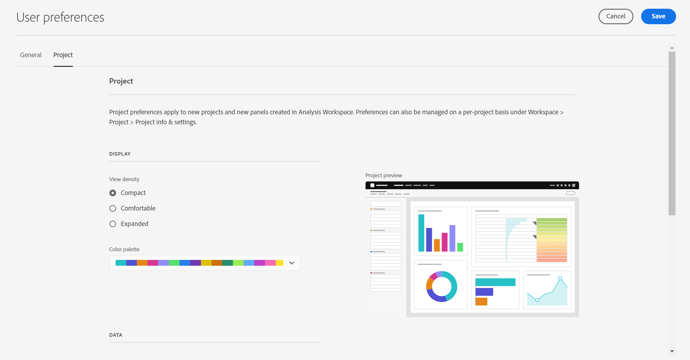
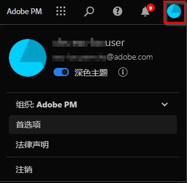

# 用户首选项

通过[!UICONTROL “组件”]>[!UICONTROL “用户首选项”]页面，可为用户管理 Analysis Workspace 设置及其相关的组件。“用户首选项”适用于&#x200B;*所有* 新的项目或面板。

## 常规首选项

常规首选项适用于您在浏览器中的 CJA 体验。

| 首选项 | 选项 |
| --- | --- |
| 登陆页面 | <ul><li>项目列表（默认）</li><li>空白项目</li><li>特定项目</li></ul> |
| 提示 | <ul><li>已启用（默认）</li><li>已禁用</li></ul> |

## 项目首选项

项目首选项适用于在 Analysis Workspace 中创建的新项目和新面板。还可在“工作区”>“项目”>“项目信息和设置”下按项目管理首选项。

| 部分 | 首选项 | 选项 |
| --- | --- | --- |
| **显示** |  |  |
|  | [视图密度](https://experienceleague.adobe.com/docs/analytics-platform/using/cja-workspace/build-workspace-project/view-density.html?lang=zh-Hans) | <ul><li>紧凑</li><li>舒适</li><li>展开（默认）</li></ul> |
|  | [调色板](https://experienceleague.adobe.com/docs/analytics-platform/using/cja-workspace/build-workspace-project/color-palettes.html?lang=zh-Hans) | <ul><li>Adobe 提供的调色板（默认）</li><li>自定义调色板</li></ul> |
| **数据** |  |  |
|  | [日历](https://experienceleague.adobe.com/docs/analytics-platform/using/cja-workspace/panels/panels.html?lang=zh-Hans?#calendar) | 现成日期范围的列表，包括&#x200B;**[!UICONTROL “本月”]**（默认） |
|  | [面板类型](https://experienceleague.adobe.com/docs/analytics-platform/using/cja-workspace/panels/panels.html?lang=zh-Hans) | <ul><li>自由格式（默认）</li><li>空白</li><li>快速见解</li></ul> |
|  | 数字格式 | <ul><li>1,000.00（默认）</li><li>1.000,00</li><li>1 000,00</li></ul> |
|  | CSV 分隔符 | <ul><li>逗号（默认）</li><li>分号</li><li>冒号</li><li>竖线</li><li>句点</li><li>空格</li><li>制表符</li></ul> |

## [!UICONTROL 深色主题]

如果您更希望为 Customer Journey Analytics 用户界面使用深色背景，可以切换到[!UICONTROL 深色主题]。

1. 单击右上角的 Experience Cloud 用户图标。

   

1. 将&#x200B;**[!UICONTROL 深色主题]**&#x200B;开关移动到右侧。

