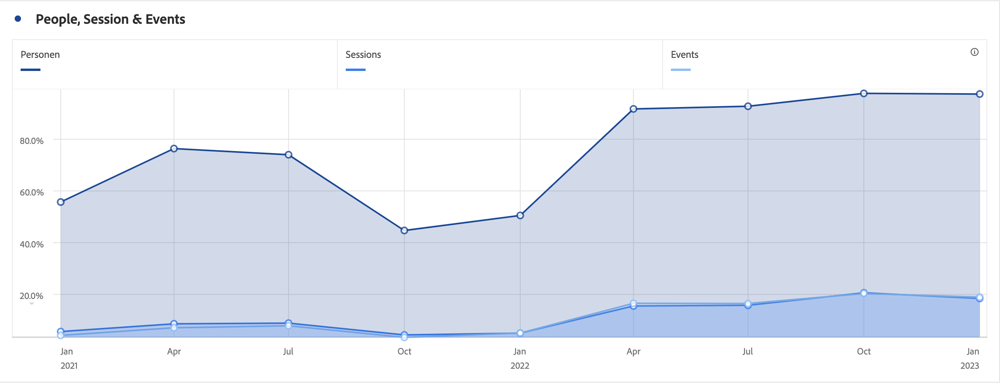

# 面积（堆叠）

>[!BEGINSHADEBOX]

_本文在_  _**Customer Journey Analytics**&#x200B;中记录了面积图和栈叠面积图可视化图表。_ _对于本文的_  _**Adobe Analytics**&#x200B;版本，请参阅[面积图和栈叠面积图](https://experienceleague.adobe.com/zh-hans/docs/analytics/analyze/analysis-workspace/visualizations/area)。_

>[!ENDSHADEBOX]

面积图可视化图表具有标准和堆叠选项。

## 面积图 {#area}

<!-- markdownlint-disable MD034 -->

>[!CONTEXTUALHELP]
>id="workspace_area_button"
>title="面积图"
>abstract="创建面积图可视化图表来表示多个量度的交集。"

<!-- markdownlint-enable MD034 -->

 **[!UICONTROL 面积图]**&#x200B;可视化图表与线形图类似，只是线条下方显示了彩色区域。 当您有多个量度并且希望显示两个或更多量度交叉的区域时，可添加面积图。

## 堆叠的面积图 {#area-stacked}

<!-- markdownlint-disable MD034 -->

>[!CONTEXTUALHELP]
>id="workspace_areastacked_button"
>title="堆叠的面积图"
>abstract="创建面积图可视化图表来表示多个量度的堆叠。"

<!-- markdownlint-enable MD034 -->

 **[!UICONTROL 堆叠的面积图]**&#x200B;可视化图表就像面积图，但每个系列都从前一个系列的顶部开始。

使用**[!UICONTROL 设置]**&#x200B;中的 **[!UICONTROL 100% 堆叠]**&#x200B;选项可将图表转化为 100% 堆叠的可视化图表。

>[!BEGINSHADEBOX]

观看演示视频的[区域可视化图表](https://experienceleague.adobe.com/en/docs/customer-journey-analytics-learn/tutorials/analysis-workspace/visualizations/add-area-visualizations){target="_blank"}。

>[!ENDSHADEBOX]

>[!MORELIKETHIS]
>
>[将可视化图表添加到面板](/help/analysis-workspace/visualizations/freeform-analysis-visualizations.md#add-visualizations-to-a-panel)
>[可视化图表设置](/help/analysis-workspace/visualizations/freeform-analysis-visualizations.md#settings)
>[可视化图表上下文菜单](/help/analysis-workspace/visualizations/freeform-analysis-visualizations.md#context-menu)
>
