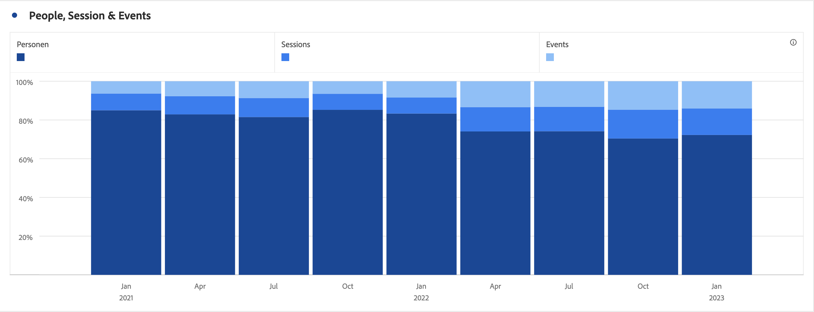

# 条形图（堆叠）

>[!BEGINSHADEBOX]

_本文记录了_  _**Customer Journey Analytics** 中的条形图和条形图堆叠可视化图表。_ _有关本文的_  _**Adobe Analytics** 版本，请参阅[条形图和条形图堆叠](https://experienceleague.adobe.com/zh-hans/docs/analytics/analyze/analysis-workspace/visualizations/bar)。_

>[!ENDSHADEBOX]

条形图可视化图表具有标准和堆叠选项。

## 条形图 {#bar}

<!-- markdownlint-disable MD034 -->

>[!CONTEXTUALHELP]
>id="workspace_bar_button"
>title="条形图"
>abstract="创建可视化条形图来表示一个或多个量度的各种值。"

<!-- markdownlint-enable MD034 -->

 **[!UICONTROL 条形图]**&#x200B;可视化图表显示一些垂直条形图，这些垂直条形图表示一个或多个量度中的各种值。

通过可视化图表设置中的粒度下拉列表，可以将趋势可视化视图（例如线形图、条形图）从每日更改为每周、每月等。

## 条形图堆叠 {#bar-stacked}

<!-- markdownlint-disable MD034 -->

>[!CONTEXTUALHELP]
>id="workspace_barstacked_button"
>title="条形图堆叠"
>abstract="创建条形图可视化来表示一个或多个堆叠量度中的多个值。"

<!-- markdownlint-enable MD034 -->

 **[!UICONTROL 条形图堆叠]**&#x200B;可视化图表与条形图类似，只是系列条相互堆叠在顶部。

使用**[!UICONTROL 设置]**&#x200B;中的 **[!UICONTROL 100% 堆叠]**&#x200B;选项可将图表转化为 100% 堆叠的可视化图表。

>[!MORELIKETHIS]
>
>[在面板中添加可视化效果](/help/analysis-workspace/visualizations/freeform-analysis-visualizations.md#add-visualizations-to-a-panel)
>[可视化设置](/help/analysis-workspace/visualizations/freeform-analysis-visualizations.md#settings)
>[可视化上下文菜单](/help/analysis-workspace/visualizations/freeform-analysis-visualizations.md#context-menu)
>

