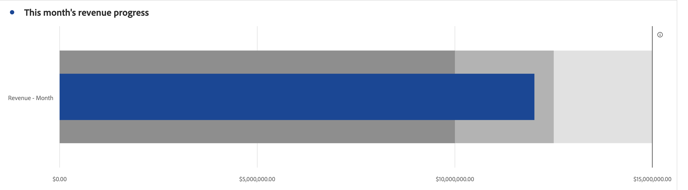

# 项目符号 {#bullet}

<!-- markdownlint-disable MD034 -->

>[!CONTEXTUALHELP]
>id="workspace_bullet_goalvalue"
>title="目标值"
>abstract="**[!UICONTROL 高目标]**&#x200B;是您的主要目标。 **[!UICONTROL 低目标]**&#x200B;和&#x200B;**[!UICONTROL 中目标]**&#x200B;创建的是低于[!UICONTROL 高目标]的范围。 注意：选中&#x200B;**[!UICONTROL 百分比]**&#x200B;选项时，请以整数形式输入目标。 例如：如果您的目标是百分之二十，则输入 `20`。"

<!-- markdownlint-enable MD034 -->

<!-- markdownlint-disable MD034 -->

>[!CONTEXTUALHELP]
>id="workspace_bullet_button"
>title="项目符号"
>abstract="创建项目符号图可视化图表来显示量度与性能范围（目标）之间的比较。"

<!-- markdownlint-enable MD034 -->

>[!BEGINSHADEBOX]

_本文记录了_  _**Customer Journey Analytics**&#x200B;中的“项目符号”可视化图表。_ _对于本文的_  _**Adobe Analytics**&#x200B;版本，请参阅[项目符号](https://experienceleague.adobe.com/zh-hans/docs/analytics/analyze/analysis-workspace/visualizations/bullet-graph)。_

>[!ENDSHADEBOX]

 **[!UICONTROL 项目符号]**&#x200B;可视化图表显示量度与性能范围（目标）进行比较或衡量的结果。

项目符号图表具有一个主要的测量方法（例如，当前年初至今的收入），允许您输入定性范围、绩效范围（例如，与目标收入相比）。 您可以指定高、中和低目标范围。 您可以在**[!UICONTROL 设置]**&#x200B;中指定目标范围。

>[!BEGINSHADEBOX]

请参阅  [项目符号图形可视化图表](https://experienceleague.adobe.com/en/docs/customer-journey-analytics-learn/tutorials/analysis-workspace/visualizations/add-bullet-graph-visualizations){target="_blank"}以观看演示视频。

>[!ENDSHADEBOX]

## 设置

您可以为[!UICONTROL 项目符号]可视化图表定义特定设置。

| 设置 | 描述 |
|---|---|
| **[!UICONTROL 项目符号选项]** | 在[!UICONTROL 项目符号]可视化图表中指定&#x200B;**[!UICONTROL 高目标]**、**[!UICONTROL 中目标]**&#x200B;和&#x200B;**[!UICONTROL 低目标]**&#x200B;的值。  **[!UICONTROL 高目标&#x200B;]**是您的主要目标。**[!UICONTROL &#x200B;低目标&#x200B;]**和**[!UICONTROL &#x200B;中目标&#x200B;]**创建的是低于高目标的范围。 注意：选中**[!UICONTROL &#x200B;百分比&#x200B;]**选项时，请以整数形式输入目标。 例如：如果您的目标是百分之二十，则输入 `20`。 |

>[!MORELIKETHIS]
>
>[将可视化图表添加到面板](/help/analysis-workspace/visualizations/freeform-analysis-visualizations.md#add-visualizations-to-a-panel)
>[可视化图表设置](/help/analysis-workspace/visualizations/freeform-analysis-visualizations.md#settings)
>[可视化图表上下文菜单](/help/analysis-workspace/visualizations/freeform-analysis-visualizations.md#context-menu)
>

