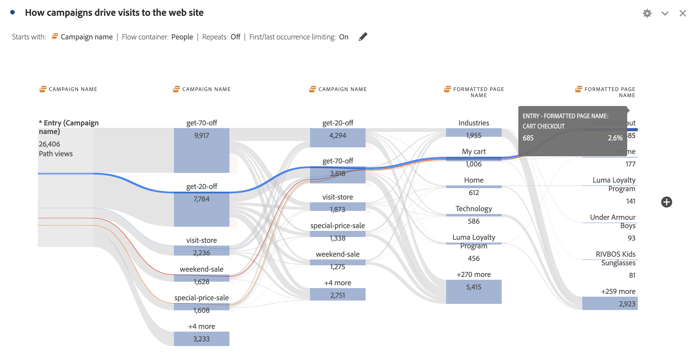

# 维度间流量

通过维度间流量可以跨不同维度查看用户路径。本文介绍了如何将此流用于两个用例：移动应用程序交互和事件，以及营销活动如何推动Web访问

<!--
A dimension label at the top of each Flow column makes using multiple dimensions in a flow visualization more intuitive:

-->

## 移动应用程序交互和事件

在此示例流中使用[!UICONTROL 屏幕名称]维度，以了解用户如何在应用程序中使用各种屏幕（场景）。 返回的上部屏幕为&#x200B;**[!UICONTROL luma： content： ios： en： home]**，这是应用程序的主页：

要浏览此应用中的屏幕与事件类型（如添加到购物车、购买及其他）之间的交互，请拖放&#x200B;**[!UICONTROL 事件类型]**&#x200B;维度：

* 在流中任何可用步骤的顶部，替换该维度：

  

* 在当前流量可视化图表之外，要添加维度：

  

下面的流量可视化显示了添加&#x200B;**[!UICONTROL 事件类型]**&#x200B;维度的结果。 该可视化图表提供了有关移动设备应用程序用户在向购物车添加产品、关闭应用程序、提供选件等操作之前如何在应用程序中的各个屏幕中进行移动的分析。

在列表顶部显示“页面”维度结果的

## 营销活动如何推动Web访问

您要分析哪些营销活动促使访问网站。 创建以&#x200B;**[!UICONTROL 促销活动名称]**&#x200B;为维度的流量可视化图表

您将最后的&#x200B;**[!UICONTROL 促销活动名称]**&#x200B;维度替换为&#x200B;**[!UICONTROL 格式化的页面名称]**&#x200B;维度，并在流量可视化图表的末尾添加另一个&#x200B;**[!UICONTROL 格式化的页面名称]**&#x200B;维度。

您可以将鼠标悬停在任何流上以查看更多详细信息。 例如，哪些营销活动导致了购物车结账。

