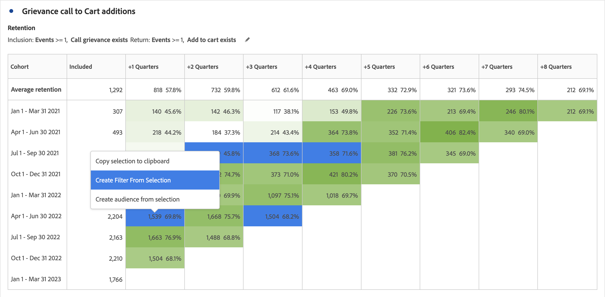

# 配置同类群组表

创建和配置[!UICONTROL 同类群组表]：

1. 添加 **[!UICONTROL 同类群组表]**&#x200B;可视化图表。 请参阅[将可视化图表添加到面板](../freeform-analysis-visualizations.md#add-visualizations-to-a-panel)。

1. 按照下表所示，定义&#x200B;**[!UICONTROL 包含标准]**、**[!UICONTROL 回访标准]**、**[!UICONTROL 同类群组类型]**&#x200B;和&#x200B;**[!UICONTROL 设置]**。

   

   | 元素 | 描述 |
   |--- |--- |
   | **[!UICONTROL 包含条件]** | 您最多可以应用 10 个包含过滤器和 3 个包含量度。该量度指定用户所属的同类群组。 例如，如果包含量度是“订单”，则只有在同类群组分析的时间范围内下达了订单的用户才会包含在初始同类群组中。 这些量度之间的默认运算符是 AND，但您可以将其更改为 OR。此外，您还可以为这些量度添加数字过滤。例如： `Sessions >= 1`.  |
   | **[!UICONTROL 返回条件]** | 您最多可以应用 10 个回访过滤器和 3 个回访量度。回访量度指示用户是已维系还是流失。例如，如果返回量度是“视频查看次数”，则只有在后续时间段（视频被添加到同类群组的时段之后）中查看过视频的用户才会被表示为已保留。 另一个量化保留的量度是会话。 |
   | **[!UICONTROL 粒度]** | 由“天”、“周”、“月”、“季度”或“年”组成的时间粒度。 |
   | **[!UICONTROL 类型]** | **[!UICONTROL 维系率]**（默认）： **[!UICONTROL 维系率]**&#x200B;同类群组衡量一段时间内同类群组回访您的资产的程度。 维系率同类群组是标准同类群组，它指示回访和重复的用户行为。 绿色表示表中的[!UICONTROL 保留率]同类群组。 **[!UICONTROL 流失率&#x200B;]**：**[!UICONTROL &#x200B;流失率&#x200B;]**（也称为流失率或流失率）同类群组衡量一段时间内同类人员如何从您的资产中流失。 流失率与保留率相反： `Churn = 1 - Retention`。 [!UICONTROL 流失率]会显示客户有多久没有回访，从而可以很好地衡量吸引力和商机。您可以使用流失率来分析和识别焦点区域：哪些同类群组过滤器可能会被吸引过来？ 红色表示表中的[!UICONTROL 流失率]同类群组（类似于**[!UICONTROL &#x200B;流量&#x200B;]**可视化图表中的流失）。  |
   | **[!UICONTROL 设置]** | **[!UICONTROL 滚动计算]**：根据前一列而不是“已包括”列（默认）计算维系率或流失率。 [!UICONTROL 滚动计算]会更改“回访”时段的计算方法。常规计算会查找符合回访标准且包含在包含时段的用户。 无论他们是否在上一时段的同类群组中。 相反，[!UICONTROL 滚动计算]会查找符合“回访”标准且包含在上一时段的用户。因此，[!UICONTROL 滚动计算]会过滤并筛分出一段时间内持续满足“回访”标准的用户。[!UICONTROL Return]标准将应用于选定时段之前的每个时段。   **[!UICONTROL 延时表&#x200B;]**： [!UICONTROL 延时表]测量包含事件发生之前和之后经过的时间。 [!UICONTROL 延时表]非常适用于进行事前/事后分析。 例如，您即将推出某个产品或某项促销活动，并且您想跟踪该产品或促销活动推出前后的行为。 [!UICONTROL 延迟表]并排显示前置和后置行为以查看直接影响。 [!UICONTROL 延迟表]中的预包含单元格计算在包含时段符合[!UICONTROL 包含]标准，然后在包含时段之前的时段符合[!UICONTROL 返回]标准的用户。 请注意，[!UICONTROL 延迟表]和[!UICONTROL 自定义维度同类群组]不能一起使用。  **[!UICONTROL 自定义维度同类群组]**：创建基于所选维度的同类群组，而不是基于时间的同类群组（默认）。 许多客户想要按时间以外的其他方式分析他们的同类群组，现在，通过新的自定义维度同类群组功能，可以灵活地根据他们所选的维度构建同类群组。使用营销渠道、促销活动、产品、页面、区域或任何其他维度，可显示维系率根据这些维度值的不同有何变化。 [!UICONTROL 自定义维度]同类群组过滤器定义仅将维度项用作包含时段的一部分，而不是回访定义的一部分。  选择[!UICONTROL 自定义维度同类群组]选项后，您可以将所需的任何维度拖放到拖放区域中。 添加维度允许您比较同一时间段内的类似维度项目。 例如，您可以并排比较各个城市的绩效、产品和促销活动等。 同类群组表返回您的前14个维度项目。 但是，您可以使用筛选器以仅显示所需的维度项。 [!UICONTROL 自定义维度同类群组]不能与[!UICONTROL 延迟表]功能一起使用。  |

1. 单击&#x200B;**[!UICONTROL 生成]**。
1. 要重新配置[!UICONTROL 同类群组表]，请选择。

1. （可选）根据选定的内容创建过滤器或受众。

   选择单元格（连续的或不连续的），然后右键单击鼠标并选择&#x200B;**[!UICONTROL 根据选定的内容创建过滤器]**。

   

1. 在[筛选器生成器](/help/components/filters/filter-builder.md)中，进一步编辑筛选器，然后单击&#x200B;**[!UICONTROL 保存]**。

   保存后的过滤器可用于 [!UICONTROL Analysis Workspace] 的[!UICONTROL 过滤器]面板中。

## 设置

您可以为[!UICONTROL 同类群组表]定义特定设置。

1. 选择以调整[!UICONTROL 同类群组表]设置。

   | 设置 | 描述 |
   |---|---|
   | **仅显示百分比** | 删除数值，仅显示百分比。 |
   | **将百分比四舍五入到最接近的整数** | 将百分比值舍入为最接近的整数，而不是显示十进制值。 |
   | **显示平均百分比行** | 在表顶部插入新行，然后添加每列中值的平均值。 |

>[!MORELIKETHIS]
>
>[将可视化图表添加到面板](/help/analysis-workspace/visualizations/freeform-analysis-visualizations.md#add-visualizations-to-a-panel)
>[可视化设置](/help/analysis-workspace/visualizations/freeform-analysis-visualizations.md#settings)
>[可视化上下文菜单](/help/analysis-workspace/visualizations/freeform-analysis-visualizations.md#context-menu)
>

