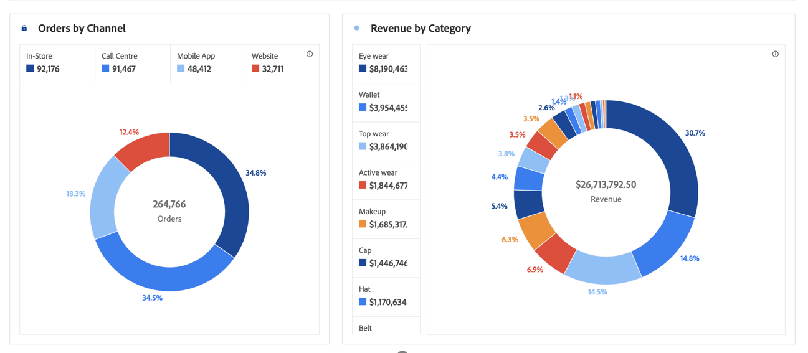

# 圆环图 {#donut}

<!-- markdownlint-disable MD034 -->

>[!CONTEXTUALHELP]
>id="workspace_donut_button"
>title="圆环图"
>abstract="创建一个圆环图可视化图表，以比较总数的百分比（通常具有少量项目）。"

<!-- markdownlint-enable MD034 -->

>[!BEGINSHADEBOX]

_本文记录了_  _**Customer Journey Analytics**&#x200B;中的圆环图可视化图表。_ _对于本文的_  _**Adobe Analytics**&#x200B;版本，请参阅[圆环图](https://experienceleague.adobe.com/zh-hans/docs/analytics/analyze/analysis-workspace/visualizations/donut)。_

>[!ENDSHADEBOX]

 **[!UICONTROL 环形图]**&#x200B;可视化图表与饼图类似，将数据显示为整体的一部分或区段。 在比较总数的百分比时，通常是在项目较少的情况下，使用环形图可视化图表。

>[!BEGINSHADEBOX]

请参阅  [添加环形图可视化图表](https://experienceleague.adobe.com/en/docs/customer-journey-analytics-learn/tutorials/analysis-workspace/visualizations/add-donut-visualizations){target="_blank"}以观看演示视频。

{{videoaa}}

>[!ENDSHADEBOX]

>[!MORELIKETHIS]
>
>[将可视化图表添加到面板](/help/analysis-workspace/visualizations/freeform-analysis-visualizations.md#add-visualizations-to-a-panel)
>[可视化图表设置](/help/analysis-workspace/visualizations/freeform-analysis-visualizations.md#settings)
>[可视化图表上下文菜单](/help/analysis-workspace/visualizations/freeform-analysis-visualizations.md#context-menu)
>

