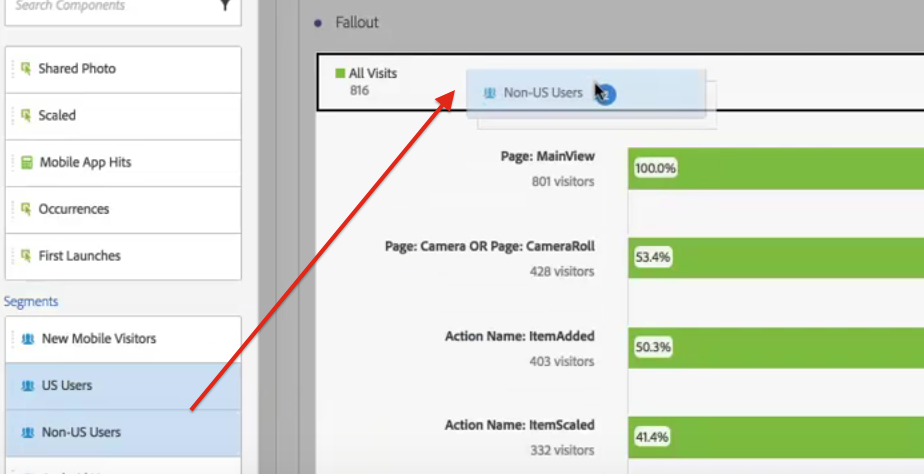

# 在流失分析中应用过滤器

>[!NOTE]
>
>您正在查看Customer Journey Analytics中的Analysis Workspace文档。 其功能集与传统Adobe [Analytics的Analysis Workspace略有不同](https://docs.adobe.com/content/help/zh-Hans/analytics/analyze/analysis-workspace/home.html)。 [了解更多...](/help/getting-started/cja-aa.md)

您可以从接触点创建过滤器，将区段添加为接触点，并比较Analysis Workspace中各过滤器的关键工作流。

>[!IMPORTANT]
>
>在流失中用作检查点的过滤器必须使用级别低于流失可视化整体上下文的容器。 使用访客情境流失，用作检查点的过滤器必须访问或基于点击的过滤器。 使用访问上下文流失，用作检查点的过滤器必须基于点击的区段。 如果您使用的组合无效，则流失率将为 100%。我们为流失可视化添加了警告，当您将不兼容的过滤器添加为接触点时，将显示该警告。 某些无效的筛选器容器组合将导致无效的流失图，如：

* 将基于访客的过滤器用作访客上下文流失可视化中的接触点
* 使用基于访客的过滤器作为访问上下文流失可视化中的触点
* 使用基于访问的过滤器作为访问上下文流失可视化中的接触点

## Create a filter from a touchpoint {#section_915E8FBF35CD4F34828F860C1CCC2272}

1. 从您特别感兴趣的特定接触点创建过滤器，该过滤器可能对应用于其他报表非常有用。 You do this by right-clicking the touchpoint and selecting **[!UICONTROL Create filter from touchpoint]**.

   

   此时会打开Filter Builder，其中预先填充了与所选触点匹配的预置顺序筛选器：

   

1. 为筛选器提供标题和说明并保存它。

   您现在可以在任何您希望的项目中使用此过滤器。

## Add a filter as a touchpoint {#section_17611C1A07444BE891DC21EE8FC03EFC}

例如，如果您想了解美国用户的趋势和对流失的影响，只需将美国用户过滤到流失中即可：

或者，也可以通过将美国用户筛选器拖动到另一个检查点来创建AND触点。

## Compare filters in fallout {#section_E0B761A69B1545908B52E05379277B56}

您可以在流失可视化中比较不限数量的过滤器。

1. Select the segments you want to compare from the [!UICONTROL Filter] rail on the left. 在我们的示例中，我们已选择了 2 个区段：美国用户和非美国用户。
1. 将它们拖入顶部的“筛选器”拖放区。

   

1. 可选：您可以保留“所有访问”作为默认容器，或者删除它。

   

1. 您现在可以比较两个过滤器的流失情况，如一个过滤器的性能优于另一个过滤器的情况，或者其他洞察。
