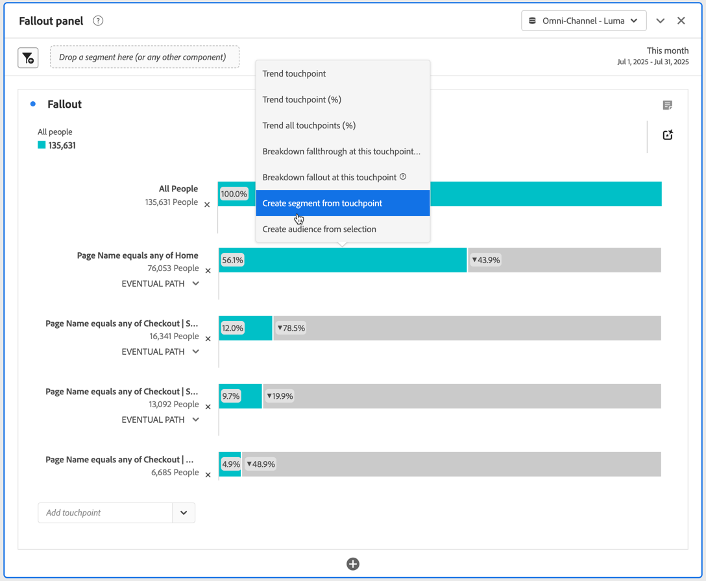

# 在流失分析中应用区段

您可以在 Analysis Workspace 中从接触点创建区段、添加区段作为接触点，并比较多个区段之间的关键工作流程。

>[!IMPORTANT]
>
>用作流失中检查点的区段必须使用级别低于流失可视化图表整体上下文的容器。对于人员上下文流失，用作检查点的区段必须是基于会话的或基于事件的区段。 对于会话上下文流失，用作检查点的区段必须是基于事件的区段。 如果使用无效的组合，则流失率为100%。 将不兼容的区段添加为接触点时，流失可视化图表中会显示警告。 某些无效的区段容器组合会导致无效的流失图表，例如：
>
>* 在人员上下文流失可视化图表中使用基于人员的区段作为接触点。
>* 在会话上下文流失可视化图表中使用基于人员的区段作为接触点。
>* 在会话上下文流失可视化图表中使用基于会话的区段作为接触点。

<!-- Should we add B2B context here?
* [!BADGE B2B Edition]{type=Informative url="https://experienceleague.adobe.com/en/docs/analytics-platform/using/cja-overview/cja-b2b/cja-b2b-edition" newtab=true tooltip="Customer Journey Analytics B2B Edition"} Usimg a B2B container based segment as a touchpoint inside a non-container based context Fallout visualization.
* -->

## 从接触点创建区段

1. 从特定的接触点创建一个您特别感兴趣，并且可以应用至其他报表的区段。右键单击接触点并选择&#x200B;**[!UICONTROL 从接触点创建区段]**。

   

   [!UICONTROL 区段生成器]打开，预先填充了与所选接触点匹配的预建顺序区段：

   

1. 为该区段提供一个标题和描述，然后保存它。

   您现在可以在所需的任何项目中使用此区段。

## 添加区段作为接触点

例如，如果您要查看您的美国用户趋势及其是如何影响流失的，只需将美国用户区段拖到流失中：

或者，您也可以将美国用户区段拖到另一检查点中，以此来创建一个 AND 接触点。

## 在流失中比较区段

您可以在“流失”可视化图表中比较任意区段数量。

1. 从左侧的[!UICONTROL 区段]面板中选择要比较的区段。 在此示例中，选择了三个区段：*外部测试版详细信息：页面版本A*、*外部测试版详细信息：页面版本B*&#x200B;和&#x200B;*外部测试版详细信息：页面版本C*。
1. 将三个区段拖到可视化图表顶部的区段拖放区域。

1. 可选：您可以保留&#x200B;*所有人员*&#x200B;作为默认容器，或者删除该容器。

   

1. 您现在可以比较三个区段之间的流失，例如一个区段在哪些方面表现优于另一个区段，或者其他分析。
