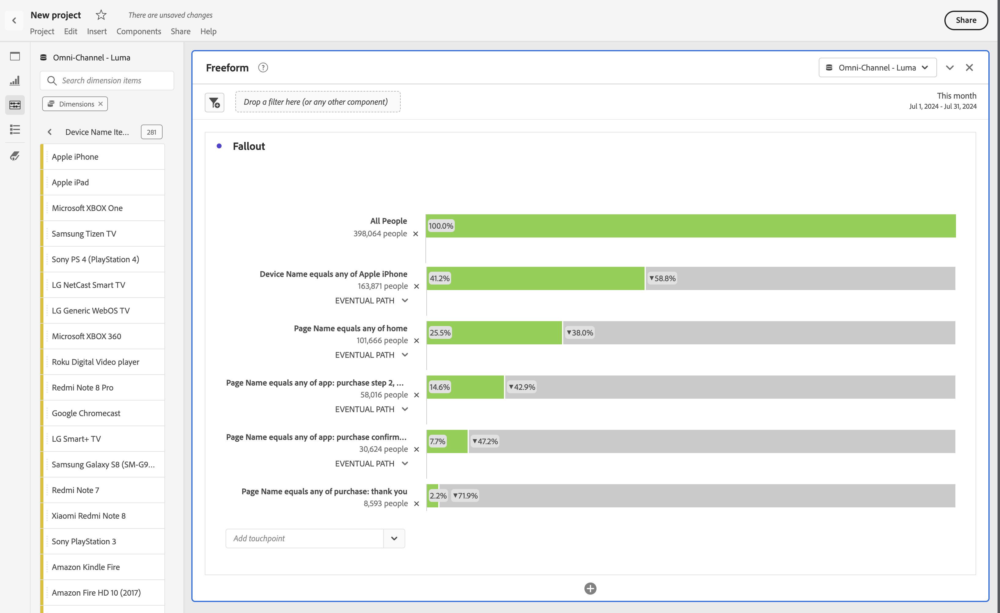
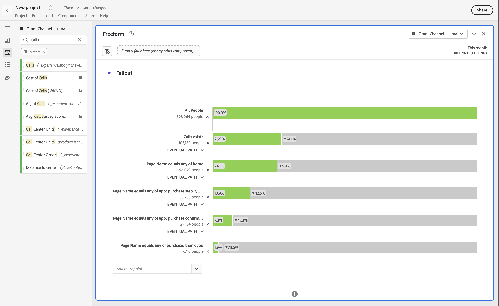
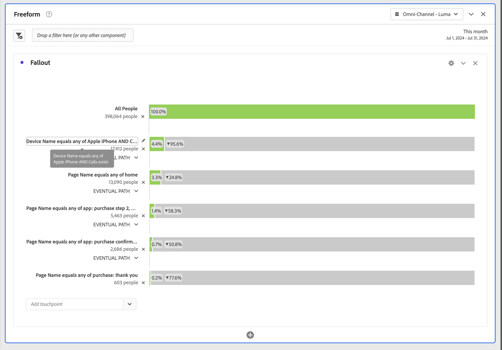

# 维度间流失

Analysis Workspace中的流失让您可以将维度和量度作为漏斗和工作流中的接触点来进行混合和匹配。 在定义要调查的用户步骤时，流失会为您提供更大的灵活性。

例如，除了页面维度之外，您还可以将其他维度项目（如设备名称维度中的特定设备名称）添加到流失可视化图表。 通过组合维度，您可以可视化页面和某些操作在客户路径中的交互方式。

流失会动态更新，并允许您查看多个维度中的流失。

您还可以添加量度。 例如，您可以添加量度“呼叫”以仅显示存在呼叫且已联系呼叫中心的用户的路径：

您可以组合维度和量度。 将另一个维度或量度拖动到现有维度或量度之上。 例如，了解拥有iPhone并联系呼叫中心的人的流失。

