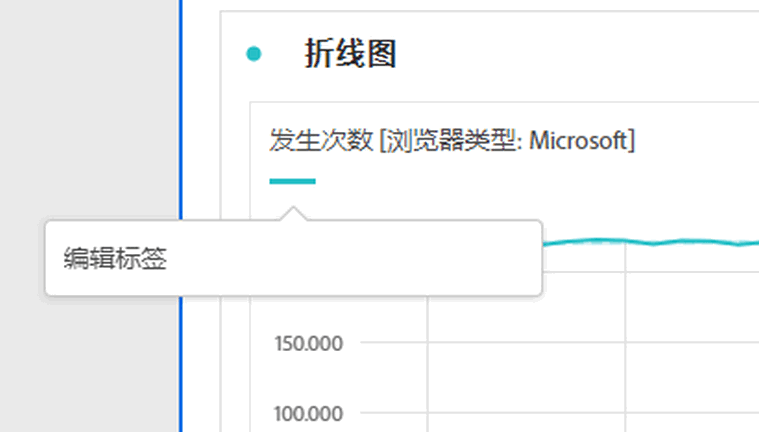
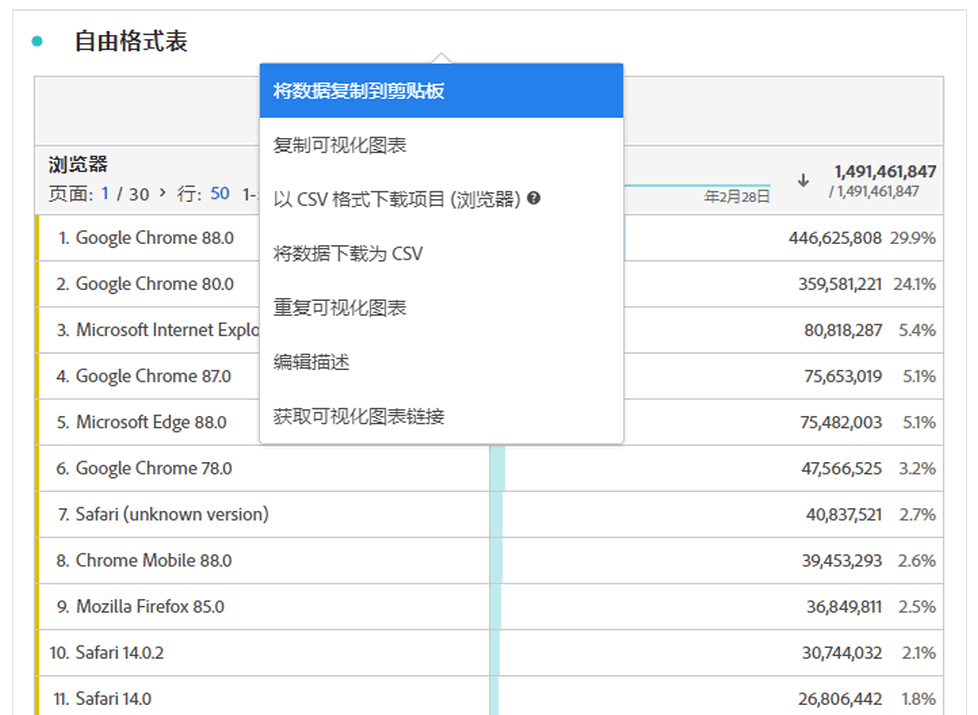
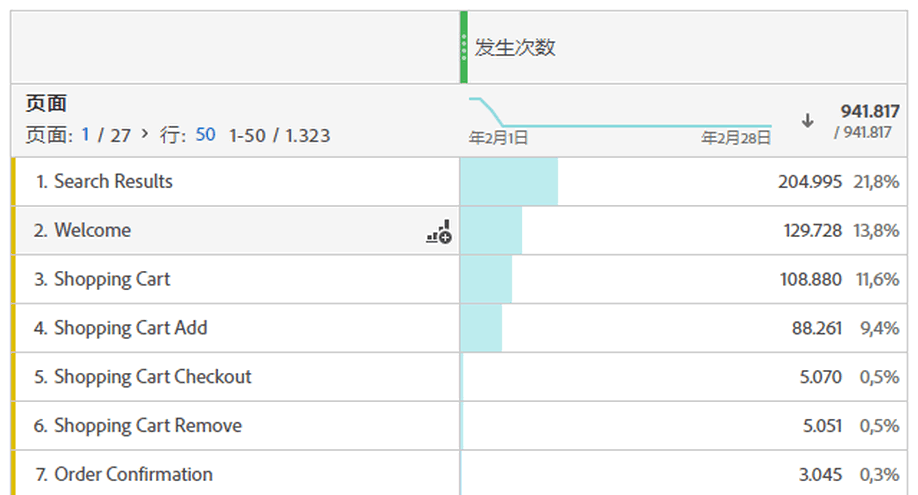

# 可视化图表概述

Workspace提供了许多可视化图表，可让您生成数据的可视化表示形式。 例如条形图、环形图、直方图、折线图、地图、散点图等。

## 类型

Analysis Workspace 中提供了以下可视化图表类型：

| 图标 | 名称 | 描述 |
| :---: | --- | ---| 
|  | [面积图](/help/analysis-workspace/visualizations/area.md) | 面积图可视化。 与线形图相似，但线条下有彩色区域。当您有多个指标并且希望显示两个或更多指标相交的区域时，可使用面积图。 |
|  | [条形图](/help/analysis-workspace/visualizations/bar.md) | 条形图可视化图表，其中垂直条形表示一个或多个量度中的各种值。 |
|  | [栈叠的条形图](/help/analysis-workspace/visualizations/bar.md) | 栈叠条形图可视化图表，其中垂直条形表示一个或多个量度中的各种值。 |
| 
 | [项目符号](/help/analysis-workspace/visualizations/bullet-graph.md) | 项目符号可视化图表，用于显示您感兴趣的值与其他性能范围（目标）进行比较或衡量的结果。 |
|  | [同类群组表](/help/analysis-workspace/visualizations/cohort-table/cohort-analysis.md) | 同类群组可视化是指一组在特定期限内共享相同特性的人员。 同类群组表对于保留、流失或延迟分析非常有用。 |
|  | [组合](combo-charts.md) | 通过组合图表，可快速构建比较可视化图表，而无需先构建表格。 |
|  | [圆环图](/help/analysis-workspace/visualizations/donut.md) | 圆环图可视化图表与饼图类似，它将数据显示为整体的一部分或过滤器。 |
|  | [流失](/help/analysis-workspace/visualizations/fallout/fallout-flow.md) | 流失可视化图表显示人员从何处离开（流失）或继续通过（流过）预定义的页面序列。 |
|  | [流](/help/analysis-workspace/visualizations/c-flow/flow.md) | 流量可视化图表可显示客户浏览您的网站和应用程序的确切路径。 |
| 
 | [自由格式表](/help/analysis-workspace/visualizations/freeform-table/freeform-table.md) | 自由格式表可视化图表是一种交互式可视化图表。 自由格式表可视化图表是Workspace中进行数据分析的基础。 |
|  | [直方图](/help/analysis-workspace/visualizations/histogram.md) | 直方图可视化图表根据量度数量，将人员、访问次数或事件划分到存储桶中。 |
|  | [水平条](/help/analysis-workspace/visualizations/horizontal-bar.md) | 水平条形图可视化显示一些水平条，这些水平条表示一个或多个量度中的各种值。 |
|  | [栈叠的水平条形图](/help/analysis-workspace/visualizations/horizontal-bar.md) | 栈叠的水平条形图可视化显示一些水平条，这些水平条表示一个或多个量度中的各种值。 |
|  | [历程画布](/help/analysis-workspace/visualizations/journey-canvas/journey-canvas.md) | 历程画布可视化图表可帮助您分析和了解您向用户和客户提供的历程。 |
|  | [关键量度摘要](/help/analysis-workspace/visualizations/key-metric.md) | 关键量度摘要可视化图表将线条、摘要更改和摘要编号可视化图表组合在一起。 |
|  | [Line](/help/analysis-workspace/visualizations/line.md) | 折线图可视化图表使用线条来表示量度，以显示一段时间内值的变化情况。 将时间作为 x 轴的线形图。 |
|  | [散点图](/help/analysis-workspace/visualizations/scatterplot.md) | 散点图可视化图表显示维度项目与最多三个量度之间的关系。 |
|  | [节标题](section-header.md) | 标识和连接面板中的截面。 |
|  | [概要变化](/help/analysis-workspace/visualizations/summary-number-change.md) | 概要变化可视化图表将选定单元格之间的变化显示为较大的数字或百分比。 |
| 
 | [摘要数字](/help/analysis-workspace/visualizations/summary-number-change.md) | 概要数字可视化图表将选定的单元格显示为一个大数字。 |
|  | [文本](/help/analysis-workspace/visualizations/text.md) | 文本可视化图表允许您将用户定义的文本添加到Workspace。 在利用面板/可视化图表描述之外，对于向您的分析和见解添加额外的上下文非常有用 |
|  | [树形图](/help/analysis-workspace/visualizations/treemap.md)
 | 树形图可视化图表将分层（树结构）数据显示为一组嵌套的矩形。 |
|  | [维恩图](/help/analysis-workspace/visualizations/venn.md) | 维恩图可视化图表使用圆圈来描述最多3个过滤器之间的量度重叠。 |

<!-- Add beneath Horizontal bar in the table above: | [Journey canvas](/help/analysis-workspace/visualizations/journey-canvas/journey-canvas.md) | Similar to Fallout, Journey canvas shows where persons left (fell out) and continued through (fell through) a predefined sequence of pages. 
Unlike Fallout, Journey canvas supports not only linear journeys, but any number of entry points and paths. Furthermore, journeys can be created in Adobe Journey Optimizer and then analyzed in Journey canvas.
 | -->

## 向面板添加可视化图表

1. 打开要添加可视化图表的Workspace项目。

1. 使用以下任意方法来添加可视化图表：

   

   * 在左侧面板中，选择 **可视化图表**，然后将可视化图表拖动到要将可视化图表添加到的面板。

   * 在要添加可视化图表的面板上，选择，然后选择表示要添加的可视化图表的图标。 将鼠标悬停在每个可视化图表的图标上可查看名称。

   * 添加[空白面板](/help/analysis-workspace/c-panels/blank-panel.md)，然后选择要添加的可视化图表。

   * 从Analysis Workspace项目中现有可视化图表的上下文菜单中，选择&#x200B;**[!UICONTROL 复制可视化图表]**&#x200B;或&#x200B;**[!UICONTROL 复制可视化图表]**。

   * 使用Workspace **[!UICONTROL 插入]**&#x200B;菜单插入可视化图表。

   * 从自由格式表的上下文菜单中，选择&#x200B;**[!UICONTROL 可视化]**。 然后从子菜单中选择可视化。 Workspace会根据表中的当前选择，确定要提供的可视化图表，并对数据进行解释以构建请求的可视化图表。

## 图例

可视化图表图例可帮助您将源表中的日期与可视化图表中绘制的系列关联起来。图例是交互式的 — 您可以选择图例项来显示/隐藏可视化图表中的系列，这在要简化所显示的数据时很有用。

此外，可以重命名图例标签，这样有助于更好地使用视觉效果。注意：图例编辑&#x200B;**不会**&#x200B;应用到：树形图、项目符号、概要变化/概要数字、文本、自由格式表、直方图、同类群组或流可视化图表。

要编辑图例标签，请执行以下操作：

1. 右键单击某个图例标签。
1. 单击&#x200B;**[!UICONTROL 编辑标签]**。

   

1. 输入新的标签文本。
1. 按 **[!UICONTROL Enter]** 键保存。

## 设置

每个可视化图表都有自己的设置。 要访问可视化图表设置，请在可视化图表标题中选择 **[!UICONTROL 设置]**&#x200B;以显示弹出窗口。

根据可视化图表，您可以配置

* 通过[**[!UICONTROL 数据源]**](#data-source)选项卡显示的可视化数据源的详细信息，并且
* 通过[**[!UICONTROL 设置]**](#settings-1)选项卡的可视化设置。

### 数据源

您可以控制数据源中的哪些数据源以及项或位置对应于可视化图表。 有关详细信息，请参阅[管理数据源](t-sync-visualization.md)。

### 设置

可视化决定了哪些可视化设置可用。 下表总结了最常见的设置。 某些可视化图表具有特定的设置。 有关更多详细信息，请参阅单个可视化图表文档。

| 选项 | 描述 |
| --- | --- |
| **[!UICONTROL 可视化类型]** | 更改用于可视化数据的可视化图表类型。 |
| **[!UICONTROL 粒度]** | 更改趋势可视化图表的时间粒度。 此更改也适用于数据源表。 |
| **[!UICONTROL 百分比]** | 以百分比显示值。 |
| **[!UICONTROL 100%栈叠]** | 将图表转换为100%栈叠的可视化图表。  仅适用于面积图、条形图和栈叠的水平条形图可视化图表。 |
| **[!UICONTROL 图例可见]** | 显示图例文本。 |
| **[!UICONTROL 限制最大项目数]** | 限制可视化图表显示的项目数。 选中后，定义最大项数。 |
| **[!UICONTROL 显示注释]** | 显示为此可视化图表所做的批注。 |
| **[!UICONTROL 隐藏标题]** | 隐藏可视化图表的标题。 |
| **[!UICONTROL 将 Y 轴固定在 0]** | 强制y轴底部为零。 如果图表上绘制的所有值都显着高于零，则图表默认值会使y轴底部非零。 如果启用此选项，Y轴将被强制为零（并且图表将被重绘）。 |
| **[!UICONTROL 显示双轴]** | 显示两个不同量度的左右两侧Y轴。 此选项仅适用于具有两个量度的情况。 当绘制的量度数量级不同时，双轴很有用。 |
| **[!UICONTROL 显示 X 轴]** | 在可视化图表中显示X轴。 |
| **[!UICONTROL 显示 Y 轴]** | 在可视化图表中显示Y轴。 |
| **[!UICONTROL 在线上显示杠铃]** | 在组合图表可视化图表的折线图可视化图表上显示杠铃。 |
| **[!UICONTROL 标准化]** | 强制实施等比例指标。 当绘制的指标处于不同程度时，同等比例会很有帮助。 |
| **[!UICONTROL 显示异常]** | 通过显示异常检测来增强线形图和自由格式表。 线形可视化图表中的异常检测包括预期值（虚线）和预期范围（阴影带）。 |
| **[!UICONTROL 显示预测]** | 通过显示预测值来增强线形图和自由格式表。 |
| **[!UICONTROL 显示最小值]** | 在可视化中显示最小值。 |
| **[!UICONTROL 显示最大值]** | 在可视化中显示最大值。 |
| **[!UICONTROL 显示趋势线]** | 在可视化图表中显示趋势线。 选中后，您可以从下拉菜单中选择趋势线类型。 |

您可以自定义创建的所有可视化图表的设置。 有关更多信息，请参阅[用户偏好设置](/help/analysis-workspace/user-preferences.md)。

## 上下文菜单 {#right-click}

在可视化图表的标题上使用上下文菜单（可通过替代选择使用，例如，使用鼠标时右键单击）来访问可视化图表的附加功能。 并非所有选项都可用于所有可视化图表。

| 选项 | 描述 |
| --- | --- |
| **[!UICONTROL 插入复制的可视化内容]** | 将复制的可视化图表粘贴（插入）到项目中的其他位置或完全不同的项目中。 |
| **[!UICONTROL 将数据复制到剪贴板]** | 将数据从可视化图表复制到剪贴板。 |
| **[!UICONTROL 将选定内容复制到剪贴板]** | 将可视化图表中的选定内容复制到剪贴板。 |
| **[!UICONTROL 以CSV格式下载项目（*维度名称*）]** | 将可视化的维度项目（最多50,000个）下载到您的本地设备。 所选维度的最大维度项为50,000个。 |
| **[!UICONTROL 复制可视化图表]** | 复制可视化图表，以便您可以将该可视化图表插入到项目中的其他位置或完全不同的项目中。 |
| **[!UICONTROL 下载数据CSV]** | 将可视化图表显示的数据下载到您的本地设备。 |
| **[!UICONTROL 导出完整表]** | 将整个表导出到指定的云位置。 请参阅[将Customer Journey Analytics报告导出到云](../export/export-cloud.md) |
| **[!UICONTROL 重复的可视化图表]** | 生成一个与可视化图表完全相同的副本。 |
| **[!UICONTROL 编辑描述]** | 添加（或编辑）可视化图表的文本描述。 查看[文本](text.md)。 |
| **[!UICONTROL 获取可视化图表链接]** | 直接复制并共享可视化图表的链接。 共享链接对话框会显示该链接。 选择复制以将链接复制到剪贴板。 |
| **[!UICONTROL 从头开始]** | 删除当前可视化图表的配置，以便您可以从头开始重新配置。 |

## 配置

某些可视化图表（例如同类群组表、流失、流量等）具有配置对话框以帮助您构建可视化图表。 使用可视化图表顶部的来访问和更改配置。

## 可视化

如果不确定应选取哪个可视化图表，请在任意自由格式表行中选择 **[!UICONTROL 可视化]**（悬停时可用）。 此选择是添加可视化图表最快的方法。 Analysis Workspace会针对哪种可视化图表最适合您的数据做出有根据的猜测。 例如，如果您选择了一行，它将创建趋势[折线图](line.md)。 如果您选择了三个筛选器行，则会创建一个[维恩图](venn.md)。

