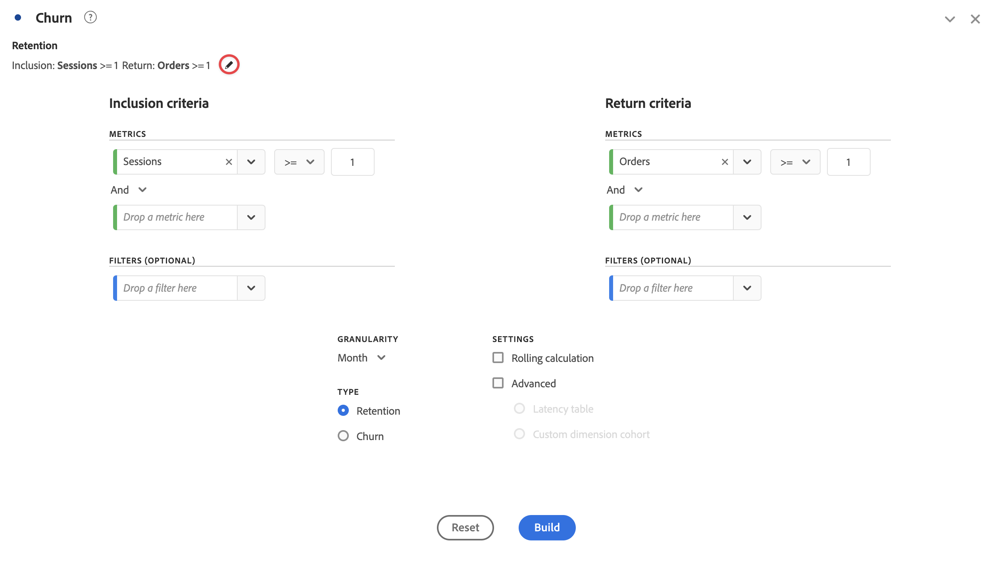

# 可视化内容概述

工作区提供了多种可视化工具，可帮助您生成数据的可视化表示。例如条形图、环形图、直方图、线形图、地图、散点图等。

## 类型

Analysis Workspace 中提供了以下可视化图表类型：

| 图标 | 名称 | 描述 |
| :---: | --- | ---| 
|  | [面积图](/help/analysis-workspace/visualizations/area.md) | 面积图可视化。与线形图相似，但线条下有彩色区域。当您有多个量度并且希望显示两个或更多量度相交的区域时，可以使用面积图。 |
|  | [条形图](/help/analysis-workspace/visualizations/bar.md) | 一种条形图可视化，其中垂直条表示一个或多个量度的不同值。 |
|  | [堆积条形图](/help/analysis-workspace/visualizations/bar.md) | 一种堆积条形图可视化，其中垂直条表示一个或多个量度的不同值。 |
| 
 | [项目符号](/help/analysis-workspace/visualizations/bullet-graph.md) | 子弹图可视化，显示您感兴趣的值与其他性能范围（目标）的比较或衡量情况。 |
|  | [同类群组表](/help/analysis-workspace/visualizations/cohort-table/cohort-analysis.md) | 同类群组可视化是指一组在特定期限内共享相同特性的人员。同类群组表对于保留、流失或延迟分析非常有用。 |
|  | [组合](combo-charts.md) | 组合图表使您无需先构建表格，即可快速构建比较可视化图表。 |
|  | [环形图](/help/analysis-workspace/visualizations/donut.md) | 与饼图类似，可视化圆环图将数据展示为整体的各个部分或区段。 |
|  | [流失](/help/analysis-workspace/visualizations/fallout/fallout-flow.md) | 流失可视化图表展示了用户在预定义的页面顺序中离开（流失）和继续浏览（流过）的情况。 |
|  | [流](/help/analysis-workspace/visualizations/c-flow/flow.md) | 流量可视化展示了客户通过您的网站和应用程序的具体路径。 |
| 
 | [自由格式表](/help/analysis-workspace/visualizations/freeform-table/freeform-table.md) | 自由格式表可视化是一种互动式可视化工具。自由格式表可视化是工作区中数据分析的基础。 |
|  | [直方图](/help/analysis-workspace/visualizations/histogram.md) | 直方图可视化根据量度的量级将人员、访问或事件分入不同的桶中。 |
|  | [水平条](/help/analysis-workspace/visualizations/horizontal-bar.md) | 水平条可视化显示了一些水平条，这些水平条表示一个或多个量度中的各种值。 |
|  | [堆叠的水平条形图](/help/analysis-workspace/visualizations/horizontal-bar.md) | 堆叠水平条形图可视化展示了代表一个或多个量度不同值的水平条。 |
|  | [历程画布](/help/analysis-workspace/visualizations/journey-canvas/journey-canvas.md) | 历程画布可视化可帮助您分析，并深入了解您为用户和客户提供的历程。 |
|  | [关键量度摘要](/help/analysis-workspace/visualizations/key-metric.md) | 关键量度摘要可视化结合了线形图、摘要变化图和摘要数字可视化。 |
|  | [Line](/help/analysis-workspace/visualizations/line.md) | 线形图可视化图表使用线条来表示量度，以显示一段时间内值的变化情况。将时间作为 x 轴的线形图。 |
|  | [散点图](/help/analysis-workspace/visualizations/scatterplot.md) | 散点图可视化图表显示维度项与最多三个量度之间的关系。 |
|  | [部分标头](section-header.md) | 识别并阐述面板中的各个部分。 |
|  | [摘要变化](/help/analysis-workspace/visualizations/summary-number-change.md) | 摘要变化可视化将所选单元格之间的变化显示为一个大的数字或百分比。 |
| 
 | [摘要数字](/help/analysis-workspace/visualizations/summary-number-change.md) | 摘要数字可视化将选定的单元格显示为一个大的数字。 |
|  | [文本](/help/analysis-workspace/visualizations/text.md) | 文本可视化功能允许您将用户定义的文本添加到工作区。在利用面板/可视化图表描述之外，对于向您的分析和洞察添加额外的上下文非常有用 |
|  | [树状图](/help/analysis-workspace/visualizations/treemap.md)
 | 树状图可视化将层次化（树状结构）数据显示为一组嵌套的矩形。 |
|  | [维恩图](/help/analysis-workspace/visualizations/venn.md) | 可视化维恩图使用圆圈来描绘最多 3 个区段的量度重叠。 |

<!-- Add beneath Horizontal bar in the table above: | [Journey canvas](/help/analysis-workspace/visualizations/journey-canvas/journey-canvas.md) | Similar to Fallout, Journey canvas shows where persons left (fell out) and continued through (fell through) a predefined sequence of pages. 
Unlike Fallout, Journey canvas supports not only linear journeys, but any number of entry points and paths. Furthermore, journeys can be created in Adobe Journey Optimizer and then analyzed in Journey canvas.
 | -->

## 将可视化图表添加到面板

1. 打开您想要添加可视化图表的工作区项目。

1. 使用以下任一方法添加可视化图表：

   

   * 在左侧面板中，选择  **可视化图表**，然后将可视化图表拖至要添加可视化图表的面板中。

   * 在要添加可视化图表的面板上，选择 ，然后选择代表要添加的可视化图表的图标。将光标悬停在每个可视化图表的图标上，即可查看其名称。

   * 添加[空白面板](/help/analysis-workspace/c-panels/blank-panel.md)，然后选择要添加的可视化图表。

   * 从 Analysis Workspace 项目现有可视化图表的上下文菜单中，选择&#x200B;**[!UICONTROL 重复可视化图表]**&#x200B;或&#x200B;**[!UICONTROL 复制可视化图表]**。

   * 使用工作区&#x200B;**[!UICONTROL 插入]**&#x200B;菜单插入可视化图表。

   * 从自由格式表的上下文菜单中，选择&#x200B;**[!UICONTROL 可视化图表]**。然后，从子菜单中选择可视化图表。根据表中的当前选择，工作区会确定提供哪种可视化图表，并解释数据以生成所请求的可视化图表。

添加简单的可视化图表，例如[条形图](line.md)的[折线图](bar.md)可视化图表时，该可视化图表使用最接近的自由格式表作为数据源。 您始终可以修改可视化图表的[数据源](#data-source)。

## 管理可视化图表

当您将鼠标悬停在可视化图表上或选择可视化图表时，可以管理该可视化图表。

* 要折叠可视化图表，请选择。
* 要显示折叠的可视化图表，请选择。
* 要删除可视化图表，请选择。 要撤消操作，请选择&#x200B;**[!UICONTROL 编辑]** > **[!UICONTROL 撤消]** (**[!UICONTROL *cmd+z *]**|**[!UICONTROL * ctrl+z *]**)。
* 要将可视化返回到默认高度，请选择。
* 要在面板中移动可视化图表，请在可见时拖放该可视化图表（通常是将鼠标悬停在标题上）。

## 图例

可视化图表图例可帮助您将源表中的日期与可视化图表中绘制的系列关联起来。图例是交互式的 - 您可以选择图例项来显示/隐藏可视化图表中的一个系列，如果您想简化可视化图表的数据，这将很有帮助。

此外，可以重命名图例标签，这样有助于更好地使用视觉效果。注意：图例编辑&#x200B;**不会**&#x200B;应用到：树状图、项目符号、概要变化/概要数字、文本、自由格式表、直方图、同类群组或流可视化图表。

要编辑图例标签，请执行以下操作：

1. 右键单击其中一个图例标签。
1. 单击&#x200B;**[!UICONTROL 编辑标签]**。

   

1. 输入新的标签文本。
1. 按 **[!UICONTROL Enter]** 键保存。

## 设置

每个可视化图表都有其自己的设置。要访问可视化设置，请选择可视化标头中的  **[!UICONTROL 设置]**&#x200B;以显示弹出窗口。

根据可视化效果，您可以配置

* 可视化数据来源的详细信息（通过[**[!UICONTROL 数据源]**](#data-source)选项卡进行配置），以及
* 可视化设置（通过[**[!UICONTROL 设置]**](#settings-1)选项卡进行配置）。

### 数据源

您可以控制哪个数据源以及该数据源中的哪些项目或位置与可视化相对应。请参阅[管理数据源](t-sync-visualization.md)，以了解详细信息。

### 设置

可视化图表决定了哪些可视化图表设置可用。下表总结了最常见的设置。某些可视化图表确实有特定设置。有关更多详细信息，请参阅单个可视化图表文档。

| 选项 | 描述 |
| --- | --- |
| **[!UICONTROL 可视化类型]** | 更改用于显示数据的可视化图表类型。 |
| **[!UICONTROL 粒度]** | 更改趋势性可视化图表的时间粒度。此更改也适用于数据源表。 |
| **[!UICONTROL 百分比]** | 显示百分比值。 |
| **[!UICONTROL 100% 堆叠]** | 将图表转变为 100% 堆叠的可视化图表。仅适用于面积图、条形图和水平堆叠的条形图可视化图表。 |
| **[!UICONTROL 图例可见]** | 显示图例文字。 |
| **[!UICONTROL 限制最大项目数]** | 限制可视化图表显示的项目数。选择后，定义最大项目数。 |
| **[!UICONTROL 显示注释]** | 显示对此可视化图表所做的注释。 |
| **[!UICONTROL 隐藏标题]** | 隐藏可视化图表的标题。 |
| **[!UICONTROL 将 Y 轴固定在 0]** | 强制将 Y 轴底部设为零。如果图表上绘制的所有值都远远大于零，则图表默认会将 Y 轴底部设为非零值。如果启用此选项，则 Y 轴将被强制设为零（并重新绘制图表）。 |
| **[!UICONTROL 显示双轴]** | 显示两个不同量度的左 Y 轴和右 Y 轴。此选项仅适用于有两个量度的情况。在所绘制量度的数量级大小不同时，双轴非常有用。 |
| **[!UICONTROL 显示 X 轴]** | 在可视化图表中显示 X 轴。 |
| **[!UICONTROL 显示 Y 轴]** | 在可视化图表中显示 Y 轴。 |
| **[!UICONTROL 在线形图中显示条形铃]** | 在组合图可视化图表的线形图可视化图表中显示条形铃。 |
| **[!UICONTROL 标准化]** | 强制所有量度按等比例计算。在所绘制量度的数量级大小不同时，等比例非常有用。 |
| **[!UICONTROL 显示异常情况]** | 通过显示异常检测来增强线形图和自由格式表。线形可视化图表中的异常检测包括预期值（虚线）和预期范围（阴影带）。 |
| **[!UICONTROL 显示预测]** | 通过显示预测值来增强线形图和自由格式表。 |
| **[!UICONTROL 显示最小值]** | 在可视化图表中显示最小值。 |
| **[!UICONTROL 显示最大值]** | 在可视化图表中显示最大值。 |
| **[!UICONTROL 显示趋势线]** | 在可视化图表中显示趋势线。选中后，您可以从下拉菜单中选择趋势线类型。 |

您可以为您创建的所有可视化图表自定义设置。有关更多信息，请参阅[用户偏好设置](/help/analysis-workspace/user-preferences.md)。

## 上下文菜单 {#right-click}

使用可视化图表标题上的上下文菜单（可通过替代选择获得，例如，使用鼠标右键单击）来访问可视化图表的附加功能。并非所有选项都适用于任何可视化图表。

| 选项 | 描述 |
| --- | --- |
| **[!UICONTROL 插入复制的可视化内容]** | 将复制的可视化图表粘贴（插入）到项目中的其他位置或完全不同的项目中。 |
| **[!UICONTROL 将数据复制到剪贴板]** | [将可视化图表中的数据](/help/analysis-workspace/export/download-send.md#copy-to-clipboard)复制到剪贴板。 |
| **[!UICONTROL 将选择复制到剪贴板]** | [将可视化图表中的选定内容](/help/analysis-workspace/export/download-send.md#copy-to-clipboard)复制到剪贴板。 |
| **[!UICONTROL 将项目下载为 CSV（*维度名称*）]** | [将可视化图表的维度项](/help/analysis-workspace/export/download-send.md#download-items-as-csv)（最多50,000个）下载到您的本地设备。 所选维度最多可有 50,000 个维度项。 |
| **[!UICONTROL 复制可视化图表]** | 复制可视化图表，您可以将其插入到项目中的其他位置或完全不同的项目中。 |
| **[!UICONTROL 下载数据 CSV]** | [将可视化图表显示的数据](/help/analysis-workspace/export/download-send.md#download-as-csv)下载到您的本地设备。 |
| **[!UICONTROL 导出整个表]** | 将整个表导出到指定的云位置。请参阅[将 Customer Journey Analytics 报告导出至云](../export/export-cloud.md) |
| **[!UICONTROL 复制可视化]** | 生成一个与可视化图表完全相同的副本。 |
| **[!UICONTROL 编辑描述]** | 添加（或编辑）可视化图表的文本描述。请参阅[文本](text.md)。 |
| **[!UICONTROL 获取可视化图表链接]** | 将链接直接复制并共享到可视化图表。共享链接对话框会显示该链接。选择“复制”将链接复制到剪贴板。 |
| **[!UICONTROL 从头开始]** | 删除当前可视化图表的设置，以便您从头开始重新配置。 |

## 配置

某些可视化图表（例如同类群组表、流失、流量等）有配置对话框，可帮助您生成可视化图表。使用可视化图表顶部的来访问和更改配置。

## 可视化

如果您不确定选择哪种可视化图表，请在任意自由格式表行（将光标悬停于上方即可显示）中选择  **[!UICONTROL 可视化]**。这一选择是添加可视化图表最快的方法。Analysis Workspace 针对哪种可视化图表最适合您的数据做出有根据的推测。例如，如果您选择了一行，则会创建趋势[线形图](line.md)。如果您选择了三个区段行，就会创建[维恩](venn.md)图。

