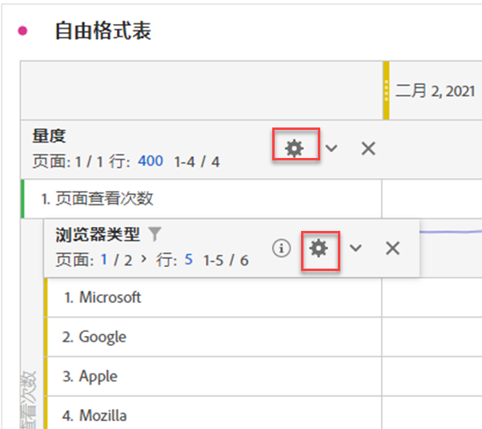

# 行设置

>[!NOTE]
>
>您正在查看有关 Customer Journey Analytics 中 Analysis Workspace 的文档。其功能集与[传统 Adobe Analytics 中的 Analysis Workspace](https://experienceleague.adobe.com/docs/analytics/analyze/analysis-workspace/home.html?lang=zh-Hans) 略有不同。[了解详情...](/help/getting-started/cja-aa.md)

行设置因您拖入到表格中的组件而异。要访问表行设置，请单击 [!UICONTROL 设置] 维度、过滤器、量度、时间段或每个维度中划分旁边的图标：

| 设置 | 描述 |
| --- | --- |
| 调整日期 | 这是一个表级设置，它会将每列的日期调整为全部从同一行开始。默认情况下，当在表行中使用时间维度且在列中应用不同的日期范围时，会启用日期调整。例如，在每日表中将“10 月”和“9 月”应用于列，则左列从 10 月 1 日开始，右列从 9 月 1 日开始。 |
| 按位置划分 | 默认情况下，此设置处于禁用状态，并且划分固定在静态行项目。例如，假设您按营销渠道划分排名前 3 的“页面”维度项目（主页、搜索结果、结账）。然后，您离开项目，两周后返回。再次打开项目时，排名前 3 的页面已更改，此时“主页”、“搜索结果”和“结账”页面成为排名第 4-6 的页面。默认情况下，营销渠道划分仍将显示在“主页”、“搜索结果”和“结账”下方，即使三者现在分别位于第 4-6 行中。  相比之下， **按位置划分** 始终对排名前3的项目进行划分，而不管它们是什么。 回顾我们的示例，当您重新打开项目时，营销渠道划分将会绑定到表中排名前 3 的页面，而不是“主页”、“搜索结果”和“结账”（三者现在分别位于第 4-6 行中）。 |
| 百分比 | **按列计算百分比**&#x200B;是默认设置；列中显示的百分比是根据列总数计算的。 **按行计算百分比**&#x200B;强制自由格式表计算整行中的单元格百分比，而不是沿列向下计算，该计算方式以总计作为分母。这对显示百分比趋势特别有用。默认情况下，使用“可视化图表”图标时会启用此设置。 |
| 列总计 | 这些设置仅可用于[静态行](/help/analysis-workspace/visualizations/freeform-table/column-row-settings/manual-vs-dynamic-rows.md)。  **显示为当前行的总和**&#x200B;将显示表中行的客户端总和，这意味着总计将&#x200B;*不* 去除重复量度，如访问次数或访客。  **显示总计**&#x200B;将显示服务器端总和，这意味着总计将去除重复量度。 |

## 更改行计数

要更改显示的行数，请执行以下操作：

1. 单击旁边的数字 [!UICONTROL 行] 在桌子顶部。

   

1. 从下拉列表中，选择希望表格显示的行数。