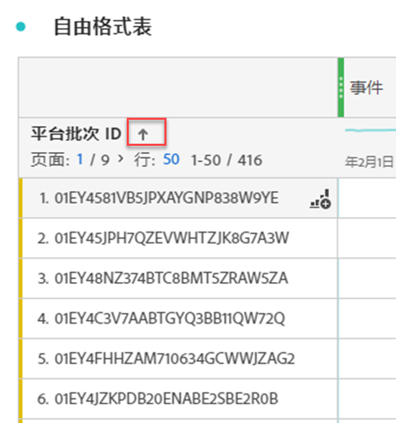

# 过滤和排序表

Analysis Workspace中的自由格式表是进行交互式数据分析的基础。 因此，它们可以包含数千行信息。 对数据进行过滤和排序，是有效显示最重要信息的关键部分。

<!--The following video covers filter and sort options in Analysis Workspace, in addition to pagination options:

>[!VIDEO](https://video.tv.adobe.com/v/23968)-->

## 过滤表 {#section_36E92E31442B4EBCB052073590C1F025}

Analysis Workspace中的过滤器可帮助您显示最重要的信息。

要在自由格式表中过滤数据，请执行以下操作：

1. 在自由格式表中，将鼠标悬停在包含要过滤数据的列上。 <!--only some types of columns show the filter... Which? Just Dimensions?-->

1. 选择 **过滤器** 图标。

   

1. 在 [!UICONTROL **搜索词或短语**] 字段中，指定要过滤的字词或短语。 只显示包含指定单词或精确短语的行。

1. （可选）要按不同标准或多个标准进行筛选，请选择 [!UICONTROL **显示高级**].

   以下选项可供使用

   | 选项 | 函数 |
   |---------|----------|
   | [!UICONTROL **包括未指定（无）**] | 选择此选项可在表中显示不属于任何表维度的数据。 <!--what is this?--> |
   | [!UICONTROL **匹配**] | 
选择 [!UICONTROL **如果满足所有标准**] 以仅显示符合您指定的所有标准的数据。 此选项通常会生成更精细的数据。
 
选择 [!UICONTROL **如果满足任何标准**] 显示符合您指定的任何一个筛选条件的数据。 此选项通常会减少数据的精细化。
 |
   | [!UICONTROL **条件**] | 
从以下过滤器选项中进行选择：

(选择 [!UICONTROL **添加行**] 添加多个筛选条件。 在 [!UICONTROL **匹配**] 部分确定是否必须满足您添加的所有标准或任何标准。)
<ul><li>
[!UICONTROL **包含短语**]:过滤的结果中只包含包含您指定的确切短语的数据。 单词必须按 [!UICONTROL **搜索词或短语字段**].
这是执行简单搜索时的默认设置。

</li><li>
[!UICONTROL **包含任何术语**]:过滤的结果中只包含包含您指定短语中的一个或多个词语的数据。 
</li><li>
[!UICONTROL **包含所有术语**]:过滤的结果中只包含包含您指定短语中所有单词的数据。 单词不必按 [!UICONTROL **搜索词或短语字段**].
</li><li>
[!UICONTROL **不包含任何术语**]:过滤的结果中只包含不包含您指定短语中任何单词的数据。 
</li><li>
[!UICONTROL **不包含短语**]:过滤的结果中只包含不包含您指定的确切短语的数据。 单词必须按 [!UICONTROL **搜索词或短语字段**].
</li><li>
[!UICONTROL **等于**]:过滤的结果中只包含与您指定的短语完全匹配的数据。 
</li><li>
[!UICONTROL **不等于**]:过滤的结果中只包含与您指定的短语不完全匹配的数据。 
</li><li>
[!UICONTROL **开始于**]:过滤的结果中只包含以您指定的单词或精确短语开头的数据。 
</li><li>
[!UICONTROL **结束于**]:过滤的结果中只包含以您指定的单词或精确短语结尾的数据。 
</li></ul> |
   | [!UICONTROL **始终排除项目**] | 指定要从过滤数据中排除的任何项目的名称。 |

1. 选择 [!UICONTROL **应用**] 来过滤数据。

   的 **过滤器** 图标  将过滤器应用到表格后，会变为蓝色。

## 对表格排序

您可以按Analysis Workspace中任何属于Dimension或量度的列对自由格式表的数据进行排序。

向下箭头图标  在列标题中可见，该列中当前正在按数据排序。

1. 在Analysis Workspace的任意自由格式表中，单击Dimension或量度名称旁边的箭头。

   排序时请考虑以下事项：

   * 向下箭头按降序排序，向上箭头（默认）按升序排序。
   * 您可以按字母顺序或数字顺序对Dimension进行排序。 例如，工作流程中可能有编号的步骤，并且可能希望按步骤编号排序。您可以按日期对与日期相关的维度进行排序。 或者，您也可以按字母顺序对数据源进行排序，如下图所示。

   

