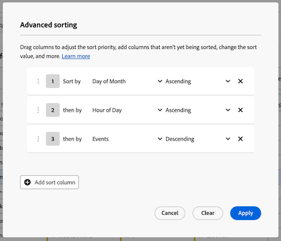

# 在自由格式表中包含多个维度列

{{release-limited-testing}}

在自由格式表中最多可包含5个维度列，这样您可以并排查看多个维度项目。 每一行维度项目的行为类似于单个连接的维度项目。

您可以将过滤器、排序、划分等应用于具有多个维度列的自由格式表，从而创建更深入的自定义分析。

## 连接的维度项目

向自由格式表添加多个维度列时，维度项目的每一行都具有类似于单个关联维度项目的行为。 此功能允许您查看特定维度组合的量度数据。

例如，考虑一个自由格式表，其维度为&#x200B;_城市_、_设备类型_&#x200B;和&#x200B;_日期_，量度为&#x200B;_事件_。 本表第一行的3个维度项成为单个拼接维度项，表明每个月30日孟买通过手机发生了2,056个事件。

| Dimension：城市 | Dimension：设备类型 | Dimension：日期 | 量度：事件 |
|---------|----------|---------|---------|
| 孟买 | 手机 | 30 | 2,056 |
| 纽约 | 平板电脑 | 31 | 1,761 |
| 班加罗尔 | 桌面 | 1 | 1,666 |
| 德里 | 手机 | 14 | 1,396 |

下表显示于Analysis Workspace中：

## 添加多个维度列

可一次添加多个维列或批量添加多个维列。

1. 在Analysis Workspace中，创建一个自由格式表。

   有关详细信息，请参阅[可视化概述](/help/analysis-workspace/visualizations/freeform-analysis-visualizations.md#add-visualizations-to-a-panel)中的[将可视化添加到面板](/help/analysis-workspace/visualizations/freeform-analysis-visualizations.md)。

1. 向自由格式表添加维度。 可一次添加一个维度，也可以一次添加多个维度。

   * 将维度逐个拖动到自由格式表中。 将其他维度列放置在表中现有维度列的左侧或右侧。 将在其中创建新列的位置显示一条蓝色垂直&#x200B;**[!UICONTROL 添加]**&#x200B;行。

     

   * 在组件菜单中选择最多5个维度，然后将它们拖动到自由格式表中。 维度按您选择它们的顺序从左到右添加到表中。

     要选择多个维度，请按住&#x200B;***命令***&#x200B;键(在Mac上)或&#x200B;***Ctrl***&#x200B;键（在Windows上）。

     

1. 将表的每一行作为单个维度项查看。 有关详细信息，请参阅[查看串联的维度项](#view-concatenated-dimension-items)。

## 过滤表格

您可以将过滤器应用于自由格式表中的一个或多个维度列。

有关筛选表的信息，请参阅[筛选和排序表](/help/analysis-workspace/visualizations/freeform-table/filter-and-sort.md#filter-tables)中的[筛选表](/help/analysis-workspace/visualizations/freeform-table/filter-and-sort.md)。

## 对表格进行排序 {#sort-tables}

<!--At GA, move this section into the "Filter and sort tables" article and replace the current "Sort tables" section. Change the "Filter tables" section above to "Filter and sort tables" and link to the other article. Also add row to Guardrails -->

您可以按Analysis Workspace中的任何列对自由格式表的数据进行排序，无论这些列是维度还是量度。

默认情况下，维度按升序排序，量度按降序排序。

### 按单列对表进行排序

按本节所述对单列的数据进行排序时，将删除应用于表的所有[高级排序](#sort-tables-by-multiple-columns-advanced-sorting)。

要按单列对表中的数据进行排序，请执行以下操作：

1. 将鼠标悬停在要排序的列的标题上，然后选择&#x200B;**排序**&#x200B;图标（当它出现时）。

   

1. 选择&#x200B;**[!UICONTROL 升序]**&#x200B;或&#x200B;**[!UICONTROL 降序]**。

   对列应用排序时，排序图标保持可见。 箭头指示数据的排序方式（升序为或降序为）。

### 按多列对表进行排序（高级排序）

{{release-limited-testing-section}}

#### 将排序应用于多个列

要按多列对表中的数据进行排序，请执行以下操作：

1. 将鼠标悬停在要排序的任何列的标题上，然后选择&#x200B;**排序**&#x200B;图标（当它出现时）。

   

1. 选择&#x200B;**[!UICONTROL 高级排序]**。

   

1. 在高级排序对话框中，执行以下任一操作：

   * 通过选择&#x200B;**[!UICONTROL 添加排序列]**&#x200B;按钮，添加尚未排序的列。

   * 通过选择&#x200B;**删除**&#x200B;图标来删除您不再想要排序的列。

   * 在列表中上下拖动列可调整排序优先级。

     有关详细信息，请参阅[排序优先级](#sort-priority)。

   * 在下拉菜单中选择&#x200B;**[!UICONTROL 升序]**&#x200B;或&#x200B;**[!UICONTROL 降序]**&#x200B;以更改排序值。

   * 通过选择列名称下拉菜单选择其他列。

1. 选择&#x200B;**[!UICONTROL 应用]**。

对列应用排序时，排序图标保持可见。 箭头指示数据的排序方式（升序为或降序为）。

#### 排序优先级

当您为多个列排序数据时，将根据您分配给每个列的优先级对数据排序。 优先级编号显示在排序图标旁边。

具有主优先级的列决定主顺序；具有次优先级的列决定主列中行的相同值的顺序；具有第三优先级的列决定主列和次列中行的相同值的顺序；依此类推。

例如，考虑一个包含以下列的表：

* 日期（维度）

* 小时（维度）

* 事件（量度）

您可以为每个列分配排序优先级，如下所示：

| 列（组件）名称 | 组件类型 | 排序优先级 |
|---------|----------|---------|
| 月中几号 | 维度 | 1 |
| 小时 | 维度 | 2 |
| 事件 | 量度 | 3 |

通过为每个列指定排序优先级，您可以确切控制数据在表中的显示方式。 在本例中，信息首先按日期、小时，最后按事件排序。

## 多个维度列和划分

Analysis Workspace提供了以下方式在自由格式表中添加多个维度：

* 包括多个维度列（如本文所述）

* [添加划分](/help/components/dimensions/t-breakdown-fa.md)

这两种方法都允许您根据其他维度分析维度。 但是，两者之间有着重要差异，可以在同一表中使用这两种方法进行更深入的分析。

### 维度列和划分之间的差异

利用多个维度列，您可以：

* 将维度项目连接到多个维度上的不同数据行。

* 仅当维度项应用于表中的每个维度列时，才将维度项包含在连接行中。 要完成此操作，请使用列筛选器取消选择每个维度列上的&#x200B;**[!UICONTROL 包括“没有值”]**&#x200B;设置。

  有关详细信息，请参阅[按多列对表进行排序（高级排序）](#sort-tables-by-multiple-columns-advanced-sorting)。

* 按多个维度和量度列排序数据，以查看更多自定义数据。

  有关详细信息，请参阅[按多列对表进行排序（高级排序）](#sort-tables-by-multiple-columns-advanced-sorting)

划分允许您：

* 在自由格式表中按次要维度划分维度项。 对于次要维度，最多可显示200个维度项目。

### 将划分添加到具有多个维度列的表中

向具有多个维度列的表添加划分时，该划分会应用于添加该划分的行上的拼接维度项（在所有维度列中）。

此外，您还可以在划分中添加多个维度列。 划分中的每一行维度项目的行为也类似于单个串联维度项目。

<!-- update screenshot to show the breakdown, and include this introductory sentence: "For example, you can break down the first dimension item in this table by a new concatenated dimension item that shows... " -->

有关如何添加划分的更多信息，请参阅[划分维度](/help/components/dimensions/t-breakdown-fa.md)。

## 基于跨多个维度列的维度项创建区段

当您基于跨越多个维度列的维度项创建区段时，每个维度项都包含在区段定义中，并且使用And运算符连接它们。

有关创建区段的信息，请参阅[创建区段](/help/components/segments/seg-create.md)。

## 不支持的维度 {#unsupported}

不支持以下维度组合，Analysis Workspace会禁止添加这些维度组合，或在添加这些维度组合后显示错误消息：

* 多个维度来自引用在同一自由格式表中一起使用的不同[对象数组](/help/use-cases/object-arrays.md)的字段。

  同一自由格式表中允许同时使用多个维度（如果它们引用相同的对象数组）。