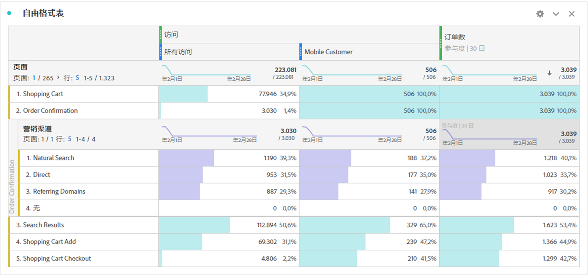
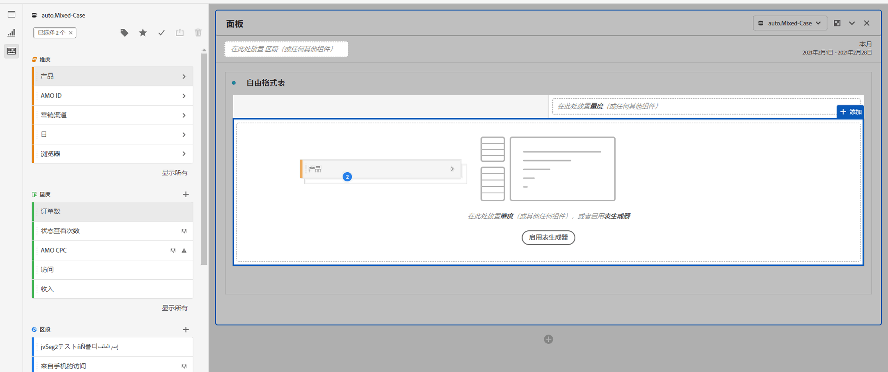
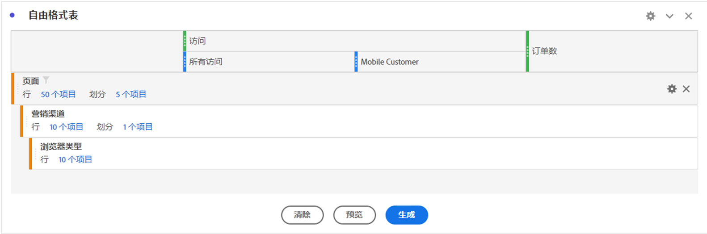
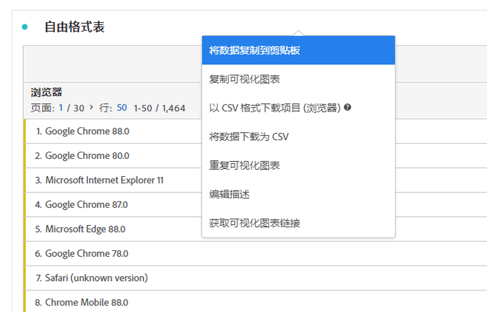

# 自由格式表

在Analysis Workspace，自由表是交互式数据分析的基础。 可以将[组件](https://docs.adobe.com/content/help/zh-Hans/analytics/analyze/analysis-workspace/components/analysis-workspace-components.html)的组合拖放到行和列中，为分析创建自定义表。 删除每个组件后，表将立即更新，以便您能够快速分析和深入挖掘。

## 自动化表

构建表最快捷的方法是将组件直接放入空白项目、面板或自由形式表中。 将自动以建议的格式为您构建自由形式表。 [观看教程](https://experienceleague.adobe.com/docs/analytics-learn/tutorials/analysis-workspace/building-freeform-tables/auto-build-freeform-tables-in-analysis-workspace.html)。

## 自由形式表生成器

如果您希望先向表中添加多个组件，然后再渲染数据，则可以启用自由格式表生成器。启用该生成器后，您可以通过拖放多个维度、划分、量度和区段来构建可解答更复杂业务问题的表格。数据不会即时更新，单击&#x200B;**[!UICONTROL 构建]**&#x200B;后，数据将会更新。

## 表交互

您可以通过各种方式与自由形式表进行交互和自定义：

* **行**
   * 您可以通过调整项目的[视图密度](https://docs.adobe.com/content/help/zh-Hans/analytics/analyze/analysis-workspace/build-workspace-project/view-density.html)，将更多行放入单个屏幕中。
   * 在执行分页之前，每个维度行最多可显示 400 行。单击“行”旁边的数字可在页面上显示更多行。 使用标题中的页面箭头导航到其他页面。
   * 可以按其他组件划分行。要同时划分多行，只需选择多行，然后将下一个组件拖动到选定行上即可。了解有关[划分](https://docs.adobe.com/content/help/zh-Hans/analytics/analyze/analysis-workspace/components/dimensions/t-breakdown-fa.html)的更多信息。
   * 可以[过滤](https://docs.adobe.com/content/help/zh-Hans/analytics/analyze/analysis-workspace/visualizations/freeform-table/pagination-filtering-sorting.html)行，以显示缩减的项目集。在[行设置](https://docs.adobe.com/content/help/en/analytics/analyze/analysis-workspace/visualizations/freeform-table/column-row-settings/table-settings.html)下，提供了其他设置。

* **列**
   * 可以将组件堆放在列中，以创建分段量度、跨标签分析等。
   * 可以在[列设置](https://docs.adobe.com/content/help/zh-Hans/analytics/analyze/analysis-workspace/build-workspace-project/column-row-settings/column-settings.html)下调整每列的视图。
   * 可通过[右键单击菜单](https://docs.adobe.com/content/help/en/analytics-learn/tutorials/analysis-workspace/building-freeform-tables/using-the-right-click-menu.html)执行多个操作。根据您单击表标题、行或列的情况，菜单可提供不同的操作。

## 导出自由格式表数据

进一步了解Analysis Workspace的所有数据[导出选项](https://experienceleague.adobe.com/docs/analytics/analyze/analysis-workspace/curate-share/download-send.html)。

* 右键单击> **[!UICONTROL 将数据复制到剪贴板]**&#x200B;将导出显示的表数据。 如果进行了表选择，则此选项将显示&#x200B;**[!UICONTROL 将选择复制到剪贴板]**。 **Ctrl+C**&#x200B;热键还复制所选数据。
* 右键单击> **[!UICONTROL 以CSV形式下载数据]**&#x200B;以CSV形式下载显示的表数据。 如果选择了表，则此选项将显示&#x200B;**[!UICONTROL 将选择内容下载为CSV]**。
* 右键单击> **[!UICONTROL 项目>下载CSV]**&#x200B;的项目，将导出最多50,000个选定维的维项目。

进一步了解Analysis Workspace的所有数据[导出选项](https://experienceleague.adobe.com/docs/analytics/analyze/analysis-workspace/curate-share/download-send.html)。

