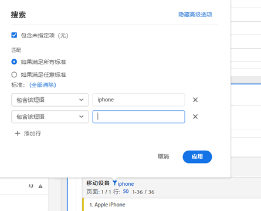
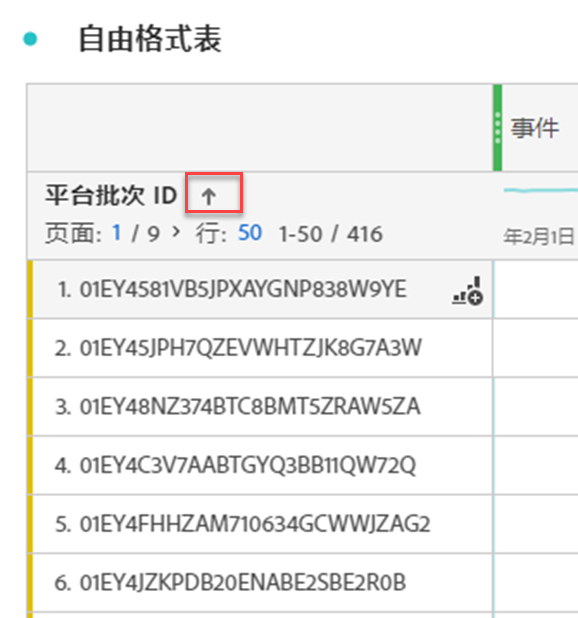

# 对表格进行分页、过滤和排序

>[!NOTE]
>
>您正在查看有关 Customer Journey Analytics 中 Analysis Workspace 的文档。其功能集与[传统 Adobe Analytics 中的 Analysis Workspace](https://experienceleague.adobe.com/docs/analytics/analyze/analysis-workspace/home.html?lang=zh-Hans) 略有不同。[了解更多...](/help/getting-started/cja-aa.md)

有关 Analysis Workspace 中的分页、筛选和排序表的概述，请观看此视频教程：

>[!VIDEO](https://video.tv.adobe.com/v/23968)

## 高级过滤选项 {#section_36E92E31442B4EBCB052073590C1F025}

在自由格式表格中，单击维度旁的“过滤器”图标，然后单击“显示高级选项”，则可以使用以下条件进行过滤。****&#x200B;您可以应用多个筛选规则。

* 包含
* 不包含
* 包含所有词语
* 包含任何词语
* 包含该短语
* 不包含任何词语
* 不包含该短语
* 等于
* 不等于
* 开始于
* 结束于

## 自由格式表中的维度排序

>[!NOTE]
>
>维度排序仅适用于 Customer Journey Analytics 中的自由格式表，而不适用于传统的 Adobe Analytics。可以在两个版本的 Analytics 中执行量度排序。

1. 在项目中的任意“自由格式”表中，单击维度名称旁的箭头：

* 向下箭头按降序排序，向上箭头（默认）按升序排序。
* 您可以按字母顺序或数字顺序对维度进行排序。 例如，工作流程中可能有编号的步骤，并且可能希望按步骤编号排序。您可以按日期对与日期相关的维度进行排序。 或者，您也可以按字母顺序对数据源进行排序，如上面的屏幕截图所示。
