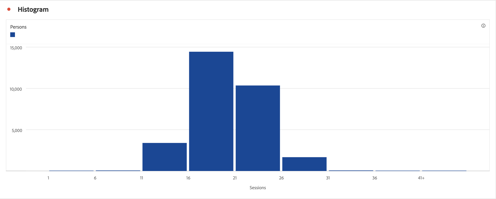
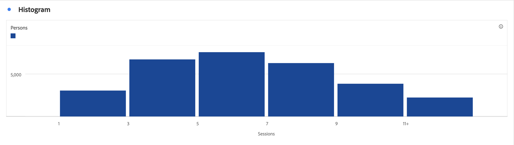
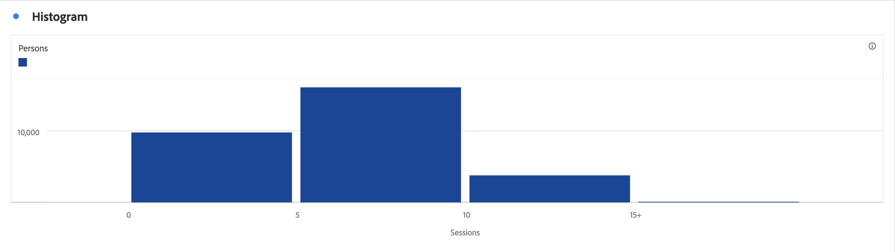

# 直方图 {#histogram}

>[!CONTEXTUALHELP]
>id="workspace_histogram_button"
>title="直方图"
>abstract="创建直方图可视化图表来表示范围组中数值数据的分布。"

>[!BEGINSHADEBOX]

_本文在_  _&#x200B;**Customer Journey Analytics**&#x200B;中记录了直方图可视化图表。_ _对于本文的_  _&#x200B;**Adobe Analytics**&#x200B;版本，请参阅[直方图](https://experienceleague.adobe.com/zh-hans/docs/analytics/analyze/analysis-workspace/visualizations/histogram)。_

>[!ENDSHADEBOX]

**[!UICONTROL 直方图]**&#x200B;可视化图表类似于[!UICONTROL 条形图]可视化图表，不过它可以将数字归为几组不同的范围（存储段）。 Analytics 将数字的“存储”自动归为不同的范围，但您可以在[高级设置](#advanced-settings)中更改相关设置。

## 使用

创建直方图的步骤如下：

1. 添加**[!UICONTROL 直方图]**&#x200B;可视化图表。 请参阅[将可视化图表添加到面板](freeform-analysis-visualizations.md#add-visualizations-to-a-panel)。
1. 从&#x200B;**[!UICONTROL 指标]**&#x200B;组件列表中拖动一个指标，或从&#x200B;[!UICONTROL *添加指标*]&#x200B;下拉菜单中选择一个指标。
1. （可选）选择&#x200B;**[!UICONTROL 显示高级设置]**。 请参阅[高级设置](#advanced-settings)。
1. 选择&#x200B;**[!UICONTROL 生成]**。

>[!NOTE]
>
>直方图仅支持标准量度，而不支持计算量度。

在下面的示例中，直方图用于统计人数的存储段会话。 直方图显示大多数人在所选日期范围内确实有 16 至 21 次会话。

## 高级设置

作为可视化图表的一部分，可以使用特定直方图设置。

| 直方图设置 | 描述 |
|---|---|
| **[!UICONTROL 开始存储段]** | 确定直方图开始的分段。 默认值为“1”。 您可以将起始数字从0设置为无限（无负数）。 |
| **[!UICONTROL 量度存储段]** | 允许您增加/减少数据范围（存储段）的数量。 存储段的最大数量为 50。 |
| **[!UICONTROL 量度存储段大小]** | 允许您设置每个分段的大小。 例如，您可以将存储段大小从1次页面查看更改为2次页面查看。 |
| **[!UICONTROL 计算方法]** | 从&#x200B;**[!UICONTROL 全局帐户]** [!BADGE B2B edition]{type=Informative url="https://experienceleague.adobe.com/zh-hans/docs/analytics-platform/using/cja-overview/cja-b2b/cja-b2b-edition" newtab=true tooltip="Customer Journey Analytics B2B Edition"}、**[!UICONTROL 帐户]** [!BADGE B2B edition]{type=Informative url="https://experienceleague.adobe.com/zh-hans/docs/analytics-platform/using/cja-overview/cja-b2b/cja-b2b-edition" newtab=true tooltip="Customer Journey Analytics B2B Edition"}、**[!UICONTROL 购买群]** [!BADGE B2B edition]{type=Informative url="https://experienceleague.adobe.com/zh-hans/docs/analytics-platform/using/cja-overview/cja-b2b/cja-b2b-edition" newtab=true tooltip="Customer Journey Analytics B2B Edition"}、**[!UICONTROL 机会]** [!BADGE B2B edition]{type=Informative url="https://experienceleague.adobe.com/zh-hans/docs/analytics-platform/using/cja-overview/cja-b2b/cja-b2b-edition" newtab=true tooltip="Customer Journey Analytics B2B Edition"}、**[!UICONTROL 人员]**、**[!UICONTROL 会话]**、**[!UICONTROL 事件]**&#x200B;或&#x200B;**[!UICONTROL 对象]**&#x200B;中选择。 例如，每个帐户 [!BADGE B2B Edition]{type=Informative url="https://experienceleague.adobe.com/zh-hans/docs/analytics-platform/using/cja-overview/cja-b2b/cja-b2b-edition" newtab=true tooltip="Customer Journey Analytics B2B Edition"}的页面浏览量、每个会话的页面浏览量、每个人的页面浏览量或每个事件的页面浏览量。 选择&#x200B;**[!UICONTROL 对象]**&#x200B;时，请选择用于子事件分析的[自定义容器](/help/data-views/create-dataview.md#containers-1)。 |

<!--Russ or Meike - Check Hit Type link above. -->

**示例**：

| 开始存储段 | 量度存储段 | 量度存储段大小 | 结果 |
|:----:|:--:|:--:|:--|
| 1 | 5 | 2 |  |
| 0 | 3 | 5 |  |

>[!MORELIKETHIS]
>
>[将可视化图表添加到面板可视化图表设置可视化上下文菜单使用直方图识别意外数据值](https://experienceleaguecommunities.adobe.com/t5/adobe-analytics-blogs/using-histograms-to-identify-unexpected-data-values/ba-p/596168)

