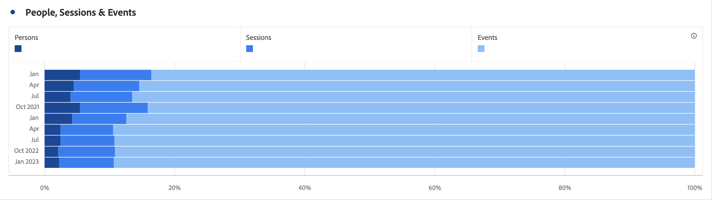

# 水平条形图（堆叠）

水平条形图可视化图表具有标准和栈叠选项。

## 水平条 {#horizontal-bar}

<!-- markdownlint-disable MD034 -->

>[!CONTEXTUALHELP]
>id="workspace_horizontalbar_button"
>title="水平条"
>abstract="创建可视化水平条形图来表示一个或多个量度的各种值。"

<!-- markdownlint-enable MD034 -->

>[!BEGINSHADEBOX]

*本文记录了**Customer Journey Analytics**中的水平条形图和栈叠的水平条形图可视化图表。 查看本文的**Adobe Analytics**版本的[栈叠的水平条形图和水平条形图](https://experienceleague.adobe.com/en/docs/analytics/analyze/analysis-workspace/visualizations/horizontal-bar)。*

>[!ENDSHADEBOX]

此 **[!UICONTROL 水平条]**&#x200B;可视化显示一些水平条，这些水平条表示一个或多个量度中的各种值。

## 堆叠的水平条形图 {#horizontal-bar-stacked}

<!-- markdownlint-disable MD034 -->

>[!CONTEXTUALHELP]
>id="workspace_horizontalbarstacked_button"
>title="堆叠的水平条形图"
>abstract="创建可视化水平条形图来表示一个或多个堆叠的量度的各种值。"

<!-- markdownlint-enable MD034 -->

 **[!UICONTROL 栈叠的水平条形图]**&#x200B;可视化与[!UICONTROL 水平条形图]类似，但序列条形图显示为栈叠的。

在 **[!UICONTROL 设置]**&#x200B;中使用&#x200B;**[!UICONTROL 100%栈叠]**&#x200B;选项可将图表转换为100%栈叠可视化图表。

>[!MORELIKETHIS]
>
>[将可视化图表添加到面板](/help/analysis-workspace/visualizations/freeform-analysis-visualizations.md#add-visualizations-to-a-panel)
>[可视化设置](/help/analysis-workspace/visualizations/freeform-analysis-visualizations.md#settings)
>[可视化上下文菜单](/help/analysis-workspace/visualizations/freeform-analysis-visualizations.md#context-menu)
>

