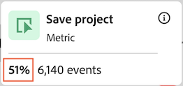
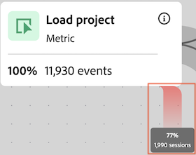

# 配置历程画布可视化

历程画布可视化图表允许您分析提供给用户和客户的旅程，并获取有关这些旅程的深入见解。

## 历程画布概述

请参阅[历程画布概述](/help/analysis-workspace/visualizations/journey-canvas/journey-canvas.md)，了解有关历程画布的更多信息，包括：

* 主要功能

* 潜在洞察

* 历程画布和流失之间的差异

* 有关分析Journey Optimizer历程的详细信息

* 等等

## 开始构建历程画布可视化

1. 在项目中添加一个空白面板，选择左边栏中的&#x200B;[!UICONTROL **可视化**]&#x200B;图标，然后将 [!UICONTROL **历程画布**]&#x200B;可视化拖动到面板中。

   或

   使用[可视化概述](/help/analysis-workspace/visualizations/freeform-analysis-visualizations.md)中的[将可视化图表添加到面板](/help/analysis-workspace/visualizations/freeform-analysis-visualizations.md#add-visualizations-to-a-panel)部分中所述的任何方式添加历程画布可视化图表。

   

1. 指定以下基本信息以配置历程画布：

   | 字段 | 功能 |
   |---------|----------|
   | [!UICONTROL **主要量度**] | 确定在计算历程中每个节点的百分比和数值时使用的量度。
**注意**：每个百分比和数字值中包含的数据的范围由您在&#x200B;**[!UICONTROL 历程画布容器]**&#x200B;字段中选择的指标决定。 例如，如果将&#x200B;**[!UICONTROL Person]**&#x200B;设置为容器，则历程中显示的统计信息跨越给定人员的多个会话。 如果将&#x200B;**[!UICONTROL 会话]**&#x200B;设置为容器，则历程中显示的统计信息将受限于给定人员的单个已定义会话。

请考虑以下主要指标如何影响每个节点的百分比和数值的示例：
<ul><li>如果&#x200B;_人员_&#x200B;是主要量度，而&#x200B;_人员_&#x200B;是容器，则只有事件与历程中每个连续节点的条件相匹配的人才能在整个历程中移动。 当人员从未到达历程中的任何紧接的后续节点时，会在节点上发生流失。 执行其他操作时，客户可能会在网站上执行操作，但不符合任何紧随其后的节点所定义的标准。</li><li>如果&#x200B;_人员_&#x200B;是主要量度，_会话_&#x200B;是容器，则只有那些其事件与单个会话内历程中每个节点的条件相匹配的人员，才会在整个历程中移动。 当人员从未在单个会话内到达历程中的任何紧接下一个节点时，会在节点上发生流失。 他们可能会在会话中的网站上执行其他操作，但不符合任何紧随其后的节点定义的标准。</li></ul> 
主要指标影响历程画布可视化的以下方面：
<ul><li>每个节点上显示的总数。  
例如，如果Events是主要量度，则每个节点显示其事件符合该节点标准（以及旅程中导致该节点的每个以前节点）的人员数量。
</li><li>每个节点上显示的百分比。 （构建可视化图表后，您可以使用&#x200B;**[!UICONTROL 百分比值]**&#x200B;下拉菜单选择显示总数的百分比、上一个节点的百分比或起始节点的百分比。）
例如，如果事件是主要指标，则每个节点显示其事件符合该节点标准（以及旅程中导致该节点的每个以前节点）的人员百分比。
</li><li>将维度添加到可视化图表后，会根据主要指标添加可视化图表的前3个节点。</li></ul> |
   | [!UICONTROL **辅助量度**] | 确定在计算历程中每个节点的百分比和数值时使用的辅助量度。 辅助量度是可选的。 
**注意**：每个百分比和数字值中包含的数据的范围由您在&#x200B;**[!UICONTROL 历程画布容器]**&#x200B;字段中选择的指标决定。 例如，如果将&#x200B;**[!UICONTROL Person]**&#x200B;设置为容器，则历程中显示的统计信息跨越给定人员的多个会话。 如果将&#x200B;**[!UICONTROL 会话]**&#x200B;设置为容器，则历程中显示的统计信息将受限于给定人员的单个已定义会话。

配置辅助指标后，它会影响历程画布可视化的以下方面：
<ul><li>显示在主指标下方的每个节点上的总数。 
例如，如果帐户是次要量度，则会在节点上显示旅程中到达该节点的所有人员的帐户数。
</li><li>显示在主指标下方的每个节点上的百分比。 （构建可视化图表后，您可以选择显示总数百分比或起始节点百分比。）</li>
例如，如果会话是辅助量度，则每个节点显示到达历程中该节点的会话的百分比（总数的百分比或起始节点的百分比）。
</li></ul> |
   | [!UICONTROL **Journey Optimizer历程**]<!-- name? --> | 选择要用作在历程画布中分析的基础的Journey Optimizer历程。 具有以下任意状态的历程均可用：“实时”、“已停止”或“已完成” 
或者，如果您希望在Analysis Workspace中通过空白画布构建分析，则可以将此选项留空。
 
在历程画布中分析Journey Optimizer历程时，该历程的显示顺序、顺序和结构与Journey Optimizer中的相同。 有关详细信息，请参阅[历程画布概述](/help/analysis-workspace/visualizations/journey-canvas/journey-canvas.md)中的[分析Journey Optimizer历程](/help/analysis-workspace/visualizations/journey-canvas/journey-canvas.md#analyze-journey-optimizer-journeys)。

**注意**：仅当在添加可视化图表的Journey Optimizer面板中选择的同一数据视图中检测到Analysis Workspace数据时，才会显示此选项。 有关更改Analysis Workspace中面板的数据视图的信息，请参阅[Analysis Workspace概述](/help/analysis-workspace/home.md)。
 |

1. （可选）选择&#x200B;[!UICONTROL **显示高级设置**]，然后指定以下信息：

   | 字段 | 功能 |
   |---------|----------|
   | [!UICONTROL **历程画布容器**] | 选择在整个历程中要重点关注的容器。 您选择的容器决定了历程中捕获的数据的范围。 这会影响可视化图表中显示的统计数据。 （如果容器名称与下面显示的默认名称不同，则已在数据视图中自定义这些名称。）<ul><li>**会话：**&#x200B;将可视化图表的统计信息限制在给定人员的单个已定义会话内。 这意味着，每个节点上显示的数字和百分比（基于主要和次要量度）必须发生在每个人的单个会话中。 换句话说，可以在一个历程中多次表示一个人。
此容器使用会话量度。
</li><li>**人员：**（默认）允许可视化图表的统计信息跨越给定人员的多个会话。 这意味着每个节点上显示的数字和百分比（基于主要和次要量度）可以在任意数量的会话中出现，只要这些会话属于同一个人。 换言之，一个人在单次历程中只能呈现一次。
此容器使用人员量度。
</li></ul> |

1. 选择&#x200B;[!UICONTROL **生成**]。

   如果您选择了Journey Optimizer历程，则该历程的显示顺序、序列和结构与Journey Optimizer中的相同。 (只有有权访问历程优化器的用户才能选择Journey Optimizer旅程。)

   <!-- add screen shot -->

   如果未选择Journey Optimizer旅程，则会显示一个空白画布，您可以在其中开始将节点添加到旅程。 (只有有权访问历程优化器的用户才能选择Journey Optimizer旅程。)

   <!-- add screen shot -->

1. 无论您是从空白画布创建新分析，还是要分析Journey Optimizer历程，都可以按照[配置可视化设置](#configure-visualization-settings)中所述配置历程。

## 配置可视化设置

历程画布标题中提供了各种配置选项。

要配置历程画布可视化图表的设置，请执行以下操作：

1. 在Analysis Workspace中，打开现有的历程画布可视化图表，或[开始构建新的可视化图表](#begin-building-a-journey-canvas-visualization)。

   标题中提供了允许您配置历程画布可视化图表的选项：

   

1. 配置可视化图表顶部显示的以下任意设置：

   | 设置 | 功能 |
   |---------|----------|
   | [!UICONTROL **百分比值**] | 旅程中每个节点上显示的百分比值。

 
在配置旅程中节点上显示的百分比值时，请考虑以下事项：
<ul><li>主量度的百分比显示在每个节点上。 如果配置了辅助量度，则还会显示辅助量度的百分比。 (有关主要和次要指标设置的详细信息，请参阅[开始构建历程画布可视化图表](#begin-building-a-journey-canvas-visualization)。)</li><li>百分比包括面板日期范围内数据视图中包含的所有人员或会话。 是否使用&#x200B;_人员_&#x200B;或&#x200B;_会话_&#x200B;取决于容器设置。 (有关容器设置的详细信息，请参阅[开始构建历程画布可视化图表](#begin-building-a-journey-canvas-visualization)。)</li></ul> 
从以下选项中进行选择：
 <ul><li>[!UICONTROL **开始节点的百分比**]：计算每个节点上显示的相对于开始节点的百分比。 百分比基于您选择的主要和次要量度。 
_启动节点_&#x200B;是一个没有连接节点的节点。

历程可以包含多个开始节点。 但是，如果历程包含2个或更多指向公共节点的启动节点，则使用总数的&#x200B;[!UICONTROL **Percent of**]。 如果要使用起始节点&#x200B;**的**&#x200B;百分比，请更新历程，以便历程中的每个节点都可以跟踪回单个起始节点。
</li><li>[!UICONTROL **上一个节点的百分比**]：计算每个节点上显示的相对于上一个节点的百分比。 百分比基于您选择的主要和次要量度。</li><li>[!UICONTROL **合计百分比**]：计算每个节点上显示的与数据视图中所有数据的百分比。 百分比基于您选择的主要和次要量度。</li></ul> |
   | [!UICONTROL **箭头设置**] | 可以将历程画布中节点之间显示的箭头配置为显示自定义标签和值。 

_标签_&#x200B;是显示在箭头上的自定义名称。 给定箭头上只显示单个标签。 标签可以是以下任意标签，并按以下优先顺序显示：
<ol><li>从历程画布添加的自定义名称（如[添加或更新箭头上的标签](#add-or-update-a-label-on-an-arrow)中所述）</li><li>Journey Optimizer标签</li><li>Journey Optimizer条件</li></ol>
_值_&#x200B;是箭头上显示的数字和百分比，它们表示从历程中的一个节点移动到下一个节点的人员或会话。 （换言之，就是那些没有在给定步骤中退出旅程的人。 ） 

以下选项适用于并非源自Journey Optimizer的旅程，以及在历程画布中未进行重大修改的Journey Optimizer旅程：（重大修改包括添加或删除节点、添加或删除箭头或更改节点的组件。）
<ul><li>[!UICONTROL **无标签**]：历程中的箭头上不显示标签。  此选项仅在历程在中被修改时可用 </li><li>[!UICONTROL **仅标签**]：标签显示在历程的箭头上。</li></ul>
以下选项适用于在历程画布中进行了显着修改的Journey Optimizer历程：（显着修改包括添加或删除节点、添加或删除箭头或更改节点的组件。）(**注意**：只有在您添加可视化图表的Journey Optimizer面板中选择的同一数据视图中检测到Analysis Workspace数据时，才会显示这些选项。 有关更改Analysis Workspace中面板的数据视图的信息，请参阅[Analysis Workspace概述](/help/analysis-workspace/home.md)。
<ul><li>[!UICONTROL **无标签或值**]：历程中的箭头上不显示标签或值。</li><li>[!UICONTROL **仅标签**]：历程中的箭头上只显示标签。 不显示值。</li><li>[!UICONTROL **仅限值**]：历程中的箭头上只显示值。 不显示标签。</li><li>[!UICONTROL **值和标签**]：标签和值都显示在历程的箭头上。</li></ul> |
   | [!UICONTROL **显示流失**] | 流失数据显示从历程的每个节点流失的百分比和数量。 流失数据基于与历程的容器设置关联的量度；而不是基于主要或次要量度。 

默认情况下，容器为&#x200B;_人员_，因此用于流失数据的量度为&#x200B;_人员_。 如果容器更改为&#x200B;_会话_，则用于流失数据的量度是&#x200B;_会话_，依此类推。

例如，使用&#x200B;_人员_&#x200B;作为容器设置，流失显示历程中从未到达任何紧接的后续节点的人员的百分比和人数。 执行其他操作时，客户可能会在网站上执行操作，但不符合任何紧随其后的节点所定义的标准。
 
有关历程画布容器设置的详细信息，请参阅[开始构建历程画布可视化图表](#begin-building-a-journey-canvas-visualization)。 |
   | **缩放控件** | 以下缩放控件在画布的右上角可用：<ul><li>**放大** ：放大可视化图表的特定区域。
您也可以使用鼠标控件，例如按住触控板。
</li><li>**缩小** ：缩小可视化图表以在画布上留出更多空间。
您也可以使用鼠标控件，例如按住触控板。
</li><li>**适应屏幕** ：调整当前缩放和平移设置以使用完整可视化填充屏幕。</li></ul>
要在放大或缩小后跨画布平移，请单击鼠标并拖动到所需的位置。
 |

1. 继续添加[添加节点](#add-nodes)。

## 添加节点

历程画布可视化图表中的节点表示用户旅程的事件或操作。

您可以通过以下方式创建节点：通过将Workspace组件从左边栏拖到画布中；允许历程画布基于现有节点选择上个或上个节点；或者复制现有节点。

### 从左边栏拖动组件

1. 在Analysis Workspace中，打开现有的历程画布可视化图表，或[开始构建新的可视化图表](#begin-building-a-journey-canvas-visualization)。

1. 将量度、维度、维度项、区段或日期范围从左边栏拖到画布上。 支持基于[派生字段](/help/data-views/derived-fields/derived-fields.md)的量度。 但是，不支持计算指标以及基于[摘要数据集](/help/data-views/summary-data.md)的任何指标或维度。

   按住Shift键或按住Command键(在Mac上)或Ctrl键（在Windows上）可在左边栏中选择多个组件。

   可视化图表会根据主要指标进行更新，如下所示（取决于组件类型和放置它的画布区域）：

   | 组件类型 | 元件放置 | 添加节点后可视化图表会更新 |
   |---------|----------|----------|
   | 量度 | 画布的空白区域 | 此时会显示组件被放置的位置，并且不会与任何现有节点连接。 |
   | 量度 | 现有节点 | 组件将自动与现有节点组合。 （有关详细信息，请参阅[合并节点](#combine-nodes)。）
 |
   | 量度 | 2个现有节点之间的箭头 | 该节点显示在两个现有节点之间，其中组件被放置并连接到两个现有节点。 （有关详细信息，请参阅[连接节点](#connect-nodes)。）
 |
   | 维度 | 画布的空白区域 | 为前3个维度项创建3个节点，这些节点放置了组件，且未与任何现有节点连接。 (**注意：**&#x200B;如果只显示1个或2个节点，则意味着数据仅可用于其中一个或2个维度项。 如果未显示节点，则意味着数据不可用于任何维度项目。 在这种情况下，请尝试将其添加到历程的其他点，调整可视化的日期范围，或选择其他维度。)
按住Shift键，将维度拖放到画布上以将其添加为具有3个维度项的单个节点。

 |
   | 维度 | 现有节点 | 划分将自动应用于显示前5个维度项的节点。<!--what happens if you hold Shift?-->
要在新的自由格式表可视化图表中查看划分，请选择节点上的&#x200B;[!UICONTROL **在自由格式表中打开**]&#x200B;链接。
 |
   | 维度 | 连接2个现有节点的箭头 | 为第一个节点（最终到达第二个节点的人员/会话）之后第一个事件之后的排名前3的维度项目创建3个节点。 这些节点显示在两个现有节点之间，其中组件被放置，并且每个节点都连接到两个现有节点。 (**注意：**&#x200B;如果只显示1个或2个节点，则意味着数据仅可用于其中一个或2个维度项。 如果未显示节点，则意味着数据不可用于任何维度项目。 在这种情况下，请尝试将其添加到历程的其他点，调整可视化的日期范围，或选择其他维度。)
按住Shift键，将维度拖放到画布上以将其添加为具有3个维度项的单个节点。 （有关详细信息，请参阅[连接节点](#connect-nodes)。）
 |
   | 维度项 | 画布的空白区域 | 此时会显示组件被放置的位置，并且不会与任何现有节点连接。 |
   | 维度项 | 现有节点 | 组件将自动与现有节点组合。 |
   | 维度项 | 连接2个现有节点的箭头 | 该节点显示在两个现有节点之间，其中组件被放置并连接到两个现有节点。 （有关详细信息，请参阅[连接节点](#connect-nodes)。）
 |
   | 区段 | 画布的空白区域 | 此时将显示一个节点，其中的组件未与任何其他节点连接。
节点上显示的数量和百分比包括按所选区段分段的主要指标总数。
 
例如，如果选择“人员”作为历程的主要量度，则将一个今天区段添加到画布的空白区域可显示今天发生事件的所有人员。
 |
   | 区段 | 现有节点 | 将区段应用于现有节点。 |
   | 区段 | 连接2个节点的箭头 | 该节点显示在两个现有节点之间，其中组件被放置并连接到两个现有节点。 （有关详细信息，请参阅[连接节点](#connect-nodes)。）

将区段应用于路径上组件放置到的点。
 |
   | 日期范围 | 画布的空白区域 | 该节点显示组件被放置的位置，并且未与任何其他节点连接。
节点上显示的数量和百分比包括按所选日期范围分段的主要指标总数。
 
例如，如果选择“人员”作为历程的主要量度，则将日期范围本月添加到画布的空白区域可显示发生当月事件的所有人员。
 |
   | 日期范围 | 现有节点 | 将日期范围应用于现有节点。 |
   | 日期范围 | 连接2个节点的箭头 | 该节点显示在两个现有节点之间，其中组件被放置并连接到两个现有节点。 （有关详细信息，请参阅[连接节点](#connect-nodes)。）

将日期范围应用到组件在路径上的放置点。
 |
   | 多个组件 | 画布的空白区域 | **如果没有组件是维度：**
每个组件都显示为单独的节点，其中组件被放置，且未与任何现有节点连接。

按住Shift键，将组件拖放到画布上以将其添加为一个组合节点。 

**如果您要添加的任何组件是维度：**

每个组件都显示为单独的节点，其中组件被放置，且未与任何现有节点连接。

一次只能添加一个维度。 添加维度后，将为删除组件的排名前3的维度项目创建3个节点。

按住Shift键，将组件拖放到画布上以将其添加为一个组合节点。 排名前3的维度项目将与每个节点相结合。 （有关详细信息，请参阅[合并节点](#combine-nodes)。）
 |
   | 多个组件 | 现有节点 | 所有组件都与现有节点相结合。
如果要添加的任何组件都是维度，则排名前3的维度项将与节点合并。
 
一次只能添加一个维度。
 |
   | 多个组件 | 连接2个现有节点的箭头 | **如果没有组件是维度：**
每个组件都显示为单独的节点，其中放置了组件，并且每个节点都连接到两个现有节点。 （有关详细信息，请参阅[连接节点](#connect-nodes)。）

按住Shift键，将组件拖放到画布上以将其添加为一个组合节点。 （组件必须属于相同类型才能合并到单个节点中。）（有关详细信息，请参阅[合并节点](#combine-nodes)。）

**如果您要添加的任何组件是维度：**

每个组件都显示为单独的节点，其中放置了组件，并且每个节点都连接到两个现有节点。

一次只能添加一个维度。 添加维度后，将为该维度的前3个项目创建3个节点，这3个项目紧跟在第一个节点（最终到达第二个节点的人员或会话）之后的第一个事件。 每个节点都连接到两个现有节点。 （有关详细信息，请参阅[连接节点](#connect-nodes)。）

按住Shift键，将组件拖放到画布上以将其添加为一个组合节点。 排名前3的维度项目与每个节点相结合，每个节点均连接到两个现有节点。 （有关详细信息，请参阅[合并节点](#combine-nodes)。）
 |

   节点显示为包含下列信息的矩形框：

   * 组件名称

   * 组件类型（如量度或维度）

   * 主要指标统计数据（总计和百分比）

   * 次要量度统计信息（总计和百分比）

   脉冲或发光节点表示正在为该节点加载数据。

1. 重复此过程以继续添加节点以构建历程。

1. 按照以下部分所述，继续自定义历程。 您可以连接节点、重命名节点、应用划分、创建受众、添加时间限制等。

### 基于现有节点显示顶级节点

您可以根据画布上已存在的节点，自动显示排名最前的即时节点。 您可以将顶级节点添加到历程画布或在自由格式表中查看它们。

在确定要显示的节点时，历程画布使用主量度。

此选项适用于画布上的以下对象：

* 单个节点

* 节点之间的箭头

#### 在现有节点之后显示顶级节点

您可以选择某个节点，并在历程中显示紧跟在该节点之后的排名最前的维度项目。 您可以将排名前3的维度项目作为单独的节点添加到历程画布中，也可以在自由格式表中查看所有排名最前的维度项目。

1. 右键单击要显示历程中排名最前的维度项目的节点。

   该节点在历程中不能有退出它的任何现有节点。

1. 选择&#x200B;[!UICONTROL **在此节点**]&#x200B;之后显示顶级节点。

1. 选择要显示维度项目的位置：

   * [!UICONTROL **在历程画布中**]：将前3个节点添加到旅程中此节点之后的画布中。 每个节点都连接到您作为画布上的单独分支而选择的节点。

   * [!UICONTROL **在自由格式表中**]：创建一个自由格式表可视化图表，以显示历程中此节点之后的所有热门维度项目。

1. 从维列表中选择所需的维。

   根据您在上一步中选择的内容，排名前3的维度项目将作为三个单独的节点添加到画布中，或者所有排名最前的维度项目都显示在自由格式表中。

#### 在现有节点之前显示顶级节点

您可以选择一个节点，并显示历程中紧靠该节点之前的热门维度项目。 您可以将排名前3的维度项目作为单独的节点添加到历程画布中，也可以在自由格式表中查看所有排名最前的维度项目。

1. 右键单击要显示历程中位于其前面的排名最前的维度项目的节点。

   此节点在历程中不能有任何现有节点进入它。

1. 选择&#x200B;[!UICONTROL **在此节点**]&#x200B;之前显示顶级节点。

1. 选择要显示维度项目的位置：

   * [!UICONTROL **在历程画布中**]：将前3个节点添加到历程中此节点之前的画布中。 每个节点都连接到您作为画布上的单独分支而选择的节点。

   * [!UICONTROL **在自由格式表中**]：创建一个自由格式表可视化图表，以显示历程中位于此节点之前的所有热门维度项目。

1. 从维列表中选择所需的维。

   根据您在上一步中选择的内容，排名前3的维度项目将作为三个单独的节点添加到画布中，或者所有排名最前的维度项目都显示在自由格式表中。

#### 显示现有节点之间的顶级节点

您可以选择一个箭头，并显示旅程中2个现有节点之间的排名最前的维度项目。 您可以将排名前3的维度项目作为单独的节点添加到历程画布中，也可以在自由格式表中查看所有排名最前的维度项目。

1. 右键单击要显示排名最前的维度项的2个节点之间的箭头。

1. 选择&#x200B;[!UICONTROL **显示这些节点之间的顶级节点**]。

1. 选择要显示维度项目的位置：

   * [!UICONTROL **在历程画布中**]：将前3个节点添加到介于2个现有节点之间的画布中。 每个节点都作为画布上的单独分支连接到周围的节点。

   * [!UICONTROL **在自由格式表中**]：创建一个自由格式表可视化图表，以显示介于2个现有节点之间的所有热门维度项。

1. 从维列表中选择所需的维。

   根据您在上一步中选择的内容，排名前3的维度项目将作为三个单独的节点添加到画布中，或者所有排名最前的维度项目都显示在自由格式表中。

### 复制节点

复制选项可用于画布上的以下对象：

* 单个节点

* 多个节点

要复制节点，请执行以下操作：

1. 选择一个或多个要复制的节点。

   要选择多个节点，请按住Command键(在Mac上)或Ctrl键（在Windows上）。

1. 右键单击其中一个选定的节点，然后选择&#x200B;[!UICONTROL **复制**]。

## 设计旅程

节点的顺序以及它们之间的连接影响历程画布数据。 历程应直观而准确地反映要报告的事件顺序。

将节点添加到画布后，您可以重新排列节点、组合节点、连接节点并在节点之间添加时间限制。

### 重新排列节点

历程画布中的历程由表示事件、维度项和区段任意组合的节点和箭头灵活图形组成。

您可以将节点拖动到画布上，以重新排列历程的事件和条件。

当您重新排列旅程中的节点顺序时，数据会相应地更新。

### 合并节点

历程画布中的组合节点是用户旅程（节点）中的单个点，它包含2个或多个通过逻辑联接在一起的组件。

#### 创建组合节点

您可以执行以下任一操作来组合历程画布中的节点：

* 从左边栏将单个组件拖动到画布上的节点。

* 从左边栏中，将多个组件同时拖动到画布上的某个节点上。

* 从左边栏中，按住Shift键，同时将多个组件拖动到画布的空白区域。

<!-- * On the canvas, select the nodes that you want to combine, right-click one of the selected nodes, then select **Combine**. Is there a limit on how many you can combine? -->

#### 组合节点时的逻辑

在组合节点时应用于节点的逻辑因要组合的组件类型而异，如下所示：

>[!TIP]
>
>您可以查看组合节点的逻辑，方法是右键单击该节点，然后选择&#x200B;[!UICONTROL **从节点**]&#x200B;创建区段。 该逻辑显示在&#x200B;[!UICONTROL **定义**]&#x200B;部分中。

| 要组合的组件类型 | 使用的逻辑（运算符） |
|---------|----------|
| 指标+指标 | 已使用OR连接 |
| Dimension项目+ Dimension项目（来自同一父维度） | 已使用OR连接 |
| Dimension项目+ Dimension项目（来自其他父维度） | 与AND连接 |
| 段+段 | 与AND连接 |
| Dimension +指标、日期范围或区段 | 与AND连接 |
| 日期范围+指标、区段或Dimension | 与AND连接 |
| 区段+指标、日期范围或Dimension | 与AND连接 |

### 连接节点

您可以连接画布上已存在的节点，也可以在将节点添加到画布时连接该节点。

您可以连接节点以定义历程的事件序列。

#### 节点之间的箭头

节点通过箭头连接。 箭头方向和宽度都有意义：

* **方向**：指示历程事件的序列

* **宽度**：表示从一个节点到另一个节点的卷百分比

  

#### 连接节点时的逻辑

连接历程画布中的节点时，使用THEN运算符连接它们。 这也称为[顺序分段](/help/components/segments/seg-sequential-build.md)。

节点作为“最终路径”连接，这意味着访客只要最终从一个节点移动到另一个节点即被计入，而不考虑在这两个节点之间发生的任何事件。 为用户沿路径移动所分配的时间由容器设置确定。<!-- It can also be controlled by [adding a time constraint](#add-a-time-constraint-between-nodes). -->

您可以查看已连接节点的逻辑，方法是右键单击该节点，然后选择&#x200B;[!UICONTROL **从节点**]&#x200B;创建区段。 该逻辑显示在&#x200B;[!UICONTROL **定义**]&#x200B;部分中。

#### 连接现有节点

历程不能是循环的，循环回以前连接的节点。

要连接历程画布中的节点，请执行以下操作：

1. 在历程画布可视化中，将鼠标悬停在要连接到其他节点的旅程序列中排在第一位的节点上。

   选定节点的两侧各显示4个蓝色圆点。

1. 将4个蓝色圆点中的任意一个拖到您要连接的节点的4个边中的任何一个。

   出现一个箭头，连接这2个节点。 有关详细信息，请参阅节点之间的[箭头](#arrows-between-nodes)。

#### 添加节点时连接节点

将节点添加到画布时，可以将其放在两个连接的节点之间。 该节点将添加到旅程的2个现有节点之间的流中。

有关详细信息，请参阅[添加节点](#add-nodes)。

<!--

### Add a time constraint between nodes

>[!AVAILABILITY]
>
>This feature is not yet available.

You can set a time constraint between nodes. When a time constraint is in place, people are considered to have fallen out of the journey if they follow the defined journey but take longer than the allotted time period to move between the nodes.

The option to add a time constraint is available for the following objects on the canvas:

* The arrow between nodes

To add a time constraint:

1. In a Journey canvas visualization, right-click the arrow between 2 nodes, then select [!UICONTROL **Add time constraint**].

from Travis: You can set time to be within X amount of time or after X amount of time (those are the only two options I think, but we can check with Brandon). 
1. Choose from the following options: 

-->

## 管理节点或箭头

<!--

### Change the color of a node or arrow

>[!AVAILABILITY]
>
>This feature is not yet available.

You can visually customize a journey by changing the color of any node or arrow on the canvas. For example, you could adjust colors to indicate a desirable or undesirable event.

The option to change the color is available for the following objects on the canvas:

* Individual nodes

* The arrow between nodes

To change the color of a node or arrow:

1. In a Journey canvas visualization, right-click the node or arrow whose color you want to change.

1. Select [!UICONTROL **Change color**]. 

1. Select the desired color. 

   The following colors are available: 

-->

### 重命名节点

将组件拖动到历程画布可视化时，它将创建一个与组件名称同名的节点。 您可以重命名节点，以更好地匹配节点表示的历程步骤。

重命名选项可用于画布上的以下对象：

* 单个节点

要重命名节点，请执行以下操作：

1. 在历程画布可视化图表中，右键单击要重命名的节点。

1. 选择&#x200B;[!UICONTROL **重命名**]。

1. 指定新名称，然后按Enter。<!--is that right?-->

### 在箭头上添加或更新标签

可以将历程画布中节点之间显示的箭头配置为显示自定义标签和值。

标签是显示在箭头上的自定义名称。 给定箭头上只显示单个标签。

有关箭头上显示的标签和值的详细信息，请参阅[配置可视化设置](#configure-visualization-settings)中的“箭头设置”。

添加或更新标签的选项适用于画布上的以下对象：

* 节点之间的箭头

要向箭头添加标签，请执行以下操作：

1. 在历程画布可视化中，右键单击要添加标签的箭头。

1. 选择&#x200B;**[!UICONTROL 添加标签]**。

1. 指定标签的名称，然后按Enter。

   如果箭头设置当前配置为隐藏标签，则会显示一条消息，提示您显示标签。

要更新箭头上的现有标签：

1. 在历程画布可视化中，右键单击要添加标签的箭头。

1. 选择&#x200B;**[!UICONTROL 更新标签]**。

1. 指定标签的名称，然后按Enter。

   如果箭头设置当前配置为隐藏标签，则会显示一条消息，提示您显示标签。

### 应用划分

画布上的以下对象可以使用将划分应用于数据的选项：

* 单个节点

* 多个节点

* 节点之间的箭头

* 节点之间的多个箭头

应用划分时，请考虑以下事项：

* 划分将应用于主要量度。 辅助指标不受影响。

* 应用划分不会更改历程。 相反，它只显示应用它的节点的划分数据。

* 如果节点已有划分，则应用新的划分会替换现有划分。

* 如果在历程中的更早时间点进行了更改，则会更新划分数据。

#### 将划分应用于一个或多个节点或箭头

1. 在历程画布可视化图表中，选择要应用划分的一个或多个节点，然后右键单击其中一个选定节点。

   或

   在历程画布可视化图表中，选择要应用划分的2个节点之间的一个或多个箭头，然后右键单击其中一个选定的箭头。

   要选择多个节点或箭头，请按住Command键(在Mac上)或Ctrl键（在Windows上）。

1. 选择&#x200B;[!UICONTROL **划分**]。

1. 选择要查看划分的位置：

   * [!UICONTROL **在历程画布中**]

   * [!UICONTROL **在自由格式表中**]

1. 选择要用于划分的维度。

   如果选择在历程画布中查看细分，则节点上会显示排名前5的维度项目。 节点上提供了一个选项，用于在自由格式表中打开划分。

   如果您选择在自由格式表中查看细分，则排名最前的维度项目将显示在紧靠历程画布可视化图表上方的新自由格式表中。

#### 将划分应用于单个节点

您可以将左侧边栏中的某个维度拖到画布上要应用划分的节点上。

有关详细信息，请参阅[添加节点](#add-nodes)。

#### 删除划分

要删除已应用的细分，请执行以下操作：

1. 右键单击应用了划分的节点。

1. 选择&#x200B;**[!UICONTROL 删除划分]**。

### 创建受众

创建受众的选项适用于画布上的以下对象：

* 单个节点

* 多个节点

* 节点之间的箭头

* 节点之间的多个箭头

从多个节点或箭头创建受众时，这些节点或箭头会通过OR运算符相连。

要创建受众，请执行以下操作：

1. 在历程画布可视化图表中，选择要创建受众的一个或多个节点，然后右键单击其中一个选定的节点。

   或

   在历程画布可视化中，在要创建受众的2个节点之间选择一个或多个箭头，然后右键单击其中一个选定的箭头。

   要选择多个节点或箭头，请按住Command键(在Mac上)或Ctrl键（在Windows上）。

   >[!NOTE]
   >
   >受众不能包含计算量度或任何基于[摘要数据集](/help/data-views/summary-data.md)的量度。 如果尝试从历程画布的任何区域创建受众，而这些区域包含计算量度或基于摘要数据集的量度，则该计算量度将不会包含在受众定义中。

1. 选择&#x200B;[!UICONTROL **从节点创建受众**]&#x200B;或&#x200B;[!UICONTROL **从箭头创建受众**]。

1. 按照[创建和发布受众](/help/components/audiences/publish.md)中的说明继续创建和发布受众。

### 查看趋势数据

您可以在折线图中查看历程画布中对象的趋势数据。<!--, with some prebuilt anomaly detection data (this is the definition in Fallout) -->

趋势选项适用于画布上的以下对象：

* 单个节点

* 多个节点

* 节点之间的箭头

* 节点之间的多个箭头

要查看趋势数据，请执行以下操作：

1. 在历程画布可视化图表中，选择要查看其趋势数据的一个或多个节点，然后右键单击其中一个选定的节点。

   或

   在历程画布可视化中，在2个要查看其趋势数据的节点之间选择一个或多个箭头，然后右键单击其中一个选定的箭头。

   要选择多个节点或箭头，请按住Command键(在Mac上)或Ctrl键（在Windows上）。

1. 选择&#x200B;[!UICONTROL **趋势**]。

### 基于节点或箭头创建区段

您可以基于历程中的节点或箭头创建新区段。 创建区段后，您可以在Analysis Workspace中的任意位置使用该区段。

从历程画布创建的区段使用[顺序区段](/help/components/segments/seg-sequential-build.md)。 这意味着该区段使用THEN运算符将人员流经的事件序列（历程）链接到选定的节点或箭头。 与选定节点或箭头匹配的所有事件都包括在区段中。

如果基于具有多个路径的节点创建区段，则所有路径都将包含在该区段中。 单独的路径使用OR运算符相连。

要创建区段，请执行以下操作：

1. 在历程画布可视化图表中，右键单击要用于创建区段的节点或箭头。

1. 选择&#x200B;[!UICONTROL **从节点**]&#x200B;创建区段，或选择&#x200B;[!UICONTROL **从箭头**]&#x200B;创建区段。

   此时将显示区段生成器。 在&#x200B;[!UICONTROL **定义**]&#x200B;部分中，区段定义是根据您选择的节点或箭头及其在历程中的上下文创建的。

1. 指定区段的标题并进行任何其他更改。 有关创建区段的详细信息，请参阅[区段生成器](/help/components/segments/seg-builder.md)。

1. 选择&#x200B;[!UICONTROL **保存**]&#x200B;以保存区段。

### 删除节点

您可以一次删除历程中的一个或多个节点。 当您删除旅程中2个节点之间连接的节点时，剩余的2个节点将直接连接。

要删除历程画布中的节点，请执行以下操作：

1. 在历程画布可视化图表中，选择一个或多个要删除的节点，然后右键单击其中一个选定的节点。

1. 选择&#x200B;[!UICONTROL **删除**]。

### 删除节点之间的箭头

您可以一次删除历程中的一个或多个箭头。 删除2个节点之间的箭头时，这些节点将不再连接。 如果箭头是较长路径的一部分，则该路径将断开。

要删除历程画布中的节点之间的箭头，请执行以下操作：

1. 在历程画布可视化图表中，在2个要删除的节点之间选择一个或多个箭头，然后右键单击其中一个选定的箭头。

1. 选择&#x200B;[!UICONTROL **删除**]。

## 从Journey Optimizer打开旅程

在Journey Optimizer中查看旅程时，您可以选择在历程画布中查看旅程。

1. 在Journey Optimizer中，打开要在历程画布中分析的旅程。

1. 选择&#x200B;[!UICONTROL **在CJA中分析**]。<!-- ?? -->
