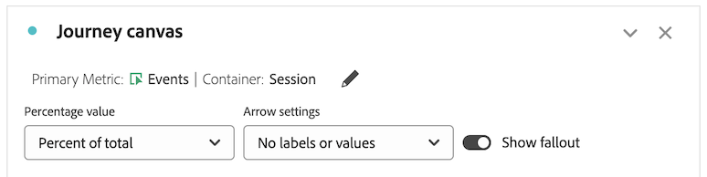

# 配置历程画布可视化图表

历程画布可视化图表可帮助您进行分析，获得关于您为用户和客户提供的历程的深入洞察。

## 历程画布概述

请参阅[历程画布概述](/help/analysis-workspace/visualizations/journey-canvas/journey-canvas.md)，了解有关历程画布的更多信息，包括：

* 主要功能

* 潜在洞察

* 历程画布与流失之间的差异

* 关于 Journey Optimizer 历程分析的详细信息

* 及更多

## 开始构建历程画布可视化图表

1. 在项目中添加一个空白面板，在左边栏中选择&#x200B;[!UICONTROL **可视化图表**]&#x200B;图标，然后将  [!UICONTROL **历程画布**]&#x200B;可视化图表拖动到面板中。

   或

   按照[可视化图表概述](/help/analysis-workspace/visualizations/freeform-analysis-visualizations.md)中的[在面板中添加可视化图表](/help/analysis-workspace/visualizations/freeform-analysis-visualizations.md#add-visualizations-to-a-panel)部分中说明的任何一种方法添加历程画布可视化图表。

   

1. 指定以下基本信息，以配置历程画布：

   | 字段 | 功能 |
   |---------|----------|
   | [!UICONTROL **主要量度**] | 确定在计算历程中每个节点的百分比和数值时使用的量度。
**请注意**：您在&#x200B;**[!UICONTROL 历程画布容器]**&#x200B;字段中选择的量度决定了每个百分比和数字值中包含的数据的范围。例如，如果将&#x200B;**[!UICONTROL 人员]**&#x200B;设置为容器，历程中显示的统计数据就会跨越某个给定人员的多个会话。如果将&#x200B;**[!UICONTROL 会话]**&#x200B;设置为容器，历程中显示的统计数据就仅限于某个给定人员的一个已定义会话。

关于主要量度如何影响每个节点的百分比和数值，请考虑以下示例：
<ul><li>如果&#x200B;_人员_&#x200B;是主要量度，且&#x200B;_人员_&#x200B;是容器，就只有其事件与历程中每个连续节点的标准相匹配的人员才能在整个历程中移动。如果人员从未到达历程中某个节点的任何紧邻的后续节点，就会在这个节点上发生流失。他们可能在网站上执行了其他操作，但他们不符合任何紧随其后的节点所定义的标准。</li><li>如果&#x200B;_人员_&#x200B;是主要量度，_会话_&#x200B;是容器，就只有其事件与某一个会话内历程中每个节点的标准相匹配的人员才会在整个历程中移动。如果人员从未在单个会话内到达历程中的任何紧邻的下一个节点，就会在这个节点上发生流失。他们可能在这个会话内在网站上执行了其他操作，但他们不符合任何紧随其后的节点所定义的标准。</li></ul> 
主要量度会影响历程画布可视化图表的以下方面：
<ul><li>每个节点上显示的总数。  
例如，如果事件是主要量度，每个节点就会显示其事件符合该节点（以及历程中引向该节点的每一个以前的节点）标准的人员的数量。
</li><li>每个节点上显示的百分比。（可视化图表构建后，您可以使用&#x200B;**[!UICONTROL 百分比值]**&#x200B;下拉菜单选择要显示总数的百分比、上一个节点的百分比还是起始节点的百分比。）
例如，如果事件是主要量度，每个节点就会显示其事件符合该节点（以及历程中引向该节点的每一个以前的节点）标准的人员的百分比。
</li><li>如果在可视化图表中添加维度，就会根据主要量度添加可视化图表的前 3 名节点。</li></ul> |
   | [!UICONTROL **辅助量度**] | 确定在计算历程中每个节点的百分比和数值时使用的辅助量度。辅助量度是可选的。 
**请注意**：您在&#x200B;**[!UICONTROL 历程画布容器]**&#x200B;字段中选择的量度决定了每个百分比和数字值中包含的数据的范围。例如，如果将&#x200B;**[!UICONTROL 人员]**&#x200B;设置为容器，历程中显示的统计数据就会跨越某个给定人员的多个会话。如果将&#x200B;**[!UICONTROL 会话]**&#x200B;设置为容器，历程中显示的统计数据就仅限于某个给定人员的一个已定义会话。

配置辅助量度后，它会影响历程画布可视化图表的以下方面：
<ul><li>在主要量度下方显示每个节点的总数。 
例如，如果帐户是辅助量度，就会在节点上显示历程中到达该节点的所有人员的帐户数。
</li><li>在主要量度下方显示每个节点的百分比。（可视化图表构建后，您可以选择显示总数的百分比或者起始节点的百分比。）</li>
例如，如果会话是辅助量度，每个节点都会显示到达历程中该节点的会话的百分比（总数的百分比或者起始节点的百分比）。
</li></ul> |
   | [!UICONTROL **Journey Optimizer 历程**]<!-- name? --> | 选择您想在历程画布中进行分析时用作分析基础的 Journey Optimizer 历程。具有任何以下状态的历程均可用：活跃、已停止或已完成 
或者，如果您想在 Analysis Workspace 中用空白画布构建分析，就可以将此选项留空。
 
如果您在历程画布中分析 Journey Optimizer 历程，该历程会以 Journey Optimizer 中相同的顺序、序列和结构显示。更多信息请参阅[历程画布概述](/help/analysis-workspace/visualizations/journey-canvas/journey-canvas.md)中的[分析 Journey Optimizer 历程](/help/analysis-workspace/visualizations/journey-canvas/journey-canvas.md#analyze-journey-optimizer-journeys)。

**请注意**：只有在您添加可视化图表的 Analysis Workspace 面板中所选择的同一个数据视图中检测到 Journey Optimizer 数据的情况下，才会显示此选项。关于更改 Analysis Workspace 中面板的数据视图的信息，请参阅 [Analysis Workspace 概述](/help/analysis-workspace/home.md)。
 |

1. （可选）选择&#x200B;[!UICONTROL **显示高级设置**]，然后指定以下信息：

   | 字段 | 功能 |
   |---------|----------|
   | [!UICONTROL **历程画布容器**] | 选择您想在整个历程中重点关注的容器。您选择的容器决定了在历程中捕获的数据的范围。这会影响可视化图表中显示的统计数据。（如果您的容器名称与下面显示的默认名称不同，说明它们已在您的数据视图中自定义过。）<ul><li>**会话：**&#x200B;将可视化图表的统计数据限制在某个给定人员的一个已定义会话内。这意味着，每个节点上显示的（基于主要和辅助量度的）数字和百分比必须在每个人的某一个会话中发生。换句话说，一个人可以在一个历程中多次出现。
此容器使用“会话”量度。
</li><li>**人员：**（默认）允许可视化图表的统计数据跨越某个给定人员的多个会话。这意味着每个节点上显示的（基于主要和辅助量度的）数字和百分比可以在任意数量的会话中发生，只要这些会话属于同一个人。换句话说，一个人在一次历程中只能出现一次。
此容器使用“人员”量度。
</li></ul> |

1. 选择&#x200B;[!UICONTROL **生成**]。

   如果您选择了一个 Journey Optimizer 历程，该历程就会以 Journey Optimizer 中相同的顺序、序列和结构显示。（只有有权访问 Journey optimizer 的用户才能选择 Journey Optimizer 历程。）

   <!-- add screen shot -->

   如果您未选择 Journey Optimizer 历程，就会显示一个空白画布，您可以在这里开始在历程中添加节点。（只有有权访问 Journey optimizer 的用户才能选择 Journey Optimizer 历程。）

   <!-- add screen shot -->

1. 无论您要从空白画布创建新分析，还是要分析 Journey Optimizer 历程，都可以按照[配置可视化图表设置](#configure-visualization-settings)中的说明配置历程。

## 配置可视化图表设置

历程画布标头中提供了各种不同的配置选项。

要配置历程画布可视化图表的设置：

1. 在 Analysis Workspace 中打开一个现有的历程画布可视化图表，或者[开始新建一个](#begin-building-a-journey-canvas-visualization)。

   标头中提供了允许您配置历程画布可视化图表的不同选项：

   

1. 配置在可视化图表顶部显示的以下任何设置：

   | 设置 | 功能 |
   |---------|----------|
   | [!UICONTROL **百分比值**] | 历程中每个节点上显示的百分比值。

 
配置历程中节点上显示的百分比值时，请考虑以下事项：
<ul><li>每个节点上显示主要量度的百分比。如果配置了辅助量度，还会显示辅助量度的百分比。（关于主要和辅助量度设置的详细信息，请参阅[开始构建历程画布可视化图表](#begin-building-a-journey-canvas-visualization)。）</li><li>百分比包括在面板的日期范围内数据视图中包含的所有人员或会话。使用&#x200B;_人员_&#x200B;还是&#x200B;_会话_&#x200B;取决于容器设置。（关于容器设置的详细信息，请参阅[开始构建历程画布可视化图表](#begin-building-a-journey-canvas-visualization)。）</li></ul> 
从以下选项中进行选择：
 <ul><li>[!UICONTROL **起始节点的百分比**]：计算每个节点上显示的相对于起始节点的百分比。百分比基于您选择的主要和辅助量度。 
_起始节点_&#x200B;是一个前面没有任何连接节点的节点。

一个历程可以包含多个起始节点。但是，如果历程包含的 2 个或更多起始节点都引向某个公共节点，就会使用&#x200B;[!UICONTROL **总数的百分比**]。如果您想使用&#x200B;**]起始节点的百分比[!UICONTROL **，请更新历程，使历程中的每个节点都可以回溯到单一的起始节点。
</li><li>[!UICONTROL **前一个节点的百分比**]：计算每个节点上显示的相对于前一个节点的百分比。百分比基于您选择的主要和辅助量度。</li><li>[!UICONTROL **总数的百分比**]：计算每个节点上显示的相对于数据视图中所有数据的百分比。百分比基于您选择的主要和辅助量度。</li></ul> |
   | [!UICONTROL **箭头设置**] | 历程画布中两个节点之间显示的箭头可以配置为显示自定义的标签和值。 

_标签_&#x200B;是显示在箭头上的自定义名称。一个箭头上只显示一个标签。标签可以是以下任何一种，并按以下优先顺序显示：
<ol><li>从历程画布添加的自定义名称（如[添加或更新箭头上的标签](#add-or-update-a-label-on-an-arrow)中所述）</li><li>Journey Optimizer 标签</li><li>Journey Optimizer 条件</li></ol>
_值_&#x200B;是箭头上显示的数字和百分比，它们表示从历程中的一个节点移动到下一个节点的人员或会话。（换句话说，就是那些没有在某个步骤中退出历程的人。） 

以下选项可用于不是源自 Journey Optimizer 的历程以及没有在历程画布中进行重大更改的 Journey Optimizer 历程：（重大更改包括添加或移除节点、添加或移除箭头或者更改节点的组件。）
<ul><li>[!UICONTROL **无标签**]：历程中的箭头上不显示标签。 此选项只有在历程更改后可用 </li><li>[!UICONTROL **仅标签**]：历程中的箭头上显示标签。</li></ul>
以下选项可用于在历程画布中进行了重大更改的 Journey Optimizer 历程：（重大更改包括添加或移除节点、添加或移除箭头或者更改节点的组件。）（**请注意**：只有在您添加可视化图表的 Analysis Workspace 面板中所选择的同一个数据视图中检测到 Journey Optimizer 数据的情况下，才会显示这些选项。关于更改 Analysis Workspace 中面板的数据视图的信息，请参阅 [Analysis Workspace 概述](/help/analysis-workspace/home.md)。）
<ul><li>[!UICONTROL **无标签或无值**]：历程中的箭头上不显示标签或值。</li><li>[!UICONTROL **仅标签**]：历程中的箭头上仅显示标签。不显示值。</li><li>[!UICONTROL **仅值**]：历程中的箭头上仅显示值。不显示标签。</li><li>[!UICONTROL **值和标签**]：标签和值都显示在历程的箭头上。</li></ul> |
   | [!UICONTROL **显示流失**] | 流失数据表示了历程的每个节点流失的百分比和数量。流失数据是基于与历程的容器设置相关联的量度，而不是基于主要或辅助量度。 

默认情况下，容器是&#x200B;_人员_，那么用于流失数据的量度就是&#x200B;_人员_。如果容器更改为&#x200B;_会话_，用于流失数据的量度就是&#x200B;_会话_，依此类推。

例如，使用&#x200B;_人员_&#x200B;作为容器设置，流失显示的是历程中从未到达任何紧邻的后续节点的人员的百分比和人数。他们可能在网站上执行了其他操作，但他们不符合任何紧随其后的节点所定义的标准。
 
关于历程画布容器设置的详细信息，请参阅[开始构建历程画布可视化图表](#begin-building-a-journey-canvas-visualization)。 |
   | **缩放控件** | 以下缩放控件位于画布的右上角：<ul><li>**放大** ：放大可视化图表的特定区域。
您也可以使用鼠标控制，例如在触控板上捏合。
</li><li>**缩小** ：缩小可视化图表，在画布上腾出更多空间。
您也可以使用鼠标控制，例如在触控板上捏合。
</li><li>**适合屏幕** ：调整当前缩放和平移设置，让完整的可视化图表填满屏幕。</li></ul>
要在缩放后在画布上平移，请单击鼠标并拖动到所需的位置。
 |

1. 继续[添加节点](#add-nodes)。

## 添加节点

历程画布可视化图表中的节点表示用户历程的事件或操作。

您可以使用以下方法创建节点：将 Workspace 组件从左边栏拖到画布中；允许历程画布基于现有节点选择下一个或上一个节点；复制现有节点。

### 从左边栏中拖放组件

1. 在 Analysis Workspace 中打开一个现有的历程画布可视化图表，或者[开始新建一个](#begin-building-a-journey-canvas-visualization)。

1. 将量度、维度、维度项、区段或日期范围从左边栏拖到画布上。基于[派生字段](/help/data-views/derived-fields/derived-fields.md)的量度受到支持。但是，不支持计算量度以及基于[摘要数据集](/help/data-views/summary-data.md)的任何量度或维度。

   您可以通过按住 Shift 或按住 Command (Mac) 或 Ctrl (Windows) 在左边栏中选择多个组件。

   可视化图表会根据主要量度进行更新，如下所示（取决于组件类型以及将其放在画布中的什么地方）：

   | 组件类型 | 组件放置 | 添加节点后可视化图表会更新 |
   |---------|----------|----------|
   | 量度 | 画布的空白区域 | 放置组件的位置上会显示节点，不与任何现有节点连接。 |
   | 量度 | 现有节点 | 组件会自动与现有节点组合。（更多信息请参阅[组合节点](#combine-nodes)。）
 |
   | 量度 | 2 个现有节点之间的箭头 | 放置组件的地方会显示节点，位于两个现有节点之间，并与这两个现有节点连接。（更多信息请参阅[连接节点](#connect-nodes)。）
 |
   | 维度 | 画布的空白区域 | 在放置组件的地方为前 3 名维度项创建 3 个节点，不与任何现有节点连接。（**请注意：**&#x200B;如果只显示 1 个或 2 个节点，就表示数据仅可用于 1 个或 2 个维度项。如果不显示任何节点，就表示数据不可用于任何维度项。在这种情况下，尝试将其添加到历程的另一个点，调整可视化图表的日期范围，或选择另一个维度。）
将维度放到画布上时按住 Shift 键，将其添加为具有 3 个维度项的一个节点。

 |
   | 维度 | 现有节点 | 显示前 5 名维度项的节点会自动应用细分。<!--what happens if you hold Shift?-->
要在新的可视化自由格式表中查看细分，请选择节点上的&#x200B;[!UICONTROL **在自由格式表中打开**]&#x200B;链接。
 |
   | 维度 | 连接 2 个现有节点的箭头 | 为（最终到达第二个节点的人员/会话的）第一个节点之后第一个事件后的前 3 名维度项创建 3 个节点。放置组件的地方会显示这些节点，位于两个现有节点之间，每一个都与这两个现有节点连接。（**请注意：**&#x200B;如果只显示 1 个或 2 个节点，就表示数据仅可用于 1 个或 2 个维度项。如果不显示任何节点，就表示数据不可用于任何维度项。在这种情况下，尝试将其添加到历程的另一个点，调整可视化图表的日期范围，或选择另一个维度。）
将维度放到画布上时按住 Shift 键，将其添加为具有 3 个维度项的一个节点。（更多信息请参阅[连接节点](#connect-nodes)。）
 |
   | 维度项 | 画布的空白区域 | 放置组件的位置上会显示节点，不与任何现有节点连接。 |
   | 维度项 | 现有节点 | 组件会自动与现有节点组合。 |
   | 维度项 | 连接 2 个现有节点的箭头 | 放置组件的地方会显示节点，位于两个现有节点之间，并与这两个现有节点连接。（更多信息请参阅[连接节点](#connect-nodes)。）
 |
   | 区段 | 画布的空白区域 | 放置组件的位置上会显示节点，不与任何其他节点连接。
节点上显示的数量和百分比包括按所选区段分段的主要量度的总数。
 
例如，如果选择“人员”作为历程的主要量度，在画布的空白区域添加一个&quot;今天&quot;区段，就会显示今天发生事件的所有人员。
 |
   | 区段 | 现有节点 | 将区段应用于现有节点。 |
   | 区段 | 连接 2 个节点的箭头 | 放置组件的地方会显示节点，位于两个现有节点之间，并与这两个现有节点连接。（更多信息请参阅[连接节点](#connect-nodes)。）

将区段应用于放置组件的路径上的点。
 |
   | 日期范围 | 画布的空白区域 | 放置组件的位置上会显示节点，不与任何其他节点连接。
节点上显示的数量和百分比包括按所选日期范围分段的主要量度的总数。
 
例如，如果选择“人员”作为历程的主要量度，在画布的空白区域添加一个“本月”的日期范围，就会显示本月发生事件的所有人员。
 |
   | 日期范围 | 现有节点 | 将日期范围应用于现有节点。 |
   | 日期范围 | 连接 2 个节点的箭头 | 放置组件的地方会显示节点，位于两个现有节点之间，并与这两个现有节点连接。（更多信息请参阅[连接节点](#connect-nodes)。）

将日期范围应用于放置组件的路径上的点。
 |
   | 多个组件 | 画布的空白区域 | **如果没有任何组件是维度：**
每个组件都显示为在放置组件的地方的一个单独节点，且不与任何现有节点连接。

将组件放到画布上时按住 Shift 键，将其添加为一个组合节点。 

**如果您要添加的组件是维度：**

每个组件都显示为在放置组件的地方的一个单独节点，且不与任何现有节点连接。

一次只能添加一个维度。添加维度后，会在放置组件的地方为前 3 名维度项创建 3 个节点。

将组件放到画布上时按住 Shift 键，将其添加为一个组合节点。前 3 名维度项与每一个节点组合。（更多信息请参阅[组合节点](#combine-nodes)。）
 |
   | 多个组件 | 现有节点 | 所有组件都与现有节点组合。
如果要添加的组件是维度，前 3 名维度项就会与节点组合。
 
一次只能添加一个维度。
 |
   | 多个组件 | 连接 2 个现有节点的箭头 | **如果没有任何组件是维度：**
每个组件都显示为放置组件的地方的一个单独节点，每个节点都与这两个现有节点连接。（更多信息请参阅[连接节点](#connect-nodes)。）

将组件放到画布上时按住 Shift 键，将其添加为一个组合节点。（组件必须是相同的类型才能组合到一个节点中。）（更多信息请参阅[组合节点](#combine-nodes)。）

**如果您要添加的组件是维度：**

每个组件都显示为放置组件的地方的一个单独节点，每个节点都与这两个现有节点连接。

一次只能添加一个维度。添加维度后，会为（最终到达第二个节点的人员或会话的）第一个节点之后第一个事件后的维度前 3 项创建 3 个节点。每个节点都与两个现有节点连接。（更多信息请参阅[连接节点](#connect-nodes)。）

将组件放到画布上时按住 Shift 键，将其添加为一个组合节点。前 3 名维度项与每个节点组合，每个节点都与两个现有节点连接。（更多信息请参阅[组合节点](#combine-nodes)。）
 |

   节点显示为一个矩形框，包含以下信息：

   * 组件名称

   * 组件类型（如量度或维度）

   * 主要量度统计数据（总数和百分比）

   * 辅助量度统计数据（总数和百分比）

   闪烁或发光的节点表示正在为该节点加载数据。

1. 重复这个过程，继续添加节点，构建您的历程。

1. 按照以下部分所述，继续自定义历程。您可以连接节点、重命名节点、应用细分、创建受众、添加时间限制等。

### 根据现有节点显示最顶级节点

您可以根据画布上已存在的节点，自动显示最顶级的直接相连的节点。您可以将最顶级的节点添加到历程画布或在自由格式表中查看它们。

在确定要显示哪些节点时，历程画布使用主要量度。

此选项适用于画布上的以下对象：

* 单个节点

* 节点之间的箭头

#### 显示某个现有节点之后的最顶级节点

您可以选择一个节点，显示在历程中紧跟在该节点之后的最顶级的维度项。您可以将前 3 名维度项作为单独的节点添加到历程画布中，也可以在自由格式表中查看所有最顶级的维度项。

1. 右键单击您想显示历程中在其之后的最顶级维度项的那个节点。

   该节点在历程中不能有从它引出的任何现有节点。

1. 选择&#x200B;[!UICONTROL **显示此节点后的顶级节点**]。

1. 选择您想在哪里显示维度项：

   * [!UICONTROL **在历程画布中**]：将前 3 名节点添加到历程中此节点之后的画布中。每个节点都与您选择其作为画布上的单独分支的节点连接。

   * [!UICONTROL **在自由格式表中**]：创建一个可视化自由格式表，显示历程中此节点之后的所有最顶级维度项。

1. 从维度列表中选择所需的维度。

   根据您在上一步的选择，前 3 名维度项作为三个单独的节点添加到画布中，或者所有最顶级维度项都显示在自由格式表中。

#### 显示某个现有节点之前的最顶级节点

您可以选择一个节点，显示在历程中紧邻在该节点之前的最顶级的维度项。您可以将前 3 名维度项作为单独的节点添加到历程画布中，也可以在自由格式表中查看所有最顶级的维度项。

1. 右键单击您想显示历程中在其之前的最顶级维度项的那个节点。

   此节点在历程中不能有引向它的任何现有节点。

1. 选择&#x200B;[!UICONTROL **显示此节点之前的顶级节点**]。

1. 选择您想在哪里显示维度项：

   * [!UICONTROL **在历程画布中**]：将前 3 名节点添加到历程中此节点之前的画布中。每个节点都与您选择其作为画布上的单独分支的节点连接。

   * [!UICONTROL **在自由格式表中**]：创建一个可视化自由格式表，显示历程中此节点之前的所有最顶级维度项。

1. 从维度列表中选择所需的维度。

   根据您在上一步的选择，前 3 名维度项作为三个单独的节点添加到画布中，或者所有最顶级维度项都显示在自由格式表中。

#### 显示现有节点之间的顶级节点

您可以选择一个箭头，显示历程中 2 个现有节点之间的顶级维度项。您可以将前 3 名维度项作为单独的节点添加到历程画布中，也可以在自由格式表中查看所有最顶级的维度项。

1. 右键单击您想显示顶级维度项的 2 个节点之间的箭头。

1. 选择&#x200B;[!UICONTROL **显示这些节点之间的顶级节点**]。

1. 选择您想在哪里显示维度项：

   * [!UICONTROL **在历程画布中**]：将前 3 名节点添加到位于 2 个现有节点之间的画布中。每个节点都作为画布上的一个单独分支与周围的节点连接。

   * [!UICONTROL **在自由格式表中**]：创建一个可视化自由格式表，显示 2 个位于现有节点之间的所有顶级维度项。

1. 从维度列表中选择所需的维度。

   根据您在上一步的选择，前 3 名维度项作为三个单独的节点添加到画布中，或者所有最顶级维度项都显示在自由格式表中。

### 复制节点

复制选项可用于画布上的以下对象：

* 单个节点

* 多个节点

要复制节点：

1. 选择您想复制的一个或多个节点。

   要选择多个节点，请按住 Command 键（Mac）或 Ctrl 键（Windows）。

1. 右键单击一个选定的节点，然后选择&#x200B;[!UICONTROL **复制**]。

## 设计历程

节点的顺序以及它们之间的连接会影响历程画布数据。历程应直观而准确地反映您想报告的事件的顺序。

将节点添加到画布后，您可以重新排列节点、组合节点、连接节点并在节点之间添加时间限制。

### 重新排列节点

历程画布中的历程包括由节点和箭头构成的一个灵活图形，它们表示了事件、维度项和区段的任意组合。

您可以拖动画布上的节点来重新排列历程的事件和条件。

当您重新排列历程中的节点顺序时，数据会相应地更新。

### 组合节点

历程画布中的组合节点是用户历程（节点）中的单个点，它包含 2 个或多个通过逻辑结合在一起的组件。

#### 创建组合节点

您可以执行以下任一操作来组合历程画布中的节点：

* 从左边栏将单个组件拖到画布上的节点。

* 从左边栏将多个组件同时拖到画布上的某个节点上。

* 按住 Shift 键，从左边栏中将多个组件同时拖到画布的空白区域。

<!-- * On the canvas, select the nodes that you want to combine, right-click one of the selected nodes, then select **Combine**. Is there a limit on how many you can combine? -->

#### 组合节点时的逻辑

在组合节点时应用于节点的逻辑因要组合的组件类型而异，如下所示：

>[!TIP]
>
>您可以查看组合节点的逻辑：右键单击该节点，然后选择&#x200B;[!UICONTROL **从节点创建区段**]。 [!UICONTROL **定义**]&#x200B;部分中显示逻辑。

| 要组合的组件类型 | 使用的逻辑（运算符） |
|---------|----------|
| 量度 + 量度 | 用 OR 连接 |
| 维度项+ 维度项（来自相同的父维度） | 用 OR 连接 |
| 维度项+ 维度项（来自不同的父维度） | 用 AND 连接 |
| 区段 + 区段 | 用 AND 连接 |
| 维度 + 量度、日期范围或区段 | 用 AND 连接 |
| 日期范围 + 量度、区段或维度 | 用 AND 连接 |
| 区段 + 量度、日期范围或维度 | 用 AND 连接 |

### 连接节点

您可以连接画布上已存在的节点，也可以在将节点添加到画布时连接该节点。

您可以连接节点用于定义历程的事件序列。

#### 节点之间的箭头

节点通过一个箭头连接。箭头方向和宽度都有意义：

* **方向**：表示历程的事件序列

* **宽度**：表示从一个节点到另一个节点的流量百分比

  

#### 连接节点时的逻辑

当您连接历程画布中的节点时，它们通过 THEN 运算符连接。这也称为[顺序分段](/help/components/segments/seg-sequential-build.md)。

节点会以“最终路径”的形式连接，这意味着只要访问者最终从一个节点移动到另一个节点，无论这两个节点之间发生任何事件，都会被计算在内。用户沿路径移动的时间由容器设置决定。<!-- It can also be controlled by [adding a time constraint](#add-a-time-constraint-between-nodes). -->

您可以查看连接节点的逻辑：右键单击该节点，然后选择&#x200B;[!UICONTROL **从节点创建区段**]。[!UICONTROL **定义**]&#x200B;部分中显示逻辑。

#### 连接现有节点

历程不能是循环的，不能回到之前连接的节点。

要连接历程画布中的节点：

1. 在历程画布可视化图表中，将鼠标悬停在您想将其与另一个节点连接的，历程序列中排在第一位的节点上。

   4 个蓝色圆点显示在选定节点的每一边。

1. 将这 4 个蓝色圆点中的任意一个拖到您想连接的另一个节点的 4 边中的任何一边。

   现在出现一个箭头连接这 2 个节点。更多信息请参阅[节点之间的箭头](#arrows-between-nodes)。

#### 添加节点时连接节点

在画布上添加节点时，可以将其放在两个已连接的节点之间。该节点就会添加到这 2 个现有节点之间的历程流中。

更多信息请参阅[添加节点](#add-nodes)。

<!--

### Add a time constraint between nodes

>[!AVAILABILITY]
>
>This feature is not yet available.

You can set a time constraint between nodes. When a time constraint is in place, people are considered to have fallen out of the journey if they follow the defined journey but take longer than the allotted time period to move between the nodes.

The option to add a time constraint is available for the following objects on the canvas:

* The arrow between nodes

To add a time constraint:

1. In a Journey canvas visualization, right-click the arrow between 2 nodes, then select [!UICONTROL **Add time constraint**].

from Travis: You can set time to be within X amount of time or after X amount of time (those are the only two options I think, but we can check with Brandon). 
1. Choose from the following options: 

-->

## 管理节点或箭头

<!--

### Change the color of a node or arrow

>[!AVAILABILITY]
>
>This feature is not yet available.

You can visually customize a journey by changing the color of any node or arrow on the canvas. For example, you could adjust colors to indicate a desirable or undesirable event.

The option to change the color is available for the following objects on the canvas:

* Individual nodes

* The arrow between nodes

To change the color of a node or arrow:

1. In a Journey canvas visualization, right-click the node or arrow whose color you want to change.

1. Select [!UICONTROL **Change color**]. 

1. Select the desired color. 

   The following colors are available: 

-->

### 重命名节点

将一个组件拖到历程画布可视化图表时，它会创建一个与该组件名称相同的节点。您可以重命名节点，以更好地匹配此节点表示的这个历程步骤。

重命名选项可用于画布上的以下对象：

* 单个节点

要重命名节点：

1. 在历程画布可视化图表中，右键单击要重命名的节点。

1. 选择&#x200B;[!UICONTROL **重命名**]。

1. 指定新名称，然后按下 Enter。<!--is that right?-->

### 在箭头上添加或更新标签

历程画布中两个节点之间显示的箭头可以配置为显示自定义的标签和值。

标签是显示在箭头上的自定义名称。一个箭头上只显示一个标签。

关于箭头上显示的标签和值的详细信息，请参阅[配置可视化图表设置](#configure-visualization-settings)中的“箭头设置”。

添加或更新标签的选项适用于画布上的以下对象：

* 节点之间的箭头

要在箭头上添加标签：

1. 在历程画布可视化图表中，右键单击要为其添加标签的箭头。

1. 选择&#x200B;**[!UICONTROL 添加标签]**。

1. 指定标签的名称，然后按下 Enter。

   如果箭头设置当前配置为隐藏标签，就会显示一条消息，提示您显示标签。

要更新箭头上的现有标签：

1. 在历程画布可视化图表中，右键单击要为其添加标签的箭头。

1. 选择&#x200B;**[!UICONTROL 更新标签]**。

1. 指定标签的名称，然后按下 Enter。

   如果箭头设置当前配置为隐藏标签，就会显示一条消息，提示您显示标签。

### 应用细分

为数据应用细分的选项适用于画布上的以下对象：

* 单个节点

* 多个节点

* 节点之间的箭头

* 节点之间的多个箭头

应用细分时，请考虑以下事项：

* 细分应用于主要量度。辅助量度不受影响。

* 应用细分不会更改历程。相反，这只是显示应用了此功能的节点的细分数据。

* 如果节点已有细分，应用新的细分就会替换现有的细分。

* 如果在更早的时候历程中发生了更改，就会更新细分数据。

#### 将细分应用于一个或多个节点或箭头

1. 在历程画布可视化图表中，选择您想应用细分的一个或多个节点，然后右键单击一个选定的节点。

   或

   在历程画布可视化图表中，选择您想应用细分的 2 个节点之间的一个或多个箭头，然后右键单击一个选定的箭头。

   要选择多个节点或箭头，请按住 Command 键（Mac）或 Ctrl 键（Windows）。

1. 选择&#x200B;[!UICONTROL **细分**]。

1. 选择您想在哪里查看细分：

   * [!UICONTROL **在历程画布中**]

   * [!UICONTROL **在自由格式表中**]

1. 选择您想为细分使用的维度。

   如果选择在历程画布中查看细分，节点上就会显示前 5 名维度项。节点上有一个选项，用于在自由格式表中打开细分。

   如果您选择在自由格式表中查看细分，最顶级的维度项就会显示在紧挨着历程画布可视化图表上方的一个新的自由格式表中。

#### 将细分应用于单个节点

您可以将左边栏中的一个维度拖到画布上要应用细分的节点上。

更多信息请参阅[添加节点](#add-nodes)。

#### 移除细分

要移除一个已应用的细分：

1. 右键单击应用了细分的节点。

1. 选择&#x200B;**[!UICONTROL 移除细分]**。

### 创建受众

创建受众的选项适用于画布上的以下对象：

* 单个节点

* 多个节点

* 节点之间的箭头

* 节点之间的多个箭头

如果您从多个节点或箭头创建受众，它们通过 OR 运算符连接。

要创建受众：

1. 在历程画布可视化图表中，选择您想创建受众的一个或多个节点，然后右键单击一个选定的节点。

   或

   在历程画布可视化图表中，选择您想创建受众的 2 个节点之间的一个或多个箭头，然后右键单击一个选定的箭头。

   要选择多个节点或箭头，请按住 Command 键（Mac）或 Ctrl 键（Windows）。

   >[!NOTE]
   >
   >受众不能包含计算量度或任何基于[摘要数据集](/help/data-views/summary-data.md)的量度。如果尝试从历程画布的任何一个包含计算量度或基于摘要数据集的量度的区域创建受众，此计算量度就不会包含在受众定义中。

1. 选择&#x200B;[!UICONTROL **从节点创建受众**]&#x200B;或&#x200B;[!UICONTROL **从箭头创建受众**]。

1. 按照[创建和发布受众](/help/components/audiences/publish.md)中的说明继续创建和发布受众。

### 查看趋势数据

您可以在折线图中查看历程画布中对象的趋势数据。<!--, with some prebuilt anomaly detection data (this is the definition in Fallout) -->

趋势选项可用于画布上的以下对象：

* 单个节点

* 多个节点

* 节点之间的箭头

* 节点之间的多个箭头

要查看趋势数据：

1. 在历程画布可视化图表中，选择要查看其趋势数据的一个或多个节点，然后右键单击一个选定的节点。

   或

   在历程画布可视化图表中，选择要查看其趋势数据的 2 个节点之间的一个或多个箭头，然后右键单击一个选定的箭头。

   要选择多个节点或箭头，请按住 Command 键（Mac）或 Ctrl 键（Windows）。

1. 选择&#x200B;[!UICONTROL **趋势**]。

### 基于节点或箭头创建区段

您可以基于历程中的节点或箭头创建新区段。创建区段后，您可以在 Analysis Workspace 中的任意位置使用该区段。

从历程画布创建的区段使用[顺序分段](/help/components/segments/seg-sequential-build.md)。这意味着该区段使用 THEN 运算符，将人员经历的一系列事件（历程）按顺序链接起来，最终导向选定的节点或箭头。与选定的节点或箭头匹配的所有事件都包含在这个区段中。

如果您基于一个有多个引入路径的节点创建区段，那么所有路径都会包含在这个区段中。各单独的路径用 OR 运算符连接。

要创建区段：

1. 在历程画布可视化图表中，右键单击要用于创建区段的节点或箭头。

1. 选择&#x200B;[!UICONTROL **从节点创建区段**]&#x200B;或者&#x200B;[!UICONTROL **从箭头创建区段**]。

   现在会显示区段生成器。在&#x200B;[!UICONTROL **定义**]&#x200B;部分中，区段定义是根据您选择的节点或箭头及其在历程中的上下文创建的。

1. 指定区段的标题，进行任何其他更改。关于区段创建的更多信息请参阅[区段生成器](/help/components/segments/seg-builder.md)。

1. 选择&#x200B;[!UICONTROL **保存**]，保存区段。

### 删除节点

您可以一次删除历程中的一个或多个节点。如果您删除历程中 2 个节点之间连接的节点，剩余的 2 个节点就会直接连接。

要删除历程画布中的节点：

1. 在历程画布可视化图表中，选择一个或多个要删除的节点，然后右键单击一个选定的节点。

1. 选择&#x200B;[!UICONTROL **删除**]。

### 删除节点之间的箭头

您可以一次删除历程中的一个或多个箭头。如果删除 2 个节点之间的箭头，这两个节点就不再相连。如果箭头是较长路径的一部分，此路径就会断开。

要删除历程画布中节点之间的箭头：

1. 在历程画布可视化图表中，选择您想删除的 2 个节点之间的一个或多个箭头，然后右键单击一个选定的箭头。

1. 选择&#x200B;[!UICONTROL **删除**]。

## 从 Journey Optimizer 打开历程

如果在 Journey Optimizer 中查看历程，您可以选择在历程画布中查看。

1. 在 Journey Optimizer 中，打开您想在历程画布中分析的历程。

1. 选择&#x200B;[!UICONTROL **在 CJA 中分析**]。<!-- ?? -->
