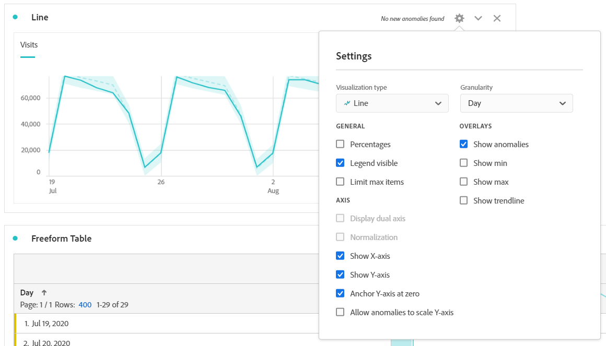

# 折线图

>[!NOTE]
>
>您正在查看有关 Customer Journey Analytics 中 Analysis Workspace 的文档。其功能集与[传统 Adobe Analytics 中的 Analysis Workspace](https://docs.adobe.com/content/help/zh-Hans/analytics/analyze/analysis-workspace/home.html) 略有不同。[了解更多...](/help/getting-started/cja-aa.md)

此折线图可视化图表使用线条来表示量度，以显示一段时间内值的变化情况。仅当使用时间作为维度时，才可以使用折线图。

>[!IMPORTANT]
>
>一些折线图可视化图表设置（如[!UICONTROL 显示趋势线]）当前处于有限测试阶段。[了解更多](https://docs.adobe.com/content/help/zh-Hans/analytics/landing/an-releases.html)

单击折线图可视化图表右上角的齿轮图标，可访问&#x200B;[**可视化设置**](freeform-analysis-visualizations.md)。设置分为以下几类：

* **常规**：各种可视化图表类型中通用的设置
* **轴**：影响折线图可视化图表的 x 轴或 y 轴的设置
* **叠加图**：用于向在折线图可视化图表中显示的系列添加其他上下文的选项。

## 更改粒度

通过[可视化设置](freeform-analysis-visualizations.md)中的粒度下拉列表，可以将趋势可视化（例如折线图、条形图）从每日更改为每周、每月等。粒度也会在数据源表中更新。

## 显示最小值或最大值

在&#x200B;**[!UICONTROL 可视化设置]** > **[!UICONTROL 叠加图]** > **[!UICONTROL 显示最小值/最大值]**&#x200B;下，您可以叠加一个最小值和最大值标签，以快速突出显示量度中的峰值和谷值。注意：最小值／最大值是从可视化中的可见数据点派生的，而不是从维中的完整值集。

## 显示趋势线叠加图

在&#x200B;**[!UICONTROL 可视化设置]** > **[!UICONTROL 叠加图]** > **[!UICONTROL 显示趋势线]**&#x200B;下，您可以选择向折线图系列添加一条回归趋势线。趋势线有助于在数据中描绘更清晰的图案。

所有模型都采用普通最小二乘法：

| 模型 | 描述 |
| --- | --- |
| 线性 | 为简单的线性数据集创建最适合的直线，当数据以稳定速率增加或减少时，此模型非常有用。方程式：`y = a + b * x` |
| 对数 | 创建最适合的曲线，当数据的变化率先快速增加或减少，然后趋于平稳时，此模型非常有用。对数趋势线可使用负值和正值。方程式：`y = a + b * log(x)` |
| 指数 | 创建一条曲线，当数据以不断增大的速率增加或减少时，此模型非常有用。如果数据包含零或负值，则不应使用此选项。方程式：`y = a + e^(b * x)` |
| 幂 | 创建一条曲线，对于要比较以特定速率增加的测量值的数据集，此模型非常有用。如果数据包含零或负值，则不应使用此选项。方程式：`y = a * x^b` |
| 二次方程式 | 找到最适合数据集的曲线，形状类似抛物线（下凹或上凸）。方程式：`y = a + b * x + c * x^2` |
