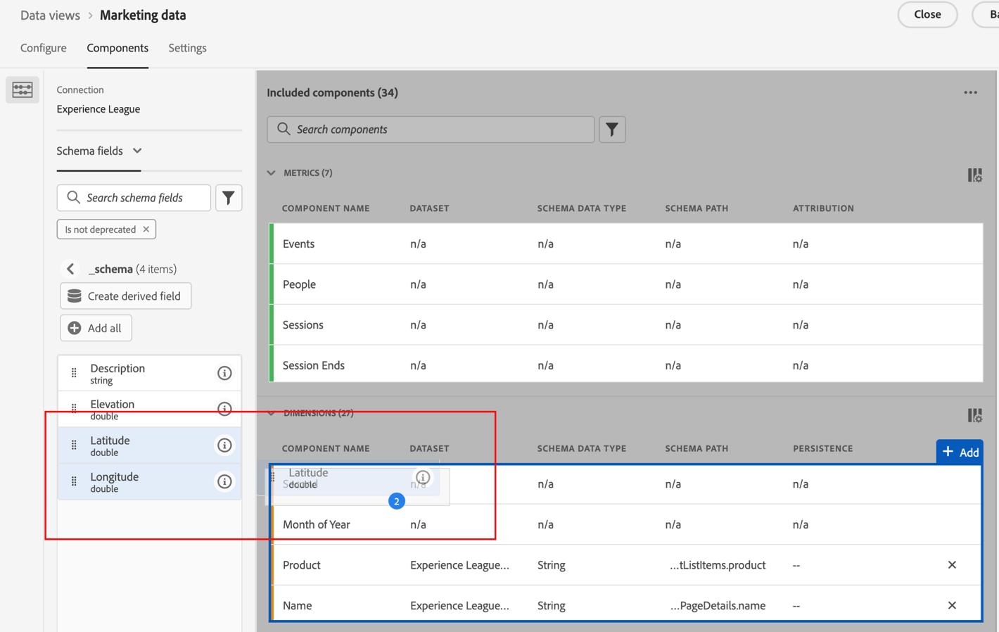

# 地图 {#map}

<!-- markdownlint-disable MD034 -->

>[!CONTEXTUALHELP]
>id="workspace_map_button"
>title="地图"
>abstract="这种可视化图表通过在地图中叠加量度来表示。这对于识别不同地理区域的数据非常有用。"

<!-- markdownlint-enable MD034 -->

<!-- markdownlint-disable MD034 -->

>[!CONTEXTUALHELP]
>id="workspace_map_bubbles"
>title="气泡"
>abstract="使用气泡绘制事件地图。"

<!-- markdownlint-enable MD034 -->

<!-- markdownlint-disable MD034 -->

>[!CONTEXTUALHELP]
>id="workspace_map_heatmap"
>title="热图"
>abstract="使用热图绘制事件地图。"

<!-- markdownlint-enable MD034 -->

>[!BEGINSHADEBOX]

_本文记录了_  _**Customer Journey Analytics**&#x200B;中的地图可视化图表。_ _查看本文的AdobeAnalytics_ 版本的&#x200B;_**映射**。_

>[!ENDSHADEBOX]

Analysis Workspace中的 **[!UICONTROL 地图]**&#x200B;可视化允许您构建任何指标（包括计算量度）的可视地图。 此工具用于识别和比较不同地理区域间的量度数据。

## 先决条件

### 在数据视图中添加上下文标签

在Customer Journey Analytics数据视图设置中，管理员可以将[上下文标签](/help/data-views/component-settings/overview.md)添加到维度或量度，并且Customer Journey Analytics服务（如[!UICONTROL 地图]可视化图表）可以使用这些标签。

#### 地图可视化图表中纬度和经度所需的上下文标签

地图可视化图表需要上下文标签才能正常工作。 如果没有以下上下文标签，则地图可视化图表将无法工作，因为没有可用的经纬度数据。

* [!UICONTROL 地域：纬度]
* [!UICONTROL 地域：经度]

要添加这些上下文标签，请执行以下操作：

1. 在 Customer Journey Analytics 中选择&#x200B;**[!UICONTROL 数据管理]** > **[!UICONTROL 数据视图]**。

1. 在数据视图页面上，选择包含要在地图可视化图表中分析的数据视图。

1. 选择&#x200B;**[!UICONTROL “组件”]**&#x200B;选项卡。

1. （视情况而定）如果您使用Web SDK，并且已配置在数据流中填充纬度和经度，或者如果您使用Analytics Source Connector填充事件数据，则您的架构中应该已提供纬度和经度字段，并且已填充正确的上下文标签。

   找到这些&#x200B;**[!UICONTROL Latitude]**&#x200B;和&#x200B;**[!UICONTROL Longitude]**&#x200B;架构字段（在&#x200B;**[!UICONTROL 事件数据集]** > **[!UICONTROL placeContext]** > **[!UICONTROL geo]** > **[!UICONTROL _schema]**&#x200B;中），并将其作为维度拖动到您的数据视图中（如果它们尚不存在）。

   当这些架构字段作为维度存在于您的数据视图中时，其上下文标签会自动应用，并且地图可视化图表使用它们而无需任何其他配置。

   

1. （视情况而定）如果您有要用于纬度和经度数据的自定义维度，则可以在自定义字段中配置上下文标签：

   1. 在&#x200B;**[!UICONTROL 维度]**&#x200B;部分中，选择包含经度数据的维度。

   1. 在右边栏的&#x200B;**[!UICONTROL 组件设置]**&#x200B;部分的&#x200B;**[!UICONTROL 上下文标签]**&#x200B;字段中，开始键入`Longitude`，然后从下拉菜单中选择它。

      

   1. 重复此过程以将&#x200B;**[!UICONTROL Latitude]**&#x200B;上下文标签添加到包含Latitude数据的维度中。

   1. （可选）默认情况下，这些维度在地图可视化图表中精确到城镇或邮政编码级别，并在Workspace报表中显示2位小数。 您可以在地图可视化图表中精确调整小数位数，以便在Workspace报表中显示5位小数。 有关如何调整精度级别的详细信息，请参阅[为维度配置精确位置](#configure-precise-locations-for-dimensions)。

1. 选择&#x200B;**[!UICONTROL 保存并继续]** > **[!UICONTROL 保存并完成]**。

#### 地理模板所需的上下文标签

Adobe提供了多个[预建模板](/help/analysis-workspace/templates/use-templates.md#web-audience)，这些模板使用地图可视化图表。 要使用每个模板，必须将相应的上下文标签添加到数据视图中的维。

以下是模板和所需的上下文标签。 如果没有这些标签，模板将无法工作，因为没有可用的地理数据。

| 模板名称 | 所需的上下文标签 |
|---------|----------|
| 地理位置：国家/地区 | [!UICONTROL 地域：地理国家/地区] |
| 地理位置：区域 | [!UICONTROL 地域：地理区域] |
| 地理位置：城市 | [!UICONTROL 地域：地理城市] |
| 地理位置：美国 | [!UICONTROL 地域：地理状态] |
| 美国地区DMA | [!UICONTROL 地域：地域Dma] |

要添加这些上下文标签，请执行以下操作：

1. 在 Customer Journey Analytics 中选择&#x200B;**[!UICONTROL 数据管理]** > **[!UICONTROL 数据视图]**。

1. 在数据视图页面上，选择包含您要使用使用地图可视化图表的预建模板分析的数据视图。 在此数据视图中，选择五个维度：一个包含国家/地区数据，一个包含城市数据，一个包含州数据，一个包含DMA数据。 然后，使用相应的上下文标签来标记这些维度。

1. 选择&#x200B;**[!UICONTROL “组件”]**&#x200B;选项卡。

1. （视情况而定）如果您使用Web SDK，并且已配置要在数据流中填充的地理字段，或者如果您使用Analytics Source Connector来填充事件数据，则地理字段应该已可在您的架构中使用并填充了正确的上下文标签。

   找到相应的架构字段，如&#x200B;**[!UICONTROL 城市]**、**[!UICONTROL 邮政编码]**、**[!UICONTROL 州或省]**（在&#x200B;**[!UICONTROL 事件数据集]** > **[!UICONTROL placeContext]** > **[!UICONTROL 地域]**），然后将这些字段作为维度拖动到您的数据视图中（如果它们尚不存在）。

   当这些架构字段作为维度存在于您的数据视图中时，其上下文标签会自动应用，并且地理模板无需任何其他配置即可使用它们。

   

1. （视情况而定）如果您有要用于地理数据的自定义维度，则可以在自定义字段中配置上下文标签：

   1. 选择包含国家/地区数据的维度。

   1. 在右边栏的&#x200B;**[!UICONTROL 组件设置]**&#x200B;部分的&#x200B;**[!UICONTROL 上下文标签]**&#x200B;字段中，开始键入`Geo Country`，然后从下拉菜单中选择它。

      

   1. 重复此过程以将&#x200B;**[!UICONTROL 地域：地理区域]**、**[!UICONTROL 地域：地理城市]**、**[!UICONTROL 地域：地理状态]**&#x200B;和&#x200B;**[!UICONTROL 地域：Dma]**&#x200B;上下文标签添加到包含相应数据的每个维度中。

1. 选择&#x200B;**[!UICONTROL 保存并继续]** > **[!UICONTROL 保存并完成]**。

### 图形驱动程序必须支持WebGL渲染

地图可视化使用WebGL进行图形显示。 如果图形驱动程序不支持WebGL渲染，则可能需要更新驱动程序。

## Customer Journey Analytics与Adobe Analytics中的地图可视化

Customer Journey Analytics中的地图可视化图表与Adobe Analytics中的地图可视化图表在以下方面有所不同：

| 功能 | Customer Journey Analytics | Adobe Analytics |
|---------|----------|---------|
| 数据源 | 使用数据视图中可用的任何区段作为数据源。 | 提供以下选项： <ul><li>移动设备纬度/经度</li><li>地理Dimension 表示有关访客位置（基于访客的IP地址）的地理分段数据。 </li></ul> |
| 精度 | 对于具有很高精确度的数据集，可以将数据视图中的维度配置为最多显示5位小数。 这可以让地图可视化图表在一米内变得准确。 
有关详细信息，请参阅[为维度配置精确位置](#configure-precise-locations-for-dimensions)。
 | 数据对于[!UICONTROL 国家/地区]、[!UICONTROL 地区]和[!UICONTROL 城市]级别是准确的。 （它不会转到DMA或邮政编码级别。） |
| 从选定范围中创建区段 | 根据您在地图可视化图表中选择的特定区域创建区段。 
有关详细信息，请参阅[从地图可视化图表创建区段](#create-a-segment-from-the-map-visualization)。
 | 一般而言，根据地图可视化图表中报告的数据创建区段。 |
| 从所选内容创建受众 | 根据您在地图可视化图表中选择的特定区域创建受众。 
有关详细信息，请参阅[从地图可视化图表创建受众](#create-an-audience-from-the-map-visualization)。 | 无法从地图可视化图表创建受众。 |
| 从选定范围中创建趋势 | 根据您在地图可视化图表中选择的特定区域创建趋势折线图可视化图表。 
有关详细信息，请参阅[从地图可视化图表创建趋势线形图](#create-a-trended-line-chart-from-the-map-visualization)。<!-- is this correct? --> | 无法从地图可视化图表创建趋势。 |
| 从选定范围中添加划分 | 在地图可视化图表中选择的特定区域中划分特定维度项目、量度、区段或日期范围。 
有关详细信息，请参阅[从地图可视化图表添加划分](#add-a-breakdown-from-the-map-visualization)。 | 无法从地图可视化添加划分。 |

## 构建地图可视化 {#begin-building-map}

<!-- markdownlint-disable MD034 -->

>[!CONTEXTUALHELP]
>id="workspace_map_panel"
>title="配置地图可视化图表"
>abstract="选择用于构建地图可视化图表的量度或计算量度。您也可以添加区段，以便聚焦于特定的数据子集。
可视化图表生成后，您可随时更新此信息。
"

<!-- markdownlint-enable MD034 -->

1. 选择左边栏中的&#x200B;[!UICONTROL **可视化图表**]&#x200B;图标，然后将&#x200B;**[!UICONTROL 地图]**&#x200B;可视化图表拖动到包含自由格式表的面板中。

   或

   使用[可视化概述](/help/analysis-workspace/visualizations/freeform-analysis-visualizations.md#add-visualizations-to-a-panel)中的[将可视化图表添加到面板](/help/analysis-workspace/visualizations/freeform-analysis-visualizations.md)部分中所述的任何方式添加地图可视化。

   {width="50%"} -

1. 指定以下基本信息以配置地图可视化：

   * **[!UICONTROL 添加量度]**：在量度下拉列表中，选择一个量度或计算量度。 （您还可以从左边栏拖动量度。）

     >[!IMPORTANT]
     >
     >如果您选择的量度应用了[归因](/help/data-views/component-settings/attribution.md#attribution-models)，则相同的归因将应用于地图可视化当前视区中的经纬度对。
     >

     <!-- Only choose metrics that use Last Touch as the [attribution model](/help/data-views/component-settings/attribution.md#attribution-models) (this is the default attribution model for all metrics). Choosing a metric that has an attribution model other than Last Touch results in inaccurate map data, because attribution is applied to the latitude and longitude pairs. -->

   * **[!UICONTROL 添加区段]**：（可选）在区段下拉列表中，选择一个区段。 或者从区段列表中拖动区段。

   在构建可视化图表后，您可以通过选择可视化图表标题中的“编辑”图标来更新此信息。

1. 选择&#x200B;**[!UICONTROL 生成]**。

   生成了带有气泡的世界地图可视化图表。

   

1. 继续[查看地图可视化图表](#view-a-map-visualization)和[配置可视化图表设置](#configure-visualization-settings)。

## 查看地图可视化

1. 如果您尚未这样做，请按照[构建地图可视化图表](#begin-building-a-map-visualization)中的说明构建地图可视化图表。

1. 在Analysis Workspace中的地图可视化中，执行以下任一操作：

   * **放大**：您可以通过以下任意方式放大地图以放大某些区域：

      * 用鼠标双击地图。

      * 使用鼠标滚轮或在触控板上执行类似的操作。

      * 在地图可视化图表上选择加号图标。

     地图将相应缩放。 将根据缩放级别自动更新所需的维度（国家/地区>州/省>城市）。

   * **缩小**：您可以通过以下任意方式缩小地图以查看更大的区域：

      * 按住Shift键并用鼠标双击地图。

      * 使用鼠标滚轮或在触控板上执行类似的操作。

      * 在地图可视化图表上选择减号图标。

     地图将相应缩放。 将根据缩放级别自动更新所需的维度（国家/地区>州/省>城市）。

   * **旋转**：在用鼠标拖动地图时按住[!UICONTROL Ctrl]键，可以二维或三维旋转地图。

     要将地图重置为原始的北对齐方式，请选择指南针图标。

   * **选择工具**：您可以选择映射的区域来[创建区段](#create-a-segment-from-the-map-visualization)、[创建趋势](#create-a-trended-line-chart-from-the-map-visualization)或[添加细分](#add-a-breakdown-from-the-map-visualization)。

     单击选择工具，然后拖动鼠标选择所需区域。

   * **比较**：您可以通过将两个或多个地图可视化图表并排放置来比较同一项目中的这些可视化图表。

   * **显示期间比较（例如逐年比较）**：

      * 显示负数。

        例如，如果您绘制的是以年同比量度，地图会在纽约上方显示 -33%。

      * 对于&#x200B;*百分比*&#x200B;类型的量度，进行聚类分析时会将百分比平均起来计算。

      * 绿色和红色颜色方案表示正值和负值。

   * **其他可视化设置**：选择可视化标题中的“设置”图标以查看地图可视化的其他设置。 有关详细信息，请参阅[配置可视化设置](#configure-visualization-settings)。

1. **保存**&#x200B;项目以保存所有地图设置（坐标、缩放、旋转）。
1. （可选）可以通过从左边栏拖入位置维度和量度来填充可视化图表下方的自由格式表。

## 配置可视化设置

要配置地图可视化图表的设置，请执行以下操作：

1. 在Analysis Workspace中，打开现有地图可视化图表，或[构建新的可视化图表](#begin-building-a-map-visualization)。

1. 将鼠标悬停在地图可视化图表上，然后选择可视化图表标题中的“设置”图标。

   可以使用以下选项：

   | 部分 | 设置 | 描述 |
   | --- |--- |--- |
   | **[!UICONTROL 地图类型]** | | |
   | | **[!UICONTROL 气泡]** | 使用气泡绘制事件。 气泡图是一种多变量图表，它是散点图和比例面积图之间的交叉。 这个视图是默认的。 |
   | | **[!UICONTROL 热图]** | 使用热图绘制事件。 热图是数据的图形表示，其中包含在矩阵中的各个值表示为颜色。 |
   | **[!UICONTROL 样式]** | | |
   | | **[!UICONTROL 颜色主题]** | 显示热图和气泡的颜色方案。 你可以选择珊瑚色、红色、绿色或蓝色。 默认为珊瑚色。 |
   | | **[!UICONTROL 地图样式]** | 您可以从基本、街道、明亮、浅色、深色和卫星中选择。 |
   | | **[!UICONTROL 群集半径]** | 将像素数量在指定范围之内的数据点组合在一起。默认值为 50。
仅当选择&#x200B;**[!UICONTROL 气泡]**&#x200B;作为&#x200B;**[!UICONTROL 映射类型]**&#x200B;时，此选项才可用。
 |
   | | **[!UICONTROL 自定义最大值]** | 允许您更改地图最大值的阈值。 调整此值可调整气泡图或热图值（颜色和大小）相对于您设置的自定义最大值的缩放比例。 |
   | | **[!UICONTROL 显示注释]** | 显示为此可视化图表所做的批注。 |
   | | **[!UICONTROL 隐藏标题]** | 隐藏可视化图表的标题。 |

## 为维度配置精确位置

如果您有非常精确的自定义数据集，则可以配置地图可视化图表以实现在一米内的位置精度。

1. 在 Customer Journey Analytics 中选择&#x200B;**[!UICONTROL 数据管理]** > **[!UICONTROL 数据视图]**。

1. 选择包含要配置以使用更精确位置的维的数据视图。

1. 在数据视图中，选择&#x200B;**[!UICONTROL 组件]**&#x200B;选项卡。

1. 选择要用于要配置的纬度和经度的维度。 有关使用哪些维度的更多信息，请参阅地图可视化图表中的[纬度和经度所需的上下文标签](#required-context-labels-for-latitude-and-longitude-in-the-map-visualization)。

1. 配置维度的精度级别：

   1. 在要配置的维度仍为选定状态时，展开右边栏中的&#x200B;**[!UICONTROL 格式]**&#x200B;部分。

      已选择

   1. 在&#x200B;**[!UICONTROL 小数位]**&#x200B;字段中，更改小数位数以反映所需的精度级别：

      * **0：**&#x200B;精确到地图可视化图表中的大区域或国家/地区级别。 在Workspace报表中显示0位小数。

      * **1：**&#x200B;地图可视化图表中精确到区域或大城市级别。  在Workspace报表中显示1位小数。

      * **2：**&#x200B;地图可视化图表中精确到城镇或邮政编码级别。 在Workspace报表中显示2位小数。

        这是默认选项。

      * **3：**&#x200B;精确到地图可视化图表中非常小的城镇或街坊级别。 在Workspace报表中显示3位小数。

      * **4：**&#x200B;精确到地图可视化图表中的特定地段或建筑级别。 在Workspace报表中显示4位小数。

      * **5：**&#x200B;地图可视化图表中精确到一米。 在Workspace报表中显示5位小数。

1. 选择&#x200B;**[!UICONTROL 保存并继续]** > **[!UICONTROL 保存并完成]**。

## 从地图可视化图表创建区段 {#map-create-segment}

您可以基于在地图可视化图表中选择的特定区域创建区段。 基于选定区域创建区段时，选定区域的经纬度范围内的任何数据都会包含在区段中。

要从地图可视化图表创建区段，请执行以下操作：

1. 缩放或平移到地图中包含要用于区段的数据的区域。

1. 执行以下其中一项操作：

   * **要从地图上当前显示的所有内容创建区段：**&#x200B;右键单击地图上的任意位置，然后选择&#x200B;**[!UICONTROL 从当前视图创建区段]**。

   * **要为更具体的地图区域创建区段：**&#x200B;单击选择工具，拖动鼠标选择所需区域，然后选择&#x200B;**[!UICONTROL 从所选内容创建区段]**。

1. 使用区段生成器定义新区段。 有关详细信息，请参阅[区段生成器](/help/components/segments/seg-builder.md)。

## 从地图可视化图表创建受众

您可以基于在地图可视化图表中选择的特定区域创建受众。

要从地图可视化图表创建受众，请执行以下操作：

1. 缩放或平移到地图中包含要用于受众的数据的区域。

1. 执行以下其中一项操作：

   * **要从地图上当前显示的所有内容创建受众：**&#x200B;右键单击地图上的任意位置，然后选择&#x200B;**[!UICONTROL 从当前视图创建受众]**。

   * **要为更具体的地图区域创建受众：**&#x200B;单击选择工具，拖动鼠标选择所需区域，然后选择&#x200B;**[!UICONTROL 从所选内容创建受众]**。

1. 使用受众生成器来定义新受众。 有关详细信息，请参阅[创建和发布受众](/help/components/audiences/publish.md#audience-builder)中的[受众生成器](/help/components/audiences/publish.md)

## 从地图可视化图表创建趋势线形图

您可以为在地图可视化图表中选择的特定区域中的数据创建趋势线形图可视化图表。

要从地图可视化图表创建趋势线形图，请执行以下操作：

1. 缩放或平移到地图中包含要用于趋势线形图的数据的区域。

1. 执行以下其中一项操作：

   * **要从地图中当前显示的所有内容创建趋势线图：**&#x200B;右键单击地图上的任意位置，然后从当前视图选择&#x200B;**[!UICONTROL 趋势]**。

   * **要为地图中更具体的区域创建趋势线图：**&#x200B;单击选择工具，拖动鼠标选择所需区域，然后选择&#x200B;**[!UICONTROL 趋势]**。

   将构建包含趋势线的折线图可视化图表。 有关此可视化图表的详细信息，请参阅[折线图](/help/analysis-workspace/visualizations/line.md)。

<!--

Can you do this?

## Add a breakdown from the map visualization

You can break down a specific dimension item, metric, segment, or date range for the data within a designated area that you select in the map visualization.

To add a breakdown from the map visualization:

1. (Optional) Zoom in on the specific area of the map that contains the data where you want to add the breakdown.

1. Click the selection tool , then drag your mouse to select the desired area.

1. Select **[!UICONTROL Add breakdown]**. 

-->

<!--

Can you do this?

## Export the map visualization as a PDF

To export the map visualization in PDF format:

1. how...

-->

